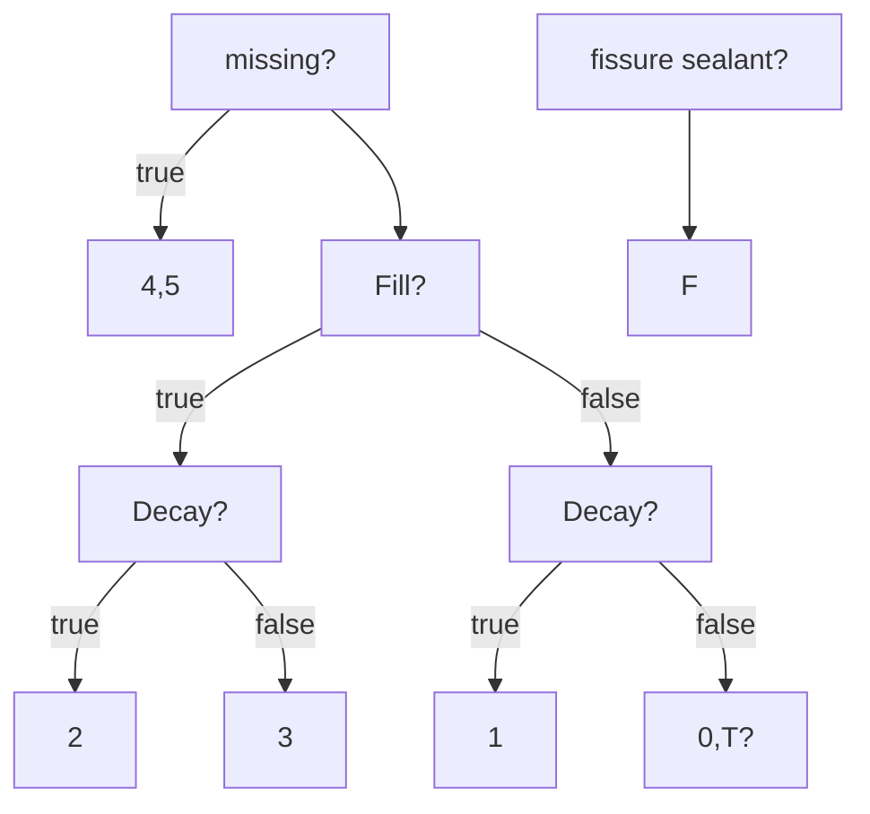

---
toc:
    depth_from: 1
    depth_to: 3
html:
    offline: false
    embed_local_images: false #嵌入base64圖片
print_background: true
export_on_save:
    html: true
---
# 口檢表
0=suoud
1=decay
2=fill with decay
3=fill no decay
4=missing due to caries
5=missing due to other reason
F=fissure sealant
8=unerrupt
T=truma

>磨耗屬於sound 

整顆＝nuion [dacay, Fill, missing]

# 恆乳牙
- 乳牙犬齒鈍
- 64 MB 特突出
