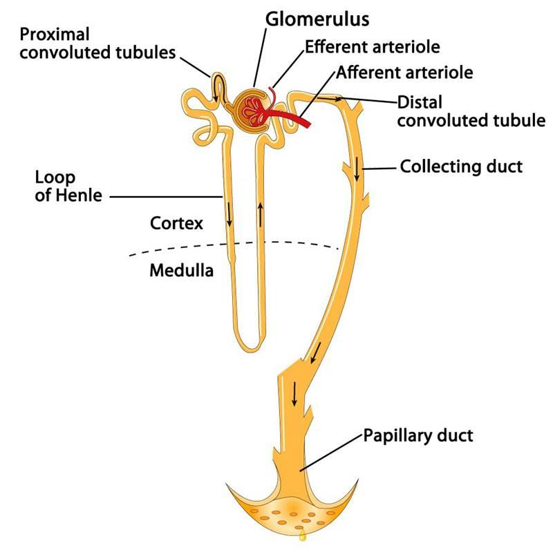

Corona radiata
theca folliculi
papillary duct

centroacinar cell
zona pellucida 
intralobular stroma 
lactiferous sinus
    兩曾Cuboid 
brunner's gland
Sebaceous gland
Oxyphil cell
Intercalated celld
