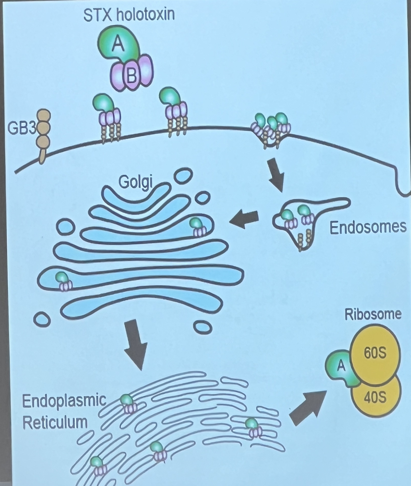
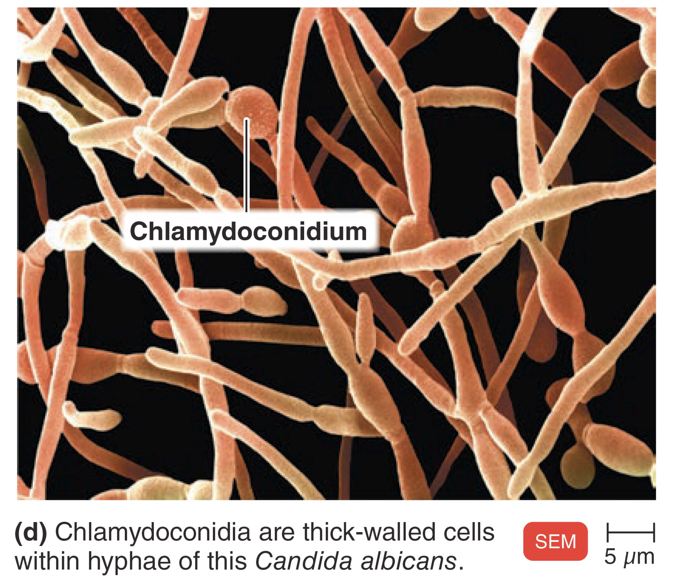
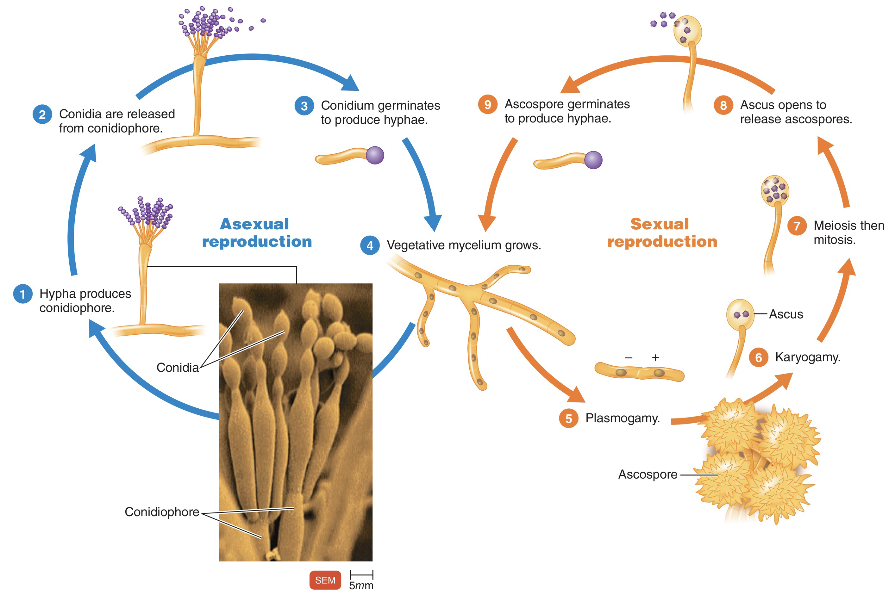
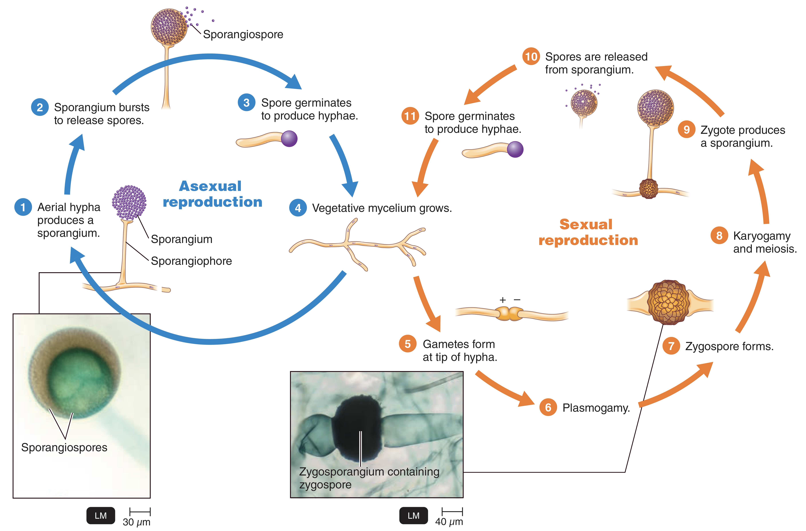
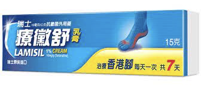
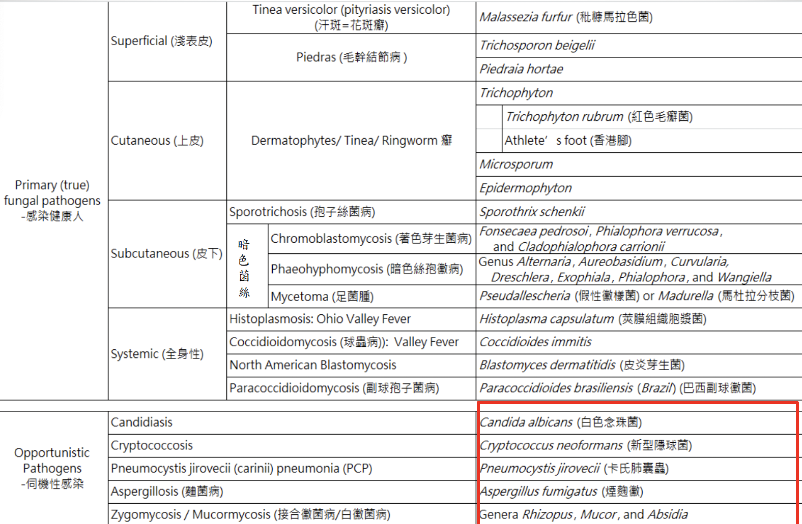
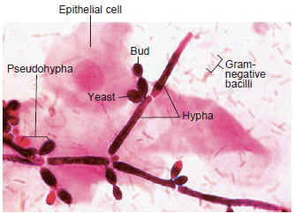
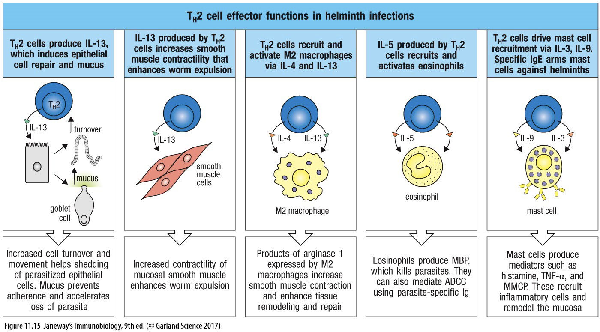

---
toc:
    depth_from: 1
    depth_to: 3
html:
    offline: false
    embed_local_images: false #嵌入base64圖片
print_background: true
export_on_save:
    html: true
---
# Intro 
- 生科不考，沒教不考
- β-lactamases destroy
antibiotics such as penicillin

- Lipopolysaccharide (LPS)
  - Lipid A 致病
  - Core 含2-keto-3-
deoxy-octanoate(KDO)

- protoplasts

- mycolic acids(acid-fast):讓細菌不被 Gram-stained

## 重組
### Homologous recombination (同源) and Non-homologous recombination:
- 幾乎相同序列
- non- 需要酵素

### Site-specific recombination
- ex. 噬菌體
- 需要特定序列、酵素

## Mutation
- Intercalating agents (Chemical agents)
  - 改變DNA鹼基對之間距離，導致配對錯誤

## Gene exchange
### Transformation
- 可以用化學方法促進DNA通透

### Conjugation
- Sex pilus 釣魚收線

### Conjugation
- Generalized or Specialize 
  - [Site-specific recombination](#site-specific-recombination)專一性

### 格蘭氏染色

:::left

**Positive**
- 單層膜
- Teichoic acid

**Negative**
- 雙層膜
- Lipopolysaccharide (LPS)
- Peptidoglycan
- Fimbriae
  - 用來附著，不一定有

:::right

:::

# 消毒 

Antisepsis
: for 活體，化學

Sterilization
: 燒毀！

Disinfection
: 剩下 Spore

:::info {spore} 
只有

Bacillus
: 好氧格蘭氏陽性桿菌

Clostridium
: 厭氧格蘭氏陽性桿菌
:::

## Antisepsis
1. Alcohols 
   - non-enveloped viruses(沒外套膜)不能殺
   - Spore, some fungi 不能殺
2. Chlorhexidine (CHX)
   - ==德恩奈漱口水能殺 SARS-CoV-2==
3. Triclosan 
   - 高露潔用這個
   - 但是好像會致癌

## Disinfection and Sterilization

1. Oxidizing
   - 3-6% Disinfection
   - 10-25% Sterilization
2. Chlorine compounds
   - 蔡衍明乾杯
3. Aldehydes
   - 蛋白質軟化
4. Radiation
   - 痛扁DNA (TT Dimer)
5. 抗生素
   - Protosil (Sulfanilamide)
   - Penicillin

## 抗生素

### peptidoglycan & Cell membrane
#### *β-lactam* 
- ==Penicillin (PCN)==
- Cephalosporin
- Carbapenems: Imipenem, Meropenem, Ertapenem
- Monobactam: Aztreonam

:::info {機制}
Peptidoglycan 形成時 Lys Ala 結合，Penicillin 類似Ala，卡住 Penicillin binding protein (PBPs)

:::

#### Glycopeptides
- ==Vancomycin(萬古霉素)==
  - 分子超大，對陰性無效
- Teicoplanin

#### Polypeptides
- Bacitracin
  - 腎毒性太強
- polymycin
---
#### Lipopeptide
- ==Daptomycin==
  - 仿間最後線

#### Polypeptides
- Polymycin

---

### 抑制蛋白質形成

#### 50S ribosome
- Macrolide (巨環): ==Erythromycin==, ==Azithromycin==
- Lincosamide(林可胺): ==Clindamycin==
- Oxazolidinones (噁唑烷酮): ==Linezolid==
- Chloramphenical

#### 30S ribosome
- Aminoglycoside: Gentamicin, Tobramycin, Amikacin
-  Tetracycline: Tetracycline(四環黴素), Doxycycline, Minocycline
- Glycylcyclines

### 抑制核酸複製
- ==Quinolones==
  - 抑制解蜁(gyrase)
- Fluoroquinolone: Ciprofloxacin, Levofloxacin,
- Moxifloxacin
- Metronidazole
  - 專扁厭氧菌
- Rifampin
  - Mycobacterium tuberculosis（結核箘）有效
  - 橘尿

### 抑制代謝
#### Folic acid 合成

- Sulfanilamide
  - 類似PABA
  
- Trimethoprim

### 整理表

| 類別                   | 名稱                    | 作用位置                       |                                 |
|----------------------|-----------------------|----------------------------|---------------------------------|
| β-lactam             | Penicillin (PCN)      | wall                       | Ala 相似物，競爭PBP結合位                |
| ^                    | Cephalosporin (頭孢子黴素) | ^                          | ^                               |
| ^                    | Carbapenems (碳青黴烯)    | ^                          | ^                               |
| ^                    | Monobactam (單環內醯胺)    | ^                          | ^                               |
| Glycopeptides        | Vancomycin (萬古霉素)     | ^                          | 阻止轉肽反應，G(-)無效                   |
| Polypeptides         | Polypeptides (桿菌肽)    | ^                          | 干擾"肽聚醣合成，G(-)無效                 |
| Lipopeptide          | Daptomycin (達托黴素)           | membrane                   | 打洞，G(-)無效                       |
| Macrolide  (大環內脂)     | Erythromycin (紅黴素)    | 50s                        |            -                     |
| ^                    | Azithromycin          | ^                          |             -                    |
| Lincosamide (林可胺)     | Clindamycin           | ^                          |              -                   |
| Oxazolidinones (噁唑烷酮) | Linezolid             | ^                          |           -                      |
|           >           | Chloramphenicol (氯黴素) | ^                          | 阻止tRNA與50S的A位點的結合               |
| Aminoglycoside       | Gentamicin (慶大黴素)            | 30s                        |                                 |
| ^                    | Tobramycin            | ^                          |                                 |
| ^                    | Amikacin              | ^                          |                                 |
| Tetracycline         | Tetracycline (四環素)    | ^                          |                                 |
| ^                    | Tigecycline (老虎黴素)           | ^                          |                                 |
| ^                    | Doxycycline           | ^                          |                                 |
| ^                    | Minocycline           | ^                          |                                 |
| >                    | Sulfonamide (磺胺)      | Tetrahydrofolic acid(四氫葉酸) | 氨基苯甲酸（PABA）類似物                  |
| >                    | Trimethoprim          | ^                          |                                 |
| >                    | Rifampin (利利肺寧)       | 轉錄                         | 抑制 RNA polymerase ==橘尿，肺結核== |
| Quninolones   (喹諾酮)    | Ciprofloxacin (環丙沙星)   | 複製                         | 抑制DNA gyrase (一種解旋酶）            |

# 致病
## 黏細胞
gram's negative: Pili, Fimbriae

## Endotoxin 
A.K.A Lipopolysaccharide (LPS)

- 可活化血小板及凝血系統為革蘭氏陰性菌造成敗血症的主因
- T independent

## A-B exotoxin
- B for bounding, A for action

都要背。。。

## 逃避免疫

- Bacterial Capsules 
  - 莢膜，辨識不能
  
- Intracellular replication
  - 躲進細胞
  
- &beta;-lactamase 直接分解抗生素

# 細菌 

## Bacillus anthracis (炭疽桿菌, G+)
- G(+)
- Spore 躲進Macrophage ，環遊世界
- Capsule: poly-D-glutamic acid
- 3 proteins
   1. Protective Antigen(PA83): *B toxin*
   2. Edema factor : 水腫， *A toxin*
   3. Lethal factor :致命，殺細胞，*A toxin*
- 2 exotoxin
  - Edema toxin = PA63+EF 
  - Lethal toxin = PA63+LF
> 20不見了
:::tip

- EF &rarr; cAMP
  - cAMP 在腸道導致腹瀉

:::

## Bacillus cereus (仙人掌桿菌、蠟桿菌, G+)
- 食物中毒
  - Emetic form: 米，嘔吐，耐熱
  - Diarrheal form: 其他，cAMP，不耐熱
- 大多無 Capsule

## Listeria *monocytogene* (李斯特菌, G+)
- 冰箱存活可能
- 超會躲，可以穿過胎盤，生食<i class="fa-solid fa-triangle-exclamation"></i>
  

## Cotynebacterium diphtheria (白喉棒狀桿菌, G+)
- 唯一宿主
- 被&beta; 噬菌體感染才有毒
- AB toxin
- 抑制蛋白合成

## Enterobacteriaceae (腸桿菌科, G-)
- Capsule 
- LPS 長一根 O antigen, Lipid A都是抗原
- G(-)

:::fbox

:::
### Escherichia coli (大腸桿菌)

1. Uropathogenic E. coli (UPEC)
   - 泌尿道感染
2. Enterotoxigenic E. coli (ETEC)
   - LT enterotoxin 
     - cAMP 拉肚子
   - ST enterotoxin
     - cGMP 拉肚子
3. Enterohemorrhagic E. coli (EHEC) / Shiga toxin producing E. coli (STEC)
   - O~157~
   - 低燒，血便
   - Hemolytic-uremic syndrome(HUS)
     - 導致腎衰竭
   - **(O~157~)**
4. Enteropathogenic E. coli (EPEC)
   - 沒有外毒素，黏著導致拉肚子，爛
   - Intimin receptor 細胞分泌的

:::info {Shiga toxin}

:::

### Salmonella (沙門氏菌)
- O (somatic) ; Vi (capsular); H (flagellar)

- Capsule 能做疫苗 16S rRNA typing

**More than 2500 unique serotypes**
- *Salmonella enterica* (serotype XXX)

:::example
1. *Salmonella enterica* serotype Typhi 
&rarr; S. Typhi (傷寒)
1. *Salmonella enterica* serotype Typhimurine
&rarr; S. Typhimurine (感染雞卵巢)
:::

#### Typhoid Fever (傷寒)
- 唯一宿主
- Macrophage 全身跑
  - 先進循環，再去膽囊

### Shigella (赤痢)
- 唯一宿主，高傳染性，10隻
- 口糞傳染
- Shiga toxin

### Yersinia (耶氏桿菌)

#### Yersinia pestis (鼠疫桿菌)
- Plaque (鼠疫)
- 10^4^隻
- 跳蚤、人傳人（肺部形，100%死亡）

#### Yersinia enterocolitica (小腸結腸炎耶氏桿菌)
- 拉肚子
- 4&deg;C存活

### Proteus mirabilis (奇異變形桿菌)
- 亂跑，Swarming 
- Urease (+)，產生胺，在膀胱

### Pseudomonas aeruginosa (綠膿桿菌)
- 水裏，隨便長
- 好氧
- 侵犯傷口，綠，香
- 高抗藥
- 有 LasA 與LasB (都是elastase，會協同破壞elastin)

## 彎桿菌(G-)

### Vibrio (弧菌)
- Gram's negative
#### V. cholera (霍亂弧菌)
- 白色掏米水便，拉到膽汁來不及上色
- O~1~, O~139~
- 10^7^ 隻
- 帶有Cholera toxin 才致病，cAMP

#### V. parahaemolyticus
- 生魚片
- Kanagawa hemolysin
  - β-hemolysis on 人O型血或兔血

#### V. vulnificus (創傷弧菌/海洋弧菌)
- 肝硬化、肝癌感染危險

### Campylobacter
- Microaerophilic (5% O~2~)
- 只吃portein

#### C. jejuni (空腸彎曲桿菌)
- 吃未熟的雞鴨牛羊肉
- Guillain-Barre syndrome (巴利氏症候群)
  - 打疫苗產生的抗體去攻擊髓鞘，自體免疫疾病

### Helicobacter
- 唯一宿主，筷子傳染
- 胃食道逆流

#### H. pylori (幽門螺旋桿菌)

## Neisseria
- Gram's negative，球菌

### N. gonorrhoeae (淋病雙球菌,gonococcus)
- 唯一宿主
- 子宮頸感染
  - **Fitz-Hugh-Cutis syndrome**: burning with urination, vaginal discharge,vaginal bleeding) &rarr; pelvic inflammation &rarr; peritonitis, perihepatitis
- No Vaccine 
  - Capsule 不一定
  - 表面抗原亂變
- 武器：
  - Pili
  - IgA protease
  - Endotoxin (lipooligasaccharide; LOS)
    - O很短
  - Por proteins(Protein I, P.I)
    - 破壞 endolysosomes (endosome+lysosome)，鑽出來活在 neutrophils 中
  - Opa proteins (Protein II, P.II)
    - (國考題：幫助細菌Adhesion)
  - Rmp proteins (Protein III, P.III)
    - 幫助細菌抵抗補體及抗生素。

### N. meningitidis (腦膜炎雙球菌)
- Meningococcus
- Capsule

- 武器：
  - Pili
  - IgA protease
  - LOS
- 唯一宿主
- Waterhouse–Friderichsen syndrome (猛爆性腦膜炎雙球菌菌血症)
- 截肢
  

## Staphylococcus (葡萄球菌，G+)
- Gram's Positive
- Catalase 有氣泡 (區別 Streptococci)
- 兼性厭氧
- 高鹽生存
- Hyaluronidase
- DNase

### 毒素 

- Portein A:抑制 IgG
- Cytotoxin: 破壞膜

### S. aureus (金黃色葡萄球菌)
- 全溶血(&beta; hemolysis)
- Coagulase-postive (凝固酶陽性)
- Cytotoxin:
  - &alpha;: 全溶血
  - &beta;: 水解磷脂
  - &delta;: 介面活性劑
  - &gamma; and Panton-Valentine (P-V): 穿孔
- Exfoliative toxins (脫皮毒素)
  - proteases
  - ETA: heat stable, phage
  - ETB: plasmid
- Enterotoxins A (Heat stable)
- Toxic shock syndrome toxin-1 (TSST-1)
  - Superantigen
  - 衛生棉感染
- Coagulase
  - fibrinogen 變成不可水解的 fibrin
  - 保護菌體
- 疾病
  - 菌血症 (Bacteremia)
  - 肺炎 (Pneumonia and Empyema)
  - 關節炎 (Septic arthritis)
  - 骨髓炎 (Osteomyelitis)

:::info {Methicillin-resistant S. aureus (MRSA)}
- &beta;-lactam 抑制 PBP2A 合成細胞壁
- MRSA 產生受體結合 &beta;-lactam

:::

### Coagulase-negative staphylococcus (CoNS)
- S. epidermidis 
- S. saprophyticus
  - 泌尿道感染

## Streptococci (鏈球菌，G+)
- Catalase negative
- C-carbohydrate
  - 細胞壁上多糖
  - 區分 GAS, GBS
- 兼性厭氧

### S. pyogenes (化膿性鏈球菌，GAS)
- &beta;-hemolysis
- Groop A Streptococci (GAS)
- Hyaluronic acid capsule (玻尿酸夾膜)
- M protein
  - 用 emm gene 分類
  - 抑制 C3b

- M-like proteins
  - 抑制 C3b 
- C5a peptidase
- Streptococcal pyogenic exotoxin (erythrogenic exotoxin, 化膿毒素)
  - Superantigen
- Streptolysins (hemolysins)
  - Streptolysin S (SLS)
    - oxygen stable
    - 有毒 
  - Streptolysin O (SLO)
    - oxygen labile,
- Streptokinase
  - 溶血栓
- 疾病
  - pharyngitis (咽喉炎)
  - Scarlet fever (猩紅熱)
  - Pyoderma (impetigo;膿疱病)
  - Erysipelas (丹毒)
    - 有邊界的紅腫
  - Cellulitis (蜂窩組織炎)
  - Necrotizing fasciitis (壞死性筋膜炎)
  - Bacteremia
  - Puerperal sepsis
  - Puerperal sepsis (產褥熱)
  - Rheumatic fever (風濕熱)
  - Acute glomerulonephritis (急性腎絲球腎炎)

### Streptococcus agalactiae (無乳/B/乙型鏈球菌，GBS)
- group B streptococci (GBS)
- &beta;-hemolysis
- CAMP test postive (區分 group A, B)
- 疾病
  - Meningitis and Sepsisin neonates (新生兒腦膜炎、敗血症)
    - 腦脊隨液、PCR 檢測
  - 陰道有，無症狀

### Viridians Streptococci (草綠鏈球菌)
- 只有 S. pneumoniae 高致病
  - 內生性
- &alpha;-hemolysin

- 疾病
  - 蛀牙
    - S. mutans, S. sobrinus
  - Subacute endocarditis (心內膜炎)

#### S. pneumoniae
- 多重夾膜
  - 做疫苗(PPV23, PCV13)
  
- IgA protease
- Pneumolysin
  - 結合 cholesterol，穿孔
- Quellung (夾膜腫脹測試)
  - 遇到血清，夾膜暴增
- 疾病
  - 流感後肺炎
  - Sinusitis (鼻竇炎)
  - otitis media (中耳炎)
  - Meningitis (腦膜炎)
  - Bacteremia

## Enterococcus (腸球菌，G+)
- 長得像鍊球菌
- 高鹽、bile salt 生存
- 臨床
  - Enterococcus faecalis (糞腸球菌, 75%)
    - 泌尿道感染
  - Enterococcus faecium (屎腸球菌, 20%)
    - Vancomycin resistant
- 疾病
  - Urinary tract infections
  - Peritoneal infections (腹膜感染)
  - Bacteremia

## Mycobacterium (分枝桿菌屬)
- 需氧
- 長很慢(20hrs 分裂)
- 非典型G+
  - 細胞壁含有過多的脂類，無法直接用水溶性染劑做染色
  - carbolfuchsin 染，酸性酒精脫色
- acid fast stain +
- 不產生外毒素，靠免疫
- 細胞壁
  - Mycolic acid 
  - Lipoarabinomannan(LAM)
    - 類似 O antigen 

### M. tuberculosis (結核病，Mtb)

- Intracellular pathogen
  - 鑽進 Macrophage 
  - 引發 T~H1~ 分泌 IFN-&gamma;，移除 Macrophage
  - 太多 Macrophage 感染導致 Caseous necrosis (乾酪性壞死)
- 唯一宿主
- 檢測
  - 痰液
  - Tuberculin skin testing (TST)
    - 注射結合病蛋白，看皮膚腫塊直徑
    - 僅代表病史
  - Interferon-γ release assays (IGRA)
    - 丟抗原，量血清 IFN-&gamma;
  - Microscopy
    - acid-fast stain +
    - 高特異性
    - 慢（數月）
  - PCR 
- 藥
  - Rifampin (RMP)
  - Isoniazid (INH)
  - Pyrazinamide (PZA)
    - 初期
  - Ethambutol (EMB)

- 疫苗： BCG (牛型分枝桿菌)

### Mycobacterium leprae (痲瘋病)

- Hansen’s Disease
- 唯一宿主
- 病徵
  - Tuberculoid leprosy (類結核型)
    - 觸覺喪失
    - T~H1~，免疫強
    - Lepromin skin test (+)
  - Lepromatous leprosy (麻瘤型)
    - 到處有結節
      - T~H2~，高傳染
    - 完全失區肢體感覺

- 檢測
  - acid-fast stain +
    - 類結核型

- 治療
  - 無疫苗
  - Sulfones
  - Rifampin
  - Clofazamine
    - 麻瘤型

### Infections by non-tuberculosis mycobacteria (非結核型分枝桿菌，NTM)

- M. avium complex (鳥型分支桿菌，MAC)
  - AIDS 死亡
  - azithromycin 治療
- M. kansaii
  - 類似 TB 
- M. marinum
  - 游泳池刮傷
- M. ulcerans
  - 潰癢
- M. fortuitum complex (rapidly growing)
  - 傷口感染，局部膿

## Nocardia
- Gram's stain 染不上去的
- Weakly acid-fast stain
- 細胞壁含有 mycolic acid
- 好氧 
- buffered charcoal yeast extract(BCYE) 培養基
- &beta;-lactam 抗性
- Intracellular pathogen
- 呼吸傳染
- 症狀
  - 肺
  - 皮膚

## Actinomyces (放線菌，G+)
- 厭氧
- Endogenous infection (自產自銷)
- ”臼齒“菌落

## Cutibacterium(痤瘡丙酸桿菌，Proprionibacterium，G+)

- 厭氧 
- 青春痘
- Catalase+

## Pasteurellaceae (巴斯德氏菌科，G-)

### Haemohilus (嗜血桿菌)
- 兼性厭氧
- 莢膜
- 不吃 lactose 
- 巧克力培養基
  - Hemin (X factor)
  - NAD (V factor)

#### H. influenzae 
- Type B strains 致病 (HiB)
- 有疫苗
  - Hib conjugate vaccine
- 莢膜上有 polyribitol phosphate (PRP)
  - 免疫辨識
- IgA proteases 
  - 打粘膜的細菌才有
- 疾病
  - Meningitis (嬰幼兒腦膜炎)
  - Epiglottitis (會厭炎)

#### H. ducreyi

- soft chancre / chancroid (軟性下
疳) in men
  - 類似梅毒

#### H. aegyptius
- 結膜炎 
  - *埃及大眼*

### Aggregatibacter

#### A. actinomycetemcomitans (伴隨放線菌)
- subacute endocarditis (亞急性心內膜炎)
  - 從牙齒跑進來

### Pasteurella (巴斯德桿菌)
- 動物傳人 
- P. multocida

## Bordetella (G-)

### B. pertussis (百日咳)
- 黏在呼吸道上皮細胞 
  - Pertactin 黏
- 只能人傳人
- 好氧
- Pertussis toxin
  - AB toxin 
    - A: S~1~
    - B: S~2~-S~5~

- 分期(菌量逐漸下降)
  - Catarrhal phase (黏膜期)
    - 最具傳染力
  - Paroxysmal phase (發作期)
  - Convalescent phase (恢復期)
- 超難培養 
  - 玫瑰培養基
- 疫苗 
  - DTaP (acellular vaccine)

## Francisella and Brucella(G-)
- 人畜共通

### Francisella tularensis
- chocolate, buffered charcoal yeast extract(BCYE) 培養基
- Intracellular pathogen
- Tularemia (兔熱病)
  - 獵獵獵人
  - Ulceroglandular (潰瘍腺, most common)
  - Oculoglandular (眼腺, contamination of eye)
  - Typhoidal (腸傷寒)
  - Pneumonic
  - Oropharyngeal and gastrointestinal diseases

### Brucellosis ?
- 常見
  - *B. abortus*
  - *B. melitensis*
- Intracellular pathogen

 

## Legionella (退伍軍人，G-)

- 水裡面 

### L. pneumophila
- Intracellular pathogen
- 污染水源傳染
- 老人會演變成肺炎
- pontiac fever 

## Clostridium (梭狀桿菌，G+)

- 絕對厭氧
  - 清創，截肢
- Spore 
- 腸胃道好朋友

### C. difficile 

- 難養到名字叫難養
- 抗生素濫用牙起來
  - Antibiotic-associated diarrhea 
- Toxin 
  - enterotoxin (toxin A)
    - disrupt the tight cell-to-cell junction
  - Cytotoxin (toxin B)

### C. perfringens (產氣梭狀桿菌)
- 好大一隻
- 很多 toxin 分解組織(用以分類)
  - &alpha; toxin : 軟磷脂酶
- Gas gangrene (氣性壞疽)
  - 分解組織產氣 
  - 好發於糖尿病，截肢

### C. tetani (破傷風)
- 雞腿狀
- 長很慢 
- Tetanospasmin
  - AB toxin  
  - 神經毒
  - Block GABA 

:::fbox 

:::

### C. botulinum (肉毒梭孢桿菌)
- botulinum neurotoxin
  - 不可逆切 SNARE ， Acetylcholine 出不來
  - flaccid paralysis (弛緩性麻痹)

- 嬰兒不能吃蜂蜜，可能有 C. botulinum

## Spirochetes (螺旋體，G-)

- 細得看不到
- Endoflagella
  - 移動

### Treponema pallidum (梅毒螺旋體)

- Chancre (無痛下疳，法文)
- 無毒素，免疫 
- 唯一宿主
- Penicillin 
- Anticardiolipin Abs (rapid plasma reagin )
  - 一個月才測的到抗體
  - 非特異性

### Borrelia burgdorferi (伯氏疏螺旋體)

- 中間宿主: Ticks 蜱蟲
- Lyme disea 
  - 遊走性紅斑
  - 慢性萎縮性皮炎
  - 神經異常

- Relapsing fever
  - 發燒又不燒，來來回回

### Leptospira interrogans (問號鉤端螺旋菌)

- 寄生在腎臟
  - 尿液傳染
- 人畜共通
- Weil disease 
  - 打爆肝腎 

## Mycoplasma (黴漿菌，G-)

- 最小可以體外培養 (0.3-0.5&mu;m)
- 除了 M. pneumoniae 好氧，都是兼性厭氧
- 無 peptidoglycan，用 Sterols 維持穩定(就他有)
  - &beta;-lactam resistant

:::info {L form Bacteria}
- 沒 peptidoglycan
:::

### M. pneumoniae

- 長的慢
- Superantigen
- 引發非典型肺炎

:::info {非典}
- 非典沒濃痰

:::

### Ureaplasma urealyticum (溶尿尿漿菌)
就很像 Mycoplasma

## Chlamydia and Chlamydophila (批衣菌，G-)
- chlamydo: 外套
- 無 Peptidoglycan，有 LPS(很少)
- 絕對寄生
- 美國最盛行的性病
- 兩種型態
  - Elementary body(EB): 傳播用
  - Reticulate body(RB): 較大，細胞內生長繁殖

### Chlamydia trachomatis (砂眼披衣菌)
- Serovars (血清型)分類
- 疾病
  - Trachoma (砂眼)
    - Serovars A-C
  - 泌尿道感染
    - Serovars D-K
  - Lymphogranuloma venereum (LGV ，性病)
    - Serovars L~1~, L~2~, L~3~
    - 輸軟管阻塞
    - Fitz-Hugh-Cutis syndrome
      - [淋病](#n-gonorrhoeae-淋病雙球菌gonococcus)
- [治療](#抗生素) 
  - doxycycline, azithromycin

### Chlamydophila pneumoniae
- 非典 
- Chlamydophila psittaci (鸚鵡熱)
  - 攻擊上呼吸道

## Rickettsia (立克次體)
- 絕對寄生

- 斑疹傷寒

- [治療](#抗生素) 
  - doxycycline, azithromycin

### *Orientia tsutsugamushi* (恙蟲東方體)
- 蘭嶼草叢一堆
- 東亞盛行

### Coxiella bumetii
- 像 Chlamydia
- LPS 
  - Phase I 
    - 抗原性差，晚偵測到 Ab
    - 慢性期
  - Phase II
    - O antigen 不見
    - 反而有抗原性強，先測到 Ab
- Q fever 
  - 牧場土裡面
  - 慢性期，致死，無疫苗

## 整理

### 唯一宿主 

- Cotynebacterium diphtheria (白喉棒狀桿菌, G+)
- Typhoid Fever (傷寒)
- Shigella (赤痢)
- H. pylori (幽門螺旋桿菌)
- N. meningitidis (腦膜炎雙球菌)
- N. gonorrhoeae (淋病雙球菌,gonococcus)
- Mycobacterium tuberculosis
(TB)
- Mycobacterium leprae (痲瘋病)

### 好氧厭氧
- 好氧
  - Bacillus 
  - Pseudomonas aeruginosa (綠膿桿菌)
  - Legionella
  - Bordetella pertussis (百日咳)
  - Mycobacterium (分枝桿菌屬)
  - Nocardia 
  - Mycoplasma pneumoniae(肺炎黴漿菌)
  - Francisella
  - Brucella

> 厭氧菌會產生 abscess (膿腫)，==Metronidazole== 治療

- 厭氧 
  - Actinomyces (放線菌，G+)
  - Cutibacterium(痤瘡丙酸桿菌，G+)
  - Clostridium (梭狀桿菌，G+)
  - 牙齒上G-
    - Porphyromonas gingivalis (PG)
      - 牙周炎，protease，鹼性

### AB toxin
| 毒素                                | 機制            | 菌種                         |
|-----------------------------------|---------------|----------------------------|
| Edema toxin                       | cAMP &uarr;    | B. Anthracis               |
| cholera toxin (霍亂毒素)           | cAMP &uarr;    | Vibrio cholera             |
| Bacillus cereus Diarrheal form | cAMP &uarr;    | B. cereus                  |
| Shiga toxin                       | 60s，apoptosis | Shigella, EHEC             |
| Lethal toxin                      | apoptosis     | B. Anthracis,              |
| Diphtheria toxin (白喉毒素)        | 轉譯(EF~2~)     | Cotynebacterium diphtheria |
| exotoxin A                        | ^             | Pseudomonas aeruginosa     |
| Pertussis toxin| cAMP&uarr;| [Bordetella pertussis (百日咳)](#b-pertussis-百日咳)|
| Tetanospasmin | Block GABA | [Clostridium tetani](#c-tetani-破傷風)|

### superantigen

|毒素|菌種| 
|-|-|
|Enterotoxin A|[Staphylococcus aureus](#s-aureus-金黃色葡萄球菌)|
| TSST-1（Toxic Shock Syndrome Toxin-1）| ^|
|Streptococcal pyogenic exotoxin (erythrogenic exotoxin, 化膿毒素)|[Streptococci pyogenes](#s-pyogenes-化膿性鏈球菌gas)|

### Enterotoxins

|毒素|機制|菌種|
|-|-|-|
| Heat-Labile enterotoxin           | cAMP &uarr;    | ETEC                       |
| Heat-stable enterotoxin           | cGMP &uarr;   | ETEC                       |
|Enterotoxin A|superantigen|[Staphylococcus aureus](#s-aureus-金黃色葡萄球菌)|
| Toxin A | disrupt the tight cell-to-cell junction | [Clostridium difficile](#c-difficile)|

### Protease 

|毒素|機制|菌種|
|-|-|-|
|Exfoliative toxins 脫皮毒素|破壞 stratum granulosum 的 intercellular bridges|[Staphylococcus aureus](#s-aureus-金黃色葡萄球菌)|
| IgA proteases |-|Neisseria meningitidis (腦膜炎雙球菌)|
|^|^|Neisseria gonorrhoeae(淋病雙球菌)|
|^|^|[Streptococci pneumoniae(肺炎連球菌)](#s-pneumoniae)|
|^|^|[Haemohilus influenzae](#h-influenzae)|

### GPC 

### Intracellular pathogen
- Typhoid Fever (傷寒)
- Mtb and Nocardia
- Francisella and Brucella
- Legionella 

### 疾病 

#### 肺? 

- [Streptococcus pneumoniae](#s-pneumoniae)
  - 最常見
- Staphylococcus aureus 
---
>好氧
- Mycobacterium tuberculosis (肺結核)
  - Intracellular pathogen
- Nocardia
  - Intracellular pathogen
- Bordetella pertussis (百日咳)
- Legionella pneumophila
  - 老人會演變成肺炎
- Mycoplasma pneumoniae
  - 非典
---
- Chlamydophila pneumoniae
  - 非典 

#### meningitis
 
|Age Group| Causes|
|-|-|
|Newborns| [Group B Streptococcus](#streptococcus-agalactiae-無乳b乙型鏈球菌gbs), Escherichia coli, Listeria monocytogenes|
|Infants and Children| [Streptococcus pneumoniae](#s-pneumoniae), [Neisseria meningitidis](#n-meningitidis-腦膜炎雙球菌), [Haemophilus influenzae type b(Hib)](#h-influenzae)|
|Adolescents and Young Adults|[Neisseria meningitidis](#n-meningitidis-腦膜炎雙球菌),  [Streptococcus pneumoniae](#s-pneumoniae)|
|Older Adults| [Streptococcus pneumoniae](#s-pneumoniae),  [Neisseria meningitidis](#n-meningitidis-腦膜炎雙球菌),  Listeria monocytogenes|

### 疫苗 

- Streptococci pneumoniae
  - 夾膜 
  - PPV23, PCV13 
- Mycobacterium tuberculosis
  - BCG 
- Hib 
  - Hib conjugate vaccine
- Bordetella pertussis
  - DTaP (蛋白質)

# 真菌
- Membrane
  - ergosterol(麥角固醇)
- Cell wall
  - chitin
  - &beta;1,3 D-glucan
  - mannan

## 型態
### Yeast 
- 像細菌
- Pseudohyphae

### Hyphae 
- Sepate hypha
- Coenocytic hypha

### Dimorphic 

### 菌絲
- Vegetative hyphae (營養菌絲)  
- Aerial hyphae (空中菌絲)

### Spore 
- Sexual spores
  - Zygospore (接合孢子)
  - Ascospore (子囊孢子)

- Asexual spores
  - Sporangiospores (孢子囊孢子)

  - Blastospore (芽生孢子)
  - Chlamydospore (厚膜孢子)

  - Conidia (分生孢子)
  - Arthrospore (分節孢子)
  - Phialospore (瓶孢子)

## 分類
### Ascomycota (子囊菌門)
- 有性: Ascospore
- 無性: Conidia, Arthrospore, Phialospore, Chlamydospore
- Hyphae 連接世代 
- Ascus(n+n)&rarr; Karyogamy(2n)&rarr; Ascospore(n)

### Basidiomycota (擔子菌門)
- Basidium(n+n &rarr; 2n) &rarr; basidiospore(n,有性)
- 沒無性胞子

### Mucormycetes (接合菌, Zygomycetes)
- 產生Sporangiospores(孢子囊孢子)
- Zygospore (接合孢子)
  - n+n &rarr; 2n &rarr; n

### Microspora (微孢子門)
- 絕對寄生
- No sexual spores
- Spore 注射進入細胞，青蛙下蛋、長出細胞膜，再炸一堆Spore
  - 超噁

## 製藥
### Cell membrane
#### Allylamines
- 抑制 ergosterol 合成

#### Azoles
- 抑制 ergosterol 合成

#### Polyenes 
- 認 ergosterol接在膜上，穿孔
- ==Amphotericin B==
- 強，七傷拳

### Cell wall

#### Echinocandins 
- 抑制 1,3-&beta;-D-glucan

### cell division
#### Griseofulvin
- 停在角質層，長期有效

### nucleic acid synthesis

#### Fluorocystine
- cystine 類似物
- Amphotericin B 協同

## 感染 

### Athlete's foot (香港腳)
- ***Trichophyton*** 
  - 吃 Keratin(角蛋白)

### Histoplasmosis

- Grow inside the phagocytes

### Candida albicans 白色念珠菌
- 70% 院內黴菌感染
- Oral candidiasis -Thrush (鵝口瘡)
- Vulvovaginal candidiasis (外陰陰道念珠菌病)

:::info {嘴}
- 治療 
  - Nastsatin
  - Azoles

:::

### Cryptococcosis 
- Cryptococcus neoformans (新型隱球菌)
  - Basidiomycota
- 腦膜炎
- 小心鴿子

### Pneumocystis jirovecii (卡氏肺囊蟲)

- 無 ergosterol

# 病毒 
- Ivanovski and Beijerinck 證明菸草疾病是病毒引起(1890s)
- 起源尚無定論
- 數量最多的微生物
- 參與了細菌、古菌、真核生物的演化
- 直徑 20~450nm

## 結構 

- Covering 
  - enveloped
    - HIV, BC肝, Corona, Flu 
  - Nake
    - 嘗病毒, A 肝
- capsid types
  - Helical
    - 伊波拉病毒
  - Icosahedral

:::fbox 

:::

Capsomeres
: 組成 Capsids 蛋白質次單元

## Papillomaviruses & Polyomaviruses
- 雙股環狀 DNA 
- Bind p53, p105RB 基因 &rarr; immortalize (transform)
  - p53
    - Papilloma E6
    - Polyoma T antigen 
  - p105RB 
    - Papilloma E7
    - Polyoma T antigen 

### Papillomaviruses
- 在表皮(1-4)、黏膜 (genital:6, 11)
- 接觸傳染
  - dysplasia (不典型增生)
  - Warts (疣)
  - Cervical cancer (子宮頸癌)
- 促進 keratin (角蛋白) 產生 &rarr; epithelial spikes (papillomatosis)

- 檢測
  - Pap smear 子宮抹片
  - 巴潘尼克氏染色法( Papanicolaou stain )
    - koilocytotic (一圈透明)
  
- 疫苗 (HPV-6, 11, 16, 18)

### Polyomaviruses 

- SV40, BK, JC 沒在人身上造成癌症
- 實驗室讓細胞不停生長
- 免疫缺失患者身上:
  - BK: 出血性膀胱炎（hemorrhagic cystitis; HC）
  - JC: 攻擊 CNS 造成 Progressive multifocal leukoencephalopathy (PML)

## Adenovirus (腺病毒)
- 雙股環狀 DNA 
- Transformation (只在動物)
  - E1A: bing pRB 
  - E1B: bind p53
- 呼吸、接觸傳染

## Parvovirus
- 最小 DNA 病毒 (18-26nm)
- 只有 B19 造成人類疾病，十分普遍
- 呼吸傳染

## Herpesviruses (皰疹病毒)

- 製造 DNA polymerase
- viral matrix proteins
  - 病毒顆粒內
  - 幫助本身 DNA 複製
  - 躲免疫
  - = Tegument proteins:

- 轉錄 
  - &alpha;: immediate-early (ie) protein
    - DNA‐binding proteins
  - &beta;: early protein
    - Transcription factors 
    - DNA polymerase
  - &gamma;: late protein
    - structural proteins

- 轉錄多樣性
  - Direct repeats (照順序重複)
  - Inverted repeats(逆向重複)

Latency
: 潛伏

LATs（Long-Term Antisense Transcripts）
: LATs 抑制病毒基因表達(轉錄因子、RNAi)，維持潛伏期

### Herpes Simplex Virus (HSV，單純疱疹病毒)
- Mucoepithelial cells &rarr; Neuron 
- 兩種
  - HSV-1: 感染上半身
  - HSV-2: 性傳染，感染下半身、新生兒疾病
- 疾病
  - Encephalitis (腦炎)
  - Cold sores(唇疱疹)
  - Neonatal HSV: 新生兒死亡、神經殘疾
- Cytopathologic effects(CPE)
  - 感染細胞使其破裂
- 檢測 
  - Tzanck smear
    - 也稱為水痘皮膚測試(Chickenpox skin test)、疱疹皮膚測試(herpes skin test)
    - 找 Cowdry type A inclusion body
- 治療(針對 DNA polymerase)
  - Acyclovir(ACV): guanosine 類似物
  - Foscarnet (ex. Pyrophosphate mimic): 抑制病毒 DNA polymerase 上的 pyrophosphate binding site

### Varicella‐zoster virus (VZV，水痘‐帶狀疱疹病毒)
- Mucoepithelial cells & T cell &rarr; Neuron 
- ==呼吸道==、接觸
- 帶狀疱疹
  - 沿著神經移動
  - 透過 viremia(病毒血症) 到皮膚
- 水痘 
  - 小孩風險
  - 初見: 肺炎風險
- 治療: ACV、Famciclovir、Valacyclovir
- 活體疫苗(for kids)

### Epstein-Barr Virus (EBV)
- Latency: B cell 
- 唾液傳染(Kiss disease) ，高盛行
- 疾病
  - Infectious mononucleosis(傳染性單核白血球增生症)
    - 沒啥特異性
    - 喉嚨痛、 高燒、頸部淋巴結腫大
  - Burkitt’s lymphoma(伯基特氏淋巴瘤)
    - B cell 異常增生
    - 大下巴
  - Nasopharyngeal carcinoma (NPC，鼻咽癌)
    - 台灣 60 - 85% NPC 與 EBV 有關
- 檢測 
  - 嗜異性抗體(Heterophile Ab)
    - 人類感染 EBV 時 B cell 生產
    - 抗原: 動物血球
  - Downey cell (Atypical lymphocytes)
    - T cell 受 Heterophile Ab 刺激產生
    - 具有更嗜鹼(深染)且空泡狀的細胞質
    - 細胞核呈現腎形或葉形
    - 邊緣因周圍紅血球作用而成鋸齒狀 

### Cytomegalovirus (巨細胞病毒)
- Monocyte、Lymphocyte、Epithelial cell &rarr; Monocyte、Lymphocyte
- 最常造成先天缺陷(Congenital defects)的病毒
- 一般人感染沒事
- Owl’s-Eye inclusion body
  - 通常是病毒複製、繁殖的地方

### HHV-6, 7
- lymphocytes &rarr; T cell 
  - 7: T~H~
- 疾病
  - 嬰兒(常見) Exanthem subitum/Roseola(玫瑰疹)
    - 一開始會持續發燒 acute febrile 約 4 天,但沒有其他感冒的症狀,之後 rash(疹子)跑出來後就會逐漸退燒。
  - 成人
    - 類似 mononucleosis 的症狀,或是淋巴腫、肝炎。

### Kaposi’s sarcoma-associated herpesvirus (KSHV)
- 感染 B cell 
- 為愛滋病(AIDS)患者最常感染的腫瘤病毒(Oncovirus)

### 整理 

- 接觸, saliva 傳染
  - Varicella-zoster virus(VZ) 可以透過呼吸系統傳遞
- 先天感染: TORCH
  - 弓形蟲(T)、梅毒(O)、德國麻疹(R )、巨細胞病毒(C )、單純疱疹病毒(H)
- 需 T cell 控制病情

|亞科|Genus| Clinical Diseases|
|-|-|-|
|&alpha;|Herpes simplex virus type 1  單純疱疹病毒第一型|Cold sores(唇疱疹), gingivostomatitis|
|^| Herpes simplex virus type 2  單純疱疹病毒第二型|Herpes genitalia|
|^| Varicella‐zoster virus (VZV)  水痘‐帶狀疱疹病毒|Chicken pox = varicella,Zoster (shingles)|
|&gamma;|Epstein‐Barr virus (EBV)| Infectious mononucleosis, Burkitt’s lymphoma, NPC |
|&beta;|Cytomegalovirus (CMV) 巨細胞病毒|先天缺陷 TOR==C==H|
|^|Rosedovirus| 嬰兒 Roseola|
|^|HHV‐7 |^|
|&gamma;|HHV‐8 (KSHV)| Kaposi’s sarcoma (primarily in AIDS patient)|

## Poxviruses (痘病毒)

- 最大的、構造最複雜(200x300nm)
  - 自行攜帶所有 mRNA 合成所需的基因序列與蛋白質
  - 可以編碼一些功能蛋白(Encodes proteins for function),例如:DNA 合成、核酸清除、躲避免疫反應的機制

- 呼吸道、結痂傳遞
- 局部性或全身性的膿包、發疹等,如天花、傳染性軟疣(molluscum contagiosum)
- 進入器官:如脾臟、肝骨髓或是其他淋巴結等,而產生膿皰(Pustules)，因痘病毒感染而產生的膿皰非常明顯且容易辨認,此可以隔離人避免傳染。
- 病毒們
  - Variola major(smallpox):大痘症(天花),嚴重可致死，1980 年消滅
  - Variola minor(Alastrim):小痘症(類天花),比較沒那麼嚴重
  - Vaccinia(牛痘病毒): 實驗室做出來當疫苗
  - Cowpox(真牛痘病毒)
  - Monkeypox(猴痘)
  - Molluscum contagiosum(傳染性軟疣)
    - 電燒(Electrocautery)

## PicoRNA (小 RNA)
- 進入宿主細胞可直接轉譯
- 產生互補 RNA 複製
- 自備 RNA polymerase

- Hepatovirus A virus (HAV)
  - 糞口感染
  - 較不會裂解宿主細胞

cytolytic
: 宿主細胞裂解
 
### Enteroviruses(腸病毒)

- 糞口感染
- 高環境耐受
- 通常無症狀，不大會引起消化疾病
- 抗體對抗，只有 Poliovirus 疫苗
- 本土化
  - Polio(以前)
  - Coxsackievirus (CAV)
    - 夏日夢魘
  - Enterovirus 71 (EV71)
    - 攻擊神經
    - 癱瘓、心肌(myocardial)炎、心包膜(pericardial)、無細菌腦膜炎(Aseptic meningitis)

- HFMD: EV71, CAV A16

#### Poliovirus (小兒麻痹)

- 靈長類專一
- 不同程度症狀
  - Asymptomatic (90%)
    - 限制在口咽、腸道。
    - 絕大部分屬於無症狀
  - Abortive poliomyelitis (非癱瘓)
    - flu-like symptom
    - 不攻擊 CNS
  - Paralytic poliomyelitis (1%)
    - 主要由 type 1 造成(即為小兒麻痺)
  - Post-poliomyelitis syndrome
    - 特徵和症狀在感染多年後才出現(較嚴重)
- 診斷
  - 糞便(stool specimens，好找)
  - 喉嚨(swab specimens，most sensitive)
- 無 antivirals
- 疫苗
  - 沙克 Salk: 去活性，肌肉皮下注射
  - 沙賓 Sabi: 減毒活性，口服

:::info {向神經前進}
1. 溶解(cytolytic): 炸掉neurons
2. 發芽(sprout): motor 倖存重生
3. Post-polio syndrome: 新長的過勞，直接躺平 &rarr; degenerate, new weakness。
:::

### Rhinovirus

- 秋冬夢魘
- 呼吸道傳染，一般感冒主因
- 33 &deg;C 

## Coronaviruses
- ss RNA +
- 最大 RNA virus
- 結構
  - Spike (S)
    - 感染用
  - membrane glycoprotein(M)
    - 抗 INF
    - 協助病毒組裝
  - envelope protein (E)
    - 協助病毒組裝
  - nucleocapsid protein (N)
    - 協助病毒組裝
    - 抗 INF
    - 螺旋狀 

- 生活史
   1. S 感染，丟出 genomic RNA(+)
   2. genomic RNA $\xrightarrow{\text{translation}}$ largre protein &rarr; RNA polymerase
   3. genomic RNA &rarr; tempalte RNA (-) $\xrightarrow{\text{裁切}}$ subggenomic tempalte &rarr; subggenomic RNA (+)
   4. subggenomic RNA (+) $\xrightarrow{\text{translation}}$ 結構蛋白
   5. tempalte RNA (-) &rarr; genomic RNA(+)

- 疾病
  - 33-35&deg;C favor 
  - 上呼吸道
  - 就感冒那樣子
  - Glycoprotein corona 幫助在腸胃道存活

- Coronaviridae family 底下只有 &beta; coronavirus 重要

- 名將堂
  - Severe Acute Respiratory Syndrome (SARS)
    - 非典 
  - Middle East Respiratory Syndrome (MERS)
  - Coronavirus Disease 2019 (SARS-CoV-2)
    - 唯一有疫苗

## Hepatitis Viruses 肝炎病毒

- HAV, HEV
  - 沒有套膜
  - 糞口傳染
  - 消化道 &rarr; 血 &rarr; 肝 &rarr; 膽汁 &rarr; 糞
- HBV、HCV、HDV
  - 血液或相關體液
  - B,D 的 sexual/ventral 高傳染
  - 慢性病
- HDV 
  - 自己做不出套膜，借用 HBV 做的套膜

### HAV

- 自然環境隨便活，耐熱 60&deg;C
- 無症狀可傳染
- 症狀 (小孩多無症狀，多能 self-limited)
  - 肝細胞受損: 瀰漫性肝壞死和損害,局部淋巴結腫大、脾腫大
  - Cholestasis (膽汁淤積): jaundice (黃疸)、hyperbilirubinemia (高膽紅素血症)。
  - albumin 減少(復原不能)
- 檢測: anti-HAV IgM (症狀出現前 10 days)

### HBV 
- Hepadnarvirus (肝病毒科)
  - enveloped
  - DNA virus
  - Icosahedral(二十面體) capsid 
- 有反轉錄酶
  - RNA-dependent DNA polymerase
  - 把做出來的 mRNA 變回 dsDNA
- 可以插入宿主 DNA

- mRNA 
  - 3.5 kb mRNA
    - HBcAg:黏 DNA capsid
    - HBeAg:會被分泌出來，可用於檢驗血液傳染性
  - 2.1 kb mRNA
    - S & M glycoproteins
  - 2.4 kb mRNA
    - L glycoprotein
>HBsAg: S, L, M

#### 疾病公衛
- Incubation period :45~120 天。
- 慢性肝炎 &rarr; 肝受損 &rarr; 肝纖維化(fibrosis) &rarr; 肝硬化(cirrhosis) &rarr; hepatocellular carcinoma (HCC,肝細胞癌)
- 1985 有疫苗
  - recombinant vaccine
  - Subunit vaccine (第一代)
    - HBsAg 
  - S gene 的質體植入酵母 (第二代)
  - 新生三劑
    - 2~5 天、1 個月、6 個月
  - 第一個疫苗預防的人類癌症

- 高傳染，20 億大盛行，3.5億慢性，其中65%中國，我們祖國真是太厲害了
  - 亞洲剋星
  - 健康成人89% 自己好，但孩童gg (30~90%慢性肝炎)
  - Cell-mediated immunity (CTL) 很重要
  - HBV 能夠在接觸到的表面存活約一週且仍具有 infectivity,如 table-tops、razor blades(剃刀片)、blood stains。

- HBV 血液檢測
  - 除了 HBcAg (黏在 capsid) 之外兩對半抗原抗體
  - anti-HBs 才有保護作用

- 急性B肝
  - Dane praticle: 完整構造
  - Subviral praticle: 有抗原性空包彈
  - window stage: HBsAg 驟降 &rarr; 測 anti-HBcAg
>Subviral 很多(10^5^)，抓不到真的。
>Subviral 可做疫苗(HBsAg)

- 慢性肝炎 
  - 產生 anti-HBe 才可能復原

### HCV 

- Flaviviridae (黃病毒科)
  - RNA 病毒
- 體外培養難
- 一次做一串蛋白質，再用 Protease 切，是個鋼彈模型玩家
- RNA 聚合酶(NS5B)
  - 曲有誤 周郎顧
- E1, E2 表面醣蛋白具抗原性

#### 疾病公衛 
- 中國和非洲盛行率高，我們祖國真是太厲害了
- 根B肝病情發展相似
- 換肝?沒用
- 三成自癒，七成 gg
- 初期無症狀
- 傳染 
  - 猩猩和人類only
  - 性行爲傳染力不如 B肝 
  - 最主要由注射藥物(毒品)、刺青傳染。
- 診斷
  - 血清 anti-HCV ab 
    - 2-5 月才測到

- 目前 C 肝沒有疫苗

### HDV 

- viroid like virus
  - 需要 HBV 表面抗原才能把自己包起來，自己做不出表面抗原
- ss circular RNA

### HEV 
- 類似 A 肝
- 會自己好
- 祖國強大了，祖國有疫苗
- Norwalk virus

### 肝炎整理 

||分類|source|envelope| 慢性| Prevent|
|-|-|-|-|-|-|
|A|PicoRNA|Stool|&cross;|&cross;|vaccine|
|B|Hepadnarvirus|Blood 或相關體液|&check;|&check;(肝癌)|Subunit vaccine|
|C|Flaviviridae|^|&check;|&check;(肝癌)| 無疫苗，貴貴藥
|D|viroid like virus|^|&check;(HBV)|&check;|B 送 D
|E| Norwalk virus|Stool|&cross;|&cross;|祖國疫苗

## Reoviruses (呼吸道腸道病毒)

- ds RNA
  - 多段
- double-layered capsids 
  - 20 面
  - intermediate/ infectious subviral particle (ISVP)
    - 中外層的capsid在腸道被蛋白酶分解
    - VP4 &rarr; VP5,VP8

- 無套膜
  - 炸細胞出去 
- 丟 RNA(+)出來做蛋白

- 口糞傳染

> Orthoreovirus 會感染人類，所以 Reoviruses 就是 Orthoreovirus，而 Reoviridae 指所有

### Orthoreovirus (正呼腸孤病毒)
- 10段 RNA
- 中和作用 (neutralization)及血球凝集抑制實驗 (hemagglutination inhibition test)可分成三種血清型 (reovirus type1,2,3)

- 輕微呼吸道症狀、腸胃道症狀、膽道閉鎖

### Rotavirus(輪狀病毒)
- 11段 RNA
- 有疫苗(減毒)
  - 寶寶的第一個副食品!
  - 2,4,6 月
- 疾病
  - 嬰兒拉肚子，嚴重水洩
  - 小腸絨毛變短變鈍
  - 嘔吐、腹瀉、發燒和脫水
  - 腸胃道及呼吸道症狀?

### Orbivirus/Coltivirus

- 脊椎及非脊椎動物共通
  - Colorado tick fever (科羅拉多壁蝨熱)
  - tick-borne viral disease (壁蝨傳播病毒疾病)

- 疾病 
  - Viremia (躲在紅血球)
  - 雙峰發燒

## Orthomyxoviridae (正黏液病毒科)
- A型、B型為主要造成人類疾病的流感病毒， 會antigenic drift
  - A: 人畜共通，可以 shifting (移形)
  - B: 不須標註HN分型，因為其不會進行移型
- 片段 ss RNA(-)

- 結構 
  - 血球凝集素hemagglutinin (HA)
    - 進入細胞，結合 Sialic acid 
  - 神經胺酸酶neuraminidase (NA)
    - 出細胞，切開 Sialic acid 連結
    - Zanamivir (Relenza)、oseltamivir (Tamiflu) 針對 NA
  - membrane protein (M2)
    - 套膜內 H^+^ &uarr;
    - RNA從膜內釋放

:::fbox 

:::

- 疾病公衛 
  - 西班牙流感(1918): H1N1
  - 人類流行：H1N1, H1N2, H3N2

## Paramyxoviridea (副黏液病毒)

- ss RNA (-)
- 很大顆，有套膜
  - 易破壞
- 結構
  - nucleocapsid protein (N)
  - polymerase (L)
  - hemagglutinin-neuraminidase (HN) 
    - HA + NA

:::fbox 

:::

### Measles(麻疹)

- 無症狀傳染
- 疾病
  - Viremia
  - CCC 
    - 咳嗽
    - conjunctivitis(結膜炎)
    - coryza(鼻炎)
  - Koplik's spots 
    - 臼齒旁黏膜白點

- 疫苗 (MMR，1歲)
  - measles 
  - mumps (腮腺炎)
  - rubella

### Mumps (腮腺炎)
- 無症狀傳染
- 疫苗 (MMR，1歲)

### Respiratory syncytial virus(RSV，呼吸道融合病毒) & Parainfluenza viruses (副流行性感冒病毒)

- 不需要neuraminidase (NA)
  - 不會 Viremia ，不會全身大蔓延
- 抗體量少

## Retroviruses (反轉錄病毒)

- Envelope Glycoprotein
  - TM (gp41)：穿膜
  - SU (gp120)：整天突變，騙抗體用的，高度糖化，接 CD4
- Nucleocapsid core
  - CA (p24)：capsid 
  - Integrase: 病毒與宿主 DNA 整合
    - Provirus (DNA之中間物)
  - Reverse transcriptase/RT (模板 RNA 3 &rarr; 5)
  - tRNAs: 反轉錄引子
- 兩條相同 ss RNA(+)

:::fbox 

:::

- 結構基因
  - GAG(Group-specific antigen)：Core,Capsid protein
  - POL(Polymerase)：RT, Protease, Integrase
  - ENV(Envelope)：SU(gp120)
- 附屬基因
  - tax, tat：活化轉錄(Transactivate)病毒和細胞基因
  - rex, rev：調控RNA splicing和促進RNA片段釋出到細胞質
  - nef：減少T~H~的CD4，促進T細胞活化

- Protease cleavage

- Life cycle of HIV 
  1. gp120 結合 CD4及 Chemokine co-receptor
     - M tropic(R5)：結合CD4與CCR5 ， 感染Monocyte、Macrophage、Dendritic cell、已活化的T cell等(前期)
     - T tropic(X4)：結合CD4與CXCR4 ，感染 Th cell(後期)
  2. gp41插入細胞膜
  3. RT 出 Provirus(ds circular DNA )
  4. Integrase 插 Provirus 進宿主

:::fbox 

:::

:::info {Chemokine}
趨化細胞的遷移
:::

- 篩檢，測 p24
  - ELISA 
  - Western blot analysis

- 治療
  - 抑制Reverse transcription
    - Azidothymidine/AZT: Thymidine 類似物
  - Highly active antiretroviral therapy/HAART(雞尾酒療法)

### Oncovirinae(致瘤病毒亞科)
- 癌症及神經疾病相關。
- 四種型態
  - A: 未成熟的病毒顆粒
  - B: Mouse mammary tumor virus
  - C: ==HTLV-1, 2, 5(人類) ， Rous sarcoma virus(鳥禽類)==
  - D: Mason-Pfizer monkey virus

### Lentivirinae(慢病毒亞科)
- 潛伏期長，需長時間發病、死亡。
- 造成神經系統疾病及免疫抑制。
- Type D相似。
- HIV-1、HIV-2

### Spumavirinae(泡沫病毒亞科)
- 無明顯症狀
- Foamy cytopathology
  - Macrophage 大量吞噬病毒後空泡狀

### Human endogenous retrovirus/HERV (內源性反轉錄病毒)

- 插入人類基因組
- 例子：Human placental virus

## VHF 
- Viral Hemorrhagic Fever(VHF，病毒出血熱)
  - Arenaviridae
  - Bunyaviridae
  - Filoviridae
  - Flaviviridae

- 大部分 48 小時發病
- ss circular RNA(-)

ambisense
: 一段RNA包含+-序列

### Arenaviridae (沙狀病毒)

- 結構
  - 沙: 很多 ribosome
  - 2 ss circular RNA(-)
    - 3 無 poly A ，用互補連起來
  - 2 spikes
  - ambisense 

- Asepitic meningitis
  - Lymphocytic choriomeningitis virus (LCMV)

- Lassa fever 
  - 人畜共通 ， Robovirus (嚙齒類)
  - 尿液、空氣傳播

### Bunyaviridae (本洋病毒)

- 結構 
  - 三段 RNA (L, M, S)
  - ambisense

- arthropods (mosquitos, tick蜱, sandfly蚋)

- Hantavirus (漢他病毒)
  - Robovirus
  - 高死亡率
  - ==沒ambisense==
  - 肺症候群高死亡 (50%)

### Filoviridae (絲狀病毒)

- 很大顆 (130-14000nm)

- Receptor: Niemann-Pick C1 (NPC1)
  - 膽固醇調節，瘦子少表現
  - 所有細胞都感染 

- Hemorrhagic rash 

- Ebola (伊波拉)
  - 大發燒
  - 進程快 (48h)
  - 破壞內皮

## Togaviridae (披衣病毒)

- 侵犯神經系統
- Arthropod-borne Virus (Arbovirus) 
  - 節肢動物叮咬

### Chikungunya virus (屈公病，CHIKV)

- Fever, rash, joint pain 
- 白線斑蚊 (Aedes albopictus), 埃及斑蚊(Aedes aegypti)

- 症狀
  - 神經病變
    - GB syndrome
  - meningoencephalitis (腦脊隨膜炎)
  - 關節發炎(long-term arthralgia)

### Rubella(德國麻疹)

- Endocytosis
- ss RNA(+)，有套膜
- 新生兒嚴重
  - 直接穿過胎盤
  - 小頭症

## Flaviviridae (黃病毒)

- 病毒 
  - dengue virus (登革熱)
  - Zika virus (茲卡)
  - yellow fever virus
  - West Nile virus
  - Japanese encephalitis virus 

:::info {Antibody-dependent enhancement (ADE) }
- 抗體效價不足，反而促進病毒進入
- **抗體-病毒**通過細胞表面的Fc受體進入宿主細胞。

:::

### Japanese encephalitis virus (日本腦炎)

- 三斑家蚊
- 疫苗 
  - ChimeriVax-JE (減毒)

### Zika virus 

- 白線斑蚊 (Aedes albopictus), 埃及斑蚊(Aedes aegypti)

- 疾病 
  - GB syndrome 
  - 垂直感染：小頭症
  - Joint pain 

### dengue virus 
- 白線斑蚊 (Aedes albopictus), 埃及斑蚊(Aedes aegypti)
 
- 偵測 NS1 protein 
  - 病毒感染，釋放
- 血小板減少
- 大出血 (相較於 Zika virus, Chikungunya)

## 整理 

|>|Virus |Envelope| genome|
|-|-|-|-|
|Papillomaviruses |HPV|&cross;| ds circular DNA|
|Polyomaviruses| SV40, BK, JC |^|^|
|>|Adenoviruses (ADV)|^|ds linaer DNA|
|Parvovirus| B19 |^| ss linear DNA(+) |
|Herpesviruses  皰疹病毒|HSV, VZV, EMV, CMV|&check;|ds circular DNA|
|Hepadnarvirus (肝病毒科)|HBV|^| 大概是 ds circular DNA|
|>|Poxviruses|^| ds linear DNA
|PicoRNA|HAV, EV, Poliovirus, Rhinovirus |&cross;|ss linear RNA(+)|
| Reoviruses|Orthoreovirus  Rotavirus   Orbivirus/Coltivirus|^|多段 ds RNA|
|>| Coronaviruses | &check;| ss linear RNA(+)|
|Orthomyxoviridae|流感病毒| ^| 多段 ss RNA (-)|
|Paramyxoviridea| measles   mumps   RSV   Parainfluenza| ^| ss linear RNA(-)|
Togaviridae   披衣病毒| Chikungunya   Rubella| ^| ss RNA(+)|
|Flaviviridae   黃病毒科|HCV,日本腦炎病毒, yellow fever, West Nile,  dengue(登革熱)   Zika virus (茲卡)|^|ss linear RNA(+)|
|Arenaviridae|Lassa fever|^|2 ss circular RNA(-/+)|
|Bunyaviridae|Hantavirus(-)|^|3 ss circular RNA(-/+)|
Filoviridae|Ebola|^|ss RNA(-)|
| HDV ||^|ss circular RNA(-)|
|Retroviruses||^|兩條相同 ss RNA(+)|

- 可以造成一般感冒症狀的病毒: 
   1. Rhinovirus
   2. coronaviruses
   3. enteroviruses, adenoviruses, and parainfluenza viruses

- 血球凝集素
  - Parainfluenza
  - Orthoreovirus

### 抗病毒藥物 

- Acyclovir
  - 常用來治療VZV, HSV，但只能抑制病毒活化，無法根治。

- 核苷酸類似物
  - ribavirin 

# 免疫學 

## Lymph node 

:::info {High endothelial venules}
- 看管淋巴細胞進入血管
- 認 L slectine ，成熟不表現

:::

## Spleen

:::fbox 

:::

- Germinal center 
  - Memory B cell
  - FDCS 
  - Macrophage

## Complement 
> 肝臟製造，血液中
- Lysis 溶解
- Chemotaxis 趨化
- Opsonization 調理

### Opsonization 調理

- C3b, C4b
### Chemotaxis 趨化
- C3a, C5a

### Lysis 溶解
- 不同 pathway 產成c3轉化酶(==C4b2a, C3bBb, C3(H~2~O)Bb==)
- C5b, 6, 7, 8, 9 形成 Membrane attack complex(MAC)

#### Classical
1. C1q 辨識 Ag，六顆球抓 Ag 
2. C1r互相活化
3. C1r 活化 C1s

#### Lectin 
- Mannose-binding lectin(MBL) 直接認 Ag

#### Alternative 
1. C3b 開始
2. C3b+B=C3bB 
3. C3bB (D)&rarr; C3bBb

#### Alternative-2
- C3 水解成 C3(H~2~O)開始
- C3(H~2~O)+B (D)&rarr; C3(H~2~O)Bb

## 嗜中性白血球(neutrophils)

- 特殊顆粒(specific granule)
  - 多數
  - lysozyme,collagenase,elastase
- 嗜苯胺藍顆粒(azurophilic granule)
  - azure A dye 染色
  - 骨髓過氧化酵素(myeloperoxidase)
  - 防禦素(defensin)

## 嗜酸性白血球(eosinophils)
- 成熟
  - GM-CSF
  - IL-3
  - IL-5
- 組織間常見

## 嗜鹼性白血球(basophils)
- IgE receptor
  - high-affinity IgE receptor(FcεRI)
- 組織少見

## 肥大細胞(mast cell)
- 幹細胞因子(c-KIT ligand, CD117)為促進成熟
- 血液少見，組織常見
- 很多高親和力受體
  - high-affinity IgE receptor(FcεRI)

## Monocyte/Macrophage 
- MHC II
- 依照來源
  - Monocyte-derived macrophages
    - bone marrow derived
    - 出生後,前驅細胞受單核球/巨噬細胞集落刺激因子(monocyte/macrophage colony-stimulating factor, M-CSF)刺激
    - 進入血液,壽命約 1~7天。
  - Long-lived Tissue-resident macrophage
    - yolk sac or fetal liver derived
    - 擁有自我更新能力(self-renewal capacity)以維持數量。
    - 不同的器官不同的表型(phenotypes)

- 依照功能 
  - 非典型(nonclassical monocyte, M2)
    - T~H~2 &rarr; IL-4, IL-13 活化
    - 痂
  - 典型/發炎型(classical or inflammatory monocytes, M1)
    - CD 14 (Toll-Like receptor, 認 LPS )

:::fbox 

:::

### C 型凝集素(C-type lectin-like family)
- 辨認抗原
- Mannose receptor

- Dectin-1
  - 辨認真菌細胞壁的 β-1,3-linked glucans

### Fc receptor 

- 抓住抗體
- Fc&gamma; Receptor 抓 IgG

### Complement receptor
- CD11b

### 抑制性的受體(inhibitory receptor)
- SIRPα
  - 黏附到健康細胞上的 CD47,產生「不要吃我」的信號

## 樹突狀細胞(dendritic cell)

- FLT3L 刺激發育
- CD11c 表現
- 依照發育來源分為四種
  - **cDCs**(Classical, conventional)
    - 1 &rarr; naive CD8^+^ T cell 
    - 2 &rarr; CD4^+^ T cell 
      - 最多
  - **pDCs** (Plasmacytoid)
    - 大ER
    - 分泌 IFN-&alpha;
    - 血液傳染性病原體(blood borne microbes),帶到脾臟呈現
  - **MoDCs** (Monocyte-derived)
    - 功能類似 cDCs
    - 表現monocyte marker
      - CD11b、CCR2
    - 發炎
  - 蘭格漢細胞(Langerhans cells)
    - 表皮常駐
    - 胚胎時期的肝臟和卵黃囊
      - 具有自我更新的能力。

## NK cell
- NK 細胞佔了血液和脾臟淋巴細胞的 5~20%
  - 血液中: CD16
- 抓 MHC I 不表現的
  - NK receptor 傳遞殺了我

- 先天性免疫
  - 被刺激:IL-12、IL-15、IL-18、IFN-&alpha;
  - 分泌: IFN-&gamma;

### NK cell inhibitory receptor

- CD94 認 HLA-E
- KIR 認 HLA-C 
- ITIM 傳遞抑制訊息

K
: lysine

:::fbox 

:::

:::info 
ITIM 
: immunoreceptor tyrosine inhibitory motif

HLA E
: human leukocyte antigen E，一種 MHC I ，一般的MHC I 呈現抗原，HLA E 呈現製造 MHC I 剩下的垃圾。

:::

#### 如何殺
- Fas ligang 
  - 認細胞的 Fas (CD95)，導致凋亡
- 有毒的 Cytokines 
  - tumor necrosis factor (TNF)
  - lymphotoxin (LT)
- Granules 
  - 先 Perforin 穿孔，再送granzymes導致凋亡

### NKT
- 辨識特殊 MHC I: CD1d
- 活化分泌 IL4
- NKT v.s. TCR
  - 都在胸腺成長
  - NKT 表現多樣性較低的 TCR (limited repertoire TCR)
  - NKT 辨識低抗原性的 lipid, glycolipid, hydrophobic peptide

:::info {NK v.s. NKT}

:::

## B cell and Antibodies 

Plasma cell
: 漿細胞

### 功能
- Complement activation 
  - 活化 C1 
- Opsonization
  - 調理(黏上去)
- Nuetralization
  - 中和 

### 結構
- Light: &kappa;, &lambda;
- Heavy: &mu;(IgM), &gamma;(IgG), &alpha;(IgA), &delta;(IgD), &epsilon;(IgE)

### Development 
- Pre-B 完成 Heavy chain 
- Immature B 完成 Light chain 
- 首次遇到丟 IgM
- Class switch 
  - 分支進化

### Ig? 
#### IgM
- 五連體
- 四個 C domain &rarr; 不用 Hinge
- 很大支，主要在血管 10%
- 活化 C1 

#### IgD 
- 主要在 B cell 表面
- 作為 Triger?

#### IgG 
- 血漿總數 80%，總蛋白 75%
- G1-G4 差在 Hinge 長度
- 多產 70-75% 
  - G1 66%
  - G2 23%
  - G3 7%
  - G4 4%
- 2^nd^ immune responses 
- 高穿透力 (唯一能過胎盤)
- 活化 C1 

#### IgA 
- Dimer (20% of IgA in human)
  - J chain 串聯
  - Compoment 黏在上面
    - IgA 會去有黏液的腔室， Complement 能保護 
  
- 在哪?
  - IgA1: 鼻腔、淚水、唾液與母乳
  - IgE: Colon

#### IgE 
- 腸道(Peyer's patches)
- 四個 C domain &rarr; 不用 Hinge
- 亂分泌、亂黏Mastcell 的 Fc receptor &rarr; 去顆粒，發炎
- 

## T cell
- 雙重辨識： MHC, Peptide 都對才殺
- CD4 and CD8 are T cell co-receptors
- 表面一定有 CD3 

DiGeorge syndrome 
: 胸腺發育不全

### TCR-CD3 complex
- CD3 具有 ITAM ，傳遞活化訊息
- 磷酸化則 ITAM activate
- 6 個分子：ζζ、εδ、γε

### &alpha;&beta;-T v.s. &gamma;&delta;-T 

- &alpha;&beta; 主導後天，&gamma;&delta;主導先天
- &gamma;&delta; 無 Positive and negative selection
  - 多為double negative T-cell，不會辨識MHC。
- 

### Diversity 
- &beta; ~ H, &alpha; ~ L 
- T cell 多樣性較高

### selection

:::left
#### Positive (Stage 1)
- Cortical epithelial cell
  - 表現所有 MHC
- 是否會和 MHC 結合?會就存活。
  - 根據結合的MHC 發育 CD4, CD8
:::right
#### Negative (Stage 2)
- 交界處或近髓質的 dendritic cell 
- 是否結合自我抗原？是就死亡。
:::

:::info{ 胸線 }
- Cortex
  - Thymocyte 
- Medulla
  - dendritic cell 
  - medullary epithelial cell

:::

## 你是哪種 T cell 

### CD 8 (T~C~)
- Dendritic cells(co-stimulatory activity)
  - 呈現 B7 活化native CD8 TC
  - Dendritic cells 分泌IL-12、IL-18 &rarr; CD8 TC 產生IFN-γ &rarr; 活化macrophage
- 1. 藉由 CD4 effector cells：同前面所提，CD4 TH cell 會co-simulation
(1) 強化 Dentrictic cells(或APC)上的4-1BBL 去接上CD8 TC cell 的4-1BB，
以及B7 去接T cell 上的CD28。
(2) 同時分泌 IL-2 到CD8 TC cell。

### CD 4 (T~H~)
- 只能選一條路走

#### T~H~1
- 殺細菌
- IFN-γ，CD40/CD40L 活化 Macrophage &rarr; M1(吞噬特化)

#### T~H~2 
- 寄生蟲 （嗜酸）
- M2 Macrophage 啟動修復

#### T~H~17 

- 促進 neutrophils 產生
- IL-17 
  - 骨髓的基質細胞(stromal cell)和髓細胞(myeloid cell)產生G-CSF &rarr;嗜中性球(neutrophils)。
- IL-22
  - 上皮細胞脫落及再生加速
- IL-17、IL-22 促進上皮細胞產生抗微生物蛋白(antimicrobial peptides)。
  - 殺胞外細菌和真菌。

#### T~FH~ 
- B cell Isotype switch 

# 免疫過程 

## APC 

1. Adhesion
2. Ag-specific activation (primary signal)
3. Costimulation
(second signal)
4. Cytokine signals (third signal)

### adhesion
1. T cell 的 LFA 先結合 APC 的 ICAM 1 (弱)
2. `primary signal match ?` LFA-1 拉近 

LFA 
: Lymphocyte function-associated antigen

ICAM 
: intercellular adhesion molecule

### Primary signal 
- CD4-MHC II &rarr; Lck 磷酸化 ITAM 

Lck
: Lymphocyte-specific protein tyrosine kinase

### Co-stimulation (second signal)
==活化的 effector T cell 不需要==
#### 增強
- T cell  的 CD28 連 B7 
  - 活化 T cell 
  - T cell 產生 IL-2 receptor

- Tumor necrosis factor (TNF family，非必要) 
  >APC/ T cell
  - CD40/CD40 L 
  - 4-1BBL/4-1BB

#### 抑制
- B7/CTLA-4
  - CTLA-4 比 CD28 親和力強20倍

- PD-L1/PD-1
  - 癌細胞抑制 Tc 

### Cytokine signals (third signal)
- Cytokines 導致分化
- TGF-&beta; &rarr; 抑制 

## T~H~ 主導 

:::fbox 

:::

## T-B cell interactions
- 在 secondary lymphoid tissues

### V(D)J重組
- 可變段（V）、多樣段（D）以及連接段（J）
- 輕鏈沒有D

### Somatic hypermutation(體細胞超突變)
- Germinal center 中的 B cell 進行V-region 突變
  - AID 使 C &rarr; U

- 根 Dendritic cell 搶， Affinity 高存活

- T cell 的 IL 4, CD40/CD40L 觸發

AID 
: Activation-induced cytidine deaminase

### Isotype switch (Class switch)
- 轉變B cell 抗原類型
- T~FH~ 主導先天
#### DNA 重組 
- CD 前面沒有剪接點 &rarr; 變不出 IgD
- V-D-J 後面接要的類型

#### RNA 剪接
- IgM &lrarr; IgD
- 剪 Poly A

#### T cell 控制

:::left
> 加起來 7

- IgG
  - IL-4 
  - IFN-&gamma;
- IgA 
  - IL-5, TGF-&beta;

- IgE 
  - IL-4

:::right

:::

#### 初級次級免疫

:::info {T-independent and dependent antigens}

- 根據抗原需不需要 T~FH~ 加持
- 一般非蛋白質抗原都是 T-independent

:::

# 免疫學統整
- T 一開始就做超多，B要透過 Affinity maturation, Isotype switch 強化
- IgM 半衰期短，親和力差，但是效率高

## MHC 
- 有核就有 MHC I

### MHC I (內源性抗原呈現)
1. MHC 在ER 製造，calnexin 幫助組裝
2. calreticulin, ERp57, 幫助穩定、不讓MCH結合
3. Proteasome 打爛 protein，餵給 MHC 
4. 運輸到細胞膜

### MHC II (外源性抗原呈現)
1. protein 先被打爛
2. LIP10 在 ER 卡著 MHC 
3. 丟出 endosome 後剩下 CLIP 在卡
4. HLA-DM 解開 CLIP 

:::info {CDRs}

CDRs
: Complementarity-Determining Regions
:::

## Cytokines 

### 干擾素

- IFN-&alpha;
  - [Dendritic cell](#樹突狀細胞dendritic-cell) 分泌 (pDCs)
  - 活化 MHC I
  - 促進 NK
- IFN-&beta;
  - fibroblast 分泌
  - 活化 MHC I
  - 促進膠原蛋白的合成
- IFN-&gamma;
  - T~H~1, T~C~, NK分泌
  - 活化macrophage(M1)
  - Isotype switching
    - IgG2, IgG3

## Interleukin (IL?) 

### IL-2 
- [Second signal](#co-stimulation-second-signal) 中 T~H~ 丟IL-2 活化 Tc
- TGF-&beta;+IL2 &rarr; 分化成 T~reg~

### IL-3
- 促進 [eosinophils](#嗜酸性白血球eosinophils) 成熟

### IL-4, 13
- 分化 T~H~2
- [NKT](#nkt) 活化後分泌
- T~H~2 分泌([T~H~ 主導](#t~h~-主導))
  - 增生 B cell, Mast cell, Thymocyte, M2
- [Somatic hypermutation](#somatic-hypermutation體細胞超突變)
- Isotype switching
  - IgG4, IgE

### IL-5
- T~H~2, T~FH~ 分泌 ([T~H~ 主導](#t~h~-主導))
- Isotype switching
  - IgG4, IgE

### IL-6 (發炎)
- IL-6 
  - 分化T~FH~ ，發炎 ([Third signal ](#cytokine-signals-third-signal))
  - IL-6 + TGH-&beta; 分化 T~H~17

- TNF-α, IL-1β, IL-6
  - acute phase response

### IL-10 (抑制)
- T~reg~ 分泌 
- 抑制所有免疫反應
- 刺激膠原蛋白的合成

### IL-12 (殺菌)
- Dendritic cells 分泌
- 分化 T~H~1，分泌 IFN-&gamma;
- 促進 NK，分泌 IFN-&gamma;

### IL-15 
- NK 成長因子

### IL-17, 22 (Neutrophils)
- IL-17
  - T~H~17 分泌
  - 促進骨髓產 Neutrophils
  - 上皮細胞產抗菌蛋白
- IL-22 
  - T~H~17 分泌
  - 促進上皮更新
  - 上皮細胞產抗菌蛋白

### IL-18 
- 刺激 NK 功能

### IL-21
- T~FH~ 分泌，促進 B cell Isotype switching

### 其他
- TGF-&beta;
  - 分化 T~H~17, T~reg~
  - Isotype switching
    - IgA1, IgA2
- FLT3L 刺激 dendritic cell 發育

## CD? 

### CD1d
- 特殊 MHC 
- 抗原呈現低抗原性的給 [NKT](#nkt)

### CD3

- 跟 TCR 一起

### CD11 
- CD11b 
  - Macrophage 補體受體
  - [Monocyte-derived DCs](#樹突狀細胞dendritic-cell)
- CD11c
  - dendritic cell 表現

### CD14 
- Toll-Like receptor
- Macrophage 認 LPS

### CD15 
- Sialyl-LewisX
- 表現:Neutrophils 

### CD16
- IgG Fc receptor
- 表現: B cell、濾泡樹突細胞、NK、Macrophage、==酸==中鹼、血小板和肥大細胞
- 磷酸化 ITAM

### CD19, 20, 22, 79
B cell 

### CD28 
- 位置：CD4 T cell
- Dendritic cells 呈現很多B7 活化 Tc
- Second signal 
  - [B7/CD28](#co-stimulation-second-signal)

### CD34 
- 原始血球、血管

### CD40 
- Second signal 
  - [TNF family](#co-stimulation-second-signal)
- [Somatic hypermutation](#somatic-hypermutation體細胞超突變)
  - CD40/CD40L, IL4 觸發

### CD47 
- Macrophage SIRPα
  - 黏附到健康細胞上的 CD47,產生「不要吃我」的信號

### CD54 
- ICAM-1
- [黏附因子](#adhesion)

### CD56
NK

### CD68 
- [Macrophage lysosome](#monocytemacrophage)

### CD80, 86 
- Dentrictic cell

### CD94 
- CD94/NKG2A
  - NK cell inhibitory receptor
  - 認 HLA-E (呈現MHC 渣渣)

### CD95 
- Fas
- 細胞凋亡開關
- NK cell Fas ligang 接上去殺細胞

### CD117 
- 幹細胞因子(c-KIT ligand)
- 促進 Mast cell 成熟

### CD284
- TLR-4 
- 抓 LPS 

## 免疫疾病
### 過敏 

|類型|原理|疾病|
|-|-|-|
IgE-mediated|水溶性蛋白質穿透黏膜|Allergic asthma(過敏性氣喘)|
^|^|Seasonal hay fever(季節性花粉熱)
^|^|Atopic dermatitis(異位性皮膚炎)
^|^|蜜蜂、Urticaria(蕁麻疹)、奇奇怪怪
|Type II hypersensitivity| 1. IgG, IgM 結合自體細胞 2. C1 聚集，Classical  3. NK 胞殺|Hemolytic disease of newborn (新生兒溶血性疾病)   RhD−母攻擊RhD+子
|^|^|Goodpasture’s syndrome  (肺出血腎炎症候群、古巴斯捷式症候群)|
^|^|Insulin-dependent diabetes mellitus (IDDM) 胰島素依賴型糖尿病|
Type III hypersensitivity|1. IgG, IgM 結合血清中的水溶性antigen   2. 根 type II 一樣|leprosy (痲瘋病)|
|^|^|malaria (瘧疾)|
|^|^|viral hepatitis
|^|^|Rheumatoid arthritis   (類風濕性關節炎)   IgM 打 IgG，龍兄虎弟|
^|^| Systemic lupus erythematosus  (SLE，全身紅斑性狼瘡)  Ag: nucleosome
Delayed-type hypersensitivity reactions   (DTH，延遲型)| Hapten(半抗原)+ Carrier(體內的蛋白質)=抗原   (T~H1,2~ 主導，Cytokine 吸引 Macrophage)| 結核菌素   (Tuberculin response Skin tes)|
^|^|Granulomatous hypersensitivity   (肉芽腫過敏)
^|^|diabetes mellitus (IDDM) 胰島素依賴型糖尿病|

### 自體免疫

- 四大機制 
  - Release of Sequestered Antigen(孤立抗原的釋放)
    - 稀有種出現
  - Molecular mimicry(分子擬態)
    - 誣陷
  - Inappropriate expression of class II MHC molecules(第二類MHC分子不正常表現)
    - APC 呈現自體抗原，底層互害
  - Polyclonal B cell activation(多株B細胞活化)
    - B cell 發瘋 (無 class switch)

### 免疫缺損症 Immunodeficiency

- X-linked agammaglobulinemia (**X-LA**)
  - 性聯(隱性)遺傳無丙型球蛋白血症
  - B cell無法發育成熟
  - Btk基因缺陷 (Bruton’s tyrosine kinase)
- Immunodeficiency with increased IgM (**HIgM**)
  - IgM增加性免疫缺損
  - B cell無法 class switching
  - X染色體上 T cell CD40L 基因缺陷
  - 容易製造IgM自體抗體
- Severe Combined ImmunoDeficiency (**SCID**)
  - 重度複合免疫不全症
  - 胸腺發育不成熟， 缺乏T cell
  - X染色體上γ chain基因缺失，cytokine receptors 失能
- Wiskott-Aldrich syndrome (**WAS**)
  - 抗體產量異常：IgA,E&uarr;，IgG-，IgM&darr;
  - 血小板小、少、爛
  - X染色體上CD43基因缺陷
    - CD43 構築T細胞的骨架

## 移植 

- MHC II > MHC I  
- CD4 T > CD8 T 

### 排斥反應

|type| time| 機制| 
|-|-|-|
|超急性排斥反應 (Hyperacuate rejection)|minutes-hours | 接受者 pre-existing Abs 攻擊 |
|急性排斥反應   (Acute rejection,   Cell-mediated graft rejection)|days-weeks|接受者 alloreactive T cell 辨認外來細胞MHC, peptide
|慢性排斥反應(Chronic rejection)| months-years|血管內皮細胞因為長期受免疫細胞過來攻擊，造成長期發炎反應。

### 免疫抑制
- Cyclosporin A(CsA)
  - 免疫抑制劑(Immunosuppressants)
  - 抑制 T cell
    - 抑制IL-2的產生
    - 抑制Ca^2+^-dependent 傳訊機制，以抑制細胞凋亡(作用於細胞內)

