---
toc:
    depth_from: 1
    depth_to: 3
html:
    offline: false
    embed_local_images: false #嵌入base64圖片
print_background: true
export_on_save:
    html: true
---
# Intro 
- 生科不考，沒教不考
- β-lactamases destroy
antibiotics such as penicillin

- Lipopolysaccharide (LPS)
  - Lipid A 致病
  - Core 含2-keto-3-
deoxy-octanoate(KDO)

- protoplasts

- mycolic acids(acid-fast):讓細菌不被 Gram-stained

## 重組
### Homologous recombination (同源) and Non-homologous recombination:
- 幾乎相同序列
- non- 需要酵素

### Site-specific recombination
- ex. 噬菌體
- 需要特定序列、酵素

## Mutation
- Intercalating agents (Chemical agents)
  - 改變DNA鹼基對之間距離，導致配對錯誤

## Gene exchange
### Transformation
- 可以用化學方法促進DNA通透

### Conjugation
- Sex pilus 釣魚收線

### Conjugation
- Generalized or Specialize 
  - [Site-specific recombination](#site-specific-recombination)專一性

### 格蘭氏染色

:::left

**Positive**
- 單層膜
- Teichoic acid

**Negative**
- 雙層膜
- Lipopolysaccharide (LPS)
- Peptidoglycan

:::right

:::

# 消毒 

Antisepsis
: for 活體，化學

Sterilization
: 燒毀！

Disinfection
: 剩下 Spore

:::info {spore} 
只有

Bacillus
: 好氧格蘭氏陽性桿菌

Clostridium
: 厭氧格蘭氏陽性桿菌
:::

## Antisepsis
1. Alcohols 
   - non-enveloped viruses(沒外套膜)不能殺
   - Spore, some fungi 不能殺
2. Chlorhexidine (CHX)
   - ==德恩奈漱口水能殺 SARS-CoV-2==
3. Triclosan 
   - 高露潔用這個
   - 但是好像會致癌

## Disinfection and Sterilization

1. Oxidizing
   - 3-6% Disinfection
   - 10-25% Sterilization
2. Chlorine compounds
   - 蔡衍明乾杯
3. Aldehydes
   - 蛋白質軟化
4. Radiation
   - 痛扁DNA (TT Dimer)
5. 抗生素
   - Protosil (Sulfanilamide)
   - Penicillin

## 抗生素

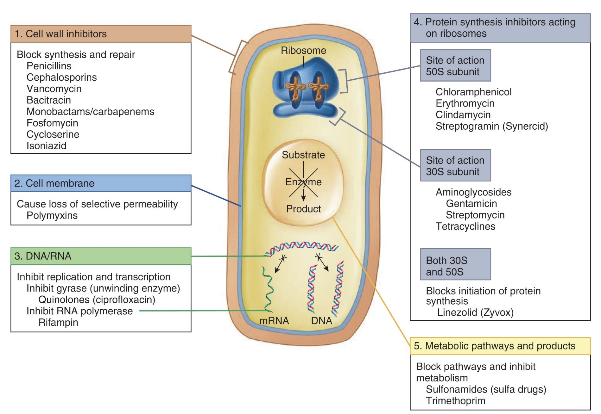

### peptidoglycan & Cell membrane
#### *β-lactam* 
- ==Penicillin (PCN)==
- Cephalosporin
- Carbapenems: Imipenem, Meropenem, Ertapenem
- Monobactam: Aztreonam

:::info {機制}
Peptidoglycan 形成時 Lys Ala 結合，Penicillin 類似Ala，卡住 Penicillin binding protein
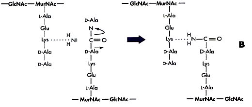
:::

#### Glycopeptides
- ==Vancomycin(萬古霉素)==
  - 分子超大，對陰性無效
- Teicoplanin

#### Polypeptides
- Bacitracin
  - 腎毒性太強
- polymycin
---
#### Lipopeptide
- ==Daptomycin==
  - 仿間最後線

#### Polypeptides
- Polymycin

### 抑制蛋白質形成

#### 50S ribosome
- Macrolide (巨環): Erythromycin, Azithromycin
- Lincosamide(林可胺): Clindamycin
- Oxazolidinones (噁唑烷酮): Linezolid
- Chloramphenical

#### 30S ribosome
- Aminoglycoside: Gentamicin, Tobramycin, Amikacin
-  Tetracycline: Tetracycline(四環黴素), Doxycycline, Minocycline
- Glycylcyclines

### 抑制核酸複製
- ==Quinolones==
  - 抑制解蜁(gyrase)
- Fluoroquinolone: Ciprofloxacin, Levofloxacin,
- Moxifloxacin
- Metronidazole
  - 專扁厭氧菌
- Rifampin
  - Mycobacterium tuberculosis（結核箘）有效
  - 橘尿

### 抑制代謝
#### Folic acid 合成

- Sulfanilamide
  - 類似PABA
  
- Trimethoprim

# 致病
## 黏細胞
gram's negative: Pili, Fimbriae

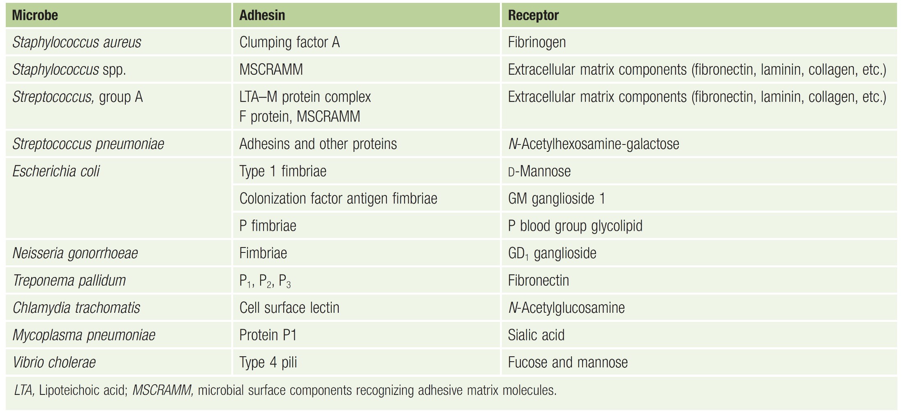

## Endotoxin 
A.K.A Lipopolysaccharide (LPS)

## A-B exotoxin
- B for bounding, A for action

都要背。。。
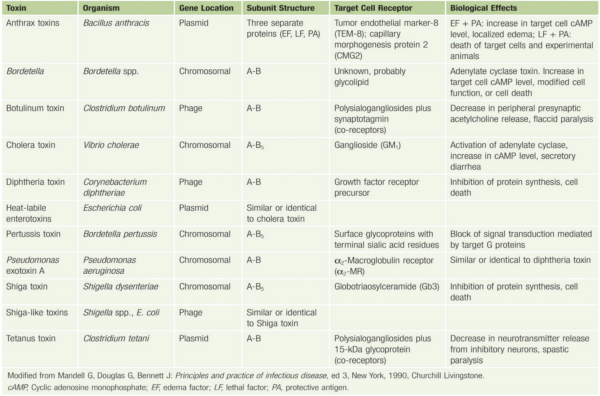

## 逃避免疫

- Bacterial Capsules 
  - 莢膜，辨識不能
  
- Intracellular replication
  - 躲進細胞
  
- &beta;-lactamase 直接分解抗生素

# 細菌 

## Bacillus anthracis (炭疽桿菌)
- Spore 躲進Macrophage ，環遊世界
- Capsule: poly-D-glutamic acid
- 3 proteins
   1. Protective Antigen(PA83): *B toxin*
   2. Edema factor : 水腫， *A toxin*
   3. Lethal factor :致命，殺細胞，*A toxin*
- 2 exotoxin
  - Edema toxin = PA63+EF 
  - Lethal toxin = PA63+LF
> 20不見了
:::tip

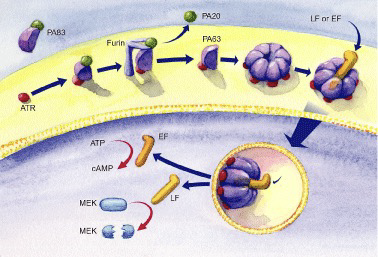
- EF &rarr; cAMP
  - cAMP 在腸道導致腹瀉

:::

## Bacillus cereus (仙人掌桿菌、蠟桿菌)
- 食物中毒
  - Emetic form: 米，嘔吐
  - Diarrheal form: 其他，cAMP
- 大多無 Capsule

## Listeria *monocytogene* (李斯特菌)
- 冰箱存活可能
- 超會躲，可以穿過胎盤，生食<i class="fa-solid fa-triangle-exclamation"></i>
  

## Cotynebacterium diphtheria (白喉棒狀桿菌)
- 唯一宿主
- 被&beta; 噬菌體感染才有毒
- AB toxin
- 抑制蛋白合成

## Enterobacteriaceae (腸桿菌科)
- Capsule 
- LPS 長一根 O antigen, Lipid A都是抗原

:::fbox

:::
### Escherichia coli (大腸桿菌)

1. Uropathogenic E. coli (UPEC)
   - 泌尿道感染
2. Enterotoxigenic E. coli (ETEC)
   - LT enterotoxin 
     - cAMP 拉肚子
   - ST enterotoxin
     - cGMP 拉肚子
3. Enterohemorrhagic E. coli (EHEC) / Shiga toxin producing E. coli (STEC)
   - O~157~
   - 低燒，血便
   - Hemolytic-uremic syndrome(HUS)
     - 導致腎衰竭
   - **(O~157~)**
4. Enteropathogenic E. coli (EPEC)
   - 沒有外毒素，黏著導致拉肚子，爛
   - Intimin receptor 細胞分泌的

:::info {Shiga toxin}

:::

### Salmonella (沙門氏菌)
- O (somatic) ; Vi (capsular); H (flagellar)

- Capsule 能做疫苗 16S rRNA typing

**More than 2500 unique serotypes**
- *Salmonella enterica* (serotype XXX)

:::example
1. *Salmonella enterica* serotype Typhi 
&rarr; S. Typhi (傷寒)
1. *Salmonella enterica* serotype Typhimurine
&rarr; S. Typhimurine (感染雞卵巢)
:::

#### Typhoid Fever (傷寒)
- 唯一宿主
- Macrophage 全身跑
  - 先進循環，再去膽囊

### Shigella (赤痢)
- 唯一宿主，高傳染性，10隻
- 口糞傳染
- Shiga toxin

### Yersinia (耶氏桿菌)

#### Yersinia pestis (鼠疫桿菌)
- Plaque (鼠疫)
- 10^4^隻
- 跳蚤、人傳人（肺部形，100%死亡）

#### Yersinia enterocolitica (小腸結腸炎耶氏桿菌)
- 拉肚子
- 4&deg;C存活

### Proteus mirabilis (奇異變形桿菌)
- 亂跑，Swarming 
- Urease (+)，產生胺，在膀胱

## 彎桿菌
### Vibrio (弧菌)
- Gram's negative
#### V. cholera (霍亂弧菌)
- 白色掏米水便，拉到膽汁來不及上色
- O~1~, O~139~
- 10^7^ 隻
- 帶有Cholera toxin 才致病，cAMP

#### V. parahaemolyticus
- 生魚片
- Kanagawa hemolysin
  - β-hemolysis on 人O型血或兔血

#### V. vulnificus (創傷弧菌/海洋弧菌)
- 肝硬化、肝癌感染危險

### Campylobacter
- Microaerophilic (5% O~2~)
- 只吃portein

#### C. jejuni (空腸彎曲桿菌)
- 吃未熟的雞鴨牛羊肉
- Guillain-Barre syndrome (巴利氏症候群)
  - 打疫苗產生的抗體去攻擊髓鞘，自體免疫疾病

### Helicobacter
- 唯一宿主，筷子傳染
- 胃食道逆流

#### H. pylori (幽門螺旋桿菌)

## Pseudomonas aeruginosa (綠膿桿菌)
- Gram's negative
- 水裏，隨便長
- 侵犯傷口，綠，香
- 高抗藥

## Neisseria
- Gram's negative，球菌

### N. gonorrhoeae (淋病雙球菌,gonococcus)
- 唯一宿主
- 子宮頸感染
  - **Fitz-Hugh-Cutis syndrome**: burning with urination, vaginal discharge,vaginal bleeding) &rarr; pelvic inflammation &rarr; peritonitis, perihepatitis
- No Vaccine 
  - Capsule 不一定
  - 表面抗原亂變

### N. meningitidis (腦膜炎雙球菌)
- Meningococcus
- Capsule
- Endotoxin (lipooligasaccharide; LOS)
  - O很短
- 唯一宿主
- Waterhouse–Friderichsen syndrome (猛爆性腦膜炎雙球菌菌血症)
  - 截肢
  
## 整理

# 免疫學 

## TCR 

CD3
: 長在T cell 

CD19, 20, 22
: B cell 

CD16, 56
: NK

CD4, CD*
: 輔助 MHC II, MHC I

## Lymph node 
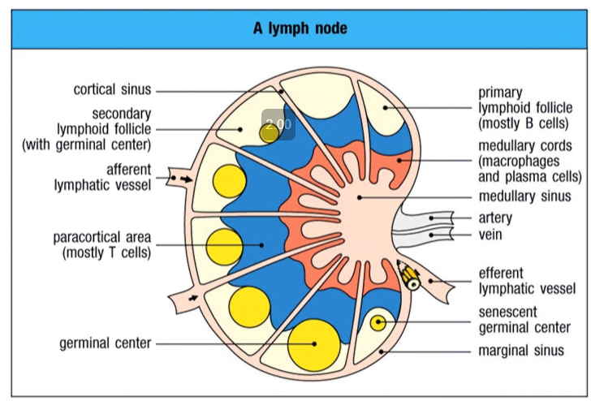

:::info {High endothelial venules}
- 看管淋巴細胞進入血管
- 認 L slectine ，成熟不表現

:::

## Spleen

:::fbox 

:::

- Germinal center 
  - Memory B cell
  - FDCS 
  - Macrophage

## Complement 
> 肝臟製造，血液中
- Lysis 溶解
- Chemotaxis 趨化
- Opsonization 調理

### Opsonization 調理

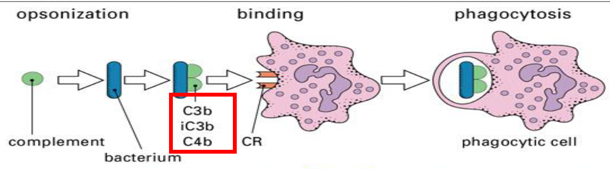
- C3b, C4b
### Chemotaxis 趨化
- C3a, C5a

### Lysis 溶解
- 不同 pathway 產成c3轉化酶(==C4b2a, C3bBb, C3(H~2~O)Bb==)
- C5b, 6, 7, 8, 9 形成 Membrane attack complex(MAC)

#### Classical
1. C1q 辨識 Ag，六顆球抓 Ag 
2. C1r互相活化
3. C1r 活化 C1s

#### Lectin 
- Mannose-binding lectin(MBL) 直接認 Ag

#### Alternative 
1. C3b 開始
2. C3b+B=C3bB 
3. C3bB (D)&rarr; C3bBb

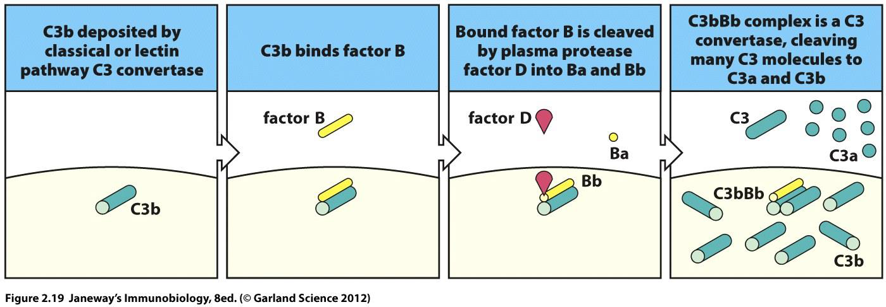

#### Alternative-2
- C3 水解成 C3(H~2~O)開始
- C3(H~2~O)+B (D)&rarr; C3(H~2~O)Bb

## Macrophage 

### Mannose receptor

:::left
C-type lectin 辨認 Mannose 
:::right

:::

### Fc receptor 

- 抓住抗體
- Fc&gamma; Receptor 抓 IgG

### Complement receptor

### CD14/ Toll-Like receptor 

- 認 LPS 

## NK cell
- 抓 MHC I 不表現的
- NK receptor 傳遞殺了我
- MHC I 若表現，抑制NK

### NK cell inhibitory receptor

- CD94 認 HLA-E
- KIR 認 HLA-C 
- ITIM 傳遞抑制訊息

K
: lysine

:::fbox 

:::

:::info 
ITIM 
: immunoreceptor tyrosine inhibitory motif

HLA E
: 一種 MHC I ，一般的MHC I 呈現抗原，HLA E 呈現製造 MHC I 剩下的垃圾。

:::

#### 如何殺
- Fas ligang 
  - 認細胞的 Fas (CD95)，導致凋亡
- 有毒的 Cytokines 
  - tumor necrosis factor (TNF)
  - lymphotoxin (LT)
- Granules 
  - 先 Perforin 穿孔，再送granzymes導致凋亡

## B cell and Antibodies 

Plasma cell
: 漿細胞

### 功能
- Complement activation 
  - 活化 C1 
- Opsonization
  - 調理(黏上去)
- Nuetralization
  - 中和 

### 結構
- Light: &kappa;, &lambda;
- Heavy: &mu;(IgM), &gamma;(IgG), &alpha;(IgA), &delta;(IgD), &epsilon;(IgE)

### Development 
- Pre-B 完成 Heavy chain 
- Immature B 完成 Light chain 
- 首次遇到丟 IgM
- Class switch 
  - 分支進化

### Ig? 
#### IgM
- 五連體
- 四個 C domain &rarr; 不用 Hinge
- 很大支，主要在血管 10%
- 活化 C1 

#### IgD 
- 主要在 B cell 表面
- 作為 Triger?

#### IgG 
- G1-G4 差在 Hinge 長度
- 多產 70-75% 
  - G1 66%
  - G2 23%
  - G3 7%
  - G4 4%
- 2^nd^ immune responses 
- 高穿透力 (唯一能過胎盤)
- 活化 C1 

#### IgA 
- Dimer (20% of IgA in human)
  - J chain 串聯
  - Compoment 黏在上面
    - IgA 會去有黏液的腔室， Complement 能保護 
  
- 在哪?
  - IgA1: 鼻腔、淚水、唾液與母乳
  - IgE: Colon

#### IgE 
- 四個 C domain &rarr; 不用 Hinge
- 亂分泌、亂黏Mastcell 的 Fc receptor &rarr; 去顆粒，發炎
- 

## T cell
- 雙重辨識： MHC, Peptide 都對才殺
- CD4 and CD8 are T cell co-receptors
- 表面一定有 CD3 

DiGeorge syndrome 
: 胸腺發育不全

### 胸線 
- Cortex
  - Thymocyte 
- Medulla
  - dendritic cell 
  - medullary epithelial cell

### selection

:::left
#### Positive (Stage 1)
- Cortical epithelial cell
  - 表現所有 MHC
- 是否會和 MHC 結合?會就存活。
  - 根據結合的MHC 發育 CD4, CD8
:::right
#### Negative (Stage 2)
- 交界處或近髓質的 dendritic cell 
- 是否結合自我抗原？是就死亡。
:::

### TCR-CD3 complex
- CD3 具有 ITAM ，傳遞活化訊息

### &alpha;&beta;-T v.s. &gamma;&delta;-T 

### Diversity 
- &beta; ~ H, &alpha; ~ L 
- T cell 多樣性較高

### 抗原呈現 
- 有核就有 MHC I

#### MHC I (內源性抗原呈現)
1. MHC 在ER 製造，calnexin 幫助組裝
2. calreticulin, ERp57, 幫助穩定、不讓MCH結合
3. Proteasome 打爛 protein，餵給 MHC 
4. 運輸到細胞膜

#### MHC II (外源性抗原呈現)
1. protein 先被打爛
2. LIP10 在 ER 卡著 MHC 
3. 丟出 endosome 後剩下 CLIP 在卡
4. HLA-DM 解開 CLIP 

:::info {CDRs}

CDRs
: Complementarity-Determining Regions
:::

## Cytokines 

# 真菌
- Membrane
  - ergosterol(麥角固醇)
- Cell wall
  - chitin
  - &beta;1,3 D-glucan
  - mannan

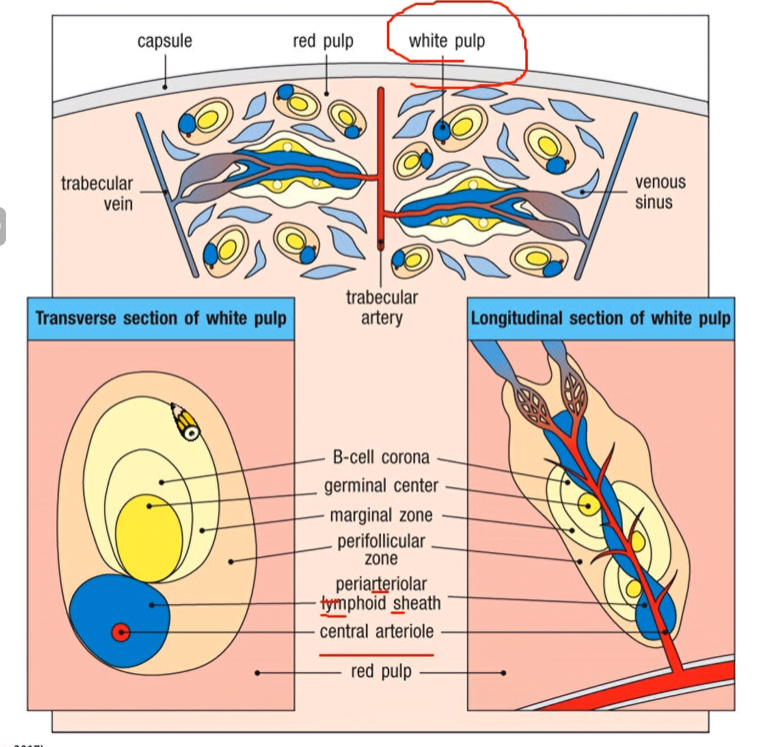
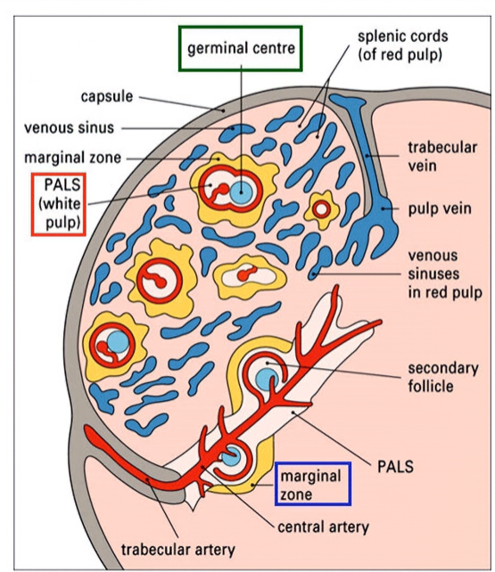

## 型態
### Yeast 
- 像細菌
- Pseudohyphae

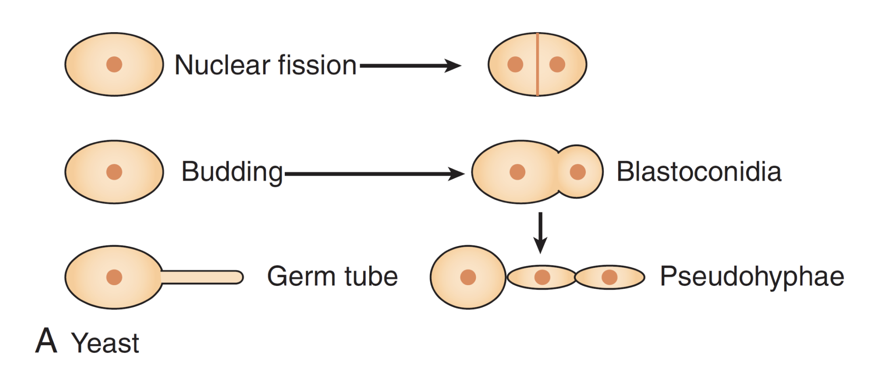
### Hyphae 
- Sepate hypha
- Coenocytic hypha

### Dimorphic 

### 菌絲
- Vegetative hyphae (營養菌絲)  
- Aerial hyphae (空中菌絲)

### Spore 
- Sexual spores
  - Zygospore (接合孢子)
  - Ascospore (子囊孢子)

- Asexual spores
  - Sporangiospores (孢子囊孢子)

  - Blastospore (芽生孢子)
  - Chlamydospore (厚膜孢子)

  - Conidia (分生孢子)
  - Arthrospore (分節孢子)
  - Phialospore (瓶孢子)
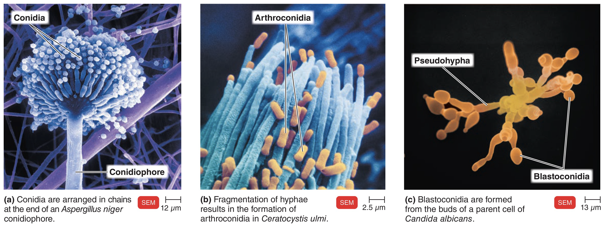

## 分類
### Ascomycota (子囊菌門)
- 有性: Ascospore
- 無性: Conidia, Arthrospore, Phialospore, Chlamydospore
- Hyphae 連接世代 
- Ascus(n+n)&rarr; Karyogamy(2n)&rarr; Ascospore(n)

### Basidiomycota (擔子菌門)
- Basidium(n+n &rarr; 2n) &rarr; Basidiomycota(n,有性)
- 沒無性胞子

### Mucormycetes (接合菌, Zygomycetes)
- 產生Sporangiospores(孢子囊孢子)
- Zygospore (接合孢子)
  - n+n &rarr; 2n &rarr; n

### Microspora (微孢子門)
- 絕對寄生
- No sexual spores
- Spore 注射進入細胞，青蛙下蛋、長出細胞膜，再炸一堆Spore
  - 超噁

## 製藥
### Cell membrane
#### Allylamines
- 抑制 ergosterol 合成

#### Azoles
- 抑制 ergosterol 合成

#### Polyenes 
- 認 ergosterol接在膜上，穿孔
- ==Amphotericin B==
- 強，七傷拳

### Cell wall

#### Echinocandins 
- 抑制 1,3-&beta;-D-glucan

### cell division
#### Griseofulvin
- 停在角質層，長期有效

### nucleic acid synthesis

#### Fluorocystine
- cystine 類似物
- Amphotericin B 協同

## 感染 

### Athlete's foot (香港腳)
- ***Trichophyton*** 
  - 吃 Keratin(角蛋白)

### Histoplasmosis

- Grow inside the phagocytes
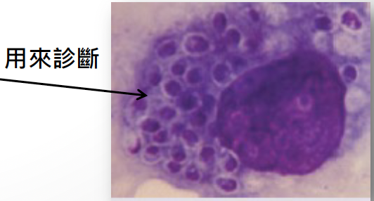

### Candida albicans 白色念珠菌
- 70% 院內黴菌感染
- Oral candidiasis -Thrush (鵝口瘡)
- Vulvovaginal candidiasis (外陰陰道念珠菌病)

:::info {嘴}
- 治療 
  - Nastsatin
  - Azoles

:::

### Cryptococcosis 
- Cryptococcus neoformans (新型隱球菌)
  - Basidiomycota
- 腦膜炎
- 小心鴿子

### Pneumocystis jirovecii (卡氏肺囊蟲)

- 無 ergosterol

