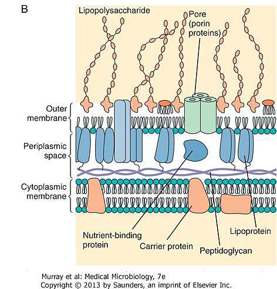
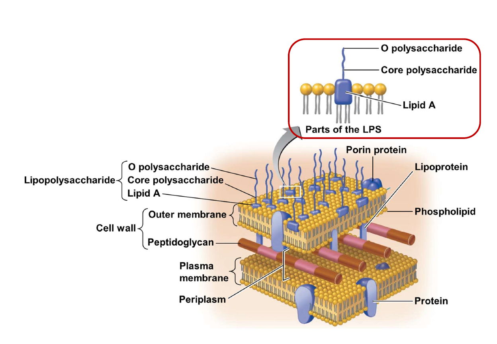
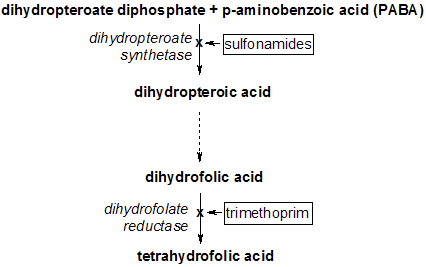
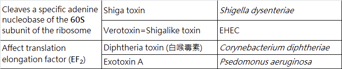

---
toc:
    depth_from: 1
    depth_to: 3
html:
    offline: false
    embed_local_images: false #嵌入base64圖片
print_background: true
export_on_save:
    html: true
---
# Intro 
- 生科不考，沒教不考
- β-lactamases destroy
antibiotics such as penicillin

- Lipopolysaccharide (LPS)
  - Lipid A 致病
  - Core 含2-keto-3-
deoxy-octanoate(KDO)

- protoplasts

- mycolic acids(acid-fast):讓細菌不被 Gram-stained

## 重組
### Homologous recombination (同源) and Non-homologous recombination:
- 幾乎相同序列
- non- 需要酵素

### Site-specific recombination
- ex. 噬菌體
- 需要特定序列、酵素

## Mutation
- Intercalating agents (Chemical agents)
  - 改變DNA鹼基對之間距離，導致配對錯誤

## Gene exchange
### Transformation
- 可以用化學方法促進DNA通透

### Conjugation
- Sex pilus 釣魚收線

### Conjugation
- Generalized or Specialize 
  - [Site-specific recombination](#site-specific-recombination)專一性

### 格蘭氏染色

:::left

**Positive**
- 單層膜
- Teichoic acid

**Negative**
- 雙層膜
- Lipopolysaccharide (LPS)
- Peptidoglycan

:::right

:::

# 消毒 

Antisepsis
: for 活體，化學

Sterilization
: 燒毀！

Disinfection
: 剩下 Spore

:::info {spore} 
只有

Bacillus
: 好氧格蘭氏陽性桿菌

Clostridium
: 厭氧格蘭氏陽性桿菌
:::

## Antisepsis
1. Alcohols 
   - non-enveloped viruses(沒外套膜)不能殺
   - Spore, some fungi 不能殺
2. Chlorhexidine (CHX)
   - ==德恩奈漱口水能殺 SARS-CoV-2==
3. Triclosan 
   - 高露潔用這個
   - 但是好像會致癌

## Disinfection and Sterilization

1. Oxidizing
   - 3-6% Disinfection
   - 10-25% Sterilization
2. Chlorine compounds
   - 蔡衍明乾杯
3. Aldehydes
   - 蛋白質軟化
4. Radiation
   - 痛扁DNA (TT Dimer)
5. 抗生素
   - Protosil (Sulfanilamide)
   - Penicillin

## 抗生素

### peptidoglycan & Cell membrane
#### *β-lactam* 
- ==Penicillin (PCN)==
- Cephalosporin
- Carbapenems: Imipenem, Meropenem, Ertapenem
- Monobactam: Aztreonam

:::info {機制}
Peptidoglycan 形成時 Lys Ala 結合，Penicillin 類似Ala，卡住 Penicillin binding protein

:::

#### Glycopeptides
- ==Vancomycin(萬古霉素)==
  - 分子超大，對陰性無效
- Teicoplanin

#### Polypeptides
- Bacitracin
  - 腎毒性太強
- polymycin
---
#### Lipopeptide
- ==Daptomycin==
  - 仿間最後線

#### Polypeptides
- Polymycin

### 抑制蛋白質形成

#### 50S ribosome
- Macrolide (巨環): Erythromycin, Azithromycin
- Lincosamide(林可胺): Clindamycin
- Oxazolidinones (噁唑烷酮): Linezolid
- Chloramphenical

#### 30S ribosome
- Aminoglycoside: Gentamicin, Tobramycin, Amikacin
-  Tetracycline: Tetracycline(四環黴素), Doxycycline, Minocycline
- Glycylcyclines

### 抑制核酸複製
- ==Quinolones==
  - 抑制解蜁(gyrase)
- Fluoroquinolone: Ciprofloxacin, Levofloxacin,
- Moxifloxacin
- Metronidazole
  - 專扁厭氧菌
- Rifampin
  - Mycobacterium tuberculosis（結核箘）有效
  - 橘尿

### 抑制代謝
#### Folic acid 合成

- Sulfanilamide
  - 類似PABA
  
- Trimethoprim

# 致病
## 黏細胞
gram's negative: Pili, Fimbriae

## Endotoxin 
A.K.A Lipopolysaccharide (LPS)

## A-B exotoxin
- B for bounding, A for action

都要背。。。

## 逃避免疫

- Bacterial Capsules 
  - 莢膜，辨識不能
  
- Intracellular replication
  - 躲進細胞
  
- &beta;-lactamase 直接分解抗生素

# 細菌 

## Bacillus anthracis (炭疽桿菌)
- Spore 躲進Macrophage ，環遊世界
- Capsule: poly-D-glutamic acid
- 3 proteins
   1. Protective Antigen(PA83): *B toxin*
   2. Edema factor : 水腫， *A toxin*
   3. Lethal factor :致命，殺細胞，*A toxin*
- 2 exotoxin
  - Edema toxin = PA63+EF 
  - Lethal toxin = PA63+LF
> 20不見了
:::tip

- EF &rarr; cAMP
  - cAMP 在腸道導致腹瀉

:::

## Bacillus cereus (仙人掌桿菌、蠟桿菌)
- 食物中毒
  - Emetic form: 米，嘔吐
  - Diarrheal form: 其他，cAMP
- 大多無 Capsule

## Listeria *monocytogene* (李斯特菌)
- 冰箱存活可能
- 超會躲，可以穿過胎盤，生食<i class="fa-solid fa-triangle-exclamation"></i>
  

## Cotynebacterium diphtheria (白喉棒狀桿菌)
- 唯一宿主
- 被&beta; 噬菌體感染才有毒
- AB toxin
- 抑制蛋白合成

## Enterobacteriaceae (腸桿菌科)
- Capsule 
- LPS 長一根 O antigen, Lipid A都是抗原

### Escherichia coli (大腸桿菌)

1. Uropathogenic E. coli (UPEC)
   - 泌尿道感染
2. Enterotoxigenic E. coli (ETEC)
   - LT enterotoxin 
     - cAMP 拉肚子
   - ST enterotoxin
     - cGMP 拉肚子
3. Enterohemorrhagic E. coli (EHEC) / Shiga toxin producing E. coli (STEC)
   - O~157~
   - 低燒，血便
   - Hemolytic-uremic syndrome(HUS)
     - 導致腎衰竭
   - **(O~157~)**
4. Enteropathogenic E. coli (EPEC)
   - 沒有外毒素，黏著導致拉肚子，爛
   - Intimin receptor 細胞分泌的

:::info {Shiga toxin}

:::

### Salmonella (沙門氏菌)
- O (somatic) ; Vi (capsular); H (flagellar)

- Capsule 能做疫苗 16S rRNA typing

**More than 2500 unique serotypes**
- *Salmonella enterica* (serotype XXX)

:::example
1. *Salmonella enterica* serotype Typhi 
&rarr; S. Typhi (傷寒)
1. *Salmonella enterica* serotype Typhimurine
&rarr; S. Typhimurine (感染雞卵巢)
:::

#### Typhoid Fever (傷寒)
- 唯一宿主
- Macrophage 全身跑
  - 先進循環，再去膽囊

### Shigella (赤痢)
- 唯一宿主，高傳染性，10隻
- 口糞傳染
- Shiga toxin

### Yersinia (耶氏桿菌)

#### Yersinia pestis (鼠疫桿菌)
- Plaque (鼠疫)
- 10^4^隻
- 跳蚤、人傳人（肺部形，100%死亡）

#### Yersinia enterocolitica (小腸結腸炎耶氏桿菌)
- 拉肚子
- 4&deg;C存活

### Proteus mirabilis (奇異變形桿菌)
- 亂跑，Swarming 
- Urease (+)，產生胺，在膀胱

## 彎桿菌
### Vibrio (弧菌)
- Gram's negative
#### V. cholera (霍亂弧菌)
- 白色掏米水便，拉到膽汁來不及上色
- O~1~, O~139~
- 10^7^ 隻
- 帶有Cholera toxin 才致病，cAMP

#### V. parahaemolyticus
- 生魚片
- Kanagawa hemolysin
  - β-hemolysis on 人O型血或兔血

#### V. vulnificus (創傷弧菌/海洋弧菌)
- 肝硬化、肝癌感染危險

### Campylobacter
- Microaerophilic (5% O~2~)
- 只吃portein

#### C. jejuni (空腸彎曲桿菌)
- 吃未熟的雞鴨牛羊肉
- Guillain-Barre syndrome (巴利氏症候群)
  - 打疫苗產生的抗體去攻擊髓鞘，自體免疫疾病

### Helicobacter
- 唯一宿主，筷子傳染
- 胃食道逆流

#### H. pylori (幽門螺旋桿菌)

## Pseudomonas aeruginosa (綠膿桿菌)
- Gram's negative
- 水裏，隨便長
- 侵犯傷口，綠，香
- 高抗藥

## Neisseria
- Gram's negative，球菌

### N. gonorrhoeae (淋病雙球菌,gonococcus)
- 唯一宿主
- 子宮頸感染
  - **Fitz-Hugh-Cutis syndrome**: burning with urination, vaginal discharge,vaginal bleeding) &rarr; pelvic inflammation &rarr; peritonitis, perihepatitis
- No Vaccine 
  - Capsule 不一定
  - 表面抗原亂變

### N. meningitidis (腦膜炎雙球菌)
- Meningococcus
- Capsule
- Endotoxin (lipooligasaccharide; LOS)
  - O很短
- 唯一宿主
- Waterhouse–Friderichsen syndrome (猛爆性腦膜炎雙球菌菌血症)
  - 截肢
  
## 整理

# 免疫學 
