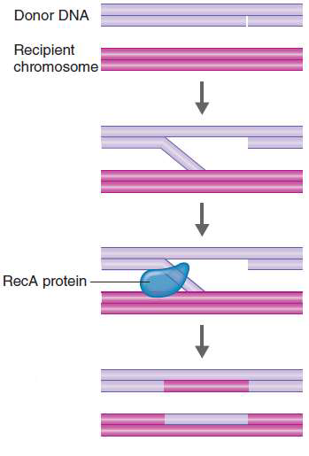
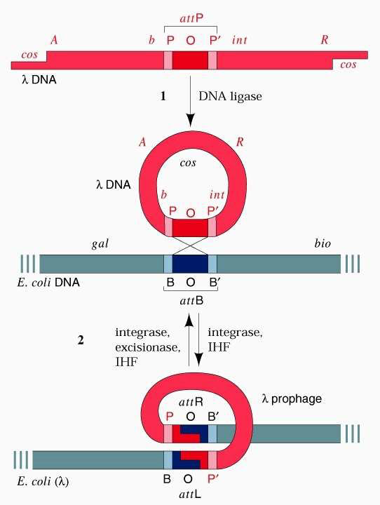

---
toc:
    depth_from: 1
    depth_to: 3
html:
    offline: false
    embed_local_images: false #嵌入base64圖片
print_background: true
export_on_save:
    html: true
---
# Intro 
- 生科不考，沒教不考
- β-lactamases destroy
antibiotics such as penicillin

- Lipopolysaccharide (LPS)
  - Lipid A 致病
  - Core 含2-keto-3-
deoxy-octanoate(KDO)

- protoplasts

- mycolic acids(acid-fast):讓細菌不被 Gram-stained

## 重組
### Homologous recombination (同源) and Non-homologous recombination:
- 幾乎相同序列
- non- 需要酵素

### Site-specific recombination
- ex. 噬菌體
- 需要特定序列、酵素

## Mutation
- Intercalating agents (Chemical agents)
  - 改變DNA鹼基對之間距離，導致配對錯誤

## Gene exchange
### Transformation
- 可以用化學方法促進DNA通透

### Conjugation
- Sex pilus 釣魚收線

### Conjugation
- Generalized or Specialize 
  - [Site-specific recombination](#site-specific-recombination)專一性
