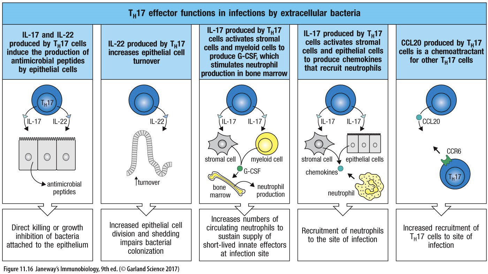

---
toc:
    depth_from: 1
    depth_to: 3
html:
    offline: false
    embed_local_images: false #嵌入base64圖片
print_background: true
export_on_save:
    html: true
---

## TCR-CD3 
- 6 個分子：ζζ、εδ、γε
- 磷酸化則 ITAM activate

## 你是哪種 T cell 

### CD 8 (T~C~)
- Dendritic cells(co-stimulatory activity)
  - 呈現 B7 活化native CD8 TC
  - Dendritic cells 分泌IL-12、IL-18 &rarr; CD8 TC 產生IFN-γ &rarr; 活化macrophage
- 1. 藉由 CD4 effector cells：同前面所提，CD4 TH cell 會co-simulation
(1) 強化 Dentrictic cells(或APC)上的4-1BBL 去接上CD8 TC cell 的4-1BB，
以及B7 去接T cell 上的CD28。
(2) 同時分泌 IL-2 到CD8 TC cell。

### CD 4 (T~H~)
- 只能選一條路走

#### T~H~1
- 殺細菌
- IFN-γ，CD40/CD40L 活化 Macrophage &rarr; M1(吞噬特化)

#### T~H~2 
- 寄生蟲 （嗜酸）
- M2 Macrophage 啟動修復

#### T~H~17 

- 促進 neutrophils 產生
- IL-17 
  - 骨髓的基質細胞(stromal cell)和髓細胞(myeloid cell)產生G-CSF &rarr;嗜中性球(neutrophils)。
- IL-22
  - 上皮細胞脫落及再生加速
- IL-17、IL-22 促進上皮細胞產生抗微生物蛋白(antimicrobial peptides)。
  - 殺胞外細菌和真菌。

#### T~FH~ 
- B cell Isotype switch 

## APC 

1. Adhesion
2. Ag-specific activation (primary signal)
3. Costimulation
(second signal)
4. Cytokine signals (third signal)

### adhesion
1. T cell 的 LFA 先結合 APC 的 ICAM 1 (弱)
2. `primary signal match ?` LFA-1 拉近 

LFA 
: Lymphocyte function-associated antigen

ICAM 
: intercellular adhesion molecule

### Primary signal 
- CD4-MHC II &rarr; Lck 磷酸化 ITAM 

Lck
: Lymphocyte-specific protein tyrosine kinase

### Co-stimulation (second signal)
==活化的 effector T cell 不需要==
#### 增強
- T cell  的 CD28 連 B7 
  - 活化 T cell 
  - T cell 產生 IL-2 receptor

- Tumor necrosis factor (TNF family，非必要) 
  >APC/ T cell
  - CD40/CD40 L 
  - 4-1BBL/4-1BB

#### 抑制
- B7/CTLA-4
  - CTLA-4 比 CD28 親和力強20倍

- PD-L1/PD-1
  - 癌細胞抑制 Tc 

### Cytokine signals (third signal)

## T~H~ 主導 

## T-B cell interactions
- 在 secondary lymphoid tissues

### Somatic hypermutation(體細胞超突變)
- Germinal center 中的 B cell 進行V-region 突變
  - AID 使 C &rarr; U

- 根 Dendritic cell 搶， Affinity 高存活

- T cell 的 IL 4, CD40/CD40L 觸發

AID 
: Activation-induced cytidine deaminase

### Isotype switch (Class switch)
- 轉變B cell 抗原類型
- T~FH~ 主導先天
#### DNA 重組 
- CD 前面沒有剪接點 &rarr; 變不出 IgD
- V-D-J 後面接要的類型

#### RNA 剪接
- IgM &lrarr; IgD
- 剪 Poly A

#### T cell 控制
- IgG
  - IL-4 
  - IFN-&gamma;
- IgA 
  - IL-5, TGF-&beta;
> 加起來 7
---
- IgE 
  - IL-4

#### 免疫過程 

## Cytokines 

- TGF-&beta;
  - 分化 T~H~17, T~reg~
  - Isotype switching
    - IgA1, IgA2

### 干擾素

- IFN-&alpha;
  - Dendritic cell 分泌 
- IFN-&beta;
  - fibroblast 分泌
- IFN-&gamma;
  - T~H~1, T~C~, NK分泌
  - 活化macrophage(M1)
  - Isotype switching
    - IgG2, IgG3

### Interleukin (IL?) 
- IL-4
  - 分化 T~H~2
  - T~H~2 分泌
  - 增生 B cell, Mast cell, Thymocyte
  - [Somatic hypermutation](#somatic-hypermutation體細胞超突變)
  -  Isotype switching
     - IgG4, IgE
- IL-5
  - T~H~2, T~FH~ 分泌
  - Isotype switching
    - IgG4, IgE

#### 抑制
- IL-2 
  - 抑制免疫反應
  - [Second signal](#co-stimulation-second-signal) 中 Tc 表現 IL-2 receptor
  - TGF-&beta;+IL2 &rarr; 分化成 T~reg~
  - T~H~ 分泌給 Tc

- IL-10
  - T~reg~ 分泌 
  - 抑制所有免疫反應

---
#### IL-6 發炎
- IL-6 
  - 分化T~FH~ ，發炎 ([Third signal ](#cytokine-signals-third-signal))
  - IL-6 + TGH-&beta; 分化 T~H~17

- IL-21
  - T~FH~ 分泌，促進 B cell Isotype switching

--- 
#### 殺細菌

- IL-12 
  - Dendritic cells 分泌
  - 分化 T~H~1，分泌 IFN-&gamma;

--- 

### Neutrophils 

- IL-17
  - T~H~17 分泌
  - 促進骨髓產 Neutrophils
  - 上皮細胞產抗菌蛋白
- IL-22 
  - T~H~17 分泌
  - 促進上皮更新
  - 上皮細胞產抗菌蛋白

## CD? 

### CD28 
- 位置：CD4 T cell
- Dendritic cells 呈現很多B7 活化 Tc
- Second signal 
  - [B7/CD28](#co-stimulation-second-signal增強)

### CD40 
- Second signal 
  - [TNF family](#co-stimulation-second-signal增強)
- [Somatic hypermutation](#somatic-hypermutation體細胞超突變)
  - CD40/CD40L, IL4 觸發
