---
toc:
    depth_from: 1
    depth_to: 3
html:
    offline: false
    embed_local_images: false #嵌入base64圖片
print_background: true
export_on_save:
    html: true
---
# Lipid 

## Plasma lipoproteins
:::fbox

:::

### 運輸
- Chylomicrons 裝 Tg

- HDL 的蛋白質多，帶 cholesterol 回肝
- VLDL 運出肝

:::info{Cholesterol ester}
- Cholesterol ester 完全疏水，能聚的更密

:::

### LDL

- apoproteins CII
- apoproteins B100

#### endocytosis 進入cell後負回饋
>抑制可降血脂

1. 抑制HMG-CoA 
   - 減少 LDL Receptor
2. 促進ACAT 
   - 促進 Cholesterol ester形成
3. 調控 LDL receptor 表現 

## Lipid acid
### 氧化
- &beta;氧化一圈少兩碳

#### Fatty acid activation
- Long chain (10-20)
  - mainly in ER
- Medium chain (4-12)
  - mitochondria matrix

#### 穿膜
- 外膜上加 Acetyl-CoA
- Carnitine
  - 標記送進matrix
- Carnitine-acylcarnitine translocase
  - 轉運 Carnitine, Fatty acyl-Carnitine
- Carnitine acyltransferase I (CPTI)
  - 外膜，加上Carnitine
- Carnitine acyltransferase II (CPTII)
  - 內膜，回收Carnitine

#### The &beta;-oxidation pathway
>粒線體基質
>&beta;氧化數逐漸上升

:::left
##### Acyl-CoA dehydrogenase
- &alpha;-&beta;氧化去氫
- 產生 FADH~2~
- Trans

##### Enoyl-CoA hydratase
- 水合產生2&deg;醇

##### 3-L-hydroxyacyl-CoA dehydrogenase
- 氧化產生酮
- NADH

##### &beta;-ketothiolase (thiolase)

- 切下一個Acetyl-CoA

:::right

:::

### 能量

- 一個Acetyl-CoA 進入 Citric Acid Cycle 產生 3NADH + FADH~2~ + ATP/GTP

### unsaturated fatty acids
#### cis
:::left
##### enoyl-CoA isomerase
- 3-cis到2-trans

##### 2,4-dienoyl-CoA reductase
- 消耗NADPH
- 2-trans,4-cis烯轉成3-cis

:::right

:::

#### propionyl-CoA

### Ketogenesis

- 一堆Acetyl-CoA沒有OAA能用（缺糖，缺碳）
- 三個產物稱為酮體
- Liver 製造酮體，組織&beta;-ketoacyl-CoA transferase 利用( S-CoA 攻擊酸)

#### &beta;-ketothiolase 
- 兩個 Acetyl-CoA 產生 Acetoacetyl-CoA 

#### HMG-CoA synthase 

第三個Acetyl-CoA 攻擊酮，產生6C

#### HMG-CoA lyase 
脱去 Acetyl-CoA 

### 合成

- 在細胞質中
- Citrate 穿膜

#### 穿膜

#### 2+3 製作

##### acetyl-CoA carboxylase (ACC).

- ACC 先接 E-Biotin，再 HCO~3~^-^
- 產生 Malonyl-CoA (3)

#### 產生2+3
- Acetyl-Acyl Carrier Protein (ACP)

#### 一坨 Megasynthase，變成4+1

:::left
##### &beta;-Ketoacyl-ACP synthase (KS)
- 2+3 &rarr;4+1
:::right

:::

## Get Tg 

### 膽鹽
- 介面活性劑

### Tg代謝

### Tg 合成

:::left
#### 原料
DHAP or Glycerol 轉成 Glycerol-3-phosphate

#### glycerophosphate acyltransferase (GPAT)

接脂肪酸上去

:::right

:::

### 脂肪暖暖包

## 磷脂

### 激活

1. glycerol phosphate
acyltransferase enzymes
   - 轉酸上去
2. ==CDP-diacylglycerol==
synthase
   - 黏上CTP，變高能
   - PPi &rarr; 2Pi

### 分支進化
>看看就好

- PS 一堆被PSD變 PE 

### PS/PG 調節

1. PG 帶負電
2. PS, PG 不帶電
3. 可以根據膜電位調整

### 高等生物
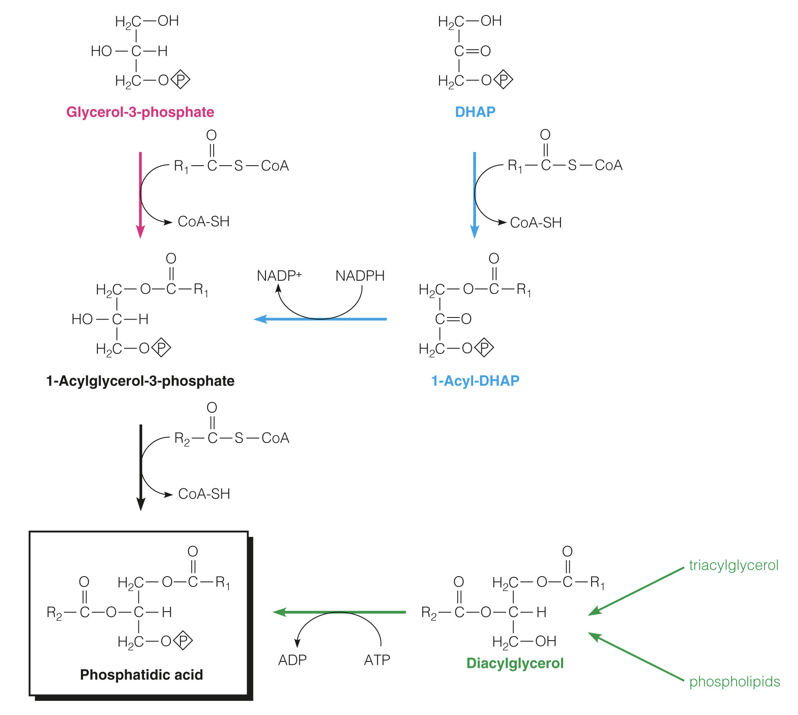
- 多途徑PA

### 做 PC & PE

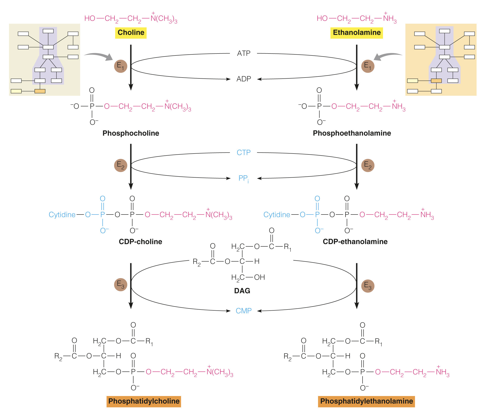

1. Kinase
2. 接上CMP，變成CDP-??
3. DAG 黏上去

:::warning {PEMT}
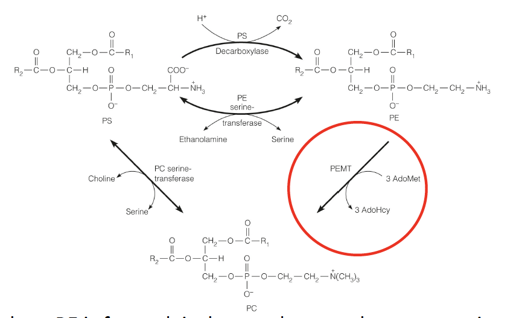
- PE 被加了三次甲基變成PC
- 甲基來源==AdoMet==
- methionine adenosyltransferase 一次拔三個Pi
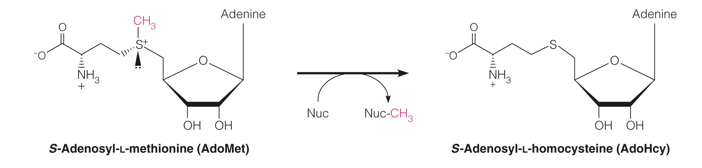
:::

### PI & Cardiolipin

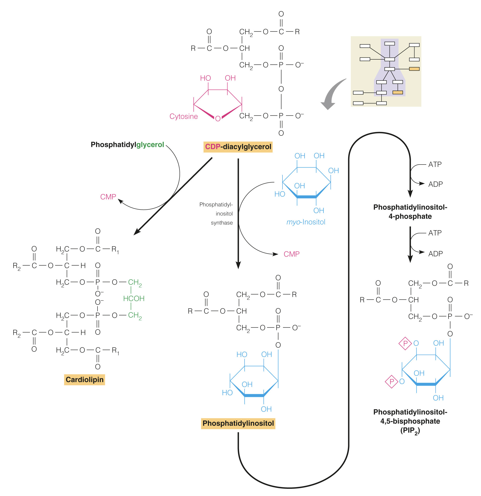

- Cardiolipin
  - 兩個DAG 黏在glycerol
- PI
  - CDP-diacylglycerol 接六碳醣
  - 負電

### 碳鏈置換

- phospholipases and specific lysophospholipid acyltransferases
- 切割位置
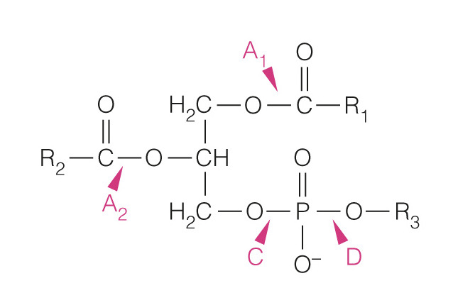

:::tip {蛇毒}
有些能切掉碳鏈，讓磷脂少一條，變成類似介面活性劑，溶cell
:::

## Steroids

### 合成 
> 27 C
#### 連接acetate
:::fbox 

:::

1. 產生mevalonate
   - ==HMG-CoA reductase 拔 S CoA, 還原 ketone==
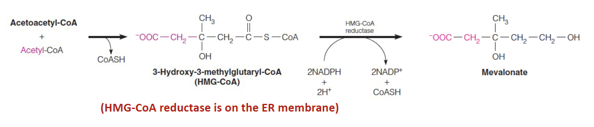

:::left
2. From 6 carbon (C6) mevalonate to 5 carbon (C5) IPP and DMAPP:
   - 三次磷酸化
   - 第三個磷酸、CO~2~一起走
   - IPP isomerase 轉換 IPP and DMAPP
:::right
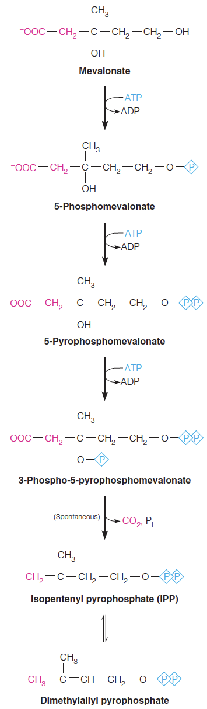

:::

3. 越來越長
   - DMAPP+ 5 IPP

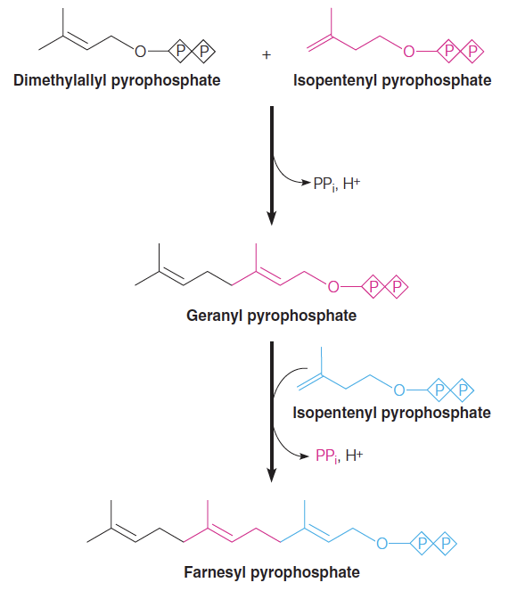

#### 成環
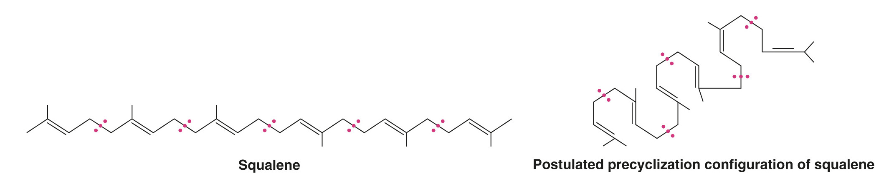

### 調控

#### Post translate 
>泛素調控 HMG CoA reductae

1. Lanosteral (cholesterol 前驅) 結合 Insig
2. Insig 把所有人黏起來
3. Ubc7 在 HMG-CoA reductase 上接 Ubiquitin
4. Proteasome 降解 HMG-CoA reductase

Ubiquitin 
: 泛素，標記擊殺

#### Transcript 

- 轉錄因子：bHLH
- 高 Cholesterol 會讓 Insig 抓 SCAP

SREBP
: sterol regulatory element binding proteins

Scap
: SREBP cleavage-activating protein

### 用途 

#### Bile acid 
- 最大宗

#### Progestin 
- 尾巴少六個，21C

### Steroid hormones 合成

## Vitamins
### Vitamin A 
- Retinal 會黏在 Disk 和 Opsin結合，形成 rhodopsin 上感光
- 照光丟出質子，變成 trans

:::fbox

:::

### Vitamin D

:::left
Active form: ==1,25-DHC==
:::right

:::

## 整理

### 磷脂
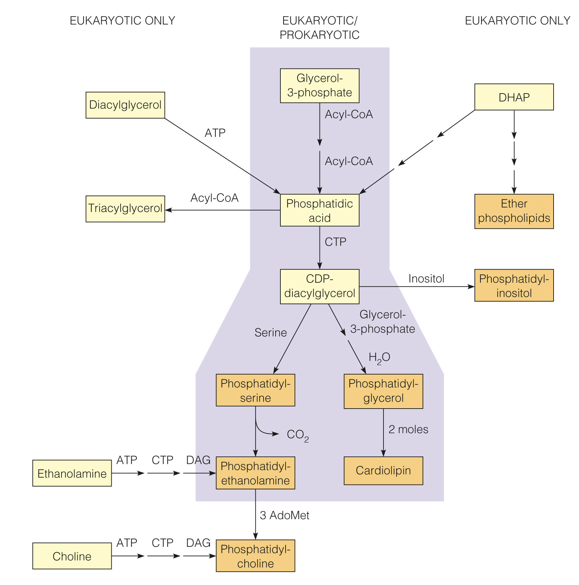
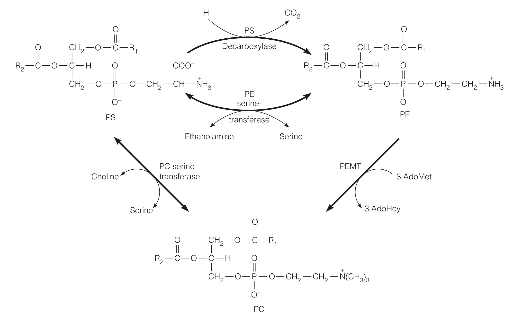

# 比較生理的東西

## 肌肉 

:::note
Glucose-6-phophatase 只有肝臟有，因此肌肉的肝醣不能利用

:::

### Cori cycle 
- 代謝乳酸
- gluconeogenesis 

### Creatine 肌酸
- 肌肉瞬間爆發力
- 形成 Creatinine (肌酸酐) 代謝

## 肝臟

- Malonyl-CoA 抑制酮體形成

## Insulin

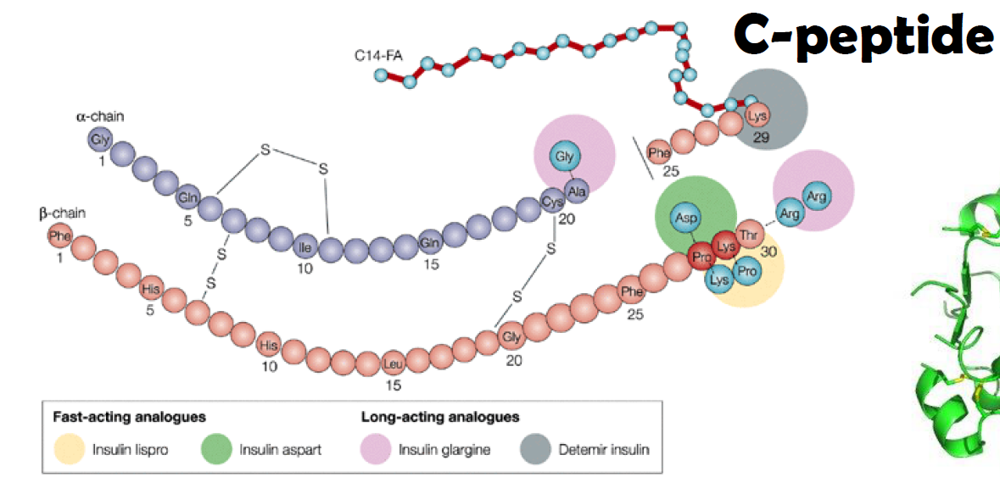

### Receptor 

- Receptor tyrosine kinase
  - 一般會形成 dimer，但是 Insulin R 自身就是 Dimer

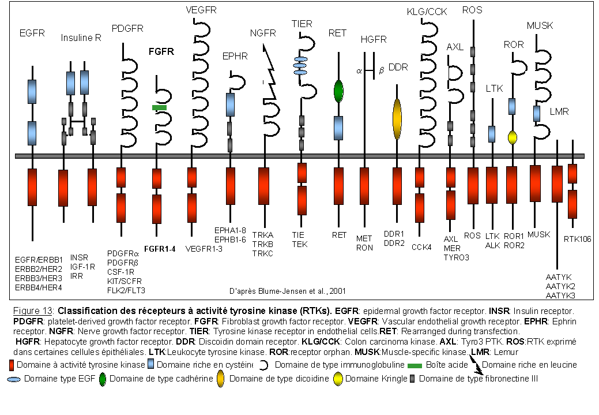

### GLUT 
> Glucose transporter

- GLUT2 
  - Liver 
  - Pancreatic &beta; cell 
  - small intestine
- GLUT4
  - Skeletal m.
  - Cardiac m.
  - Adipose tissue 
- GLUT5
  - 運 flucose 

## Leptin (瘦素)

:::left
- Adipose cell 產生
- 抑制 fat synthesis
- 促進 &beta;-oxidation
- 抑制 Hypothalamus 
- 促進產熱
  - 促進 Norepinephrine (唯一去偶合劑，搶電子傳遞)
:::right
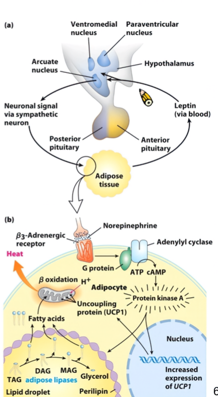
:::

## Glucagon / Epinephrine
- 促進分解
  - 例外: Epinephrine 會促進肌肉糖解
- cAMP 增加
  - 促進脂肪、肝糖分解
  - G protein 途徑
  - 促進 Protein Kinase A (PKA)

# 蛋白質代謝 

## Ubiquitin 

:::left

- 標記分解
- 標記需花ATP
- HECT E3 把它接在 Lysine
- Proteasome 分解
:::right

:::

## Amino acid metabolism

:::info {Kidney proximal tubular cells}
- 產胺

:::

### 轉胺機制
- ==&alpha;-ketoglutarate $\leftrightarrow$ L-glutarate==

#### 轉胺酶：
  - Alanine aminotransferase (ALT; glutamate pyruvate transaminase, GPT)
  - Aspartate aminotransferase (AST; glutamate oxaloacetate transaminase, GOT)

#### 輔酶: pyridoxal 5 phosphate (PLP, VitB6)
:::left
- 大家的輔酶
  - Transamination
  - Decarboxylation
  - Deamination
  - Transsulfuration
  - Desulfuration
  - Heme synthesis
  - Racemization
  - Tryptophan metabolism
  - Amino acid absorption

:::right 

:::

## 血液運輸
- 一般組織氮廢物用 L-glutamine 運送 (轉成中性)

- 肌肉氮廢物用 Alanine 運送
  - ==Pyruvate $\leftrightarrow$ Alanine==
  

## Glutamate Releases in liver
- 先轉胺再脱胺，&alpha;-ketoglutarate 進入 TCA cycle
  - aminotransferase
  - glutamate dehydrogenase
- 在 mitochondria

## Urea Cycle 尿素循環
- mitochondria 開始，在細胞質結束

### mitochondria 內
1. NH~4~^+^, CO~2~, ATP &rarr; Carbamoyl phosphate 
   - 起始酵素： Carbamoyl phosphate Synthetase

2. 加 ornithine 
   - transcarbamoylase

3. Formation of argininosuccinate through a citrullyl AMP intermediate
   - ==oxaloacetate $\leftrightarrow$ Aspartate==

4. Fumarate 連接 Urea cycle, TCA cycle

5. Formation of urea and ornithine
   - Urea + Arginine &rarr; Ornithine

## 生酮生糖？

生酮：3T2L(只生酮)1F (HMV, 必須)

## 各種輔酶
### Tetrahydrofolate 

- 來源：Vit B9
  

- Serine, glycine, methionine,
histidine metabolism

- 攜帶一個碳
  - -CH~3~

### Tetrahydrobiopterin (BH~4~) 
- 來自 GTP 

### Biotin (B~7~)
- 帶碳酸根單碳 
- Carboxylase 系列的輔酶
- 會和 Avidin 結合 (生雞蛋一堆)

:::example 
- 糖質新生 step1

:::

### pyridoxal 5 phosphate (PLP, VitB6)
- 脱去單碳
- 大家的輔酶
  - Transamination
  - Decarboxylation
  - Deamination
  - Transsulfuration
  - Desulfuration
  - Heme synthesis
  - Racemization
  - Tryptophan metabolism
  - Amino acid absorption
### S-Adensylmethionine (SAM, adoMet)

- 甲基化

- Homocysteine 
  - 需要 PLP 分解

### Thiamin pyrophosphate (TPP, Vit B~1~)
- Pyruvate dehydrogenase 
- 參與脫氫
- 缺乏：beriberi (腳氣病)

### niacin (Vit B~3~)
- NADP, NAD 原料

# 各種氨基酸

## Tryptophan
- 唯一有吲哚 (ex. IAA)
- 血清素 (Serotonin)
- 無光，Serotonon &rarr; 褪黑激素 (melatonin)

## Tyrosine and Phenylalanine
- 黑色素(Melanin)
- ==tyrosinase==
- 兒茶酚胺（Catecholamine）
  - BH~4~, PLP, 甲基化

### phenylketonuria (PKU， 苯酮尿症)
- Phenylalanine hydroxylase 失能
  - Phenylalanine沒法變成 tyrosine
  

- BH~4~
- 少一個都不行
  

- 三個產物都有神經毒 &rarr; severe mental retardation (智障)

### 其他症狀
- 黑尿酸堆積 &rarr; 黑尿症

## &alpha; Ketoglutarate
- Arg, Glu, His, Pro 都走這條

:::warning {Glutathione (GSH)}
- 清自由基
- NADPH 清除
- 標記分子 （肝臟去毒）
- 折雙硫鍵

:::

### &gamma;-aminobutyric acid (GABA)

- PLP  脱 CO~2~

### NO 
- NO synthase 切 Arginine 

- 血管擴張： cGMP 導致，Phosphodiesterase (PDE5) 水解

### histamine
Histidine 脱 CO~2~ (PLP) 轉 histamine

## Succinyl CoA
- Iso, Met, Thr, Val 
- Biotin, B~12~

## Branched Chain Amino Acids metabolism (BCAA)

- 不在肝臟分解，在肌肉分解，防抽筋
- leucine, isoleucine, and valine
- 楓糖漿尿症 (Maple syrup urin MSUD)
- 輔酶： TPP 

## 整理 

# 蛋白質合成

## 重要三組人
- 轉胺作用分解、合成

## Ser, Gly, Cys 

### Creatine 合成

### 芳香族胺基酸合成

- shikimic acid pathway
- Chorismate
