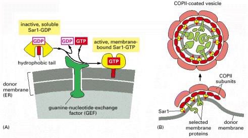
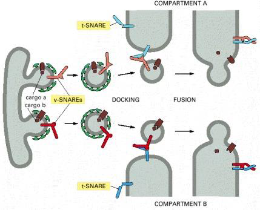
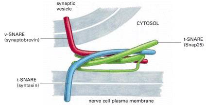
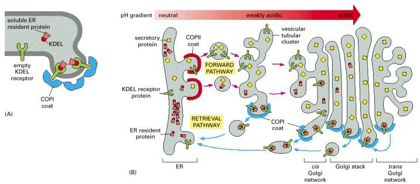
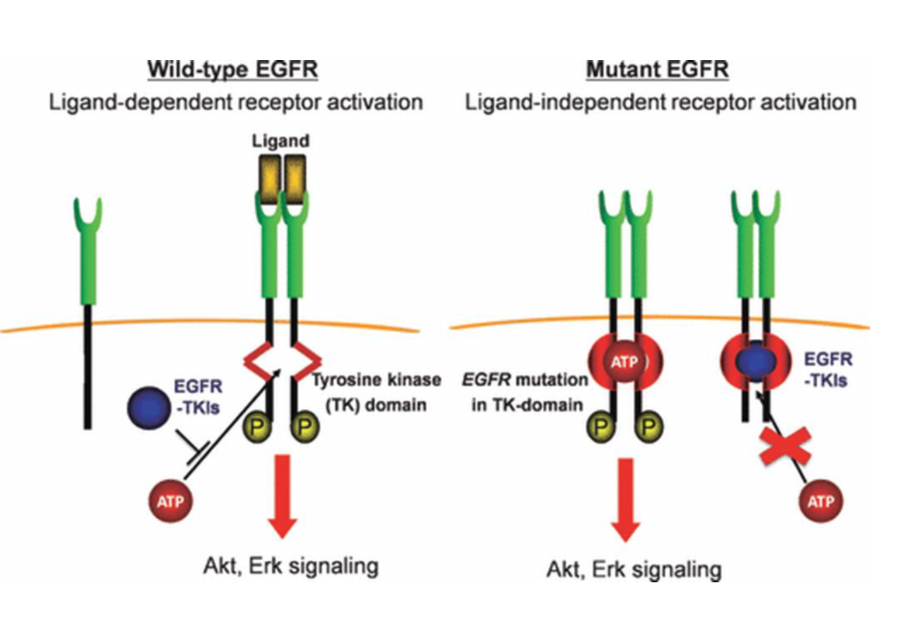
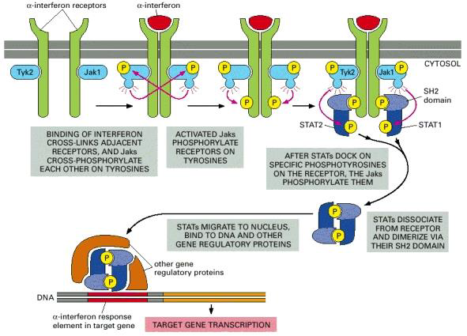
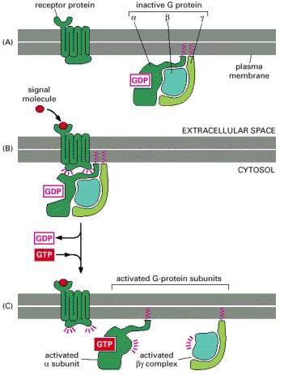
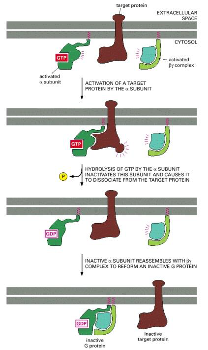

---
toc:
    depth_from: 1
    depth_to: 3
html:
    offline: false
    embed_local_images: false #嵌入base64圖片
print_background: true
export_on_save:
    html: true
---
# 膜運動

## GEF 
- 分出

## V-SNARE and t-SNARE 
- Fusion 
  

## COP
- COPI coat: Golgi &rarr; ER 
- COPII coat: ER &rarr; Golgi
- 專一性: Receptor

# 訊息傳遞
>蛋白質磷酸化發生在 Tyr Ser Thr

## 從肺癌的例子開始
TKIs (Tyrosine kinase inhibitor )抑制 EGFR 的 TK-domain 

### Receptor 沒TK功能？
找外面的

## G protein Coupled Receptors
:::fbox

:::

