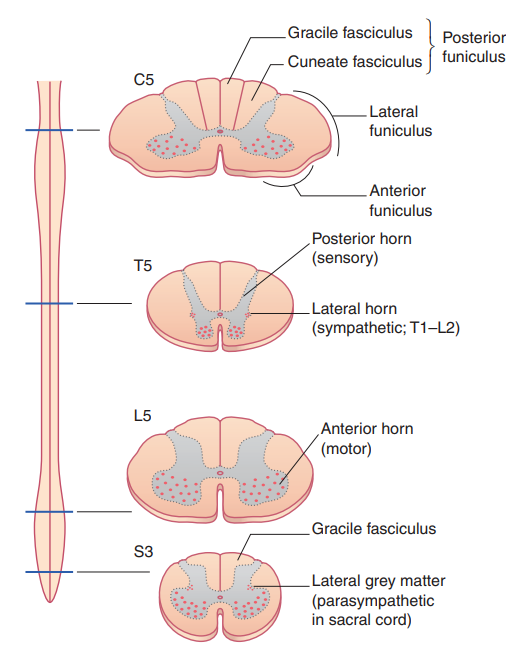
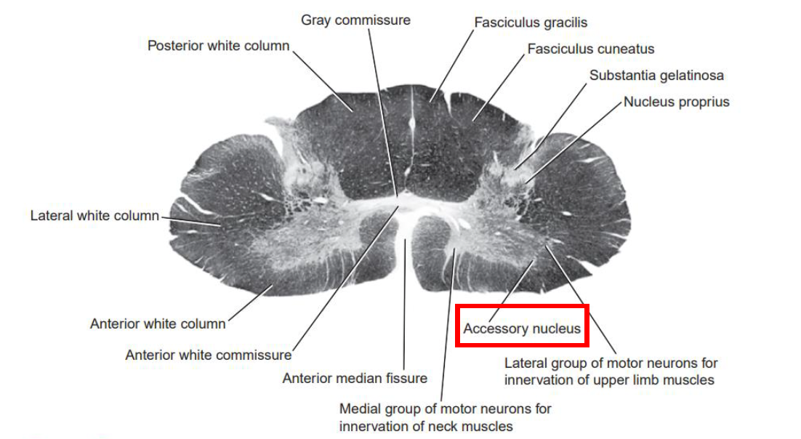
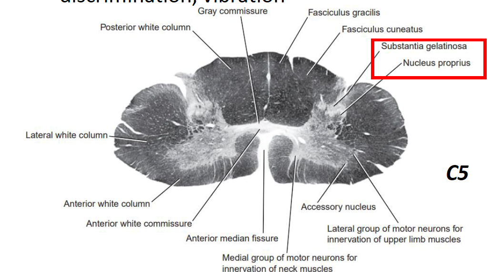

---
toc:
    depth_from: 1
    depth_to: 3
html:
    offline: false
    embed_local_images: false #嵌入base64圖片
print_background: true
export_on_save:
    html: true
---
# 脊椎
- lateral horn
  - 交感
- Gracile fasciculus
  - 上肢
- fasciculi proprii
  - 跨層傳遞的神經束
- Relay (projection) cell (20 50 &mu;m)
  - 傳感覺到大腦
- α motor neuron and γ motor neuron
(50 100 uM
    - 骨骼肌

## 發育 
- Neural crest &rarr; posterior root ganglia

:::fbox

:::

## Central group 
- C3-5
  -  phrenic nucleus (phrenic)
- C1-C5
  -  accessory nucleus 
  -  innervate SCM and trapezius
- L2-S1
  - lumbosacral nucleus 
  - unknown innervation

## posterior gray columns
- Substantia gelatinosa group
    - 溫、痛
- Nucleus proprius group
  - 自體感覺 proprioception

## posterior gray columns (intermediate)

- Nucleus dorsalis (Clarke’s column): C8 L3

## 要知道的 
### 灰質

>再來是各層細胞本體功能

#### Lamina I
- tip of the dorsal horn

#### Substantia gelatinosa group (laminae II)
- Gray column 中最靠背側的區域
- 輸入痛覺(pain)、溫覺(temperature)、粗略的觸覺(light touch)
- 傳到 III, IV

#### Nucleus proprius group (laminae III, IV)
- 本體感覺(proprioception), light touch

#### laminae V 
- 感覺穿到對側

#### laminae VI 
- 參與脊椎反射的 small interneurons 

#### Lateral column(horn)(laminae VII)
- T1-L2：細胞較小，含有節前交感神經纖維
- S2-S4：含有節前副交感神經纖維

##### Nucleus dorsalis (Clarke’s column)
- 本體覺、平衡覺、

### 白質

#### Motor

- Corticospinal tract
  - 去大腦
- Rubrospinal fiber
  - 去中腦
  - 唯一 flexor
- Reticulospinal tract
  - Lateral Reticulospinal fiber (源自延腦reticular formation)
  - Fastigiospinal fiber (源自小腦fastigial nucleus)
- Vestibulospinal tract
  - Medial reticulospinal
  - vestibulospinal tracts 

## blood supply 

# 途徑 

## General somatic afferent (GSA)

### Exteroceptive GSA-1 (痛、溫覺)
lateral division of the posterior root &rarr; posterolateral tract(tract of Lissauer) &rarr;
laminae I to V &rarr; Ventral spinothalamic tract

- chemical stimuli (痛覺)，最慢
- 

### Exteroceptive GSA-2 (觸、壓覺)

medial division of the posterior root &rarr; posterior funiculus

### Proprioceptive GSA (本體感覺)
- 接收muscle, tendon, joint 的stretch, pressure, vibration，由heavily myelinated
fiber 傳輸，傳遞快
- medial division of the posterior root &rarr; posterior funiculus

## Motor 

# 間腦
## (Dorsal) thalamus(丘腦)
- fornix 神經纖維輸出到大腦

## Epithalamus(上丘腦、上視丘)
- pineal gland
- 連接到limbic system (邊緣系統，和情緒、記憶有關)

## Ventral thalamus
- subthalamic nucleus(丘腦底核)

## Hypothalamus(下丘腦、下視丘)

:::fbox 

:::

# Basal ganglia (基底核)

- 一坨神經核
  - Striatum (紋狀核, 輸入層)
    - caudate nucleus(尾核)
    - putamen(殼核)
  - Globus palidus (GP)
    - External
    - Internal 
  - substantia nigrapars compacta (SNc)
  - Subthalamic nucleus (STN)
  - Thalamus 
    - 過濾，激發層

  
- 動作協調控制、學習相關
  - extra-pyramidal system
- executive functions
- behavior and emotions.

## Direct /Indirect
- Motor 大多時候抑制
- 負責啟動動作、協調性

:::info {Parkinson’s disease}
- 抑制動作
- 失去協調性，但仍然有力

:::

:::info {Huntington’s disease}
- 不自主動作干擾

:::
