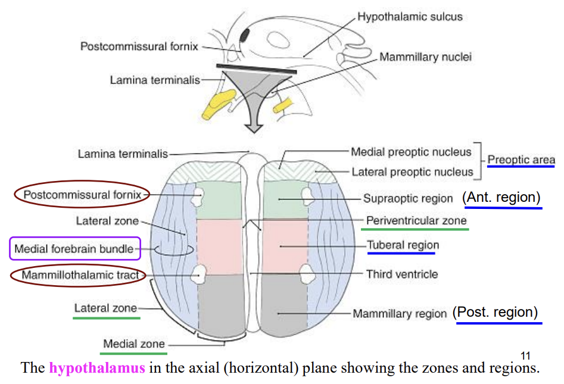

---
toc:
    depth_from: 1
    depth_to: 3
html:
    offline: false
    embed_local_images: false #嵌入base64圖片
print_background: true
export_on_save:
    html: true
---
# 脊椎
- lateral horn
  - 交感
- Gracile fasciculus
  - 上肢
- fasciculi proprii
  - 跨層傳遞的神經束
- Relay (projection) cell (20 50 &mu;m)
  - 傳感覺到大腦
- α motor neuron and γ motor neuron
(50 100 uM
  - 骨骼肌

## 發育 
- Neural crest &rarr; posterior root ganglia

:::fbox

:::

## Central group 
- C3-5
  -  phrenic nucleus (phrenic)
- C1-C5
  -  accessory nucleus 
  -  innervate SCM and trapezius
- L2-S1
  - lumbosacral nucleus 
  - unknown innervation

## posterior gray columns
- Substantia gelatinosa group
    - 溫、痛
- Nucleus proprius group
  - 自體感覺 proprioception

## posterior gray columns (intermediate)

- Nucleus dorsalis (Clarke’s column): C8 L3

## 要知道的 
### 灰質

>再來是各層細胞本體功能

#### Lamina I
- tip of the dorsal horn

#### Substantia gelatinosa group (laminae II)
- Gray column 中最靠背側的區域
- 輸入痛覺(pain)、溫覺(temperature)、粗略的觸覺(light touch)
- 傳到 III, IV

#### Nucleus proprius group (laminae III, IV)
- 本體感覺(proprioception), light touch

#### laminae V 
- 感覺穿到對側

#### laminae VI 
- 參與脊椎反射的 small interneurons 

#### Lateral column(horn)(laminae VII)
- T1-L2：細胞較小，含有節前交感神經纖維
- S2-S4：含有節前副交感神經纖維

##### Nucleus dorsalis (Clarke’s column)
- 本體覺、平衡覺、

### 白質

#### Motor

- Corticospinal tract
  - 去大腦
- Rubrospinal fiber
  - 去中腦
  - 唯一 flexor
- Reticulospinal tract
  - Lateral Reticulospinal fiber (源自延腦reticular formation)
  - Fastigiospinal fiber (源自小腦fastigial nucleus)
- Vestibulospinal tract
  - Medial reticulospinal
  - vestibulospinal tracts 

## blood supply 

# 途徑 

## General somatic afferent (GSA)

### Exteroceptive GSA-1 (痛、溫覺)
lateral division of the posterior root &rarr; posterolateral tract(tract of Lissauer) &rarr;
laminae I to V &rarr; Ventral spinothalamic tract

- chemical stimuli (痛覺)，最慢
- 

### Exteroceptive GSA-2 (觸、壓覺)

medial division of the posterior root &rarr; posterior funiculus

### Proprioceptive GSA (本體感覺)
- 接收muscle, tendon, joint 的stretch, pressure, vibration，由heavily myelinated
fiber 傳輸，傳遞快
- medial division of the posterior root &rarr; posterior funiculus

## Motor 

# 間腦
## (Dorsal) thalamus(丘腦)
- fornix 神經纖維輸出到大腦

- internal medullary lamina 切成四區+ 兩顆球

|   >   |     區域     |   縮寫   |    分類     |       功能        |
|-------|------------|--------|-----------|-----------------|
|   >   |  Anterior  |   A    |   Relay   |       邊緣        |
|Lateral|   Dorsal tier  |     LD     |Association| 高階視覺 |
|   ^   |     ^      |   LP   |Association|      高階視覺       |
|   ^   |     ^      |Pulvinar|Association|    視覺功能、眼睛運動    |
|   ^   |  Ventral tier  |   VA     |   Relay| 基底核輸入   |
|   ^   |     ^      |   VL   |   Relay   |      基底核輸入      |
|   ^   |     ^      |  VPL   |   Relay   |       體感覺       |
|   ^   |     ^      |  VPM   |   Relay   |      顏面感覺       |
|   >   |Intralaminar|   CM   |     -     |        -        |
|   ^   |     ^      |   PF   |     -     |        -        |
|   >   |   Medial   |   DM   |Association|      高階視覺       |
|   >   |     >      |  MGB   |   Relay   |       聽覺        |
|   >   |     >      |  LGB   |   Relay   |       視覺        |
|   >   |     >      |Thalamic| reticular |nucleus - 大腦皮質輸入 |

### Anterior 

- 邊緣系統相關

:::left

MTT
: mammillothalamic tract

:::right

:::

### Lateral 
- Dorsal tier
  - LD 
  - LP
  - Pulvinar
- ventral tier
  - VA 
    - globus pallidus, substantia nigra 輸入
  - VL 
  - VPL 
  - VPM 

### Medial 
- dorsomedial nucleus (DM)
  - parvicellular(cadually) part 副
  - magnocellular(rostrally)part
  - paralaminar part(和internal medullary lamina 相鄰) 

### Thalamic reticular nucleus
- 包在外面

## Epithalamus(上丘腦、上視丘)
- pineal gland
- 連接到limbic system (邊緣系統，和情緒、記憶有關)
- 有stria medullaris thalami

## Ventral thalamus
- subthalamic nucleus(丘腦底核)

## Hypothalamus(下丘腦、下視丘)

:::fbox 

:::

# Basal ganglia (基底核)

- 一坨神經核
  - Striatum (紋狀核, 輸入層)
    - caudate nucleus(尾核)
    - putamen(殼核)
  - Globus palidus (GP，蒼白核)
    - 專丟 GABA
    - pallidopallidal fibers 連接 External, Internal
    - External(有神經來回 SNc)
    - Internal 
  - Ventral pallidum (substantia innominata)
  - Ventral striatum
    - nucleus accumbens
    - olfactory tubercle

  - substantia nigrapars compacta (SNc，黑質)
    - 動作強化器
  - Subthalamic nucleus (STN)
  - Thalamus 
    - 過濾，激發層

  
- 動作協調控制、學習相關
  - extra-pyramidal system
- executive functions
- behavior and emotions.

## Direct /Indirect
- Motor 大多時候抑制
- 負責啟動動作、協調性

:::info {Parkinson’s disease}
- 抑制動作
- 失去協調性，但仍然有力
- SNc &darr;

:::

:::info {Huntington’s disease}
- 不自主動作干擾
- SNc &uarr;

:::

# 小腦

- Inferior cerebellar peduncle(下小腦腳)
   - 輸入層 
- Middle cerebellar peduncle(中小腦腳)
  - 輸入層 
  - brachium pontis，橋腦手臂
- Superior Cerebellar peduncle(上小腦腳)
  - 輸出層，交叉

# Limbic System

Limbic System(邊緣系統)
- 行為學習
- 調控 Hypothalamus

# Hypothalamus

## 解剖
### Sagittal section

p：Preoptic area (optic chiasma 與anterior commissure 之間的區域)
a：Anterior region (optic chiasma 以上、hypothalamic sulcus 以下的區域)
t：Tuberal region (tuber cinereum 以上、hypothalamic sulcus 以下的區域)
po：Posterior region (mammillary body 以上、hypothalamic sulcus 以下的區域)
藍線：hypothalamic sulcus
O：optic chiasma
M：Mammillary body

### Frontal section

pe：Periventricular zone
m：Medial zone
l：Lateral zone
F：fornix(位在Medial zone跟
Lateral zone的交界)：Limbic system
的神經纖維(黑色的)，穿過下視丘，
到mammillary body
OT：optic tract
3：第三腦室
In：interthalamic adhesion/ massa
intermedia

### Horizontal section

## 分區功能

|分區 | 結構| 功能|
|-|-|-|
|Lateral zone|lat. preoptic nucleus|sleep-promotion|
|^|lat. tuberal nuclei & tubero-mammillary nucleus| 睡眠甦醒循環|
|^|lat. nucleus| feeding center|

# 運動神經 

- 腦神經對側感覺，兩側運動

# 感覺神經 

|Sensor|fiber|適應| function
|-|-|-|-|
|Nuclear bag| A&alpha;(Ia)|SA| 肌肉收縮速度|
|Nuclear chain|A&beta;|^|肌肉長度|
Golgi tedon organ| A&alpha;(Ib)|^|肌腱張力|
特化神經末稍|A&beta;|SA,RA|deep touch,  vibration|
游離神經末梢|A&delta;, C|-|light touch, 溫, 痛(傷害)

# 疾病

- 肌皮
  - C5, 6: 二頭
  - C7: 三頭
  - C7: 中指
  - T4: 奶頭
  - T10: 肚臍
  - L4,L5: toe
- homonymous hemianopia (同側半盲)
  - 下圖 3gg

- Internuclear opthalamoplegia (INO；核間性眼肌癱瘓)
  - CN VI和CN III 連不起來
  - 一眼向外另一眼不向內
- Cavernous sinus & syndromes
  - CN &#8546;,&#8547;,Ⅴ~1~, Ⅴ~2~, Ⅵ

- Central/Peripheral Facial Nerve Palsy
  - CN VII 
  - 下半面攤
- CP (Cerebellopontine) angle tumors
  - CN VIII
  - 聽力喪失
- Carpal tunnel syndrome
  - 最常見 peripheral mononeuropathy
  - Median nerve
- Radial nerve palsy
  - 虎口麻
  - 手抬不起來
- Diabetic polyneuropathy
  - 多發性神經病變
  - Diabetic Amyotrophy(糖尿病肌萎縮)

# 視覺 

orientation selectivity
: 度(神經會更興奮)

## lateral geniculate nucleus

- Magnocellular layer(Layer 1, Layer 2) &rarr; 4c &rarr; 4a,4b
  - rod cell 
- Parvocellular layer(Layer3-6)&rarr; 4c &rarr; 2,3
  - con 

- layer 1、4、6 傳遞對側眼睛傳來的訊息
- layer 2、3、5 傳遞同側眼睛傳來的訊

>(V1分六層)

## 視覺皮層(Visual Cortex)

>striate cortex,
- V1
  - edges and line
  - orientation selectivity
    - Simple cell
    - Complex cell
      - 取max

>extrastriate cortex
- V2處理Binocularity
  - size tuning
  - 於binocular(用雙眼看)
  - 結色彩與形體(color and form conjunction)
  - 輪廓整合
  - V2神經參與pattern completion (腦補)
  - orientation selectivity
- V3處理Depth
>associated visual cortex
- V4處理Color
  - Ventral Pathway 整合輸出
    - 質地
    - 顏色
    - 方向(包含運動)
- V5處理Movement
  - 高維訊息整合
  - orientation selectivity
  - Dorsal Pathway
    - 傳遞物體方向、運動資訊
    - 樣在V4和其他資訊整合
