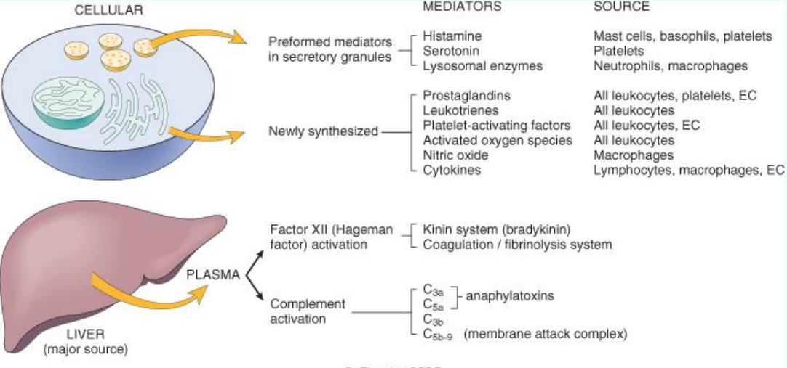
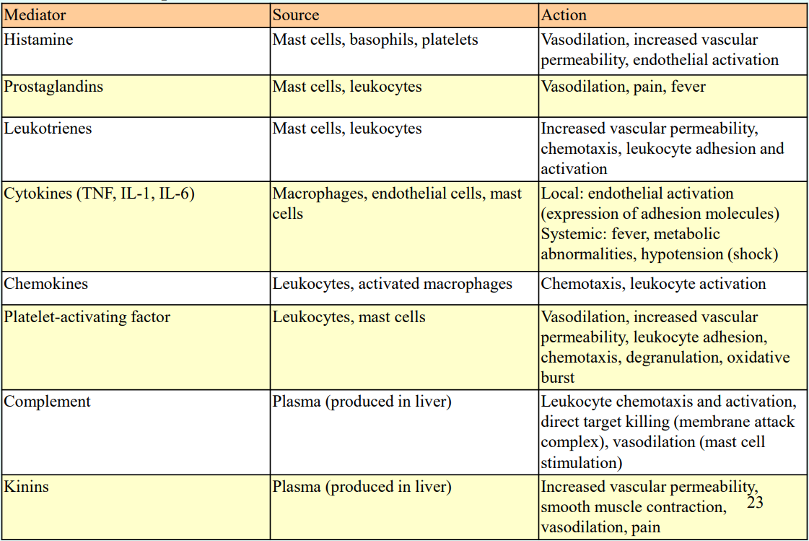
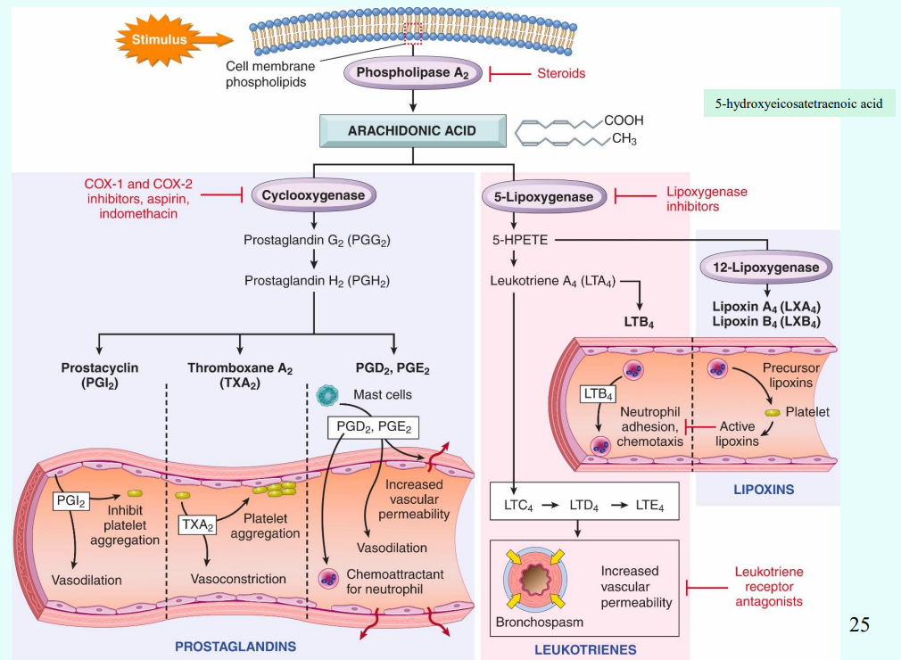
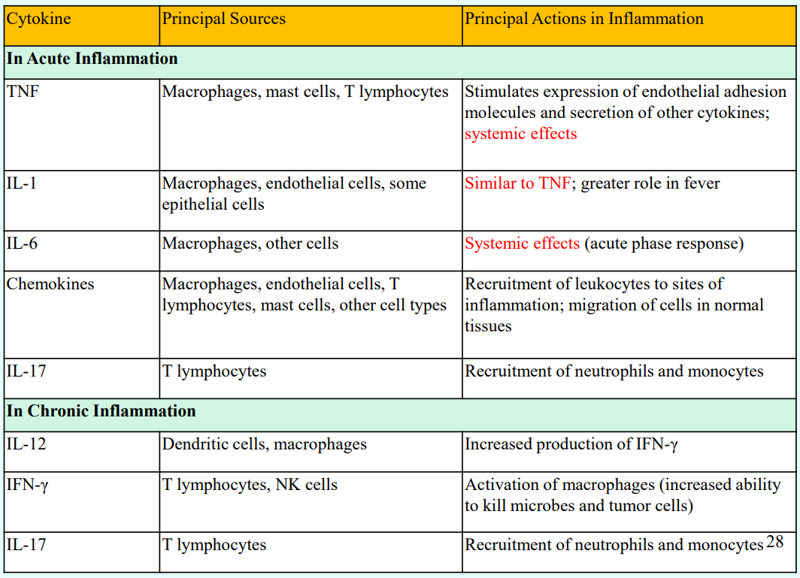
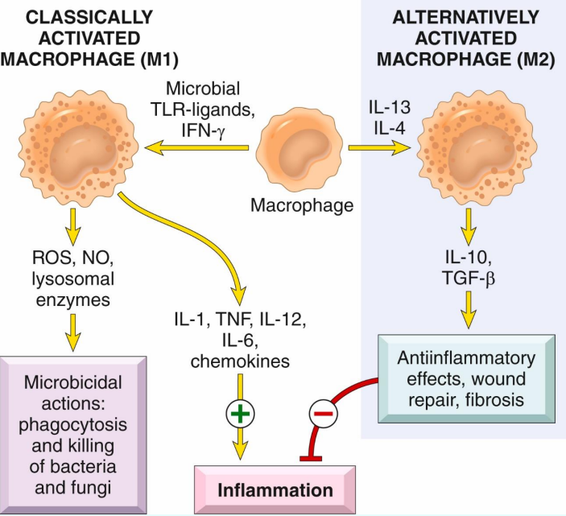

---
toc:
    depth_from: 1
    depth_to: 3
html:
    offline: false
    embed_local_images: false #嵌入base64圖片
print_background: true
export_on_save:
    html: true
---

# 發炎

## Mediators 

### Vasoactive  amines 
  - Histamine
  - Serotonin

### Arachidonic acid metabolites (花生四烯酸產物)
  - Prostaglandin (前列腺素)
  - leukotriene
  - lipoxin
  

|Action |Metabolites|
|-|-|
Vasodilation |PGD~2~, E~1~, E~2~, I~2~
Vasoconstriction |Thromboxane A~2~|
^| Leukotrienes C~4~, D~4~, E~4~
Increased vascular permeability | Leukotrienes C~4~, D~4~, E~4~
^|PGD~2~, E~2~
Chemotaxis, leukocyte adhesion |Leukotriene B~4~, HETE, PGD~2~
Pain and fever| Prostaglandin (PGE~2~)

### Cytokine 

## 分類 
- Serous inflammation 
  - Cell-poor exudate
  - No microbes
  - ex. 水泡
- Fibrinous inflammation
  - 纖維化
  
- Suppurative or purulent inflammation
  - 化膿
- Ulcer 
  - 黏膜不見

### 慢性發炎 

==Macrophage==

- Granulomatous inflammation
  - Macrophage 沒作用
  - Foreign body granuloma
  - Immune granuloma:
    - tuberculosis, 
    - sarcoidosis 
    - leprosy
    - cat-scratch diseases

