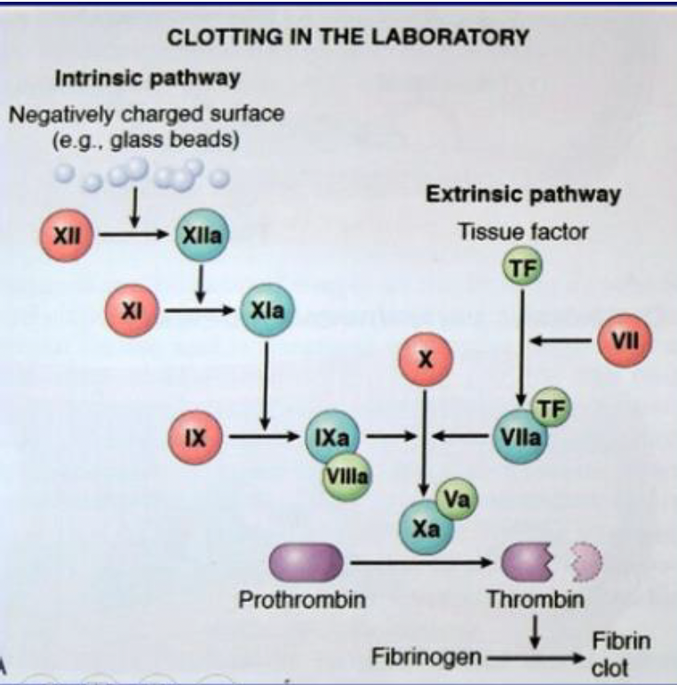
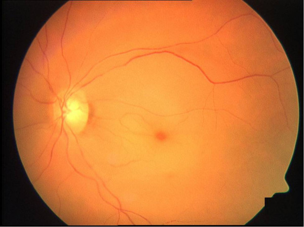
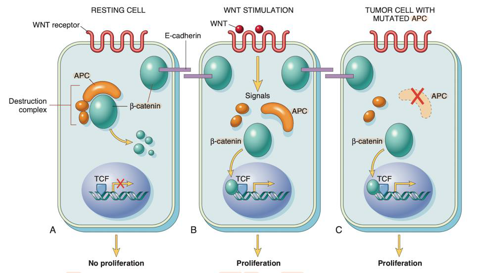
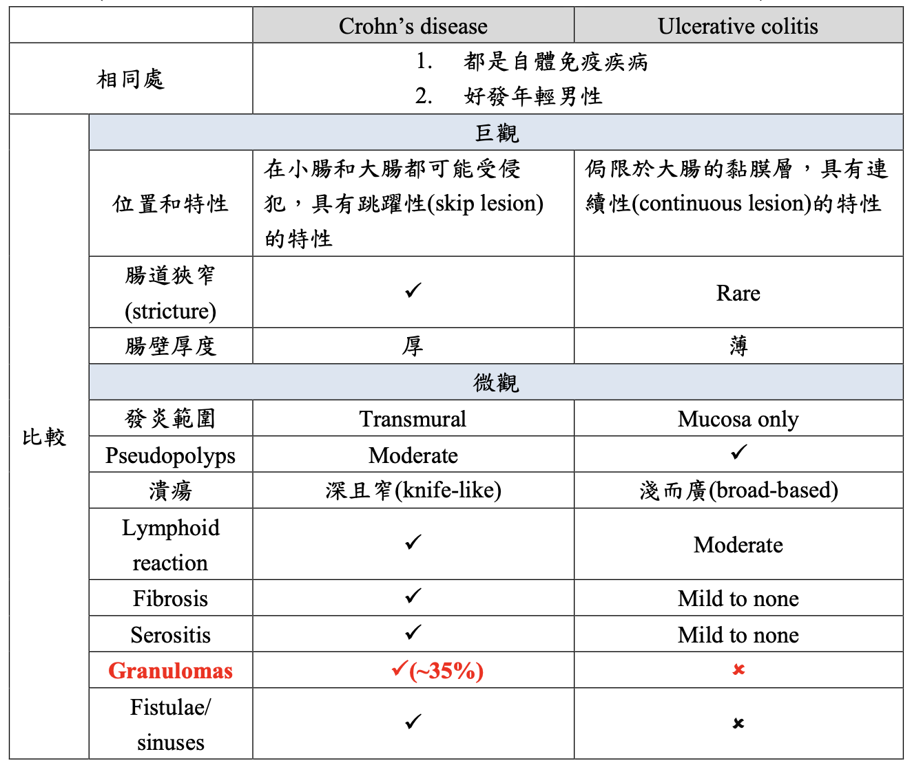
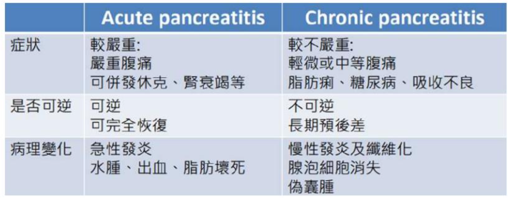
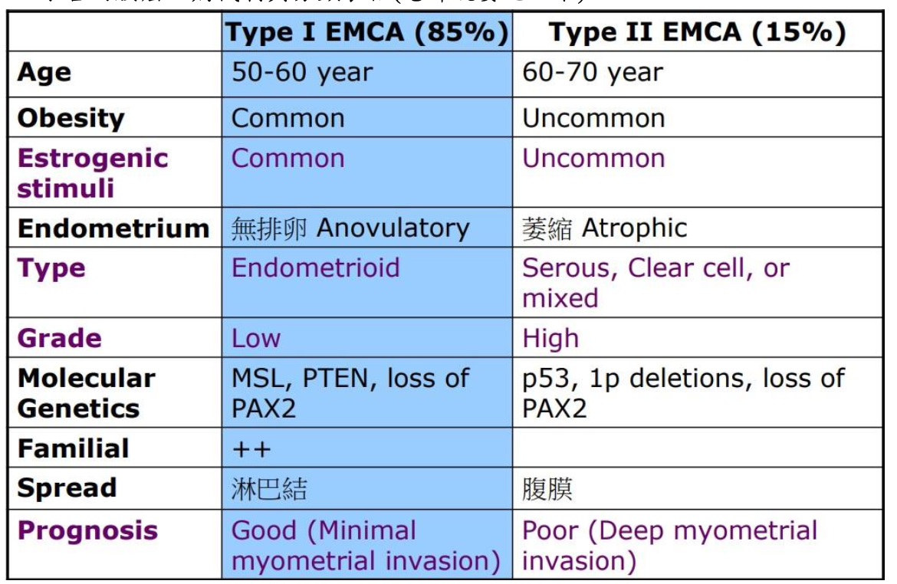
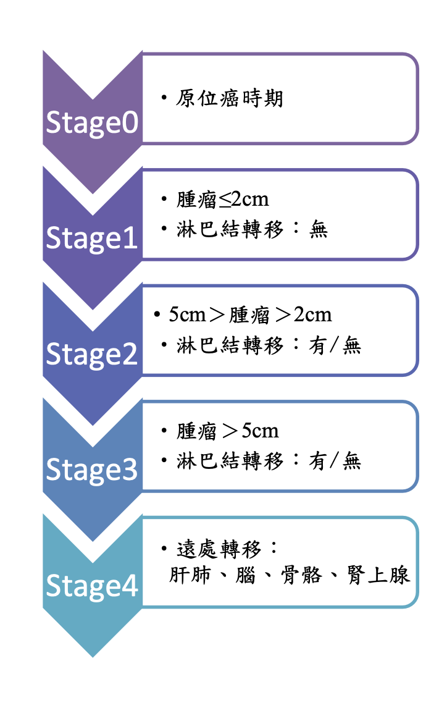

---
toc:
    depth_from: 1
    depth_to: 3
html:
    offline: false
    embed_local_images: false #嵌入base64圖片
print_background: true
export_on_save:
    html: true
---

# 發炎
Exudate
: 滲出液，含大量蛋白質，是為發炎性體液

Transudate
: 漏出液，蛋白質含量低，微血管的膠體滲透壓減少而造成

## Mediators 

### Vasoactive  amines 
  - Histamine
  - Serotonin

### Arachidonic acid metabolites (花生四烯酸產物)
  - Prostaglandin (前列腺素)
  - leukotriene
  - lipoxin
  

- Steroids
- COX-1 和COX-2 inhibitors，如Ibuprofen, aspirin, indomethacin等NSAIDs
- lipoxygenase inhibitors
- Leukotriene receptor antagonists(與lipoxygenase inhibitors同為氣喘藥)

|Action |Metabolites|
|-|-|
Vasodilation |PGD~2~, E~1~, E~2~, I~2~
Vasoconstriction |Thromboxane A~2~|
^| Leukotrienes C~4~, D~4~, E~4~
Increased vascular permeability | Leukotrienes C~4~, D~4~, E~4~
^|PGD~2~, E~2~
Chemotaxis, leukocyte adhesion |Leukotriene B~4~, HETE, PGD~2~
Pain and fever| Prostaglandin (PGE~2~)

### Cytokine 

## 分類 
- Serous inflammation 
  - Cell-poor exudate
  - No microbes
  - ex. 水泡
- Fibrinous inflammation
  - 纖維化
  
- Suppurative or purulent inflammation
  - 化膿
- Ulcer 
  - 黏膜不見

### 慢性發炎 

==Macrophage==

- Granulomatous inflammation
  - Macrophage 沒作用
  - Foreign body granuloma
  - Immune granuloma:
    - tuberculosis, 
    - sarcoidosis 
    - leprosy
    - cat-scratch diseases

## ROS

- ROS (neutrophils)
  - 經常被phagocyte oxidase 誘導(respiratory burst)
  - hypochlorite
  - hydroxyl radical

- Reactive nitrogen species (macrophages)

## 病
- Leukocytes Adhesion Deficiency (**LAD-1**)
  - integrin 無用
  - 皮膚或牙周等軟組織有recurrent soft tissue infection
- α1-antitrypsin(AAT) deficiency
  - 無法抑制發炎酵素
- Chronic Granulomatous Disease (**CGD**, 慢性肉芽腫)
  - 成因：缺乏NADPH氧化酶
  - 症狀：容易在頭頸部、肺部等處產生巨噬細胞聚集而成的肉芽腫，容易反覆感染發炎。

## 血管再生 (angiogenesis)

growth factor ：
- Vascular endothelial growth factor(VEGF)
- Fibroblast growth factor(FGF)
- Angiopoietin 1, 2
- Platelet-derived growth factor(PDGF)
- Transforming growth factor β
# 血 

## 病

nutmeg liver
: 中央靜脈長期積血，最終導致周圍肝細胞萎縮壞死，中央靜脈附近呈現紅棕色，外型像一種叫做nutmeg的植物種子，故稱之為nutmeg liver。右心房出問題可能使血液無法從肝臟回流，長期下來就會產生nutmeg liver

Gamna-Gandy body
: 長久、阻塞性的congestion造成脾腫大、出血，血液中的鐵堆積在組織間形成綠色或黃綠色的物質，稱為Gamna-Gandy body

Budd-Chiari syndrome(hepatic vein thrombosis)
: 血液從肝回心臟時受阻礙，血流堆積在肝臟

Nephrotic syndrome(腎病症候群)
: 腎臟功能異常導致蛋白質流失，血液滲透度下降，液體流出到組織間造成水腫

Cirrhosis(肝硬化)
： 肝功能異常無法製造白蛋白

Myocardial Infarction
: 心肌梗塞

aneurysm
: 動脈瘤

hemoptysis (喀血)
: 來自下呼吸道的咳血

melena
: 瀝青性便血，為上消化道出血的特徵，血液在腸道內經過酵素處理呈現瀝青色糞便

hematemesis
: 吐血，來自上消化道的吐血

hematochezia
: 便血，糞便呈鮮紅色

metrorrhagia
: 陰道出血

menorrhagia
: 經血過多

hypovolemia
: 血容量不足

---

>血小板疾病

thrombocytopenia
: 血小板數量減少

von Willebrand disease
: vWF有缺陷(較為常見)

Bernard-Soulier syndrome
: GpIb有缺陷

Glanzmann’s Thrombasthenia
: Gpllb-llla complex有缺陷

--- 

Libman-Sacks
: 心內膜炎的一種，因為自體免疫疾病紅斑性狼瘡(SLE)引發

Heparin-induced thrombocytopenia syndrome (HITS)
: 肝素觸發免疫反應，IgG＋PF4, Heparin+PF4 激活血小板，導致thrombocytopenia，但更容易血栓。

Antiphospholipid antibody syndrome(APS)
: anti-phospholipid antibody 導致細胞死亡，venous or arterial thromboses, thrombocytopenia, repeated miscarriages, Renal failure

Migratory thrombophlebitis (Trousseau syndrome)
: 在內臟出現腫瘤時，特別是pancreas adenocarcinoma的病患。會隨著淋巴或是血流產生遷移性的血栓(Trousseau syndrome)。

***Disseminated intravascular coagulation (DIC)***
- fibrin protein刺激後活化 &rarr; 到處微小的thrombi &rarr; 大量消耗platelet and coagulation factor 
- hemorrhage 
- microangiopathic anemia
  - 微血管有microthrombus ，RBC 通過時受到破壞。

Traveler syndrome
: 搭飛機的時候因久坐造成腿部靜脈血液滯留形成血栓，進一步導致pulmonary thromboembolism

Caisson disease
: 潛水夫病

## 凝血 
- 凝血因子II是prothrombin(凝血酶原)
- 內外在途徑的最終結果都是讓prothrombin(凝血酶原)轉化成thrombin(凝血酶) =
- 完整的*內皮細胞產生 ==PGI2、NO和ADPase== 抗凝血
- Clot stabilization and resorption(血塊穩定與吸收)
  - t-PA：可以使纖維蛋白溶解
  - thrombomodulin(凝血酶調節素)：會介入coagulation cascade，限制凝血反應

### thrombi 血栓 

- arterial thrombi
  - Lines of Zahn(pale & darker layers)：層狀的結構
  - 灰白色且易碎
- venous thrombi
  - 90%位於下肢
  - 層次不規則，呈現紅色(無Lines of Zahn)
  - 和死後血塊(postmortem clots)的區別：
    - 血栓有層狀構造，黏在血管壁不易拔起
    - 死後血塊沒有層狀構造，易拔起，顏色較深，表面有油脂堆積
- 血栓形成的 Primary(Genetic) factor：factor V mutation

## Embolus and Embolism (栓子與栓塞)
- Embolus(栓子): 塞子

### 當個塞子
- Thromboemboli(血栓栓子)
  - 最常見 
  - from deep vein of leg and pelvis，尤其是在膝蓋以上的位置(>95%)
    - 60%~80% 沒有臨床上症狀
  - Systemic thromboembolism
    - 動脈的血栓脫落後在主循環形成栓塞(arterial embolism)。
    - 80% 血栓來自心臟內
    - 下肢(75%)發生栓塞

- Liquid emboli
  - Fat emboli 大部分(90%)形因是長骨斷裂(long bone fracture)
  - 肺部栓塞，相關症狀在 1 至3 天後突然發作(sudden onset)
    - thrombocytopenia
      - 血小板黏附至脂肪小球
    - anemia
    - neurologic symptoms
    - pulmonary insufficiency
    - Biochemical injury(較重要)：從脂肪小球釋出的free fatty acid 會造成內皮傷害以及局部發炎。

- Amniotic fluid
  - 羊水以及某些胎兒的組織進入媽媽的血液循環中。
  - 死亡率很高，

- Air embolism
  - \>100 cc 才會有臨床症狀
  - **Bends**
    - 氣泡出現在骨骼肌以及關節處（尤其在femoral head、tibia、humerus bone附近），造成嚴重疼痛
  - Chokes(哽塞)
    - 氣泡塞在肺部血管
  - Caisson disease
    - 氣泡在骨骼系統的持續存在造成多處骨骼缺血性壞死

## Infarction and infarct(梗塞)
Infarction
: 因為栓塞而造成遠端組織缺血性壞死(A consequence of ischemic necrosis of distal tissue from an embolic event)。(過程)

Infarct
: 因為血管阻塞而壞死的區域稱作infarct(an area of ischemic necrosis caused by occlusion of vessels)

### 分類

- White(anemic) infarct
  - 發生在心臟、脾臟、腎臟動脈阻塞
  - 單一輸入，無血液
- Red or hemorrhagic infarct
  - 靜脈阻塞，或者是具有雙重血流支配的器官(e.g.卵巢、睪丸、腸子、肺臟、肝臟)

- Septic infarct(infective)
  - 受到感染
  - 可能源自於感染性的瓣膜贅物(infected heart valve vegetation)所造成的embolism。

## Shock (cardiovascular collapse)

系統性的組織血液灌流不足

# 遺傳
Autosomal dominant (AD，體染色體顯性遺傳)
Autosomal recessive (AR，體染色體隱性遺傳)

|>|名稱| 機制 | 遺傳|
|-|-|-|-|
|Marfan syndrome || Fibrillin-1 合成異常 &rarr; 異常 elastic fiber |AD，15q21 點突變|
|Familial hypercholesterolemia|異|肝細胞 LDL receptor異常 &rarr; 血漿膽固醇濃度 x2~3/ x5~6 &rarr; 軟組織堆積|AD|
|^|同|^|^| 
|Niemann-Pick disease (尼曼匹克氏症)|spinogomyelinase 無法產生 &rarr; spinogomyelin 的累積在細胞|

## Niemann-Pick disease 尼曼匹克氏症
- cherry-red spot

# 過敏 

|類型|原理|疾病|
|-|-|-|
IgE-mediated|水溶性蛋白質穿透黏膜|Allergic asthma(過敏性氣喘)|
^|^|Seasonal hay fever(季節性花粉熱)
^|^|Atopic dermatitis(異位性皮膚炎)
^|^|蜜蜂、Urticaria(蕁麻疹)、奇奇怪怪
|Type II hypersensitivity| 1. IgG, IgM 結合自體細胞表面抗原 2. C1 聚集，Classical  3. Macrophage 吞噬|Hemolytic disease of newborn (新生兒溶血性疾病)   RhD−母攻擊RhD+子
|^|^|Goodpasture’s syndrome  (肺出血腎炎症候群、古巴斯捷式症候群)|
^|^|Insulin-dependent diabetes mellitus (IDDM) 胰島素依賴型糖尿病|
Type III hypersensitivity|1. IgG, IgM 結合血清中的水溶性antigen   2. 根 type II 一樣|leprosy (痲瘋病)|
|^|^|malaria (瘧疾)|
|^|^|viral hepatitis
|^|^|Rheumatoid arthritis   (類風濕性關節炎)   IgM 打 IgG，龍兄虎弟|
^|^| Systemic lupus erythematosus  (SLE，全身紅斑性狼瘡)  Ag: nucleosome
Delayed-type hypersensitivity reactions   (DTH，延遲型)| T~H1~, T~H17~ &rarr; B cell   (T~H1,2~ 主導，Cytokine 吸引 Macrophage)| 結核菌素   (Tuberculin response Skin tes)|
^|^|Granulomatous hypersensitivity   (肉芽腫過敏)
^|^|diabetes mellitus (IDDM) 胰島素依賴型糖尿病|
^|^|Contact dermatitis (接觸性皮膚炎)
|T cell-mediated cytotoxicity| CD8+ T cell 胞殺 | Allograft rejection(同種異體移植的排斥反應)
^|^| Tumor immunity(腫瘤免疫)
^|^| Viral infection

## Systemic lupus erythematosus (SLE)
- anti-dsDNA
- anti-Sm: Smith抗原
- antiphospholipid (少見)

## Rheumatoid arthritis (RA)
- IgG 攻擊關節囊
- 非化膿增生性滑膜炎(non-suppurative proliferative synovitis)
- 類風濕性因子(Rheumatoid factor, RF)
  - 一種特殊 IgM 抗體
  - 原本是判斷RA確診的方式之一，但現在發現在其他的自體免疫疾病病人身上也會有RF的出現，所以RF和RA不一定相關，不能當作判斷依據
- 成對稱性關節炎(symmetrical arthritis)

## Sjögren’s Syndrome 修格蘭氏症候群

- 50~60歲的女性，破壞淚腺及唾液腺
- 分為原發性(Primary)和繼發性(Secondary)

## 免疫缺失 
### B cell 

> X-link
- X-linked agammaglobulinemia (XLA, Bruton Disease)
  - 隱性
  - Btk基因缺陷 (Bruton’s tyrosine kinase)
  - T cell的功能正常。
- Immunodeficiency with increased IgM (HIgM)
  - IgM增加性免疫缺損
  - CD40L 缺陷 &rarr; 無法 class switching
  - 容易製造IgM自體抗體
- Wiskott-Aldrich syndrome (WAS)
  - Wiskott-Aldrich syndrome protein(WASP) &darr; &rarr; X染色體上CD43基因缺陷
  - CD43 構築T細胞的骨架
  - 抗體產量異常：IgA,E↑，IgG-，IgM↓
  - 血小板小、少、爛

---

- Severe Combined ImmunoDeficiency (SCID)
  - 重度複合免疫不全症
  - X-linked recessive
    - X染色體上γ chain基因缺失，cytokine receptors 失能
  - Autosomal recessive
    - Adenosine deaminase(ADA) 缺陷 40%

# 癌 

## 基因
### Oncogenes
- HER-2
  - 乳癌即是HER-2 receptor過度表現
- Myc 
  - E2F &rarr; Transcription
  - cycline, CDK &rarr; cell cycle
  - Ras 調控 Myc
### tumor-supressor gene，
- RB
  - RB的低/過度磷酸化 &rarr; 阻止/活化 E2F
  - CDK4 磷酸化 RB
- APC
    - 接收 WNT signal 放出 &beta;-catenin

- TP53
  - DNA受損則停止細胞週期
  - guardian
  - HPV: E6-P53, E7-P21, RB
  - P53 &rarr; P21 &rarr; 抑制 CDK

- BRCA1、BRCA2
  - BRCA為DNA修補的重要factor，如果突變會有高度的DNA mutation的現象，容易發生乳癌或是婦癌相關的疾病。

# 心血管 

## MI

- 1- 2hrs
  - wavy fibers
- 4-8hrs
  - PMNs 
- 18hrs
  - 肉眼可以觀察到變化
    - 顏色變白(pallor change)
- 18-24hrs
  - contraction band
  - coagulation necrosis
  - 細胞質嗜酸性 cytoplasmic eosinophilia
- 24-72hr
  - complete coagulation necrosisof myofiber 
- 4-7d
  - 心臟最容易 rupture
  - Macrophage 變多
    - 肉芽組織

## 血管炎 

(1)
| | vessel|病因| 特色
|-|-|-|-|
|Giant cell (temporal) vasculitis |Large | 免疫？|
Takayasu’s arteritis | ^ | 自體？|15-40 女，低血壓
|Polyarteritis nodosa (PAN)| Medium| HBV | 壞死、纖維化同時呈現
Kawasaki disease|^|免疫，病毒？|急性、自限、較少fibrinoid necrosis
Buerger’s disease | Medium, small| 抽菸 | thromboangiitis obliterans (TAO), superficial nodular phlebitis (遊走性淺靜脈炎)
Wegener’s granulomatosis|Small| c-ANCA| 只影響呼吸道，急性肉芽腫壞死。 40歲(男性多於女性)
Microscopic polyangiitis|^| p-ANCA| 統一發炎階段 palpable purpura
Churg-Strauss syndrome (CSS)|allergic rhinitis, asthma, 嗜酸性球增加|-|

- Raynaud’s phenomenon
  - 四肢末梢供血不良
  - Primary
    - 遺傳，好發於 14 歲女性
    - 成因：冷或情緒引發的動脈、小動脈收縮
  - Secondary
  - narrowing 造成末梢的arterial insufficiency

# 肺癌 

| 癌症類型             | 位置                         | EGFR突變    | 病理學特徵                                               | 其他特徵                            |
|----------------------|------------------------------|-------------|----------------------------------------------------------|-------------------------------------|
| Adenocarcinoma       | 周邊肺部                     | 常見        | 腺泡樣、乳頭狀、微乳頭狀、固體腺癌                        | 多見於女性和非吸煙者                |
| Squamous Cell Carcinoma | 中央肺部或大支氣管           | 罕見        | 角化珠、細胞間橋、分泌副甲狀腺素                                           | 多與吸煙有關                        |
| Small Cell Carcinoma | 中央肺部                     | 罕見        | 小細胞、成團、核染色質細緻                                 | 高度侵襲性，與吸煙高度相關、分泌 ADH,ATCH           |
| Non-Small Cell Carcinoma | 周邊肺部或中央肺部           | 視具體亞型而定 | 包含腺癌、鱗狀細胞癌、大細胞癌等                           | 不同亞型特徵不同，EGFR突變多見於腺癌 |

# GI 
- Meckel Diverticulum
  - true diverticulum
  - from vitelline duct (卵黃管)
  - ileum
- Hirschsprung Disease
  - distal colon / rectum 無神經
- Gastroesophageal reflux disease (GERD)
- Barrett’s esophagus 
  - Chronic GERD
  - Goblet cell 為診斷必須

- colon adenocarcinoma
  - APC &rarr; APC/WNT pathway 缺陷 &rarr; FAP(70%) &rarr;  Sporadic colon cancer(80%)
  - MSH2, MLH1 &rarr; Hereditary nonpolyposis colorectal cancer (HNPCC) &rarr; Sporadic colon cancer(15%)

- 肝細胞腺瘤(Hepatocellular Adenoma)
  - b-catenin 的突變，可能轉變為惡性
- 膽管癌(Cholangiocarcinoma)
  - 第二常見的肝內腫瘤

- Gastric Adenocarcinoma
  - CDH1 &rarr; Diffuse type
  - signet-ring cell
  - linitis plastic(皮革胃)

- Gastrointestinal Stromal Tumor(GIST)
  - 腹部最常見的間葉細胞瘤(mesenchymal tumor)
  - tyrosine kinase c-KIT的基因突變

# Female Genital System

- Paget’s disease 
  - 癌細胞中還沒穿過基底膜
- Surface epithelium tumors
  - BRCA1 與 BRCA2(兩者為腫瘤抑制基因)

  - Serous tumors
  
---
- 乳癌

# 男性 
|癌|特徵|
|-|-|
Embryonal|tubular、papillary convoluted
yolk sac |Schiller-Duval body
seminoma |solid pattern，incomplete septum
^|lymphocyte infiltrated granuloma
Bowen’s disease| 單個、角質厚呈現灰白色
Bowenoid papulosis|多發性、可呈疣狀、pigmented

# 泌尿 

- Rapid Progressive glomerulonephritis (RPGN)
  - Glomerular crescent formation
  - 自體免疫 
    - Goodpasture’s syndrome
    - 紅斑性狼瘡System Lupus Erythematosus
    - ANCA
- Berger’s disease
  - 台灣最常見的原發性腎病Primary GN
  - 顯微鏡下血尿
  - 緩慢的演變為慢性腎衰竭
- Kimmelstiel-Wilson disease
  - Nodular glomerulosclerosis
  - DM 10-20 年
- Minimal change disease (MCD，過去誤稱Lipoid nephrosis)
  - 腎絲球中部分區域足細胞的梳子狀結構消失
  - 2~6歲的孩童
- 局灶節段性腎小球硬化Focal segmental glomerulosclerosis (FSGS)
  - 有腎病綜合症Nephrotic syndrome,、蛋白尿proteinuria、高血壓hypertension、顯微鏡下血尿microscopic hematuria與氮血症azotemia
- 最常見的nephrotic syndrome：小孩MCD，大人FSGS。

- Renal cell carcinoma
  - 60~70歲 
  - 男性比女性多2~3倍 
  - VHL gene (suppressor)
  - Hippel-Lindau syndrome

# 內分泌 

- Sheehan’s syndrome
  - 產後腦下垂體壞死
  - 產後出血造成休克，腦下垂體前葉容易缺血性壞死

- Carcinoma of the thyroid
  - papillary carcinoma
    - 造成原因：游離輻射
    - 淋巴結轉移，轉移速度慢
    - BRAF的突變
    - 預後最好
  - follicular carcinoma
    - 血性轉移
    - 轉移速度慢
    - 轉移到肺臟或是骨頭

  - Pheochromocytoma嗜鉻細胞瘤
    - 10%
      - 10%的散發病例是雙側性
      - 10% malignant behavior
      - 10% extra-adrenal，此時又叫paraganglioma
      - 10%沒有高血壓(現在認為是25%)

# 血 

- 多血症(Polycythemia)
  - 血紅素(Hb)>15.5 g/dL，
- 週期性嗜中性球減少症(cyclic neutropenia)
  - neutrophil(<1500/mm3)
  - mutation of ELANE
- Chronic myeloid leukemia (CML)
  - t(9；22) 費城染色體
- ALL
  - 小孩最常見的 leukemia，B-ALL比T-ALL常見
- AML
  - 大人最常見的leukemia

- Hodgkin lymphoma
  - Reed-Sternberg cell(RS Cell, Owe's eye)
  - lunar cell
- Non-Hodgkin lymphoma(NHL)
  - Follicular lymphoma
    - BCL2
  - Diffuse large B-cell lymphoma
    - 為最常見的aggressive lymphoma，長的快
