---
toc:
    depth_from: 1
    depth_to: 3
html:
    offline: false
    embed_local_images: false #嵌入base64圖片
print_background: true
export_on_save:
    html: true
---

# necrosis
- Coagulative necrosis
- Caseous necrosis
- Liquefactive necrosis

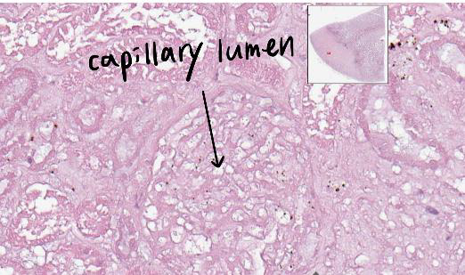

:::spoiler
 Foam cells
 : 黑圈，巨噬細胞因為吞很多lipid而使細胞質呈偏白的泡泡狀，稱為Foamy macrophage(Foam cells)
:::
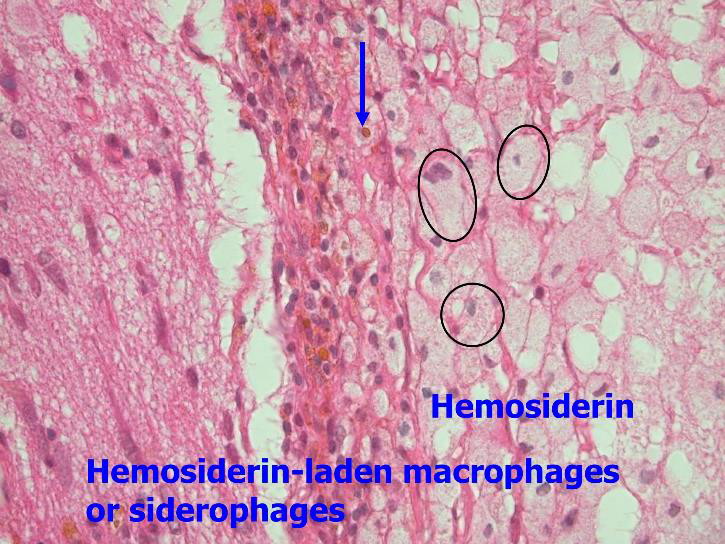

:::spoiler 
Hemosiderin-laden macrophages
: 藍圈，吞噬Hemosiderin的 macrophage

Hemosiderin
 : 黑圈，紅血球分解後，含鐵成分聚集而成
:::
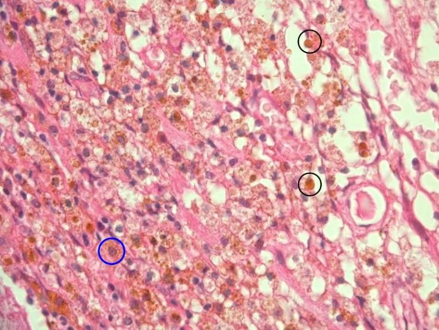

:::spoiler {}
Caseous necrosis

Macrophage
: 藍圈 
:::

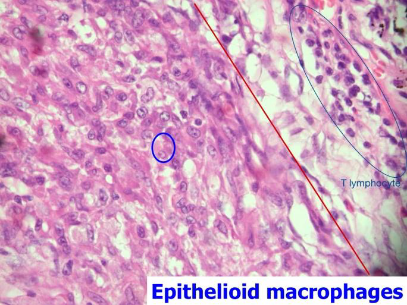

:::spoiler 
langhans giant cell
:::
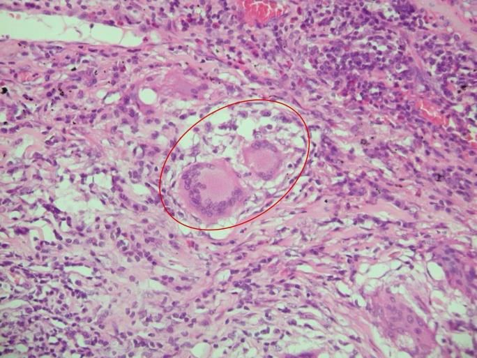

:::spoiler 
Fat necrosis: **急性胰臟炎(acute pancreatitis)**
:::
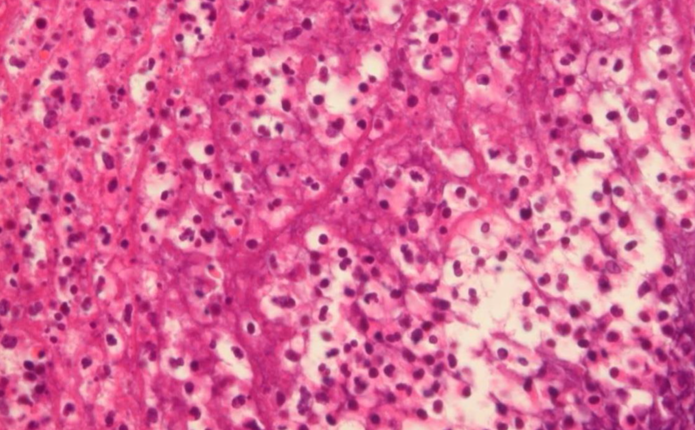

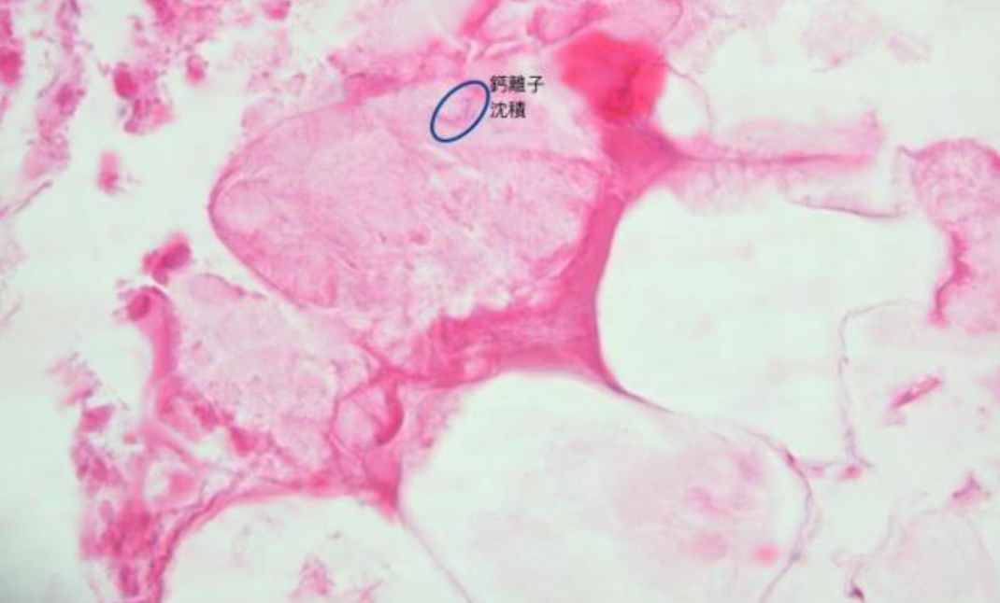

# Adaptation

metaplasia
: 化生

:::spoiler 
Squamocolumnar junction

stratified squamous epithelium
:::
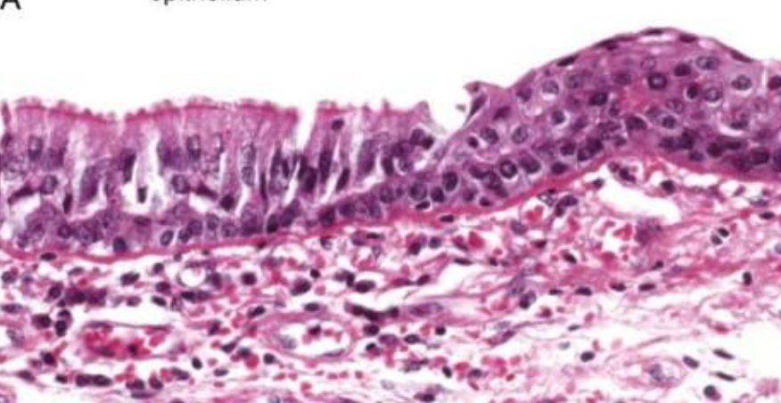

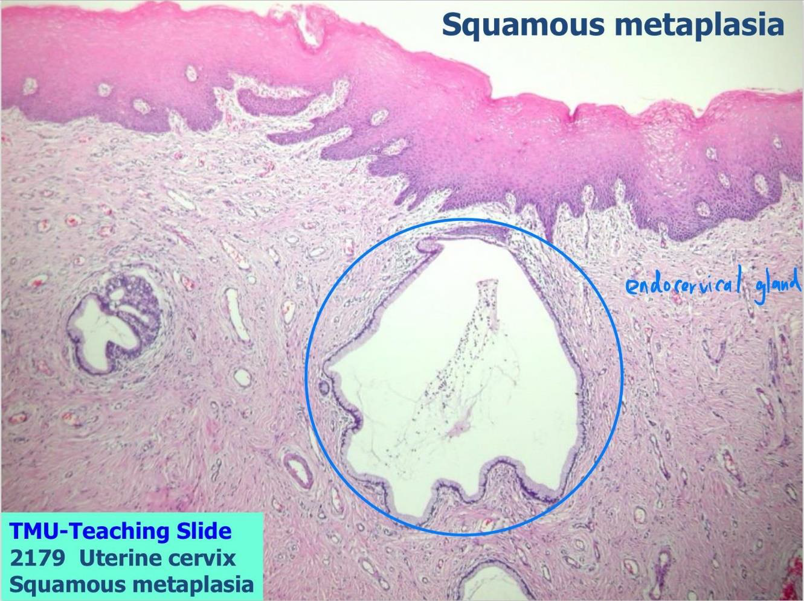

# Inflammation and Repair

:::spoiler 
acute appendicitis
:::

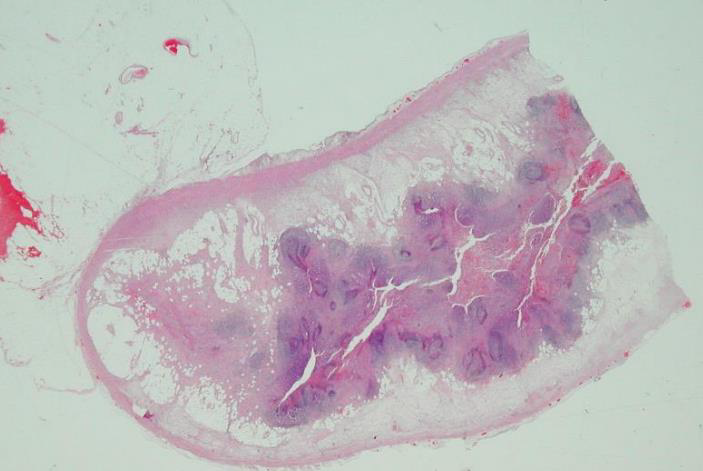

:::spoiler 
ulcer, stomach
:::

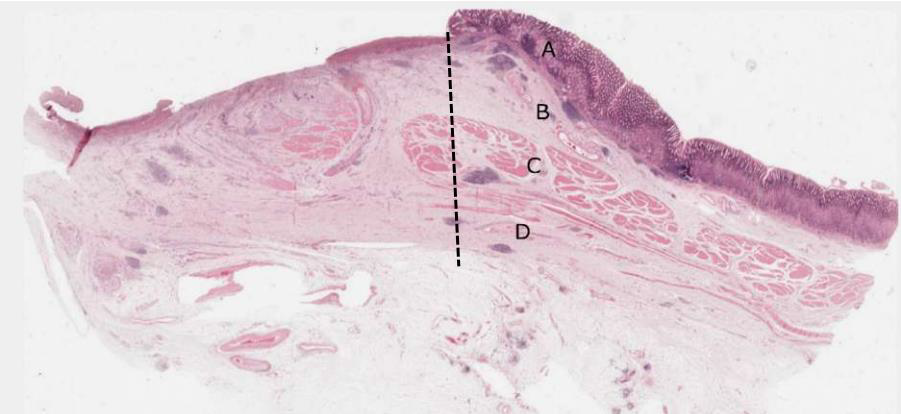

:::spoiler 
壁細胞(Parietal cell)：紅色圓圓細胞，分泌HCL和intrinsic factor。

主細胞(Chief cell)：藍紫色細胞，分泌蛋白酶。

:::

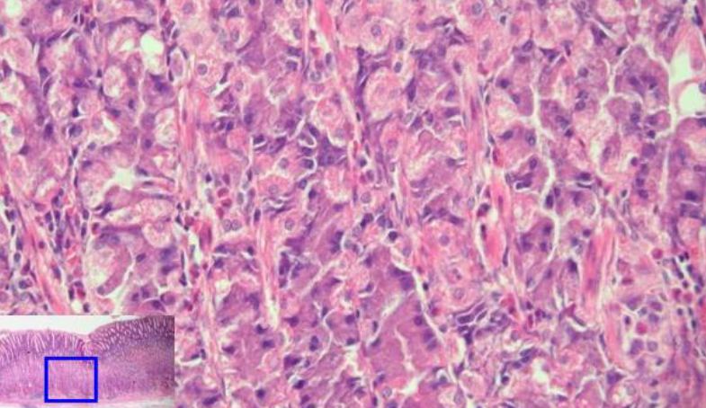

:::spoiler 
1. necrotic tissue(急性發炎細胞)
2. granulation tissue
3. fibrotic tissue
4. lymphoid follicles
:::

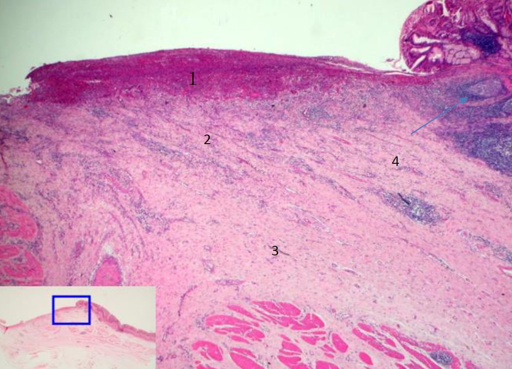

:::left
necrotic tissue
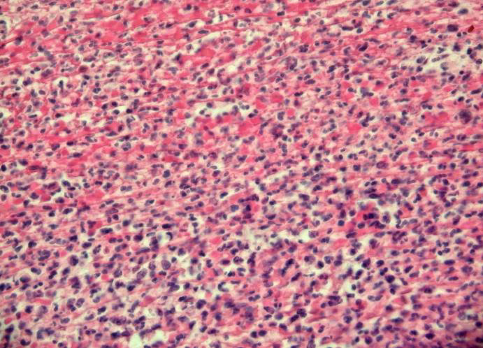
fibrotic tissue
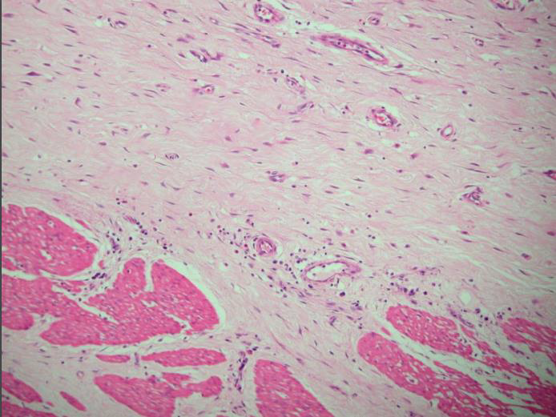
:::right
granulation tissue
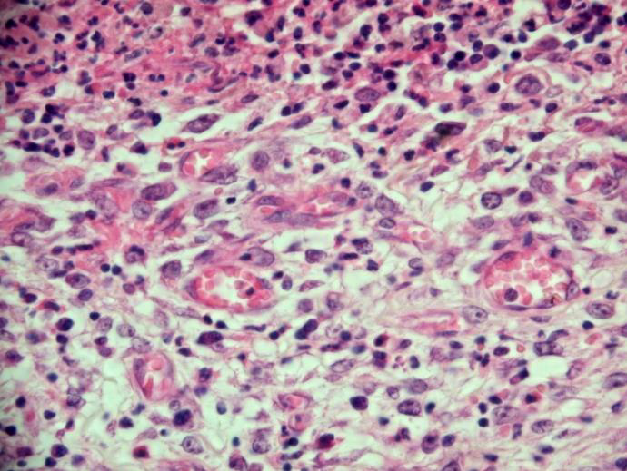

:::
:::spoiler 
幽門腺黏膜 (pyloric gland)

:::

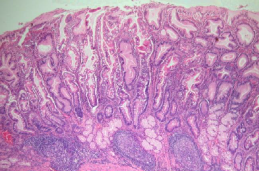

intestinal metaplasia (杯狀細胞)
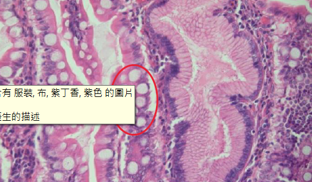

# Hemodynamic Disorders

:::spoiler 
若是血栓形成較久(右圖左)，organization會較完整，則血栓內的顏色較淡、fibrin較多、有較多內皮細胞。要與congestion(右圖右，也就是剛形成的fresh thrombus)區分。
:::

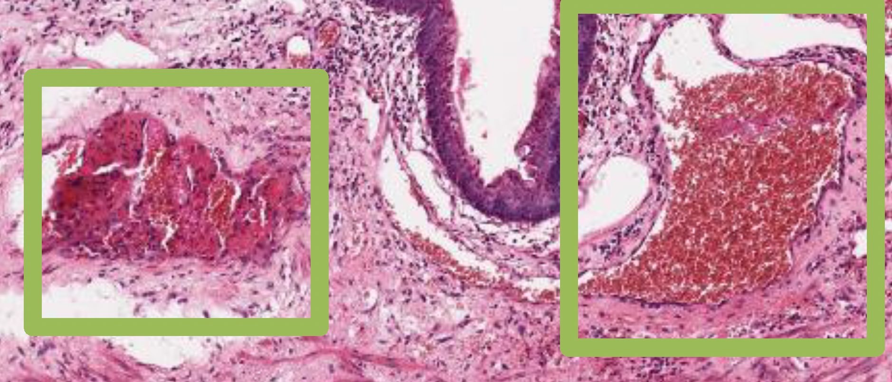
