---
toc:
    depth_from: 1
    depth_to: 3
html:
    offline: false
    embed_local_images: false #嵌入base64圖片
print_background: true
export_on_save:
    html: true
---

# necrosis
- Coagulative necrosis
- Caseous necrosis
- Liquefactive necrosis

:::spoiler
 Foam cells
 : 黑圈，巨噬細胞因為吞很多lipid而使細胞質呈偏白的泡泡狀，稱為Foamy macrophage(Foam cells)
:::

:::spoiler 
Hemosiderin-laden macrophages
: 藍圈，吞噬Hemosiderin的 macrophage

Hemosiderin
 : 黑圈，紅血球分解後，含鐵成分聚集而成
:::

:::spoiler {}
Caseous necrosis

Macrophage
: 藍圈 
:::

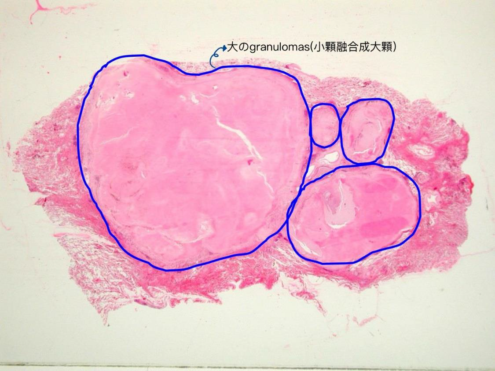

:::spoiler 
langhans giant cell
:::

:::spoiler 
Fat necrosis: **急性胰臟炎(acute pancreatitis)**
:::

:::spoiler 
Gangrenous necrosis
:::
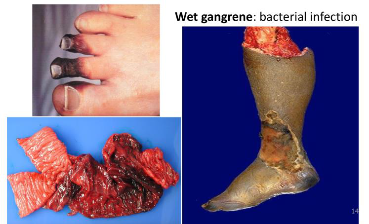

# Adaptation

metaplasia
: 化生

:::spoiler 
Squamocolumnar junction

stratified squamous epithelium
:::

:::spoiler 
合成過多的分泌性蛋白：漿細胞分泌免疫球蛋白(immunoglobin)後儲存在細胞內形成Russell bodies
:::
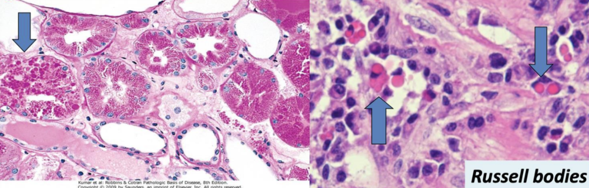

:::spoiler 
Dystrophic calcification
:::
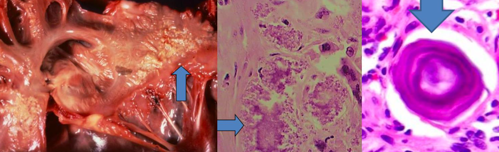

:::spoiler {}
肺泡壁分布是congestion，亂糟糟的就是hemorrhage
:::

:::spoiler 
fat emboli
:::

# Inflammation and Repair

angiogenesis
: 血管增生

epithelioid cells
: 上皮細胞的活化巨噬細胞

:::spoiler 
acute appendicitis
:::

:::spoiler 
ulcer, stomach
:::

:::spoiler 
壁細胞(Parietal cell)：紅色圓圓細胞，分泌HCL和intrinsic factor。

主細胞(Chief cell)：藍紫色細胞，分泌蛋白酶。
:::

:::spoiler 
1. necrotic tissue(急性發炎細胞)
2. granulation tissue
3. fibrotic tissue
4. lymphoid follicles
:::

:::left
necrotic tissue

fibrotic tissue

:::right
granulation tissue

:::
:::spoiler 
幽門腺黏膜 (pyloric gland)

:::

intestinal metaplasia (Goblet cell)

# Hemodynamic Disorders

:::spoiler 
若是血栓形成較久(右圖左)，organization會較完整，則血栓內的顏色較淡、fibrin較多、有較多內皮細胞。要與congestion(右圖右，也就是剛形成的fresh thrombus)區分。
:::

:::spoiler 
fibrin堆積形成的thrombus
:::
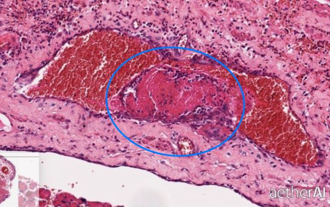

:::spoiler 
Plasma 血漿
:::
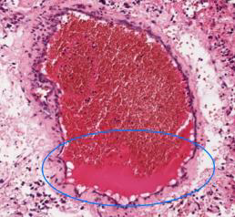

:::spoiler 
Hemorrhage
:::
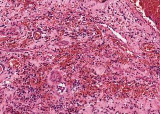

Mesentery
: 腸繫膜

:::spoiler 
腸子的submucosa，edema
:::

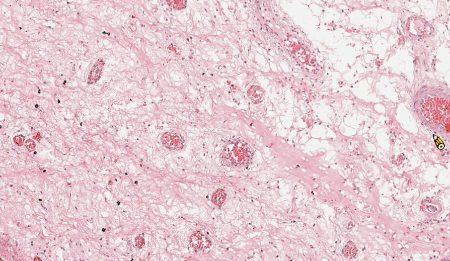

# Neoplasia

Teratoma
: 畸胎瘤

adenoma
: 腺瘤

desmoplasia
: 結締組織增生

pleomorphism
: 多形性

:::spoiler 
adenocarcinom
desmoplasia(黃色星號)
:::
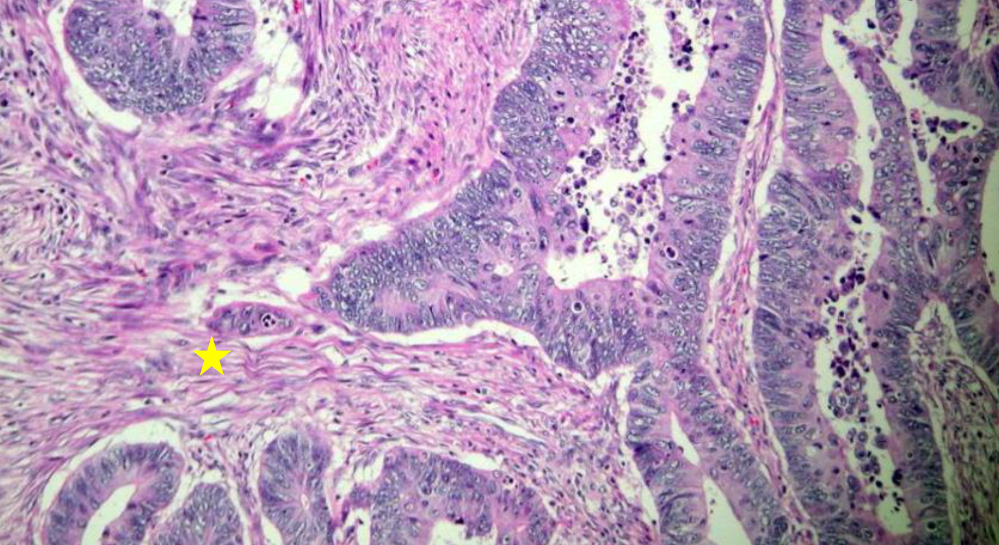

carcinoma in situ
: 原位癌，異常細胞僅存在於它們最初形成的細胞層中，沒有侵犯周圍組織。

## Squamous cell carcinoma (SCC)
invade
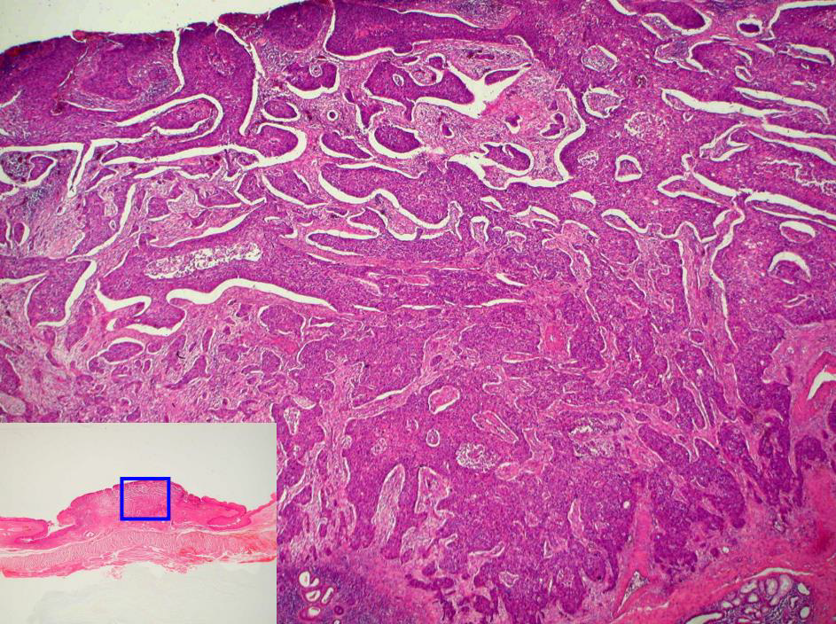

carcinoma i situ
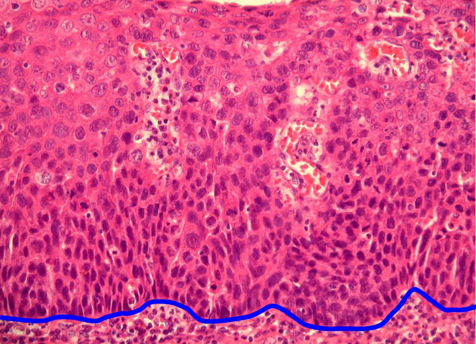

# 其他單字 

:::spoiler {Atherosclerosis}
動脈粥狀硬化
:::

:::spoiler {Rupture}
破裂
:::

:::spoiler {Aneurysm}
動脈瘤
:::

:::spoiler {Stromal cell}
基質細胞
:::
