---
toc:
    depth_from: 1
    depth_to: 3
html:
    offline: false
    embed_local_images: false #嵌入base64圖片
print_background: true
export_on_save:
    html: true
---

# Adrenoceptor Antagonist Drugs

- Reversible
  - agonist

- Irreversible 
  - 強力鍵結 &alpha; receptor

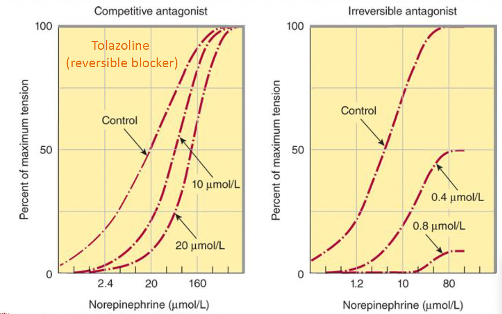

- 選擇性 (Selective)
  - 對 &alpha;~1~, &alpha;~2~ 親和力差異
  - ==要背==

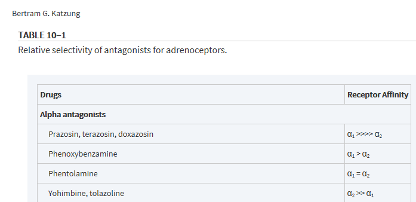

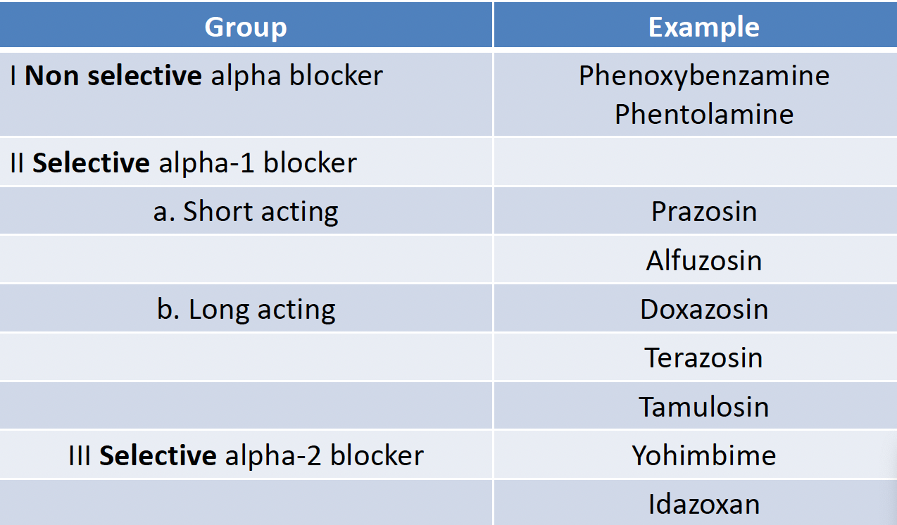

:::info {嗜鉻細胞瘤}

TODO

:::

### 常見副作用
1. Pheochromocytoma
2. Hypertensive Emergencies
3. Chronic Hypertension
4. Peripheral Vascular Disease
5. Urinary Obstruction
6. Applications of α 2 Antagonists

## &beta; RECEPTOR ANTAGONIST DRUGS

- pure antagonists
- partial agonists
  - 穩定不活化的 &beta; receptor

- 個體差異大
- 脂溶 Pass BBB
- lol 結尾
- 氣喘要用 &beta;~1~ Selective Antagonist
- Without intrinsic sympathomimetic activity:
  - Propranolol (membrane stabilizing action)
  - Sotalol , 
  - Nadolol 
  - Timolol
- 參考參考
  - ==Esmotol== : 速效

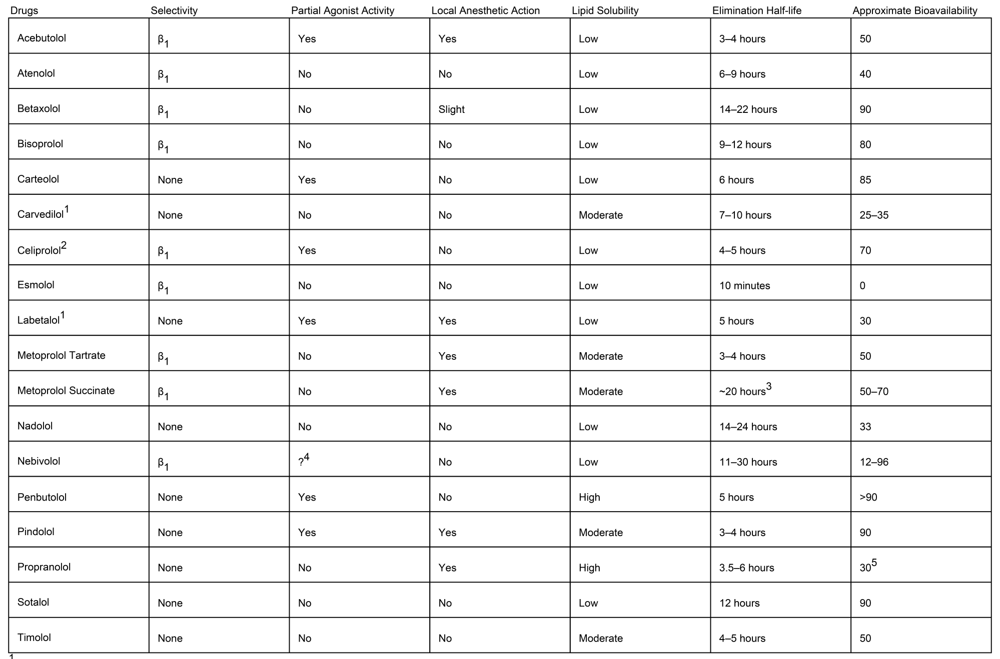

:::info {Glaucoma}
- 眼房液過多 &rarr; 眼壓高 &rarr; 損傷視神經
- 治療
  - 促進眼房液流出
  - 減少製造

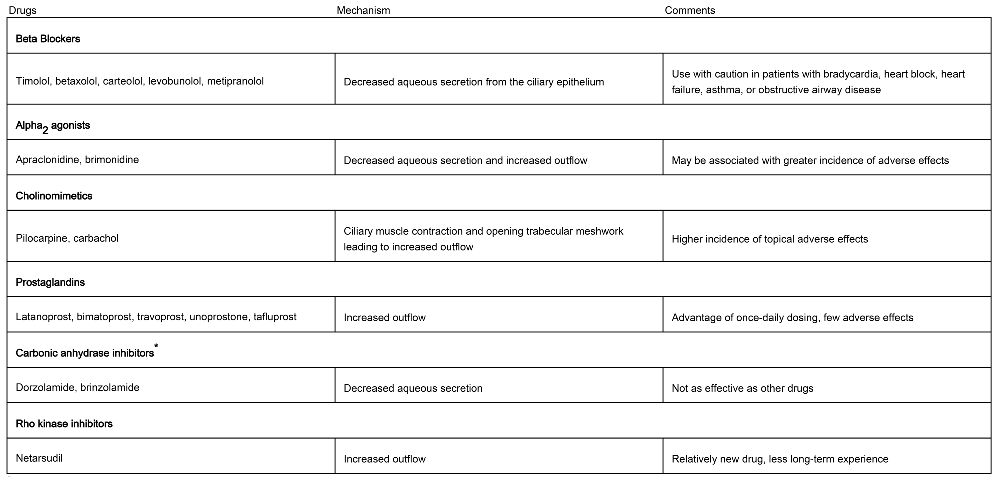
:::

- 一線用藥？
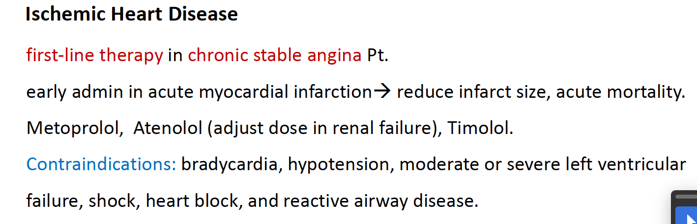

# Cholinergic Drugs

> Acetylcholine

- 生理？
  - Neuromuscular junction (NMJ，肌肉)
  - Autonomic nervous system (ANS)
  - Central nervous system (CNS)
    - Nucleus Basalis
    - Pedunculopontine necleus
    - 清醒

## 效果

- 同時干擾正副交感，主宰的被影響
  - 除了血管，正常都是交感主宰

>低劑量，非選擇 (low dose Atropine)
:::fbox 
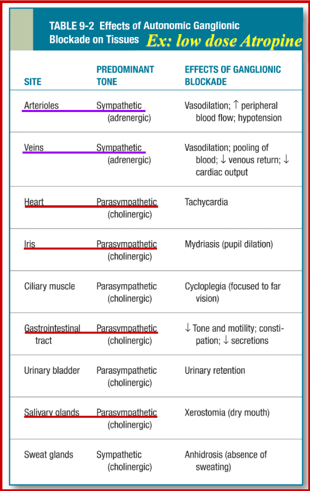
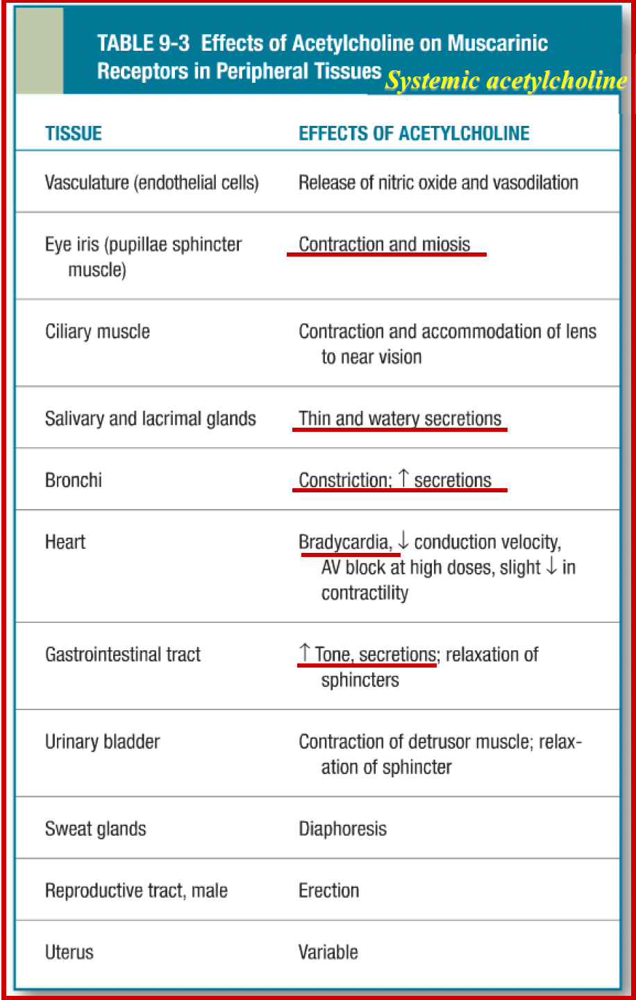
:::

## 機制

- Choline 限制
  - 要回收 (CHT)

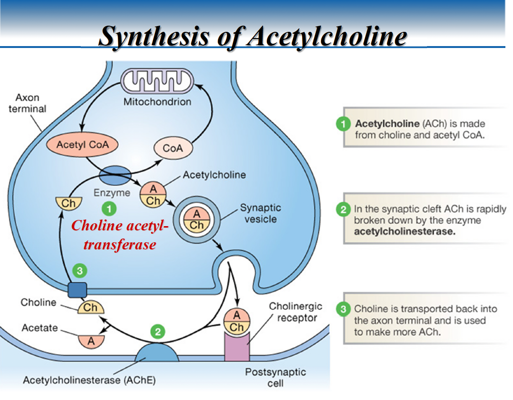

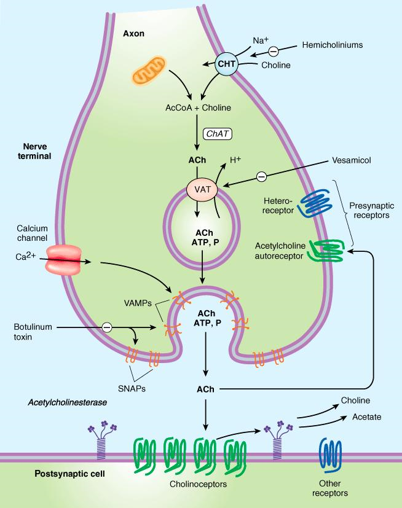

### Receptor
> 共筆

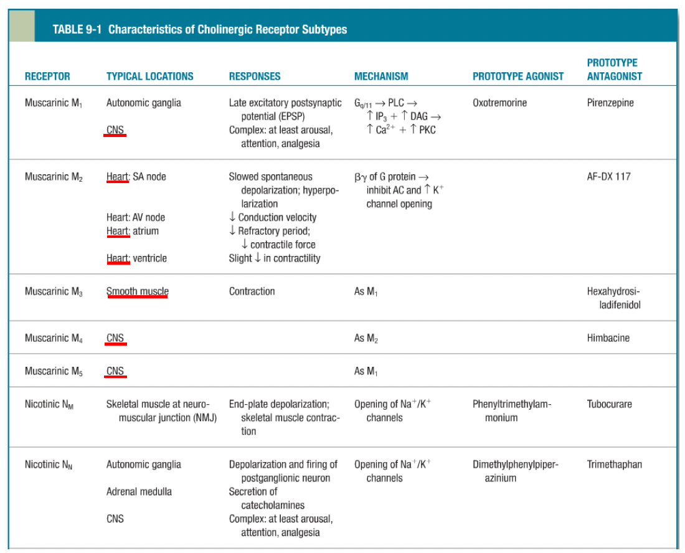

## 藥物 

### 類似物
- 帶正電，過不了 BBB 
- 分解快

:::fbox 

:::

內碼
1176565573