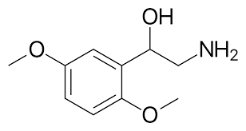

---
toc:
    depth_from: 1
    depth_to: 3
html:
    offline: false
    embed_local_images: false #嵌入base64圖片
print_background: true
export_on_save:
    html: true
---

# 腎上腺素

|種類|位置|G protein| effect|
|-|-|-|-|
&alpha;1 (＋)|==升血壓==: 收縮小動脈平滑肌|Gq| IP3、DAG&uarr; &rarr; Ca^2+^&uarr;
^|==升血糖==：胰島素&darr;, 肝臟糖解|^|^
^| 散瞳: 收縮虹膜放射肌|^|^
^|收縮胃腸道括約肌、膀胱平滑肌(憋尿)、毛囊平滑肌|^|^
^|減少鼻黏液|^|^
|&alpha;2 (-)|突觸前：NE釋放&darr; &rarr; 交感&darr; &rarr; ==降血壓==| Gi | adenyl cyclase&darr; &rarr; cAMP&darr;|
^|突觸後：血管收縮|^|^
^|中樞血管：舒張、減少交感活性|^|^
^|平滑肌舒張|^|^
^|射精(ejaculation)|^|^
^|抑制 lipolysis|^|^
^|眼內壓 &darr; |^|^
|&beta;1 (+)|SA node&uarr; &rarr; 心跳、收縮力&uarr;|Gs| adenyl cyclase&uarr; &rarr; cAMP&uarr;
| &beta;2 (+/-) | ==降血壓==: 擴張血管平滑肌 |^|^
^|==升血糖==: 昇糖素&uarr;|^|^
| ^| 擴張==支氣管平滑肌==、子宮平滑肌(安胎)|^|^
| ^ |  收縮腸壁、胃壁平滑肌    |^|^
^|活化心臟 Gi |^|^
| &beta;3 (+) | ==利尿==:膀胱逼尿肌(detrusor muscle)放鬆|^|^
^|活化lipolysis|^|^
| D1 (+) | 腎臟血管平滑肌舒張 | ^|^
| D2 (-) | | Gi | adenyl cyclase&darr; &rarr; cAMP&darr;| 

## agonists
> N 電子雲越厚，越偏 &beta;2 
> NE &rarr; Epinephrine &rarr; Isoproterenol &rarr; Terbutaline
==?line==

| | 受體| effect | |
|-|-|-|-|
| Epinephrine | &alpha;, &beta;| 直接|口服無效|
| Norepinephrine (NE) |α, &beta;1 | ^|增加迷走神經活性|
| Phenyl**ephrine** | α1 |^|散瞳劑(mydriatic)、 去鼻充血劑(decongestant)、提高血壓
| Midodrine | ^ |^|姿勢性低血壓
| ^ | ^ |^|Prodrug, 
|Clonidine| &alpha;2|-|
| methyldopa |^||
| guanfacine |^||
| guanabenz |^||
| Tizanidine | ^|-|肌肉鬆弛劑
| Dexmedetomidine |^| - |鎮定(sedative) |
| Oxymetazoline |^| 直接 | 去鼻充血劑(decongestant) |
| Isoproterenol | &beta; | 直接| 降血壓藥 |
| Terbutaline  | &beta;2 | ^ | 氣喘
| Dobutamine (+)| &beta;1, α1&darr; | ^ | 強心劑|
| Dobutamine (-)| &alpha;1| ^ | |
| Ephedrine (麻黃素) | &beta; | mix | 氣喘 |
| Pseudoephedrine |?|^| 去鼻充血劑(decongestant)|
| **Amphetamine-Like:**   Modafinil, Armodafinil, Tyramine| | 競爭 NE 回收 (NET)|
| ^| | NE 釋放&uarr;|
| **Catecholamine Reuptake Inhibitor:**   Cocaine, Atomoxetine, Reboxetine | | NET&darr; 

# Adrenoceptor Antagonist Drugs

- Reversible
  - agonist

- Irreversible 
  - 強力鍵結 &alpha; receptor

- 選擇性 (Selective)
  - 對 &alpha;~1~, &alpha;~2~ 親和力差異
  - ==要背==

:::info {嗜鉻細胞瘤}

TODO

:::

### 常見副作用
1. Pheochromocytoma
2. Hypertensive Emergencies
3. Chronic Hypertension
4. Peripheral Vascular Disease
5. Urinary Obstruction
6. Applications of α 2 Antagonists

## &beta; RECEPTOR ANTAGONIST DRUGS

- pure antagonists
- partial agonists
  - 穩定不活化的 &beta; receptor

- 個體差異大
- 脂溶 Pass BBB
- lol 結尾
- 氣喘要用 &beta;~1~ Selective Antagonist
- Without intrinsic sympathomimetic activity:
  - Propranolol (membrane stabilizing action)
  - Sotalol , 
  - Nadolol 
  - Timolol
- 參考參考
  - ==Esmotol== : 速效

:::info {Glaucoma}
- 眼房液過多 &rarr; 眼壓高 &rarr; 損傷視神經
- 治療
  - 促進眼房液流出
  - 減少製造

:::

- 一線用藥？

# Cholinergic Drugs

> Acetylcholine

- 生理？
  - Neuromuscular junction (NMJ，肌肉)
  - Autonomic nervous system (ANS)
  - Central nervous system (CNS)
    - Nucleus Basalis
    - Pedunculopontine necleus
    - 清醒

## 效果

- 同時干擾正副交感，主宰的被影響
  - 除了血管，正常都是交感主宰

>低劑量，非選擇 (low dose Atropine)
:::fbox 

:::

## 機制

- Choline 限制
  - 要回收 (CHT)

### Receptor
> 共筆

## 藥物 

### 類似物
- 帶正電，過不了 BBB 
- 分解快

:::fbox 

:::

內碼
1176565573
