---
toc:
    depth_from: 1
    depth_to: 3
html:
    offline: false
    embed_local_images: false #嵌入base64圖片
print_background: true
export_on_save:
    html: true
---

# 腎上腺素

|種類|位置|G protein| effect|
|-|-|-|-|
&alpha;1 (＋)|==升血壓==: 收縮小動脈平滑肌|Gq| IP3、DAG&uarr; &rarr; Ca^2+^&uarr;
^|==升血糖==：胰島素&darr;, 肝臟糖解|^|^
^| 散瞳: 收縮虹膜放射肌|^|^
^|收縮胃腸道括約肌、膀胱平滑肌(憋尿)、毛囊平滑肌|^|^
^|減少鼻黏液|^|^
|&alpha;2 (-)|突觸前：NE釋放&darr; &rarr; 交感&darr; &rarr; ==降血壓==| Gi | adenyl cyclase&darr; &rarr; cAMP&darr;|
^|突觸後：血管收縮|^|^
^|中樞血管：舒張、減少交感活性|^|^
^|平滑肌舒張|^|^
^|射精(ejaculation)|^|^
^|抑制 lipolysis|^|^
^|眼內壓 &darr; |^|^
|&beta;1 (+)|SA node&uarr; &rarr; 心跳、收縮力&uarr;|Gs| adenyl cyclase&uarr; &rarr; cAMP&uarr;
| &beta;2 (+/-) | ==降血壓==: 擴張血管平滑肌 |^|^
^|==升血糖==: 昇糖素&uarr;|^|^
| ^| 擴張==支氣管平滑肌==、子宮平滑肌(安胎)|^|^
| ^ |  收縮腸壁、胃壁平滑肌    |^|^
^|活化心臟 Gi |^|^
| &beta;3 (+) | ==利尿==:膀胱逼尿肌(detrusor muscle)放鬆|^|^
^|活化lipolysis|^|^
| D1 (+) | 腎臟血管平滑肌舒張 | ^|^
| D2 (-) | | Gi | adenyl cyclase&darr; &rarr; cAMP&darr;| 

## agonists
> N 電子雲越厚，越偏 &beta;2 
> NE &rarr; Epinephrine &rarr; Isoproterenol &rarr; Terbutaline
> &alpha;2 N 接拉電子基
==?line==

| | 受體| effect | |
|-|-|-|-|
| Epinephrine 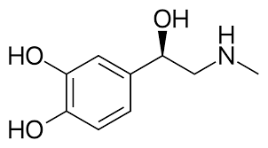| &alpha;, &beta;| 直接|口服無效|
| Norepinephrine (NE) |α, &beta;1 | ^|增加迷走神經活性|
| Phenyl**ephrine** 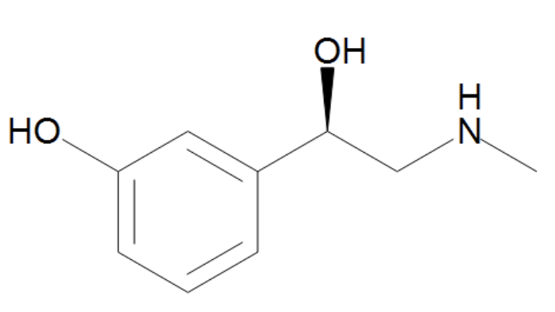| α1 |^|散瞳劑(mydriatic)、 去鼻充血劑(decongestant)、提高血壓
| Midodrine 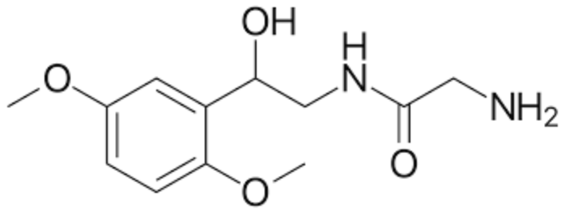| ^ |^|姿勢性低血壓
| ^ | ^ |^|Prodrug, 
| methyldopa |&alpha;2|-|-
| guanfacine |^||
| guanabenz |^||
|Clonidine |^|直接|高血壓、鎮定 //可樂定//|
| Tizanidine 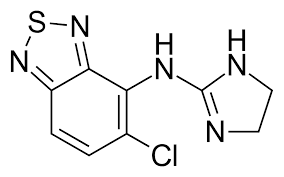| ^|^|肌肉鬆弛劑
| Brimonidine 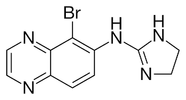 | ^ |^|青光眼
| Dexmedetomidine |^| ^ |鎮定(sedative) |
| Oxymetazoline |^| ^ | 去鼻充血劑(decongestant) |
| Isoproterenol | &beta; | 直接| 降血壓藥 |
| Terbutaline  | &beta;2 | ^ | 氣喘
| Dobutamine (+)| &beta;1, α1&darr; | ^ | 強心劑|
| Dobutamine (-)| &alpha;1| ^ | |
|-terol | β2 | ^ |
|Ritodrine| ^ |^| 安胎|
| Ephedrine (麻黃素) 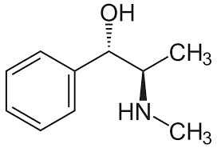| &beta; | mix | 氣喘 |
| Pseudoephedrine |?|^| 去鼻充血劑(decongestant)|
| **Amphetamine-Like:**   Modafinil, Armodafinil, Tyramine| | 競爭 NE 回收 (NET)|
| ^| | NE 釋放&uarr;|
| **Catecholamine Reuptake Inhibitor:**   Cocaine, Atomoxetine, Reboxetine | | NET&darr; 

## Antagonist 

> 默認直接作用，搶受體
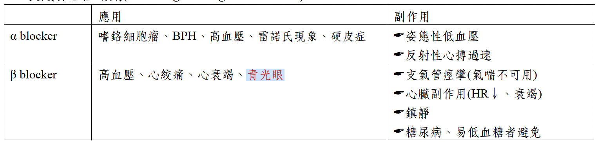

| | 受體 | r/ir |effect|
|-|-|-|-|
| Phentolamine  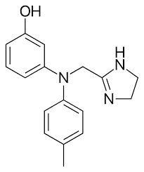| &alpha; | ir (24h)|治療 pheochromocytoma (嗜鉻細胞瘤) 造成的高血壓。   阻斷α2 receptor，造成 tachycardia(心跳過速), cardiac arrhinias (心臟驟停)   //有個性的糞系辦//
Phenoxybenzamine | ^ | r (4h)| ^
| Prazosin | &alpha;1 | R| 治療慢性高血壓
Pra==zosin==, Terazosin, Doxazosin| ^ | ^|<ul><li>尿道內括約肌&uarr; &rarr; 緩解攝護腺肥大(BPH)</li> <li>第一次用α1 blocker可能會有噁心//(osin)//、  Orthostatic hypotension (姿勢性低血壓)、頭暈等症狀</li></ul>|
|Indoramin| ^ | -|^
|Urapidil  //u rapid//| ^ | ^ | ^
Yohimbine   //yohi~//| &alpha;2 |-| <ul><li>促NE釋放，交感&uarr;</li><li>治療姿勢性低血壓、勃起障礙</li> </li>  | 
Esm==olol== | &beta;1 | - | 藥效極短
| Betaxolol | ^ | 青光眼
| metoprolol |^ |-|
| Nadolol |&beta; | 24h
| Propranolol | ^| 口服可用率低，可穿BBB|
| Timolol | ^ | 青光眼
| Labetalol  //來逼他//| &alpha;, &beta; | 治高血壓, Congestive Heart Failure (CHF)
| Carvedilol, medroxalol, bucindolol | ^ |

# Cholinergic Drugs

## 效果

- 同時干擾正副交感，主宰的被影響
  - 除了血管，正常都是交感主宰

>低劑量，非選擇 (low dose Atropine)
:::fbox 

:::

## 機制

階段|蛋白|功能
-|-|-
合成|CHT|將Choline傳輸到細胞內 (Choline和Na+的同向運輸)
儲存|VAT|將合成的ACh傳輸到突觸小泡中 (ACh和H+的反向運輸)
釋放|SNARE|介導突觸小泡與細胞膜融合釋出ACh

### Receptor

## 藥物 
### Direct agonist
#### 類似物
- 帶正電，過不了 BBB 
- 分解快

:::fbox 

:::

#### Alkaloids (生物鹼類)
- 帶正電，無法穿越BBB
- 腸胃吸收差、BA(bioavailability)低。

Muscarine
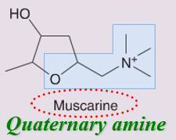
Pilocarpine
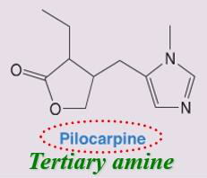

### Indirect agonist (AChE inhibitors)
==ostigmine==
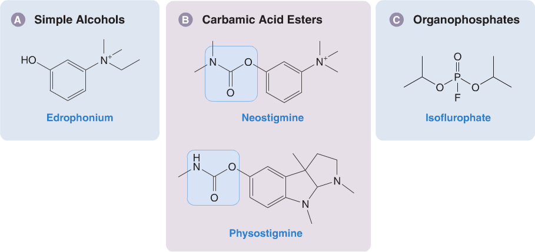

Simple alcohols 
: Reversible(可逆)、作用時間短(藥效僅5-15分鐘)

Carbamic acid esters (胺甲酸酯類)
: Reversible(可逆)、作用時間介於另兩類之間(藥效0.5-6小時)

Organophosphates (有機磷)
: Irreversible(不可逆)、作用時間長(藥效超過100小時)、生化武器

# Local Anesthetics

- 沒有選擇性
- 阻斷鈉離子通道(voltage-gated sodium ion channel)以終止痛覺傳遞
- TAC(Tetracaine+Adrenaline+Cocaine)

||effect|||排出|
-|-|-|-|-|
***Ester-linked*** | mins-1h ||| 血漿中esterase (Pseudocholinesterase) &rarr; 腎 
Procaine 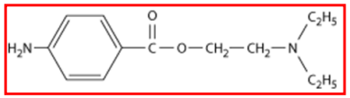| 快|短|浸潤 | 降低 Sulfonamide(磺胺類抗生素)的抗菌作用。
Tetracaine 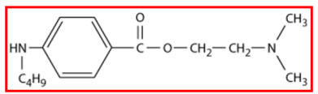| 慢|長|塗抹/脊椎| 會造成血管舒張
Cocaine 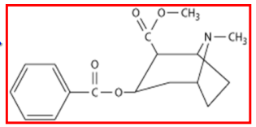| 快|中| all|強烈的血管收縮
Amide-linked |1-2h|||肝臟P450 &rarr;腎臟
Lidocane 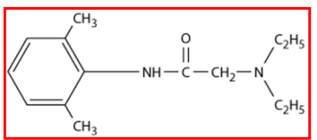|快|中|all|最常用的局部麻醉，Epinephrine合併使用可延長作用時間、提升藥效
Prilocaine|^|^|^|少用，不須併用血管收縮劑
Bupivacaine|-|長|浸潤/ 硬膜下腔/ 脊髓 | 不影響運動
Articaine   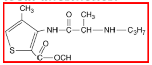|快|短|浸潤|取代 Procaine ，牙科

# GABA 促進

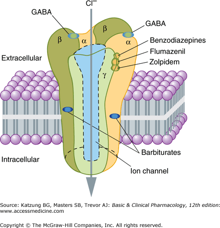

# 鎮痛劑（analgesics）
## NSAID 

1. 肝代謝、與albumin 結合
2. 抑制COX1(constitutive)：
   - 胃酸↑ (GI effects)
   - 抑制血小板
   - 鈉滯留、腎功能↓：老人、體液過少者容易(Sulindac、Nabumetone 無活性腎排出，影響小)
3. 抑制COX2(inducible)：
   - 消炎止痛 (抑制PGE2所釋放 Bradykinin & Histamine)
   - 促進血小板
4. 共同副作用：促進Lipooxygenase &rarr; LTC4等增加→支氣管收縮

|||cox| 備註
|-|-|-|-|
Salicylic acid|Aspirin | 1>2|
^|Diflunisal | 1,2
Ticagrelor|| 1,2|
Celecoxib || 2  //沒奈心(Me lo xi)清理(cele)一坨(eto)，挑著清 //
Etodolac || ^
Meloxicam || ^ |
|Acetate| Diclofenac //豬哥//| 1,2 |肝毒性 |
|^| Indomethacin  | ^ | 腎毒性最大、治(關閉)PDA
|^| Nabumetone | ^
|^|Sulindac | ^| 
|^| Tolmetin //痛沒停//| ^| 無法治痛風
^|Ketorolac | ^| 嚴重腸胃副作用
|Propionate //丙 &rarr; 3 &rarr; 解熱//| Ibu==pro==fen //嬰不破費// |1,2|常見。關閉早產兒 PDA
|^|Ketoprofen | ^
|^|Naproxen //nap//|^| somnolence(嗜睡 )
|^|Oxaprozin | ^ | 長效 //POX//
|Piroxicam|| ^| ^
|非 NASID|Acetaminophen| ^| COX 影響小，作用於CNS，長期大量使用具肝毒性。

PDA
: 開放動脈導管 (patent ductus rteriosus)

## DMARD
- Disease-modifying antirheumatic drugs
  - RA 藥

### 抑制骨髓 
- Azathioprine/AZA

### csDMARDs 

||||
|-|-|-|
抑制B/T cell 皆抑制骨髓| Azathioprine | 口服佳
^|Mycophenolate mofetil (MMF) | 抑制IMP變為GMP
^|Cyclophosphamide | 烷化DNA
^|Leflunomide, Teriflunomide|-

### biologic(生物製劑)

- Cyclosporine、Tacrolimus

|Anti |-|-|
|-|-|-|
T-cell-modulating biologic|Abatacept|-
B-cell cytotoxic| Belimumab, Rituximab(RTX) | //RTX 若比鄰//
|TNF-α| Infliximab, Adalimumab, Golimumab, Etanercept, Certolizumab| //T 應付(inf)阿達(ada) Intern (etan)舌頭(certo)夠力(goli)//
IL-1| Anakinra, Canakinumab, Rilonacept | //1 號 ana 硬拉(inra), canal, rhino (rilo) 要12歲//
|IL-6| Sarilumab, Tocilizumab |//莎莉拖戲//
|IL-17|Secukinumab, Ixekizumab, Brodalumab| //Broda 一起去(17,I xe ki) 洗身體(Secu)//

## tsDMARDs
- targeted synthetic(標靶藥物)。

//靶心(Barci)JK 頭髮(Tofa)//
- Tofacitinib
  - 抑制所有的 Janus kinase/JAK family
  - 適應症: 發炎性腸道疾病
  - 副作用: 上呼吸道感染 、泌
- Barcitinib
  - 抑制 JAK1、JAK2＞JAK3
  - 適應症: RA
  - 副作用:感染, Herpes virus(泡疹病毒)復發

## endogenous opioid peptide (內生鴉片)

|Receptor subunit| 最佳親和|
|-|-|
&mu;| Endorphins
&delta; | Enkephalins
&kappa; | Dynorphins

NMDA Receptor
: 放大器 &rarr; 鴉片類耐受性

- 治療腹瀉(不易進中樞) //落魄大夫治腹瀉//
  - Diphenoxylate (因)
  - Difenoxin (不可用於腸侵入性細菌造成之腹瀉)
  - Loperamide

- 替代治療
  - 鴉片類的 methadone，buprenorphine //不會懦夫，沒啥痛//
  - 非鴉片類的 clonidine //可樂定//

# DM 

- Insulin
- Secretagogues：胰島素促泌劑，因此對第一型糖尿病沒效。
  - Sulfonylureas
  - Meglitinides
- Sensitizers：胰島素增敏劑
  - Biguanides：Metformin
  - Thiazolidinediones(TZD)
- Alpha-glucosidase inhibitors：抑制碳水化合物分解，延長血糖上升時間。
- Incretin mimetics：新藥物，能跟腸泌素一樣具有促進Insulin分泌的功能。
  - Glucagon-like peptide(GLP) analogs and agonists
  - Gastric inhibitory peptide(GIP) analogs
- DPP-4 inhibitors：Incretin易被DPP-4分解掉，故抑制此酵素能延長作用時間。
- Sodium-glucose cotransporter 2 inhibitors：抑制腎臟對糖類的再吸收，增加糖排出

//gli 在前 &rarr; 飯前吃 &rarr; 促泌//

## amylin 類似物

- 降血糖
- 降食慾

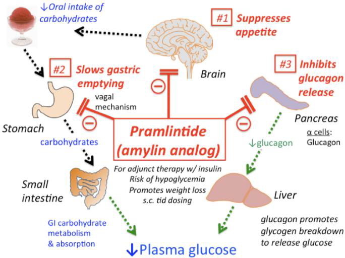

## Insulin Preparations 胰島素製劑

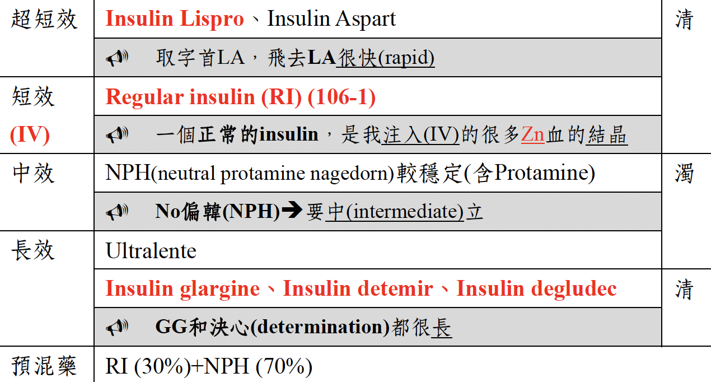

## 促泌劑
作用在K+ channel，使K+ channel關閉，促進胰島素分泌

||| 作用
|-|-|-|
Sulfonylureas //gli在前面，飯前//| Tolbutamide, Chlorpropamide, Tolazamide, Acetohexamide (臨床無使用)|hypoglycemia
^|Glyburide| 腎、糞排除 //sul fo//
^|Glipizide| ^
^|Gliclazide (臨床無使用) |^
^|Glimepiride |^
Meglitinides //gli在後面，飯後//| Repaglinide | 
^|Nateglinide | 

## 增敏劑
| | | |
|-|-|-|
|Biguanides| Metformin  //mate for me//| 乳酸中毒 (禁忌：心肝腎不佳)   抑制糖質新生   Type 2 DM 的第一線用藥
|Thiazolidinediones (TZD)  //蛤蜊太熟//| Troglitazone|  PPARγ→↑GLUT-4   肝毒性   Pioglitazone：TG&darr;, HDL&uarr;   Rosiglitazone：總膽固醇&uarr;, HDL&uarr;, LDL&uarr; 
^| Rosiglitazone |^

## 氣喘/COPD藥

- Corticosteroid 
  - HAT (histone acetyltransferase) &darr;
  - HDAV &uarr;
- Theophyline
  - IL10 release
  - HDAV &uarr;
  - Adenosine R &darr;

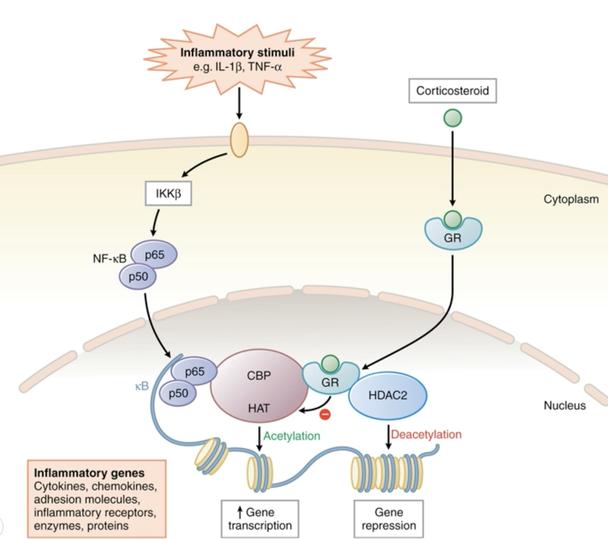

# 期末

|類別|| |
|-|-|-|
|IA|Quinidine|延長再極化期
|^|Procainamide|IA $\xRightarrow{P450}$ III   Ach agonist|^
|IB|Lidocaine, Mexiletine, Phenytoin|縮短再極化期, 毛地黃解毒劑,治療 TdP|
|IC|-| CNS effect
|II|-olol|β1 blocker
|III|Sotalol, Ibutilide, Dofetilide|造成TdP
|I-IV|Amiodarone|

- 腎毒
  - Cisplatin
  - Methotrexate
  - Cephalosporins
  - FQs
    - moxifloxacin 例外
  - Glycopeptides
    - Viomycin
    - Teicoplanin
    - Bacitracin
    - Capreomycin
  - aminoglycosides
    - Streptomycin
    - Gentamicin
  - Rifamycins
  - Amphotericin B
  - Allylamines
  - Fluconazole
  - Cidofovir
  - Foscarnet

- 骨髓抑制
  - ganciclovir 
  - valgamciclovir
  - Methotrexate
  - Chloramphenicol

- digitalis
  - 效果:鈉鉀幫補&darr;&rarr;鈉鈣幫浦排鈉留鈣 &rarr; 強心 
  - 風險:低血鉀(細胞鉀不足)、低血鎂(Ca^2+^ 湧入)、細胞外高血鈣
  - 副作用: 心搏過速、顫動型心律不整(即Tdp)
  - 解毒: atropine, IB, AB
  - 

- 鼻炎預防 
  - Corticosteroids
  - Cromolyn
- Anti-leukotrienes
  - Zileuton
  - Zileuton

---
- RAAS Inhibitor
  - Direct renin inhibitor(DRI)
    - Aliskiren
  - ACEI
    - enalapril
    - lisinopril
  - Angiotensin II-receptor blocker(ARB)
    - Side: Fetotoxic
    - Valsartan
  - aldosterone 
  

- Calcium-channel blockers(CCBs)

---

Lipid-lowering
- statin
  - HMG-CoA Reductase inhibitor
  - CEPT inhibitor &rarr; 升 HDL
  - 降 LDL
  - 長效: Atorvastatin, Rosuvastatin
  - DM: Pitavastatin
- Ezetimib
  - NPC1L1 inhibitor
  - 抑制小腸對於dietary和biliary cholesterol的再吸收
- fibrates
  - PPARs-α
  - 增加 ApoA-Ⅰ, Ⅱ &rarr; HDL
  - 形成膽結石(gallstones)
- Niacin
  - apoA-I

內碼
1176565573
