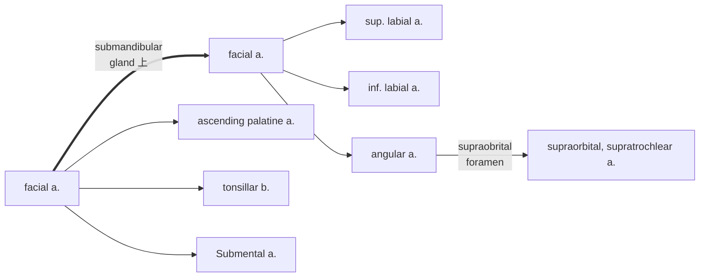
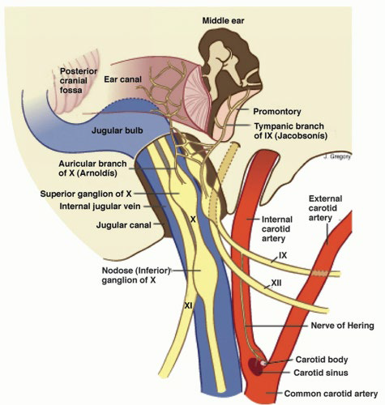
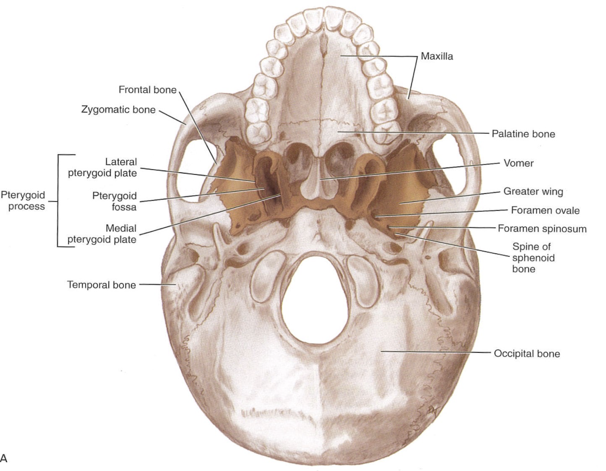
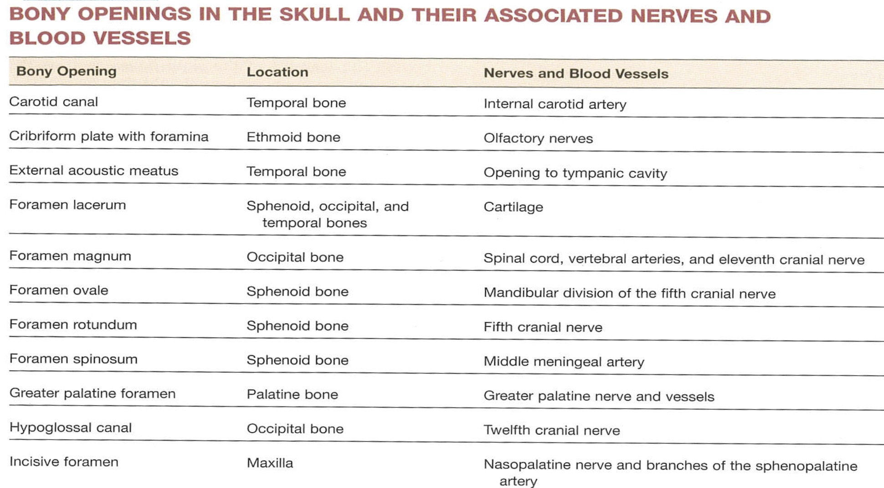
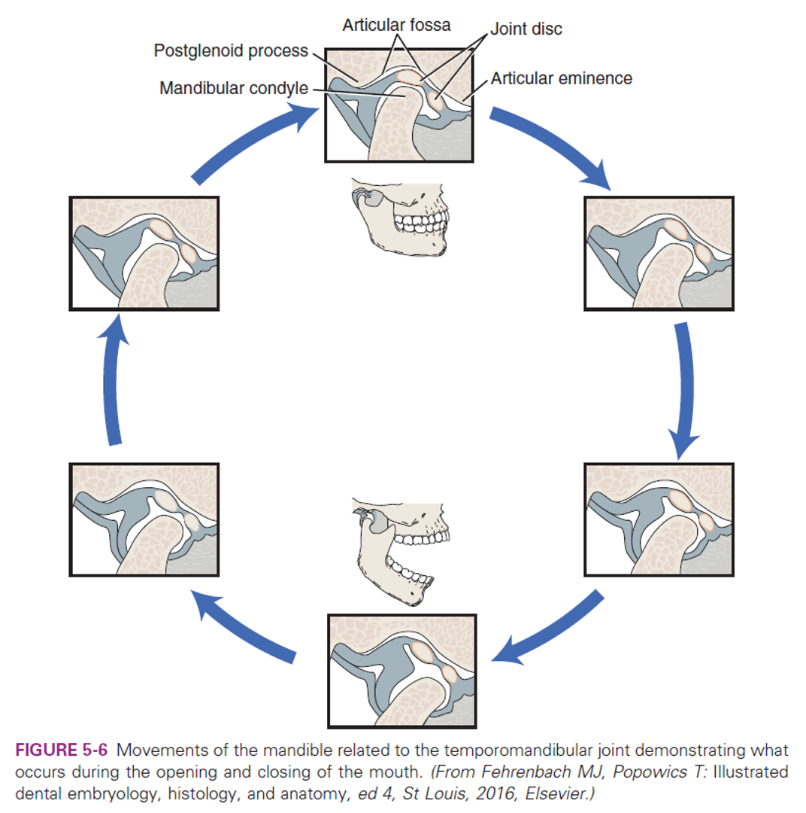
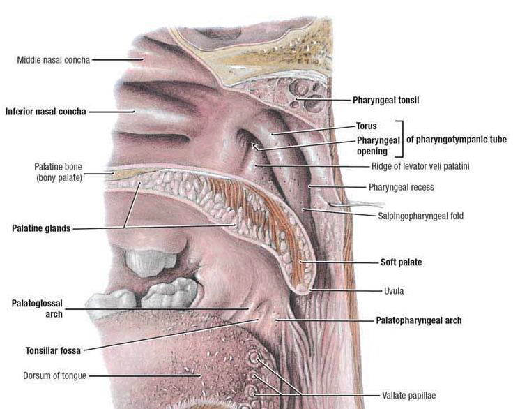
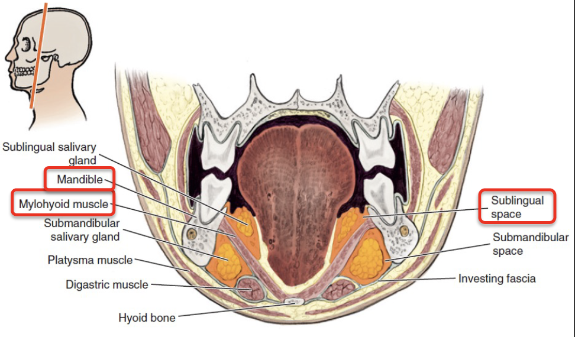
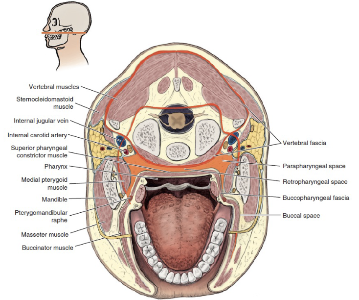

---
toc:
  depth_from: 1
  depth_to: 3
html:
    offline: false
    embed_local_images: false #嵌入base64圖片
print_background: true
export_on_save:
  html: true
---

# Artery


## Subclavian a.

\picBox{


}


:::info
**Scalene m.**
ant.,mid. scalene insertion at rib 1
post. scalene insertion at rib 2
:::

## Thyrocervical trunk


## Axillary a.


## Common carotid

- carotid sheath
- 頸部無分支


## External carotid


lingual a.
: hyoglossus m. 深層，digastric下
:::info
由深而淺
lingual a.$\rightarrow$ hyoglossus m.$\rightarrow$ lingual v.&n.
:::


Superficial temporal a.
: 從耳前上穿出

:::danger
[Deep temporal a.](#second-part)
:::

## Facial a.

> digastric上



### Ascending palatine a.
- Styloglossus, Stylopharyngeus m. 之間，levator veli palatini m.附近分兩支：
- 支配軟顎
- 支配palatine tonsil, auditory tube


## Maxillary a.

- Mandibular part
- Pterygoid part
- Pterygopalatine part


:::info
Maxillary a.通過pterygoid muscle淺層，穿入[pterygopalatine fossa](#pterygopalatine-fossa)

:::

### First part


Ant. tympanic a.
: 進入 [tympanic cavity](#ear)，供應 tympanic membrane

Middle meningeal
: 被[Auriculotemporal n.](#posterior-division) 環繞

### Second part

皆有([CN V~3~](#anterior-division))伴行，除了Buccal n.為sensory，其為motor

- Ant./post. deep temporal a.
- Buccal a.
- Masseteric a.
- Pterygoid a.

### Third part

皆有sensory 伴行，穿入[pterygopalatine fossa](#pterygopalatine-fossa)


Sphenopalatine a.
: 最終分支，進入 [Sphenopalatine foramen](#sphenopalatine-foramen)，支配鼻竇

Vidian a.
: [Vidian n.](#gland)

maxillary tuberosity
: on [alveolar bone](#alveolar-bone)


## Superior thyroid artery 

- Infrahyoid br.
- Sup. laryngeal a. 
- SCM br.
- Cricothryoid br. 


## Tympanic artery 


\picBox{

}


## SCM血液
**上1/3**
- [Occipital a.](#external-carotid)

**中1/3**

- Sup. thyroid a.
- Ext. carotid a.

**下1/3**

- [suprascapular a.](#thyrocervical-trunk) (>80%)


## Internal carotid a.

- 進入carotid canal 前無分支
- CN X 伴行
- Carotid canal入顱
- carotid a. 夾 Stylopharyngeus m.(CN IX) , Styloglossus m. (CN XII)


## Cerebral arterial circle


### Ophthalmic a.
- Dorsal nasal a.
- Supratrochlear a.
  - Ant./ Post. ethmoid a.
- Supraorbital a.
- Ciliary a.
- Lacrimal a.


# Vein


:::info
subclavian vein 在ant. scalene m. 上方
:::


## 顱內 


# Nerve

:::info
感覺神經 1, 2, 8
運動神經 3, 4, 6, 11, 12
副交感 3, 7, 9, 10
:::


| CN           |Origin| foramen                 |
| -------------- | -|------------------------ |
| I            | 嗅球|cribriform plate        |
| II           | Optic Chiasma| optic canal             |
| III, IV | Midbrain | sup orbital fissure |
V~1~, VI | pons  | ^  |
| V~2~    |^     | foramen rotundum   |^     |
| V~3~       |^  | foramen ovale           |
| VII |^    | Internal coustic meatus |
| VIII | Pons, Medulla 之間   | ^ |
| IX, X, XI   |Medulla | jugular foramen         |
| XII          | ^|Hypoglossal canal       |


## CN III, IV, VI
>[眼眶](#眼眶)


### CN III
- Superior br.
  - **Motor**
  - sup. rectus m.
  - levator palpebrae superioris m.
  - sup. tarsal m. 
- Inferior br.
  - **Motor**
  - inf. rectus m.
  - med. rectus m.
  - inf. oblique m.
  - **Parasympathetic**
  - ciliary ganglion
    - sphincter pupillae m.(瞳孔括約肌)
    - ciliary m.(水晶體曲度)

:::info{injure}

:::

### CN IV
**Motor**
- Sup. oblique m.

:::info{injure}
複視
:::

### CN VI
- Lateral rectus m.

## CN V1


- Lacrimal n.
  - [lacrimal g.](#gland)
- Nasociliary n.
  - Ant./ Post. ethmoid n.
    - 進入Ethmoid sinus
  - Infratrochlear n.
  - Long ciliary n.
    - 瞳孔擴張
- Frontal n.
  - Supratrochlear n.
  - Supraorbital n.

## CN V2


### Post. sup. alveolar n.

穿過 [pterygomaxillary fissure](#pterygopalatine-fossa)，支配上顎臼齒(molars)，除了第一大臼齒(mid. sup alveolar n.)

:::warning

[PSA a.](#third-part)
[Alveolar bone](#alveolar-bone)
:::


### Infraorbital n.
感覺神經
- Ant./Mid sup. alveolar n.
  - 與[動脈](#third-part)伴行
- Sup. labial br.
- Nasal br.
### Pterygopalatine ganglion

位於[pterygopalatine fossa](#pterygopalatine-fossa)


## CN V3

### Meningeal br.

進入 foramen spinosum

### Anterior division

[支配咀嚼肌](#second-part)

- Masseteric n.
- Anterior and posterior deep temporal n.
- Medial pterygoid n.
- Lateral pterygoid n.
- Buccal n.(**Sensory**)

### Posterior division

- Auriculotemporal n.
  - 夾 [mid. meningeal a.](#first-part)
  - 走進 Digastric, Stylomastoid 之間 
- Lingual n.
  - [Chorda tympanic](#chorda-tympanic-n) 匯入
- Inf. alveolar n.
  - Mental n.
    - 進入[Mandibular foramen](#mandible)
    - Incisive n.
      - 下顎前牙感覺
- Mylohyoid n. (Motor)


## CN VII
- Parotid plexus(支配表情肌)
  - Temporal br.
  - Zygomatic br.
  - Buccal br.
  - Marginal mandibular br.
  - Cervical br.

- Greater petrosal n.(**Parasymphysis**)
  - Mucous g.
  - [Lacrimal g.](#gland)
- Stapedius n.
  - 支配Stapedius m.
- Chorda Tympanic n.(**Parasymphysis**)
  - 支配前$\frac{2}{3}$味覺
  - Submandibular, Sublingual [g.](#gland)


:::info{Parotid plexus}


:::
:::info{Chorda tympanic} 

:::
:::info{Great petrosal and Vidian}


[Lesser petrosal n.](#cn-ix)
:::

## CN VIII 
- Vestibular n. (平衡)
- Cochlear n. (聽力)


## CN IX
### Motor
- [Stylopharyngeus m.](#外部)
- Lesser petrosal n.(**Parasymphysis**)
  - 支配[Parotid g.](#gland)的副交感節前神經

### Sensor
- Tympanic n.
  - 中耳、鼓膜內面、耳咽管(Eustachian)
- Sinus n.

**Terminal** 
- Pharyngeal br.(with CN X)
  - Mucosa of [oropharynx](#oropharynx)
- Tonsillar br.
  - Palatine tonsil
- Lingual br.
  - 舌頭後1/3味覺、一般感覺

>分隔ECA,ICA



## CN X

### Structure
- common carotid a. 外側，蓋在 thyrocervical trunk 上
- recurrent laryngeal n.沿 tracheoesophageal groove 攀升(就是食道和氣管中間)，接觸 medial thyroid gland，向內鑽到 inf. constrictor，進入 larynx，同時支配感覺與運動


---

- *Auricular br(腦內)*
  - Ext. acoustic meatus

---

- 所有 plato- 除了 [Tensor veli palatini](#內部)
  - [Palatoglossal m.](#內部)

- Pharyngeal br.
  - [Pharynx](#muscle) (除了 Stylopharyngeus)

--- 
[Larynx](#larynx-1)
- Sup. laryngeal n.
  - Internal br.(Internal laryngeal n.)
    - [Laryngopharynx](#laryngopharynx)
    - Larynx (Vocal fold 以上)
    - *舌根、Epiglottis 味覺*
  - External br.
    - Cricothyroid m.
- Recurrent laryngeal n.
  - 過Cricothyroid joint改叫Inf. laryngeal n.
  - 支配所有軟骨間肌，除了 Cricothyroid m.
  - *假聲摺以下的喉部黏膜感覺*


:::warning
{recurrent laryngeal n.}

- left: arch of aorta
- right: Subclavian a.


:::


### Sensor


## CN XI
- Spinal root(C~1~-C~5~)混合
- 向後支配SCM, Trapezius


## CN XII

- 跨過ECA所有分支，除了Occipital a.
- 與[Ansa cervicalis](#ansa-cervicalis) 混和
- 支配[舌部肌肉](#muscle-1)


## Cervical plexuses


### Ansa cervicalis
- Omohyoid
- Sternohyoid
- Sternothyroid
- Geniohyoid
- Thyrohyoid
  


## Sup. cervical ganglion

支配carotid plexus, pharyngeal plexus


# Gland


# Muscle of Mastication

都是[CN V~3~](#cn-v3)支配


|           |                  >                  |                Masseter                |                  Temporalis                  |                             >                             |               Medial pterygoid               |                  >                  |               Lateral pterygoid               |
| :---------: | :-----------------------------------: | :---------------------------------------: | :--------------------------------------------: | :---------------------------------------------------------: | :--------------------------------------------: | :------------------------------------: | :---------------------------------------------: |
|           |             Superficial             |                  Deep                  |                      -                      |                        Superficial                        |                     Deep                     |                Upper                |                     Lower                     |
|  Origin  |                  >                  |             zygomatic arch             |  inferior temporal line<br>temporal fascia  | Maxillary tuberosity<br>Pyramidal process of the palatine | Medial surface of<br>lateral pterygoid plate |             Greater wing             | Lateral surface of<br>lateral pterygoid plate |
| Insertion | Angle<br>inferior and lateral ramus | Superolateral ramus<br>Coronoid process | Coronoid process<br>anterior border of ramus |                             >                             |            Medial ramus<br>angle            | Articular disc<br>capsule of the TMJ |                Pterygoid fovea                |
|  Actions  |                  >                  |          Elevates<br>Protrudes          |             Elevates<br>Retrudes             |                             >                             |            Elevates<br>Protrudes            |                  >                  |            Depresses<br>Protrudes            |

# Osteology

## 分類

<table>
<tr>
<th>顱骨(8)</th><th>顏面骨(14)</th>
</tr>
<tr>
<td>

- Occipital
- Ethmoid
- Frontal
- Temporal
- Parietal
- Sphenoid
</td>
<td align="left">

- vomer
- Mandible
- inf. nasal conchae
- nasal
- Maxilla
- Zygoma
- Lacrimal
- Palatine
</td>
</tr>
</table>


:::info{再生三要件}

- Cell
- Scaffold
- Growth factors
  :::
  :::info{一些單字}
  notch
  : 壓跡

eminence
: 最凸點
:::

## 骨頭

### Frontal bone

1. Frontal sinus
2. Supraorbital notch/foramen
3. Glabella(眉間)
4. Lacrimal fossa
   
:::spoiler{相鄰骨}
Pr, S, L, N, E, Z, Mx
:::


### Parietal bone

1. Sagittal suture
2. Lambdoidal suture
   
:::spoiler{相鄰骨}
   F, O, T, S, Pr'
:::

### Ethmoid bone

1. Cribriform plate
   - Olfactory n. (CN I)
2. superior and middle Nasal concha


\picBox{


}


### inferior Nasal concha


\picBox{


}

### Sphenoid bone
1. pterygoid hamulus 
   
2. Foramen rotundum
   - [CN V~2~](#foramen-rotundum)
3. Foramen ovale
   - [CN V~3~](#first-part)
4. Foramen spinosum
   - [Mid. meningeal a.](#first-part)
5. Pterygoid canal
   - vidian [a.](#third-part)/[n.](#cn-vii)
6. Foramen lacerum (破裂孔)
7. Optic canal
   - CN II
   - [Ophthalmic a.](#ophthalmic-a)
8. Sup. orbital fissure
   - Ophthalmic n.([CN V~1~](#cn-v1))/ v.
   - CN III, IV, VI

:::spoiler{相鄰骨}
F, O, T, E, Pr, V, Z, Pl, Mx

:::

>上視圖


>前視圖


>後視圖


### Temporal bone

1. Carotid canal
   - [ICA](#internal-carotid-a)
2. Ext. acoustic meatus
3. Int. acoustic meatus
   - CN [VII](#cn-vii), VIII
4. Jugular foramen
   - int. jugular v.
   - CN [IX](#cn-ix), X, XI
5. Stylomastoid foramen
   - [parotid plexus](#cn-vii)
6. [Foramen lacerum](#sphenoid-bone)
7. Petrotympanic fissure
   - [chorda tympanic](#cn-vii)
8. Zygomatic process
9.  articular eminence

:::spoiler{相鄰骨}
Pr, O, S, M
:::


### Occipital bone

1. Hypoglossal canal
   - CN XII
2. Foramen magnum
   - Spinal cord
   - Vertebral a.
   - CN XI
3. [Jugular foramen](#temporal-bone)
4. [Foramen lacerum](#sphenoid-bone)
   :::spoiler{相鄰骨}
   Pr, T, S, C1
   :::


### Vomer


### Maxillary bone

1. four process
   - frontal
   - zygomatic
   - palatine
   - alveolar
2. Infraorbital fissure
   - Infraorbital [n.](#infraorbital-n)/ [a.](#third-part)
     :::spoiler{相鄰骨}
     F, Z, N, L, V, E, Pl, S, INC
     :::


:::info{骨折}

:::


### Alveolar bone

1. Palatine process
2. Alveolar process
3. Maxillary tuberosity (智齒後)
   - PSA foramen ([a.](#third-part)/ [n.](#post-sup-alveolar-n))
4. Incisive canal
   - nasopalatine [n.](#pterygopalatine-ganglion) and vessel


### Palatine bone

1. Greater palatine foramen
2. Lesser palatine foramen
3. [Greater/ lesser palatine n.](#pterygopalatine-ganglion)

### Lacrimal bone

:::info{淚囊（lacrimal sac）}
相鄰 lacrimal bone, maxillary bone

:::
:::spoiler{相鄰骨}
F, Mx, E, INC
:::

### Mandible

1. Symphysis & Parasymphysis $\rightarrow$ Body  $\rightarrow$ Ramus
   
2. Condylar process
3. Coronoid process
4. Mandibular foramen
   - [Mental n.](#posterior-division)
   - 第一小臼齒下
5. Mental foramen
6. Lingula (小舌)
7. Mental spine (頦棘)
8. Sublingual g. $\rightarrow$ Mylohyoid line $\rightarrow$ Submandibular g.
9. Oblique line
   - 7,8外
10. Antegonial notch
facial a./v.經過


\picBox{


}
> 國考毒瘤


#### 肌肉接點


### Hyoid bone


## 眼眶


## 腦洞們





## Buttress

傳導力量


## Sutures

- Coronal
- Sagittal
- Lambdoidal(人字)
- Squamosal(鱗)
- Temporozygomatic
- Median palatine
- Transverse palatine


## 發育年表 
- 2y 
  - 額骨融合
- 4y
  - 枕骨軟骨融合
- 16-20y
  - Sphenoid, Occipital 融合


# Lymphatic  system

:::spoiler{總圖}


:::

## Nodes


:::info{Lingual Lymphatic nodes}

:::

:::tip{病灶}

:::
## Groups


Level I
: the submental group (Ia), and the
submandibular group (Ib).

Level II
: the upper jugular lymph nodes
- level IIa -- CN XI 前
- level IIb – CN XI 後

Level III
: the middle jugular lymph nodes

Level IV
: the lower jugular lymph nodes

Level V
: all lymph nodes contained within the posterior triangle

Level VI
: lymph nodes of the anterior (central) neck compartment

:::tip 
清除 I, II, III
:::

## Nasal cavity


## Oral cavity


## Tongue


## Tonsil


**Waldeyer's tonsillar ring**
:::fbox 


:::


## Face
1. Maxillary
2. Buccinator
3. Supramadibular


## Larynx

用vocal fold 分，上,下分別到SDC, IDC


## Thyroid
跟著Sup./ Inf. thyroid a.走，分別到SDC, IDC


# Nose 
**Bone**
- Frontal (nasal process)
- Maxilla (frontal process)
- Nasal

**Cartilage**
- Septal
- Lateral nasal
- Alar


## Artery
**[Ophthalmic a.](#ophthalmic-a)**
- Dorsal nasal a.
- External nasal a.

**[Infraorbital a.](#third-part)**
- Nasal br.

**[Superior labial a](#facial-a)**

- Septal a.
- Alar a.


## Nerve

- [Ant. ethmoid n.](#cn-v1)
  - Int./ Ext. nasal n.
    - 鼻內/ 外感覺
- [Nasociliary br.](#cn-v1)
- [Infraorbital n.](#infraorbital-n)
  - Nasal br.

# Nose cavity


:::info{Hypophyseal  fossa} 
腦下垂體在這
:::

## Nasal septum (鼻中膈)
 
- nasal sepal cartilage 
- perpendicular plate of ethmoid
- vomer


## Nerve
- Olfactory n. (CN I)

**[Ophthalmic n.](#cn-v1)**
- Anterior ethmoid n.
  - 中下鼻甲前測一般感覺

**[Maxillary n.](#cn-v2)**
- Infraorbital n.

- [Pterygopalatine ganglion]((#pterygopalatine-ganglion))
  - Post. inf. nasal Br. of Greater palatine n.
  - Nasopalatine n.
    - 走在鼻中隔
    - 穿過 Incisive canal
  - Post. lat./med. sup. nasal n.


## Artery
- [Ant./ Post. ethmoid a.](#ophthalmic-a)
  - 供應鼻中隔
- [Sup. labial a.](#facial-a)
  - Septal br.


- [Maxillary a.](#third-part)
  - Sphenopalatine a.
    - to Incisive canal
  - Greater palatine a.


# Paranasal sinuses

鼻旁竇，濕潤呼吸的空氣


|                                       |          Artery/ Nerve          |
| :--------------------------------------: | :-------------------------------: |
|                Frontal                |    Ophthalmic br./ division    |
|               Maxillary               |     Maxillary br./ division     |
|                Ethmoid                | Ophthalmic br.<br>Maxillary br. |
|                Sphenoid                |                ^                |


## Frontal sinus

神經皆[CN V~1~](#cn-v1)

- Anterior ethmoid a.
- Supraorbital a./n.
- Supratrochlear (滑車上) a./n.

## Maxillary sinus

來自[Maxillary a. 3rd Part](#third-part), [Maxillary division](#cn-v2)

- Ant./mid. sup. alveolar a./n.
- Post. sup. alveolar a./n.

## Ethmoid sinus


:::info{ethmoid bulla}
Mid. ethmoid sinus 開口

:::

- Ant. ethmoid a./n.
- Post. ethmoid a./n.
- Post. lateral nasal [a.](#third-part)/[n.](#cn-v2)

## Sphenoid sinus

- Post. ethmoid a./[n.](#cn-v1)
- Post. lateral nasal [a.](#third-part)/[n.](#cn-v2)
  


# Ear


# TMJ
## Supply
**artery**

- Anterior:
  - Masseteric a.

- Posterior: 
  - Sup. temporal a. (TMJ br. )
  - Ant. tympanic a.
  - Deep auricular a.

**Vein**
- Superficial Temporal
- Maxillary
- Pterygoid plexus

**Nerve**
- Auriculotemporal(Sensor)
- Masseteric br. of the mandibular n. (Sensor)
- Post. deep temporal nerve


## Join capsule
Articular eminence 到 articular fossa


## Joint disk
- 分成 Ant. band(2mm), Central intermediate zone(1mm), 
Post. band(3mm)

- Dense fiber CT，無神經血管
- Lower division 連到 condylar neck 的 lat.,med. poles
- Upper division 連到 Temporal bone 的 postglenoid process


:::info{collateral ligament}

:::

## retrodiskal tissues
有神經血管，分秘 Synovial fluid 到 Synovial cavity
1. Superior retrodiskal lamina:elastic fibers,接到 tympanic plate,限制平行移動
2. Inferior retrodiskal lamina:Collagen fibers,將 disc 接到 condyle,限制旋轉移動


## Ligament
- Temporomandibular ligaments
   - Inner horizontal protion
限制向後
   - Outer horizontal protion
限制旋轉、平移
- Stylomandibular ligaments
- Sphenomandibular ligaments


:::info
Stylomandibular ligament 分隔 parotid ,submandibular g.
:::

## JAW movement 
- 旋轉: 下顎離上門牙2.5cm
- 平移: disc-condyle complex 沿 articular eminence 滑動,可再往前張開約 1.5 公分



## movement


# Alveolar process


- Alveolus of maxillary central incisor
- Interdental septum
- Interradicular septa
- Alveolar eminence
  
  :::info{Dehiscence & Fenestration}
  
  :::

## Sharpey's fiber

牙齒與齒槽之間，包含縱向 principal fiber(Sharpey's fiber) 連接牙齒與齒槽骨


## 區分process

### 上門齒

- 側門牙根較靠近鼻腔底
  

### 上犬齒

- 唇側齒槽薄
- 顎板比小臼齒厚


### 上臼齒

- [Maxillary sinus](#maxillary-sinus)下
- 大臼齒牙根分內外


### 下門、犬齒

- alveolar process 薄


### 下臼齒

- alveolar process 厚
- 5 在 mental fossa上方
- 6, 7, 8有 [Oblique line](#mandible)
- 6, 7 多牙根一前一後，distal 可能多個
- 8 在Submandibular fossa 上


## 區分上下顎

1. 下顎Cortical plate 厚，越後面越厚
2. 下頷管
   :::info

- cortical plate: 皮質骨，X-ray 下白色
- Sponge bone: X-ray 下黑色
  :::
  :::tip
  上顎可浸潤麻醉，因為cortical plate薄
  :::

# 舌頭
## Structure


- Terminal sulcus(terminalis)分前後

### Papillae


#### Filiform
- 最多
- 無 taste buds

#### Fungiform
- 前側
- [CN VII](#cn-vii)

#### Foliate
- 舌邊緣
- [CN VII](#cn-vii), [CN IX](#cn-ix)

#### Circumvallate
- 後側
- [CN IX](#cn-ix)

## Nerve
**運動** 
- [CN XII](#cn-xii)

**感覺**
- 根部 taste/ general sense
  - [Vagus n.](#cn-x)
- 後$\frac{1}{3}$ taste/ general sense
  - [Glossopharyngeal n.](#cn-ix)
- 前$\frac{2}{3}$
  - Taste: [Chorda tympanic](#chorda-tympanic-n)
  - General sense: [Lingual n](#posterior-division)

:::info{Hyoglossus m. 外側}

- Lingual n.
- Hypoglossal n.
- Submandibular duct 
:::


## Artery
### Lingual a.
Genioglossus m., Hyoglossus m.之間
- Deep lingual a.
- Sublingual a.
  - 會合 Submental a. (Facial a. 分支)
  


## Muscle
### Extrinsic muscles
>Motor:[CN XII](#cn-xii)

移動舌頭
1. Genioglossus(makes bulk of the tongue)
2. Hyoglossus
3. Styloglossus

>Motor:[CN X](#cn-x) (Pharyngeal plexus)
4. Palatoglossus


### Intrinsic muscles
>Motor:[CN XII](#cv-xii)

改變舌頭形狀
1. Sup. longitudinal
2. Inf. longitudinal
3. Transverse
4. Vertical


# Oral cavity 


## 上顎
- maxilla
  - Palatal process
- palatine
  - Palatal process
- Incisive foramen
  - [Nasopalatine n. ](#pterygopalatine-ganglion)
  - [Sphenopalatine a.](#third-part)
- Greater/ Lesser palatine [n.](#pterygopalatine-ganglion)/[a.](#third-part)


## Cheek 
- Parotid papilla
  - 上顎第二大臼齒外
- pterygomandibular raphe
  - pterygomandibular space 邊界

## Floor
- Sublingual papilla (caruncle)
  - Submandibular g. 開口


## gums


- 角化牙齦
  - 硬顎內側都是角化牙齦
- Mucogingival (藍線)

## Salivary g.

| Parotid  | Submandibular   | Sublingual   |
|-------------- | -------------- | -------------- |
| serous    | mostly serious     | almost mucous     |


### Parotid g.


### Minor salivary g.


# Pharynx

## Structure




### Nasopharynx
>Sensor:[CN V](#cn-v2)


- Opening of Pharyngotympanic tube (auditory tube, Eustachian tube) 
  - 前:Salpingopalatine fold 
  - 後:Torus tubarius $\rightarrow$ Salpingopharyngeal fold
- Pharyngeal tonsil

:::info{Pharyngotympanic tube}

- 通過 Temporal bone 
- 後2/3是軟骨
:::
---

### Oropharynx
>Sensor:[CN IX](#cn-ix)


由外而內

- Palatoglossal fold(arch)
- Palatine tonsil
- Palatopharyngeal fold(arch)
    - 分隔口腔與口咽(fauces)

---

### Laryngopharynx
>Sensor:[CN X](#cn-x)


- Epiglottis
- Choana 後鼻孔
- Piriform recess
    - (medial) larynx;
    - (lateral) thyroid cartilage
    - (posterior) Inf. pharyngeal constrictor m.


## Muscle


### 外部

- pharyngeal constrictor
    - [CN X](#cn-x) (Pharyngeal plexus) 控制
    - 環狀肌肉

    |  | 外 | 內 |
    | --- | --- | --- |
    | Sup | Pterygomandibular raphe | pharyngeal raphe|
    | Mid | Hyoid bone 的 greater horn,<br>Sup. pharyngeal constrictor | ^ |
    | Inf | Thyroid cartilage 的 oblique line,<br>Cricoid cartilage | ^ |

- Stylopharyngeus
    - 穿入Sup. Mid. pharyngeal constrictor之間
    - CN IX 支配


### 內部


> [Vagus](#cn-x) 支配

- Palatoglossus m
   - palatoglossal fold 下
   - Palatine aponeurosis $\rightarrow$ lateral side of tongue
- Palatopharyngeus m
  - palatopharyngeus fold下
  - Hard palate and palatine aponeurosis $\rightarrow$ Thyroid cartilage and pharyngeal wall
  - [salpingopharyngeus m.](#structure)會合
- Salpingopharyngeus m.
   - salpingopharyngeal fold下
   - Cartilage of pharyngotympanic tube(耳咽管軟骨) $\rightarrow$ thyroid cartilage and pharyngeal wall
- Levator veli palatine m.
  - From [Scaphoid fossa](#sphenoid-bone)

---

>V~3~支配

- Tensor veli palatini m.
  - 增加軟顎強度
  - 打開耳咽管
  - 繞過 [pterygoid process](#sphenoid-bone)

> 藍圈: Pharyngotympanic tube
> 綠: Tensor veli palatini m.


## Nerve 
### Pharyngeal plexus
- CN IX
  - 主要 Sensor
  - Stylopharyngeus m.
- CN X
  - 主要 Motor
  - Sup. laryngeal n.
- CN XI
  - Motor
### Others
- Recurrent laryngeal branch of the vagus
  - Part of Inf. constrictor m.
- [Pharyngeal n.](#pterygopalatine-fossa)
  - Sensor of nasopharynx & the auditory tube
- CV V~3~
  - Tensor veli palatini 
    


    
## Artery 
**From [Ext. carotid a.](#(#external-carotid))**
- Ascending pharyngeal
  - stylopharyngeus
  - constrictor m.
  - palatine tonsil
  - soft palate
- Sup. thyroid a.
  - 穿過 Inf. constrictor m.
  - Thyroid gland

**From [Facial a.](#facial-a)**
- Ascending palatine
  - Sup. constrictor m. 
  - Soft palate
- Tonsillar a.
  - Sup. constrictor m.
  - palatine tonsil 

**Others**
- [Pharyngeal a.](#pterygopalatine-fossa)
  - Superior portion of the nasopharynx
  - Auditory tube

- [Pharyngeal br. of Inf. thyroid a.](#thyrocervical-trunk)


# Larynx


## Muscle 
### 關閉 Epiglotticus
- Thyroepiglotticus m
- Aryepiglotticus


### Vocal fold
>Motor: [Recurrent laryngeal n.](#cn-x)

- Arytenoid m.
  - Transverse fiber / Oblique fiber
  - Vocal fold adduction
- Post. cricoarytenoid
  - Vocal fold abduction
- Lateral cricoarytenoid m.
  - Vocal fold adduction
- Thyroarytenoid m. 
  - Arytenoid cartilage 往前 
>Motor: [External laryngeal n.](#cn-x)

- Cricothyroid m.


:::info{假聲帶:Vestibular Fold}

:::

## Artery
- [Sup. laryngeal a.](#external-carotid)
- [Inf. laryngeal a.](#thyrocervical-trunk)


## Nerve 
- Sup. laryngeal n.
  - Internal br.(Internal laryngeal n.)
    - Sensor 
    - 穿過 Thyrohyoid ligament
  - External br.
    - Motor
- Recurrent laryngeal n.
  - Inf. laryngeal a.伴行
  - 過Cricothyroid joint改叫Inf. laryngeal n.


# Neck 


## Triangle


## Muscle
### 舌骨上
|   肌肉       | 神經支配  |
|----------|---------|
|Mylohyoid |  CN V~3~   |
|Digastric| Ant. belly: CN V~3~<br>Post. belly: CN VII  |
|Stylohyoid|  CN VII  |
| Geniohyoid | C~1~ |
### 舌骨下

:::left
| 肌肉  | 神經支配   |
|-------------- | -------------- |
| Omohyoid| Ansa cervicalis|
| Sternohyoid | ^ |
| Sternothyroid | ^|
| Thyrohyoid m. | C~1~ |
:::right

:::

### Others
| 肌肉  | 神經支配   |
|-------------- | -------------- |
| Trapezius    | CN XI     |
| SCM | ^ |


# Fasciae


## Superficial fascia
- 表情肌
- Platysma
  


## Deep fascia
### Head
- Temporal fascia
  - Temporal arch以上
- Masseteric-parotid fascia
  - Temporal arch以上
  - ==連到investing fascia==
- Buccopharyngeal fascial
  - ==連到investing fascia==
- Pterygoid fascia
  - Pterygoid m. 外


### Neck
- Investing fascia
  - 最外層
- Carotid fascia
- Visceral fascia
  - 食道呼吸道

- Vertebral facial


# Space


```mermaid
flowchart TB 
v[Vestibular<br> space]
c[Canine<br> space]
b[Buccal<br>space]
p[Pterygomandibular<br>space]
pd[Parotid<br>space]
pp[Parapharyngeal<br>space]
sm[Submandibular<br>space]
ms[Masticator<br>space]
smt[Submental<br>space]
click v "#vestibular-space"
click c "#canine-space-maxilla"
click b "#buccal-space"
click p "#pterygomandibular-space"
click pd "#parotid-space"

c---b
b---p
pd---pp
ms---sm
ms---pp
sm---smt
```

## Vestibular space
- of Maxilla
- of Mandible


## Canine space (Maxilla)
- Nasolabial sulcus


## Buccal space
- Buccal fat pad 
- Parotid duct
- Facial a.


## Parotid space
- Parotid g.
- Facial n.
- ECA 
- Retromandibular v.


## Masticator space 


### Temporal space
Temporalis m.分隔
- Superficial temporal space
- Deep temporal space 

### Infratemporal space 
Zygomatic arch 以下
- 外側
  - Temporalis
- 內側
  - Pterygoid plate
- Maxillary a.

### Pterygomandibular space
Med. pterygoid m.外
- Inf. alveolar a./ v./ n.
- Lingual n.

### Submassetric space


## Submental & Submandibular space 
**Submental**
- Digastric, Hyoid bone, Mandibular symphysis 為界
- Superficial cervical fascia為底，Mylohyoid m. 為頂


## Sublingual space
- Lingual n./a.
- Hypoglossal n.



## Cervical spaces



### Previsceral space

### Parapharyngeal space
- 顱底到舌骨
- 倒錐型
- [Glossopharyngeal n.](#cn-ix)
- [Hypoglossal n.](#cn-xii)
- [Deep cervical lymphatic node](#nodes)

### Retropharyngeal space
- Dangerous space
- Sup. pharyngeal constrictor m.後
### Perivertebral   & Paravertebral space


# Infratemporal fossa


## 血管

[Maxillary a.](#maxillary-a)

## Nerve
  

- [CN V~3~](#cn-v3)
- [CN V~2~](#cn-v2)
- [Chorda tympanic](#chorda-tympanic-n)
- [Lesser petrosal n.](#cn-ix)

# Pterygopalatine Fossa


## <font color='#5f5'>Pterygomaxillary fissure</font>

$\rightarrow$ ***Infratemporal fossa***

- [PSA n.](#post-sup-alveolar-n)
- [Maxillary a.](#third-part)
- Variable network of veins into the pterygoid plexus

## <font color='#ee7'>Sphenopalatine foramen</font>

***$\rightarrow$ Nasal cavity***

- [Nasopalatine n.](#pterygopalatine-ganglion)
- [Post. sup. nasal n.](#pterygopalatine-ganglion)
- Sphenopalatine vessels

## <font color='#7bf'>Inferior Orbital fissure</font>

***$\rightarrow$ Orbit***

- Infraorbital n. ([CNV~2~](#cn-v2))
- Zygomatic n. ([CNV~2~](#cn-v2))
- Infraorbital vessels
- Inferior ophthalmic v.

## <font color='#e7e'>Palatine canal</font>

***$\rightarrow$Hard & soft palate (Oral cavity)***

- [Greater palatine n.](#pterygopalatine-ganglion) and vessels
- [Lesser palatine n.](#pterygopalatine-ganglion)  and vessels

## <font color='#f55'>Foramen Rotundum</font>

***$\rightarrow$ Middle cranial fossa***

- [CN V~2~](#cn-v2)出顱

## <font color='#f55'>Pterygoid canal</font>

***$\rightarrow$ Foramen lacerum (破裂孔)***

- [Vidian n.](#gland)
- [Vidian a.](#third-part)


## <font color='#f55'>Pharyngeal canal</font>

***$\rightarrow$ Nasopharynx***

- [Pharyngeal n.](#pterygopalatine-ganglion)
- [Pharyngeal vessels](#pterygopalatine-ganglion)

## [Pterygopalatine ganglion](#pterygopalatine-ganglion)

- Greater/lesser palatine n.
- Nasopalatine n.
- Post. sup. nasal n.
- Pharyngeal n.

# Temporal fossa


## Artery

- [Superficial temporal a.](#external-carotid)
- [Middle temporal a.](#external-carotid)
- [Anterior & Posterior deep temporal a.](#second-part)

## Vein

- Superficial temporal:
  - Anterior to the Superficial temporal a.
  - Joins the maxillary v. to form the
- retromandibular v.
- Middle temporal:
  - Arises deep within the temporalis m. and fascia
  - Joins the superficial temporal v. immediately before it passes inferior to the root of the zygomatic arch
- Anterior & Posterior deep temporal:
  - Drain into the pterygoid plexus of veins
  - Also communicate with the middle temporal v.
- Maxillary: *
  - A short branch formed by a confluence of the pterygoid plexus of veins
  - Joins the superficial temporal v. to form the retromandibular v.

## Nerve

- [CN V~3~](#cn-v3)
  - [Auriculotemporal n.](#posterior-division)
  - [Ant. & Post. deep temporal n.](#anterior-division)
- Temporal br. ([CN VII](#cn-vii))
