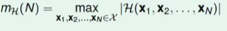

---
toc:
    depth_from: 1
    depth_to: 3
html:
    offline: false
    embed_local_images: false #嵌入base64圖片
print_background: true
export_on_save:
    html: true
---

# 為何有用
假設訓練跟測試的資料分布一樣。但是選到爛訓練 資料(偏頗)的機率?

## 有限個假說

$$
P(Bad) \leq P(Bad\ for\ h_i)\\
\leq 2M\exp(-2\epsilon^2N)
$$
>Hoeffding 不等式

## 無限個

h 發生 Bad的機 D會重疊&rarr;分類 (用 a set of input 的 ans 分類)

### Growth Function
分類數

Break point
: k is break point of H &lrarr; k point not shattered
