---
toc:
     depth_from: 1
     depth_to: 3
html:
     offline: false
     embed_local_images: false #嵌入base64圖片
print_background: true
export_on_save:
     html: true
---
# Intro
Zona pellucida
: 

caption
: 女性分泌刺激精子

:::note 
精子對側形成dorsal，$\beta$-catanin調節
:::

Proliferation
: 增生

## 胚胎發育

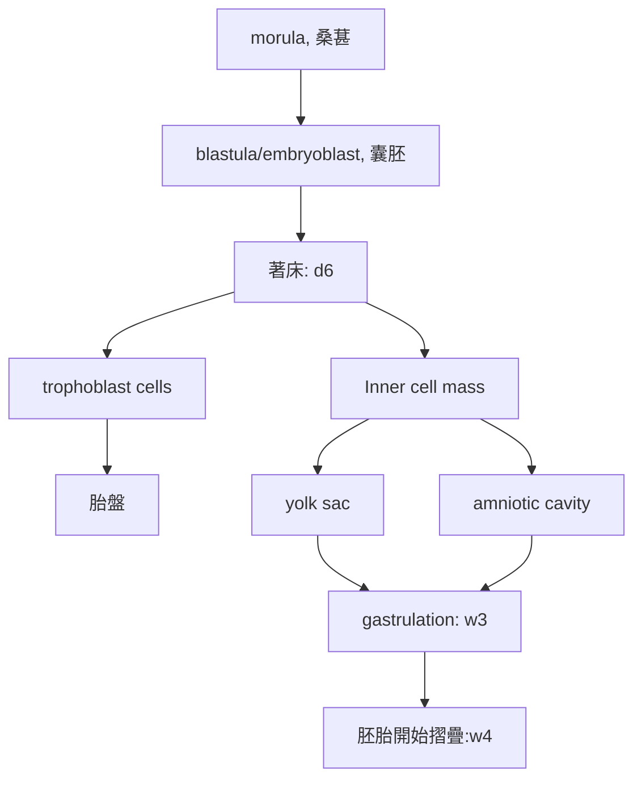
```mermaid
graph TD

m[morula, 桑葚]-->b[blastula/embryoblast, 囊胚]-->im[著床: d6]
im-->t[trophoblast cells]-->tt[胎盤]
im-->em[Inner cell mass]-->a[amniotic cavity]
em-->y[yolk sac]
y & a-->g[gastrulation: w3]-->f[胚胎開始摺疊:w4]

```

### 胚胎期(embryonic period)：w2-8

- trophoblast cells
形成胎盤
- embryoblast
  - 分化成羊膜腔(amniotic cavity)與卵黃囊(yolk sac)：

#### 原腸化(gastrulation): w3
- primitive node 折進來變脊索(notochord)
- 中胚層(mesoderm)

:::note {內外胚層交界}
口腔、肛門
:::

#### Fold: W4 

- 頭摺(head fold)、尾摺(tail fold)、側摺(lateral fold)

## 分化基因
BMPs
: bone morphogenetic proteins，腹背軸，刺激表皮，腹部表現。

Wnt
: wingless，前後軸，頭頸部發育最早

SHH
: (Sonic hedgehog) 左右分化，決定四肢以及腦脊髓正中線的形成

cadherins
: 細胞連結，分N,P,E，同性相吸
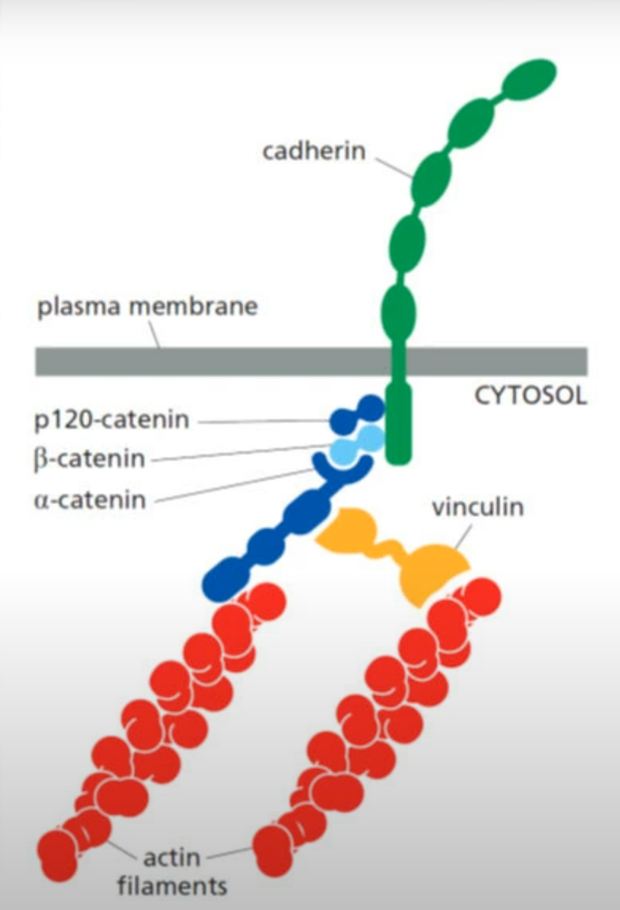

:::note {epithelial—mesenchymal transitions (EMT)}
Slug,Snail,and Twist 負責打散epithelial cell形成mesenchymal
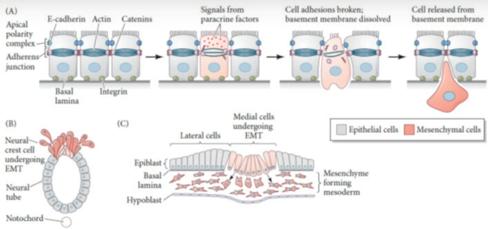
:::

## 分節

somites
: 軀幹形成肌肉、骨頭、結締組織
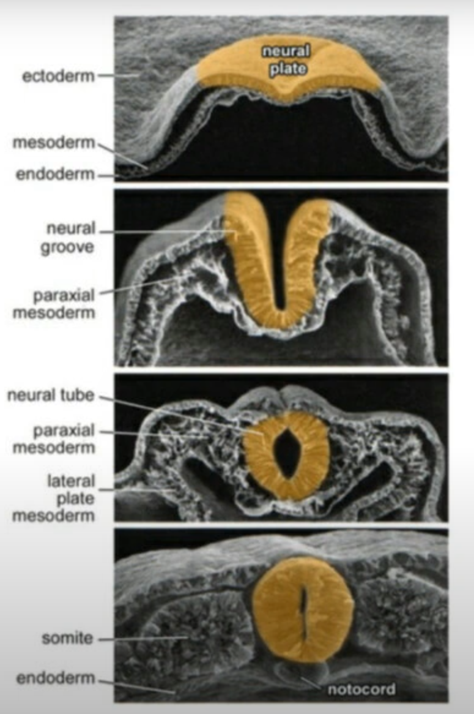

somitomeres(musculature)
: 頭頸部，八對連在一起，僅產生肌肉

neural crest cells(NCCs)
: EMT打散，分化成頭頸部雜七雜八

# 主結構

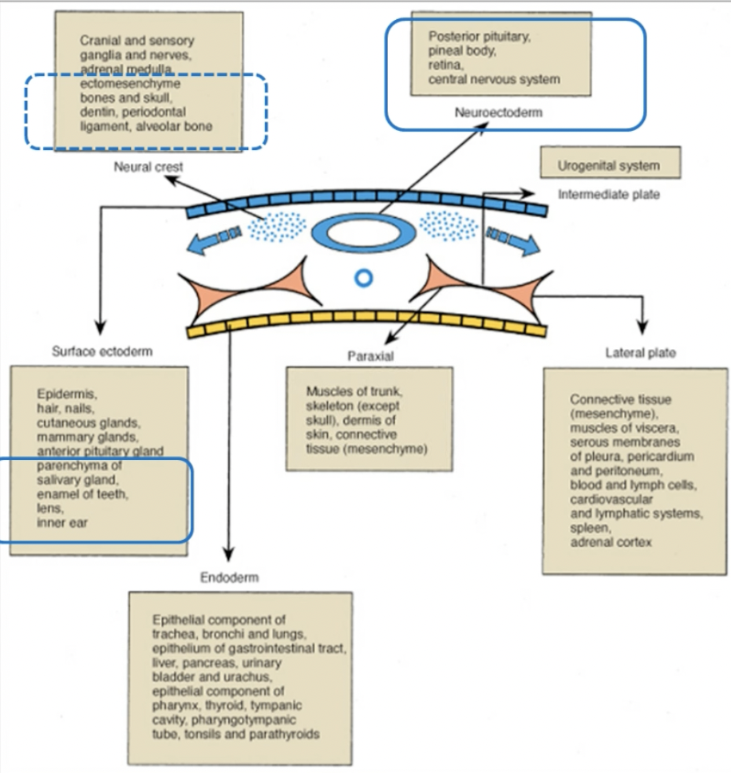

## somitomeres
- 八對連在一起，僅產生肌肉
- 1,2 形成顱顏,3-8 形成pharyngeal

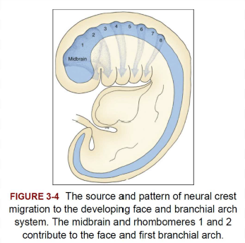

Hox
: somitomeres 3 之後表現

Dlx family
: 主導上下顎分支
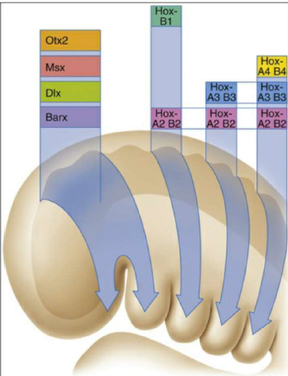
## Pharyngeal pounch /groove 

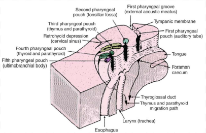
- 除了 1st Pharyngeal pouch 形成內耳道，其他都形成腺體

||Pouch|Groove|
|-|-|-|
|1|內耳道|外耳道|
|2|palatine tonsil|脖子|
|3|thymus g.|^|
|^|inf. parathyroid g.|^|
|4|sup. parathyroid g.|^|
|5|calcitonin-secreting C-cells|^|

## Pharyngeal arch

- 形成軟骨、神經、肌肉、血管

|Arch|1|2|3|
|-|-|-|-|
|cartilage|Meckel's cartilage|Reichert's cartilage|hyoid bone lower part, greater horns|
|^|^|<ul><li>hyoid bone upper part& lesser horns</li><li>stylohyoid ligament</li><li>stapes</li>|^|
|muscular from|4|6|7|
|nerve|CN V|CN VII|CN IX|
|muscular|咀嚼肌|表情肌|stylopharyngeus m.|
|備註|-|Thyroid g.|Carotid body|

|Arch|4|6|
|-|-|-|
|cartilage|epiglottic, thyroid cartilage |cricoid, arytenoid cartilage|
|muscular from|somites 1,2||
|nerve|CN X||
|muscular|CN X 支配||
|備註|主動脈弓|-|

## Fiber 

- I 
  - 三股螺旋
- III
  - 胚胎/ repair 
- IV 
  - Basal laminae
- VII 
  - epithelium 
  - 錨定
- IX 
  - Cartilage
- X 
  - Hypertrophic zone (Cartilage)
- 

# 臉 (1st Pharyngeal arch)

- 24d
  - 上下顎分開
- 24-28d 
  - Med. nasal process $\rightarrow$ 上顎門牙

- 26d
  - Frontal prominence
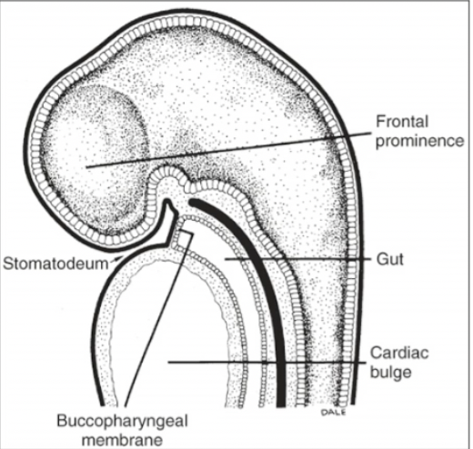
- 27d
  - Frontonasal process 
  - Odontogenic epi. 開始
- 37-38d
  - Odontogenic epi.連起來
- 4w
  - 舌頭開始發育
- 7-8w
  - 舌頭下降
  - secondary palate 開始長，前往後聚合
- 9w
  - 抬頭(upper facial complex has lifted away from the thorax)
  - 長下顎

:::note{Dlx family 是主導上下顎分支的重要基因}

:::
# 舌頭

## Secondary palate 形成
:::left
- 7-8W開始發育 ， 12W完成
- 由前向後方聚合
- 9W舌頭已經降到Secondary palate下，抬頭將提供向前空間
:::right
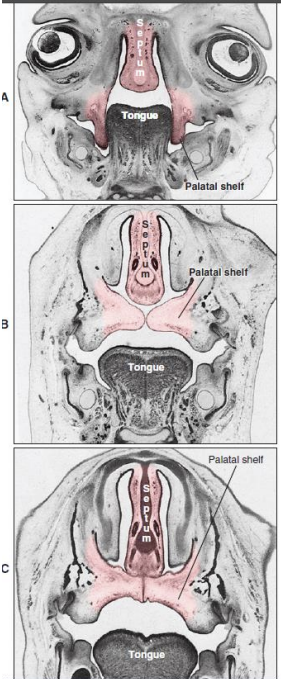

:::

## Arch
:::left
- Arch 1 $\rightarrow$ 舌尖
- Arch 2,3,4 mesenchyme $\rightarrow$ 舌根
- Arch 4 $\rightarrow$ epiglottis
- occipital somites $\rightarrow$ 舌肌肉
:::right

:::

# 骨頭
- 軟骨內骨化(Endochondral ossification)
  - 顱底
  - TMJ
- 膜內骨化(Membranous bone)
  - 顱頂Cranial vault
  - face

## Mandible

- 6W 開始形成Meckel’s cartilage
  - 向前聚合，間質組織連接
  - CN V3一起走
- 7W mental foramen 開始膜內骨化
- 10W Meckel's cartilage退化成 Incus, Malleus

||condylar|coronoid|chin|angular|
|-|-|-|-|-|
|骨化|軟骨|||膜內|
|發育 時間|12w-20w,青春期|4m-birth|一歲|-|

:::fbox

:::

### Meckel's cartilage

:::warning
Mandible 是 Meckel’s cartilage 旁邊的間質組織所形成的膜內骨化產生
:::

## Maxilla
- 都是膜內
- Infraorbital foramen 開始膜內骨化
- Sinus 內是空氣: 出生後發育

# 牙齒

- Primary epithelial band 侵入外胚層間葉組織（ectomesenchyme），形成 Dental, Vestibular lamina
- 除了Enamel來自表皮其餘都是來自ectomesenchyme
- ectomesenchyme決定牙齒形狀
:::note 
上皮細胞先引導間葉，分化後失去功能，改由間葉調控
:::

:::note {Ameloblast & Odontoblast}

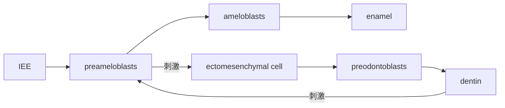
```mermaid
graph LR

IEE-->pa[preameloblasts]-->a[ameloblasts]-->e[enamel]

ec[ectomesenchymal cell]-->po[preodontoblasts]-->d[dentin]


pa-->|刺激|ec
d-->|刺激|pa
```

:::

 

## 型態基因
### Field model

### Clone model
- ectomesenchyme 引導萌發
- zone of the clone 移到哪牙胚長到哪，複製前面的牙
- 實驗:分離要長成第一大臼齒的組織還是能往後依序長出三個臼齒

## stage

### Bud stage   

- 細胞分裂
- Dental lamina 侵入
- Condensation of ectornesenchyme

## Cap stage 

- 組織分化(histodifferentiation)
- Dental organ
  - OEE (Outer enamel epi., cuboidal)
  - Stellate reticulum
  - IEE
- dental papilla
- dental sac (follicle)

:::note {Enamel knot}
牙齒開始形成位置，變成cusp

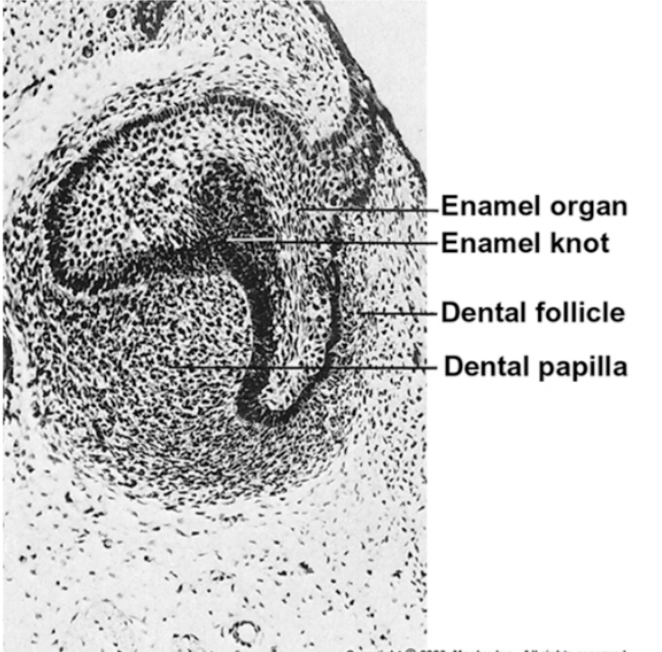

:::

:::tip {Enamel cord}
OEE,IEE傳訊?功能不明
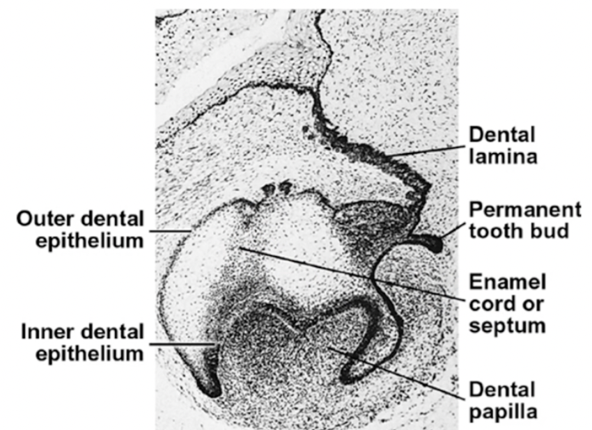
:::

## Early bell stage 
- 形態分化(Morphodifferentiation)
- Dental lamina 斷開
- Cervical loop 反折
  - 形成牙根開始位置

--- 
由上而下
- 星形網狀層(Stellate Reticulum)
- Stratum intermedium (牙根無)
  - Enamel 的形成必須
- IEE $\rightarrow$ Ameloblast
  - 單層柱狀
  - 向下生成Enamel
- Dental papilla $\rightarrow$ Odontoblast
  - 向上生成pre dentine
  - pre dentine 引導 Ameloblast 生成 Enamel
-  Dental papilla $\rightarrow$ Pulp tissue

---

:::warning
先Dentine 後 Enamel
:::

## Late/ Crown/ Advance bell stage 
- 開始鈣化
  - pre dentine $\rightarrow$ dentine 
  - stellate reticulum 崩毀
- Odontoblast, IEE 界線分出來，產生root sheath

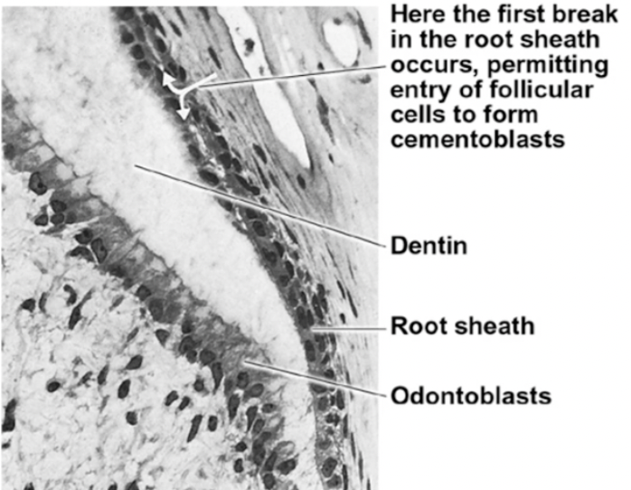
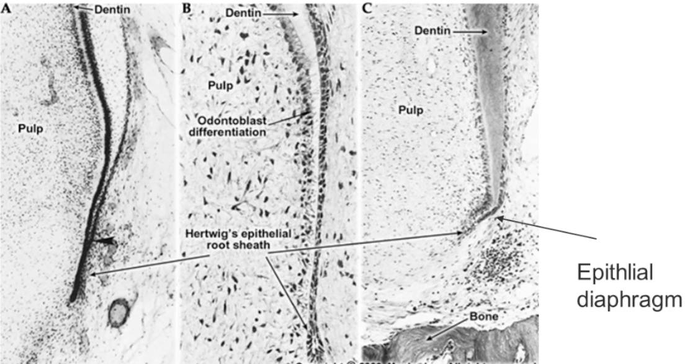
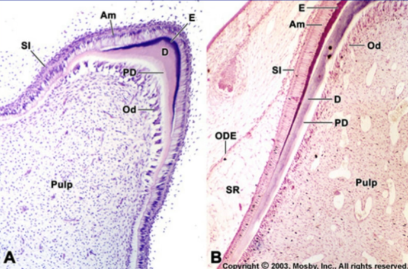

## 整理圖 

# Enamel
- 1-2mm
- 96%鈣化
- 無collagen，蛋白質替代:
  - amelogenins 在 rod sheath
  - enamelins 

- 主要礦化結晶：hygroxyapatite Ca~10~(PO~4~)~6~(OH)~2~
  120&deg; 平行四邊形，上下兩層交錯

- OH 脆弱，F^-^取代
## 結構

- inter rod 在 rod 周圍，組成相同，走向不同
- Rod sheath 卡在R, IR之間
  - 裡面主要是 amelogenin

:::fbox 

:::
## 生長
- Ameloblast 細胞間有 tight junction，Odontoblast無
- Distal portion of Tomes' process 開始長
- 生成時30%鈣化，整個長好再鈣化到96%(3年)

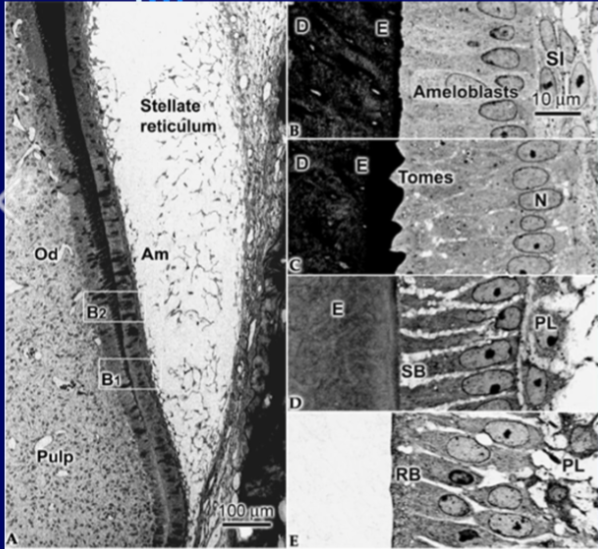

:::note {Tomes' process}

- 細胞凸起
- 如果有，enamel整齊
- 分成
  - distal portion 分泌 rod
  - proximal portion 分泌 inter rod

:::

### Presecretory stage 
- 細胞分化
#### morphogenetic phase
  - 準備進入[bell stage](#bud-stage)
  - 無 Tomes' process
  - IEE 準備形成 Ameloblast
  - 分泌amelogenin ，先刺激生成 Dentin 再生成 Enamel
  

#### Differentiation phase 
- Bell stage，已經分化

### Secretory stage 
- 緊密 Ameloblast，核偏
- Inner/Outer enamel 的 Tomes' process沒出現，無Enamel rod & interrod 

### Maturation stage
- 分泌完成，開始鈣化，約三年
- Ameloblast 亂排 
  - Ruffle-ended (80%)
    - 分泌 Ca^2+^
  - Smooth-ended (20%)
    - 細胞間疏鬆，送出polypeptide
  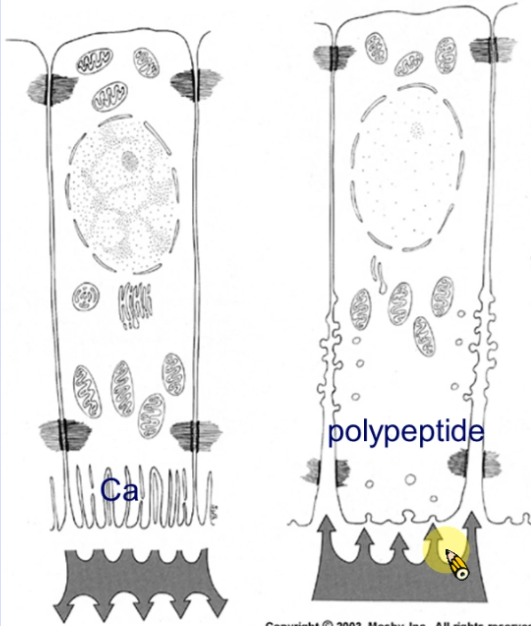
  

:::note{Amelogenesis imperfecta}
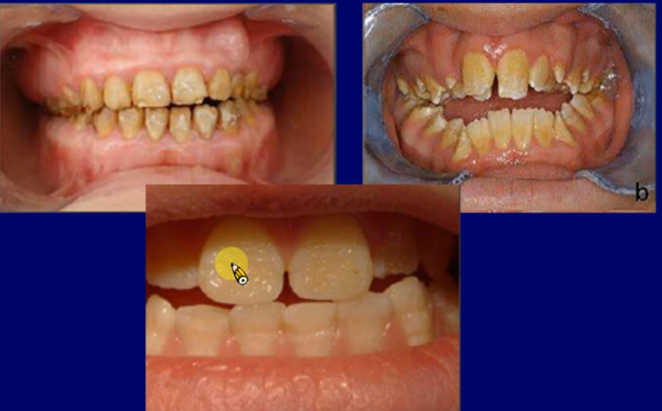
:::

## Enamel protein 
- amelogenins 
  - 主要控制厚度寬度
- Ameloblastin
  - 控制長長
- Enzymes (打斷 protein)
  - MMP20
  - KLK4

## 紋路們
###　Striae of Retvius
Rods

:::left

:::right

:::

### Perikymata
Striae of Retvius 延伸到表面

### Bands of hunter and Schreger

光下深淺斑紋

### Cross striation
垂直rod，rod生長時狀態不同導致

### Gnarled Enamel
Cusp 亂七八糟 Enamel

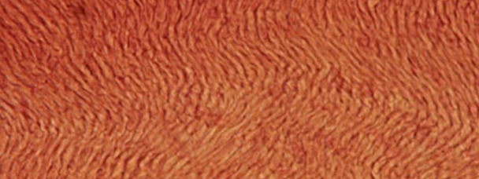

### Enamel lamellae
有機物渣渣聚集

### Enamel tufts
- rods 從 Dentin 到 Enamel 轉向造成
- 由DEJ伸出，短短的不會延長到牙齒表面。

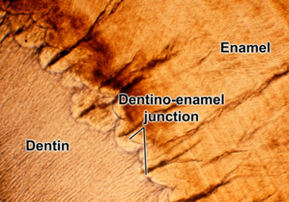

:::note{DEJ}

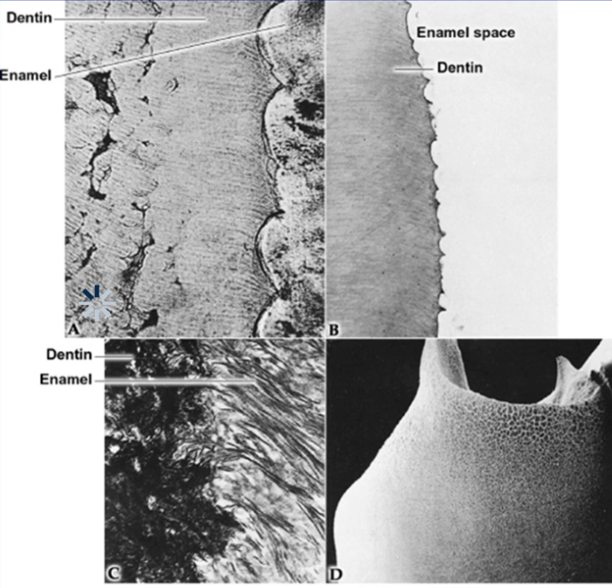
:::

### Enamel spindles
- Odontoblast 細胞突出
- 常見於cusp tip，比tufts 小很多，需放大倍看。

# Dentin 
- 70% 礦化
  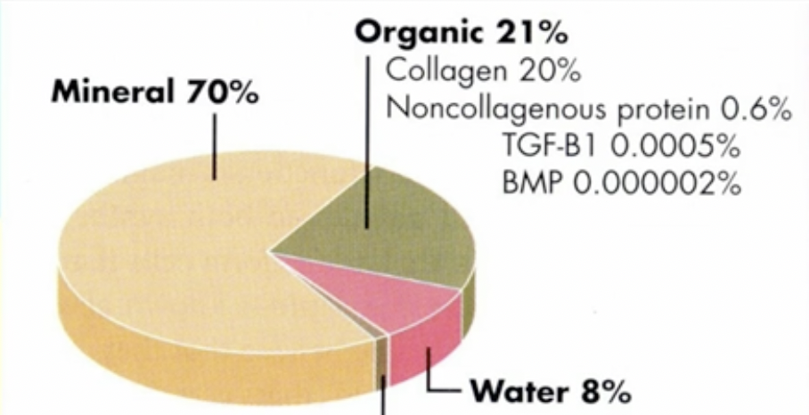
- 生長速度 4&mu;m / day
- Odontoblast (深色 dentin 淺色 predentin)
  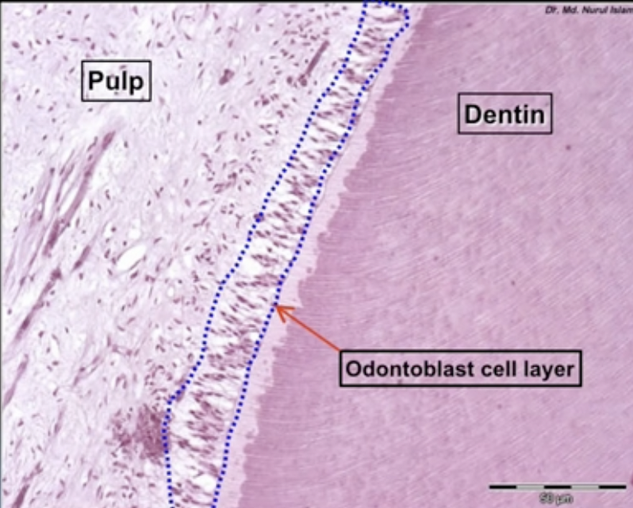

Dental tubules
: Crown 顏色深明顯，接近root 孔洞變大，密度高
:::left
Crown
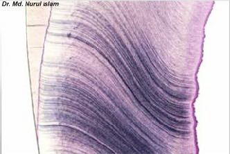
:::right
root
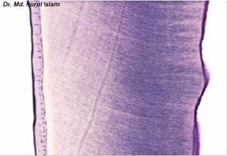
:::
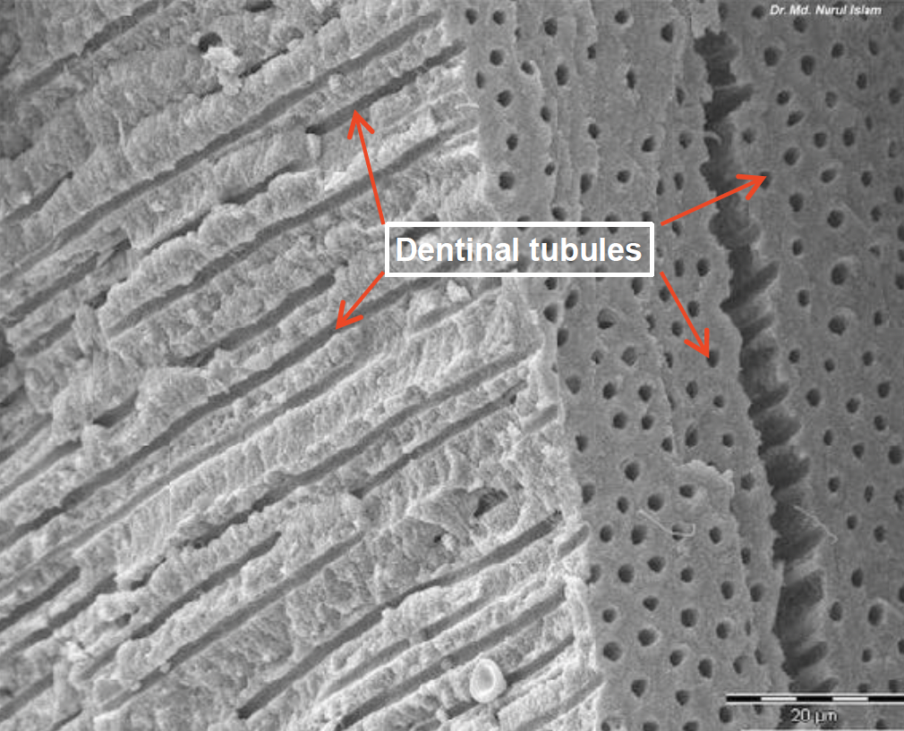

## 分類

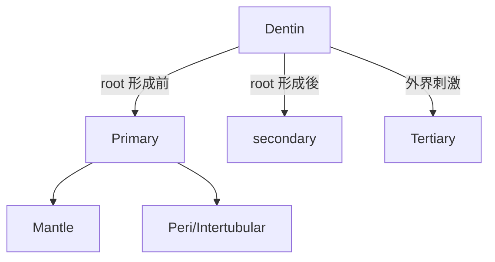
```mermaid
graph TD 
D[Dentin]-->|root 形成前|p[Primary]
p-->m[Mantle]
p-->pi[Peri/Intertubular]
D-->|root 形成後|s[secondary]
D-->|外界刺激|t[Tertiary]
```

Peritubular/ Intertubular dentin
: Dental tubules 周圍/ 中間

Primary/ secondary dentin
: 牙根形成前/ 後 dentin (牙根形成需兩年)

Mantle dentin
: 第一層 predentin 緊鄰 Enamel

Tertiary dentin
: 不規則，修復性的

:::note 
根管會越來越小 
:::

Interglobuler
: 礦化不全

Granular layer of Tomes
: DCJ的黑點們 (protein)

Incremental Growth Lines
: Enamel, Dentin 年輪們 ，==lines of Retzius, Owen==

## Dentin Sensitivity

**Fluid movements in the dentinal tubules**
>the tubular nature of dentin permits fluid movement to occur within the tubule when a stimulus is applied – a movement registered by pulpal free nerve endings close to the dentin.

# Pulp
- Cells 
  - Odontoblast, Fibroblast, white-blood cells, Undifferentiated mesenchymal cells, Macrophages and Lymphocytes.
  - ==No fat cell==
- reticular/ collagen fibres (Type I,III).
- Odontoblast
  - 產生 Secondary dentin / Tertiary dentin

## 構造們

Pulp stone 
: - True (Denticle): 有Dental tubules，跟 Dentin 分離

: - False (Concentric): 無Dental tubules

Diffuse Pulp Calcification
: 根管越來越小

## 神經
| fiber | Myelination | 位置 |閾值| 痛|
|-|-|-|-|-|
|A&delta;|&check;|PDJ|低|刺|
|C|&cross;|Pulp core|高|痛爆|

## 多根牙

# Cementum 
==Bone + PDL + Cementum + Gingiva = 牙周==

- 長到能咬合之前/後: Pre/ functional stage
- type I collagen
- type III collagen
  - repair 用的
- type XII 
  - 韌帶

## 發育 
1. Cervical loop &rarr; Hertwig's epithelial root sheath (HERS)

2. HERS 刺激 Pulp tissue 轉化成 Odontoblast &rarr; Predentin &rarr; Dentin
3. Dentin 刺激 HERS 斷裂 
4. Dental follicle 接觸 Predentin 轉化成 Cementoblasts
5. HERS
   - 殘留在PDL形成 Epithelial cell rests of Malassez (ERMS)
   - 發炎形成根尖囊腫 (radicular cyst)
   - 少數形成修補用blast

:::note {alkaline phosphatase}

- 鹼性磷酸酶
- 硬組織鈣化必須

:::

:::note {RGD motif}
- 維持 PDL 不礦化

:::

## 組織 
- Cervical: 50&mu;m，Apical: 200&mu;m
- 
### Acellular extrinsic fiber cementum(AEFC)
- Primary cementum，牙根形成就長
- 第一層 Cementoblast 應該具有 Fibroblast 特徵，去跟Dentin 黏在一起
- Cementum 大概 15-20&mu;m 開始礦化（有方向性）
- 外層 Cementoblasts 向內分泌 Matrix Protein 
- PDL fiber 伸到 Cementum 裡面
- 越裡面越低(45-60%)
- 上2/3主要固定牙齒

### Cellular intrinsic fiber cementum (CIFC)
- 牙根長一半開始長
- 長得快，礦化少
- 下1/3，apical 之間
- 含 Cementoid cell (看不太到)
  - repair 用
- fiber bundles 部分鈣化，固定牙齒 (from PDL)
- Cementoblast 不活化被Cementum 包，變成Cementocytes
  - 毛毛(canaliculi)朝內（root surface）

### Acellular afibrillar cementum (AAC)
- CEJ 附近
  - Alveolar crest在CEJ下 1.5-2mm 
- 沒固齒能力

# Bone 

- 上顎薄，下顎臼齒Buccal side 最厚

:::note{三個一樣的東西}

Cribriform plate
: 

Lamina dura 
: 

Bundle bone
: 
:::

## 結構
### Haversian system

Precursors cell 
: blast 

### Periosteum/ Endosteum 
- Periosteum 活性高
- Endosteum 有 [Osteogenic cell](#osteogenic-cell)

### Osteogenic cell
> 來自Mesenchymal cell 

- osteoprogenitors
- preosteoblasts
  - 可以 mitosis
- osteoblasts
  - 可以 mitosis
  - 不活化稱為 Bone-lining cell
  - 被分泌物包起來稱 osteocytes
- osteocytes,
- bone-lining cells

### Osteoid 
- 未鈣化

### Osteoclast 
- 有 tartrate-resistant acid phosphatase
- 住在 Howship's lacunae 
- Sealing zone 負責密封
:::fbox 
 
:::

### Bone sialoprotein/ Osteopontin 
- 在鈣化前緣
- 鈣化結構作為骨架
- [Wnt](#分化基因) 相關

## 調控 

- VitD, PTH(副甲狀腺素) 低濃度促進骨生成，反之促進骨吸收
- Calcitonin(降鈣素), Estrogen(雌激素) 抑制骨吸收
- Glucocorticoid(醣皮質素) 大部分抑制生成
- FGF23 跟磷消耗相關
- Leptin 抑制骨生成
  - 脂肪細胞分泌
- Sclerostine(SOST) 抑制骨生成
  - osteocytes 分泌
  - PTH 抑制 
  - Calcitonin 促進
- [Wnt](#分化基因) 促進骨生成，抑制脂肪
  - 

## 基因 
### Runx2 
- 決定往硬骨or 軟骨

### RANK/ RANKL 
- Osteoclast 生成
- Osteoprotogerin 結合 RANK 抑制

## 生長 

### 軟骨內骨化
- 有方向性，Longitudinal septa 被留下來

### 膜內骨化
- Woven bone 
  - 未成熟
  - Noncollagen portein 多 

### Remodeling 
- 先 clast ，再 blast 回來
  - 有 Cement/ reversal line (反轉線)
  - Collagen 少， Calcium-to-phosphorus 高
- Blast 填滿變成 Filling cone

> Rest line v.s. reversal line

- osteocytes 決定
- 成人 
  - Cortical bone 5% per year
  - Trabecular bone 15% per year

# Periodontal Ligament(PDL)

- 0.15mm-0.38mm 中1/3最窄
- 用進廢退
- 年紀越大越窄 

## 結構
- Attach gingiva 貼在骨頭上不能動

frenum insertion
: 繫帶過長

## Cells 

- Fibroblast：
  - principal cells
  - 發炎破壞周圍組織
- Epithelial Cells
  - HERS/ ERMs
- Undifferentiated Mesenchymal Cells
- Stem Cells
- Bone and Cementum Cells

## Fiber 
### Collagen fiber
- Collagen fiber III 
  - Repair self, cementum, bone
- Collagen fiber I
  - Sharpey's fiber
  - 往內往外，僅 AEFC 完全鈣化
- Collagen fiber XII
- 5 Group, Oblique 多

- 另外 5 Group
  

### Elastic fiber 
- Oxytalan fibers
  - vertically from the cementum surface
  - 調節血流，Cervical third 多

## Artery 
- 下顎、後牙、Cervical third 多

## Nerve 
- 副交感相關

# Shedding and Eruption of tooth

Natal tooth
: 出生就有牙

Crowing 
: 擁擠，Mandibula 長不夠

- Dental follicle 引導萌發，牙胚卻不影響

- 先 Lingual 再往牙根之間

## 萌發順序 
- crown completed $\mathop{\longrightarrow}\limits^{3year}$ time of emergence $\mathop{\longrightarrow}\limits^{3year}$ root completed

## Gubernacular cord

Dental lamina 殘餘

# Oral Mucosa

Fordyce's granules
:  - 皮脂腺
  - 在lamina propria

- 神經、血管、腺體都在Submucosa

Waldeyer's ring
: 淋巴（上皮往內凹）

Epithelial Proliferation 
: - 唯一能分裂
: - basal lamina 上2-3層
: - 52-75天一輪、牙齦52-75天

## 分類
### Masticatory mucosa 
- 20%
- 上皮角化
- 缺Submucosa

### Lining mucosa 
- 65%
- 舌背、牙齦、硬顎以外

### Specialized mucosa 
- 15%
- 舌背味蕾

## 分層 

- A: Orthokeratinization in human gingiva
- B: Parakeratinization in human gingiva
  - 角化不全，正常
- C: Nonkeratinization in primate buccal epithelium

### Basal cell 
- 立方形
- 分化最少 
- Lamina lucida，透明層
- Lamina densa，緻密層
- Lamina fibroreticularis，網狀纖維板或Sublamina densa，副緻密層

### Prickle cell
- Desmosome 
- 最多層

:::note {包膜顆粒}

糖脂質
:::

### Granular layer
- 2-3層
- 大量角化透明顆粒

:::note 

:::

### Keratinized layer 

:::note {cytokeratin, CK}
- 不同的上皮細胞有不同種類的CK，就算同種細胞，不同的層次表現的CK也不盡相同
:::

### Clear cell 

## 型態
### 嘴唇
- 上皮內側後
- Vermillon zone(唇紅區), Intermediate zone 有角質化，無附屬構造

#### Vermillon zone
- 真皮乳突，微血管環

### Mucogingival junction 
- 角化&rarr;非角化
- Lamina propria 從膠原纖維（連骨頭），到 Elastic fiber

### Dentogingival junction 

- Free gingiva
- Attached/gingiva
- Junctional epithelium
  - 往牙根變薄
- Interdental papilla

- ==gingiva sulcus== 
  - 0.5~0.3mm
- gingiva crevicular fluid 
  - 還補體、抗體、免疫球
 

| |Junctional|gingiva|
|-|-|-|
|RER/高基|高|低|
|張力絲|低|高|
|Desmosome|低|高|

:::fbox

:::

### Epithelial Attachment
- 連Basal lamina 與牙齒
- 缺 ==collagen IV==, anchoring fiber
- 利用 Hemidesmosome

### Free gingiva groove (FGG)

### gingiva stippling 
- 牙齦點班
- 抗磨耗
- 男性深

### Col 
後牙 papilla 之間，無角化 

### Hard palate 
- Palatine raphe 
  - 無 缺Submucosa

### Soft palate 
- 非角化 
- Submucosa 多黏液腺

### Tongue 

#### Lingual Papilla
- Filiform
  - 缺B~12~或貧血患者缺乏

- Fungiform Papilla 
  - Filiform 之間
  
- Foliate papilla
  - 舌後方測緣
  - 黑箭頭是味蕾
  
- Circumvallate papilla
  - 50% of all taste buds
  - 角化上皮覆蓋
  - 味蕾在兩側 
  - 深溝
  - Von Ebner's glands
  

:::note{Von Ebner's glands}
純漿液腺

:::

#### Taste bud

- Type I (60%)：dark cell
  - 最常見
  - 終止於微絨毛 (microvilli)，有約30 ~ 40個纖細的突起 (processes) 
  - 會伸出味蕾孔外細胞質內包含很多囊泡

- Type II (30%)：light cell
  - 看起來比較亮，細胞也比較大
  - 細胞較短，微絨毛較少

- Type III (7%)：intermediate cell
  - 型態近似Type II
  - 無微絨毛，有比較鈍且圓的頂端
  - 終止於味蕾孔外
- Type IV (3%)：basal cell
  - 為基底細胞，位在味蕾基底部

>軟顎、會厭都有味蕾

>[舌](../二上/口解.html#舌頭)

### foramen cecum
- 甲狀腺在舌頭上發育留下來的痕跡，
  - 甲狀腺後沿著甲狀舌管 (thyroglossal duct)到現在的位置
- 若未消失會與甲狀舌管連在一起，形成甲狀舌管囊腫 (thyroglossal duct cyst)

### Lingual tonsil
- 舌後1/3的淋巴組織，許多舌濾泡組成
- 每個濾泡含一個或一個以上的淋巴小結，可含生發中心
- 與腭扁桃體和咽扁桃體一起構成口咽部的淋巴環

## Aging 
- 因為唾液腺退化，被脂肪組織或纖維組織取代，而無法分泌唾液，口腔黏膜較平滑、乾燥
- 上皮萎縮且變得更脆弱，因此對特定物質變得更為敏感、易受傷
- 上皮變得更薄，上皮和結締組織的接觸面變平
- 絲狀乳突數量減少，葉狀乳突可增生，此時飲食中如缺乏維生素B等營養成分，則上述變化更明顯
- 固有層中細胞會減少而膠原蛋白和纖維增加
- 主要的唾液腺都會大量萎縮，被脂肪、纖維所取代。黏膜各處的小唾液腺發生明顯萎縮，被增生的纖維組織取代。所以在老年患者中，特別是停經後的女性往往出現口乾、黏膜燒灼感及味覺異常等
- 嘴唇和頰側皮脂腺會增加
- 神經末梢的密度降低，味蕾數量減少，黏膜感覺功能下降
- 老人容易口乾、敏感，但除了口腔黏膜變薄及唾液分泌減少，並無特別病變
- 口腔靜脈曲張 (varicosities) (下圖)：主要發生在老年人舌腹

## 比較 
### 更新週期

# gg
