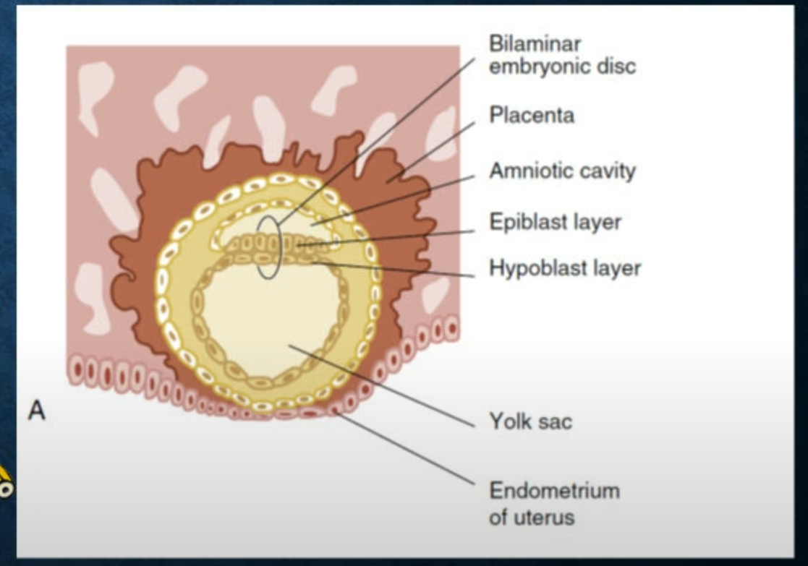

---
toc:
     depth_from: 1
     depth_to: 3
html:
     offline: false
     embed_local_images: false #嵌入base64圖片
print_background: true
export_on_save:
     html: true
---
# 2023.02.20
caption
: 女性分泌刺激精子

:::note 
精子對側形成dorsal，$\beta$-catanin調節
:::

Proliferation
: 增生

:::note{blastula day 8}
- trophoblast cells
形成胎盤
- embryoblast
 分化成細胞

:::

BMPs
: bone morphogenetic proteins，腹背軸，刺激表皮，腹部表現。

Wnt
: wingless，前後軸

:::note {內外胚層交界}
口腔、肛門
:::

cadherins
: 細胞連結，分N,P,E，同性相吸

:::note {epithelial—mesenchymal transitions (EMT)}
Slug,Snail,and Twist 負責打散epithelial cell形成mesenchymal

:::

somites
: 軀幹形成肌肉、骨頭、結締組織

somitomeres(musculature)
: 頭頸部，僅產生肌肉

neural crest cells(NCCs)
: EMT打散，分化成頭頸部雜七雜八

