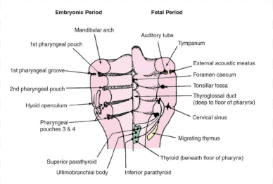

---
toc:
     depth_from: 1
     depth_to: 3
html:
     offline: false
     embed_local_images: false #嵌入base64圖片
print_background: true
export_on_save:
     html: true
---
# Intro
caption
: 女性分泌刺激精子

:::note 
精子對側形成dorsal，$\beta$-catanin調節
:::

Proliferation
: 增生

:::note{blastula day 8}
- trophoblast cells
形成胎盤
- embryoblast
 分化成細胞

:::

## 分化基因
BMPs
: bone morphogenetic proteins，腹背軸，刺激表皮，腹部表現。

Wnt
: wingless，前後軸，頭頸部發育最早

:::note {內外胚層交界}
口腔、肛門
:::

SHH
: (Sonic hedgehog) 左右分化，決定四肢以及腦脊髓正中線的形成

cadherins
: 細胞連結，分N,P,E，同性相吸

:::note {epithelial—mesenchymal transitions (EMT)}
Slug,Snail,and Twist 負責打散epithelial cell形成mesenchymal

:::

## 分節

somites
: 軀幹形成肌肉、骨頭、結締組織

somitomeres(musculature)
: 頭頸部，八對連在一起，僅產生肌肉

neural crest cells(NCCs)
: EMT打散，分化成頭頸部雜七雜八

# 主結構

## somitomeres
- 八對連在一起，僅產生肌肉
- 1,2 形成顱顏,3-8 形成pharyngeal

Hox
: somitomeres 3 之後表現

Dlx family
: 主導上下顎分支

## Pharyngeal pounch /groove 

- 除了 1st Pharyngeal pouch 形成內耳道，其他都形成腺體

||Pouch|Groove|
|-|-|-|
|1|內耳道|外耳道|
|2|palatine tonsil|脖子|
|3|thymus g.|^|
|^|inf. parathyroid g.|^|
|4|sup. parathyroid g.|^|
|5|calcitonin-secreting C-cells|^|

## Pharyngeal arch

- 形成軟骨、神經、肌肉、血管

|Arch|1|2|3|4-6|
|-|-|-|-|-|
|cartilage|stylohyoid lig.|hyoid bone lower part, greater horns||咽喉軟骨|
|^|hyoid bone upper part, lesser horns|^|^|^|
|muscular from|4|6|7|somites 1,2|
|nerve|CN V|CN VII|CN IX|CN X|
|muscular|咀嚼肌|表情肌|stylopharyngeus m.|CN X 支配
|備註|-|-|Carotid body|主動脈弓|

# 臉 (1st Pharyngeal arch)

- 24d
  - 上下顎分開
- 24-28d 
  - Med. nasal process $\rightarrow$ 上顎門牙

- 26d
  - Frontal prominence

- 27d
  - Frontonasal process 
  - Odontogenic epi. 開始
- 37-38d
  - Odontogenic epi.連起來
- 7-8w
  - 舌頭下降
  - secondary palate 開始長，前往後聚合
- 9w
  - 抬頭(upper facial complex has lifted away from the thorax)
  - 長下顎

# 舌頭

- Arch 1 $\rightarrow$ 舌尖
- Arch 2,3,4 mesenchyme $\rightarrow$ 舌根
- Arch 4 $\rightarrow$ epiglottis
- occipital somites $\rightarrow$ 舌肌肉

# 骨頭
- 顱底: 軟骨內骨化(Endochondral ossification)
- Cranial vault, face: 膜內骨化(Membranous bone)

## Mandible

- Arch 1 軟內骨化

||condylar|coronoid|chin|angular|
|-|-|-|-|-|
|骨化|軟骨|||膜內|
|發育 時間|12w-20w,青春期|4m-birth|一歲|-|

### Meckel's cartilage
- 停在 mental foramen 開始膜內骨化
- 退化成 Incus, Malleus

## Maxilla
- 都是膜內
- Infraorbital foramen 開始膜內骨化
- Sinus 內是空氣: 出生後發育

# 牙齒

Primary epithelial band 侵入 ectomesenchyme(負責調控)，形成 Dental, Vestibular lamina

 

:::note 
上皮細胞先引導間葉，分化後失去功能，改由間葉調控
:::
## 型態基因

## stage

### Bud stage   

- 細胞分裂
- Dental lamina 侵入
- Condensation of ectornesenchyme

## Cap stage 

- 開始分化
- Dental organ
  - OEE (Outer enamel epi., cuboidal)
  - Stellate reticulum
  - IEE
- dental papilla
- dental sac (follicle)

:::note {Enamel knot}
牙齒開始形成位置，變成cusp

:::

:::tip {Enamel cord}
OEE,IEE傳訊?功能不明

:::

## Early bell stage 

- Dental lamina 斷開
- IEE $\rightarrow$ Ameloblast
  - 單層柱狀
  - 生成Stratum intermedium (牙根無)
  - 向下生成Enamel
- Cervical loop 反折
- Dental papilla $\rightarrow$ Odontoblast
  - 向上生成pre dentine 

Cervical loop
: 形成牙根

:::warning
先Dentine 後 Enamel
:::

## Late/ Crown/ Advance bell stage 
- 開始鈣化
  - pre dentine $\rightarrow$ dentine 
  - stellate reticulum 崩毀
- Odontoblast, IEE 界線分出來，產生root sheath

# Enamel
