---
toc:
    depth_from: 1
    depth_to: 3
html:
    offline: false
    embed_local_images: false #嵌入base64圖片
print_background: true
export_on_save:
    html: true
---

## Bud stage 

- 細胞分裂
- Dental lamina 侵入
- Condensation of ectornesenchyme

## Cap stage 

- 開始分化
- Dental organ
  - OEE (Outer enamel epi.)
  - IEE
  - Stellate reticulum
- dental papilla

## Early bell stage 

- Dental lamina 斷開
- Ameloblast
  - 向下生成牙釉質
- Cervical loop 反折
- Odontoblast (中胚層)
  - 向上生成pre dentine 

:::warning
先Dentine 後 Enamel
:::

## Late/ Crown/ Advance bell stage 
- 開始鈣化
  - pre dentine $\rightarrow$ dentine 
  - stellate reticulum 崩毀

# 110 
:::left

:::right
Oral mucosa

:::

:::left

:::right
labial mucosa

:::

:::left

:::right
vermilion zone

:::

:::left

:::right
Dermal papillae

:::

:::left

:::right
Sublingual gland

:::

:::left

:::right
Parotid gland

:::
:::left

:::right
Submandibular gland
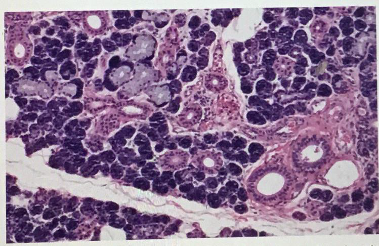
:::

:::left

:::right
Serous demilune

:::

:::left

:::right
myoepithelial cell

:::

:::left

:::right
intercalated duct

:::

:::left

:::right
striated duct

:::

:::left

:::right
Excretory duct

:::

:::left
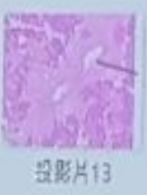
:::right
pseudostratified columnar epithelium

:::

:::left
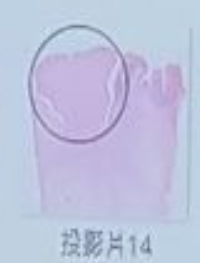
:::right
Circumvallate papillae
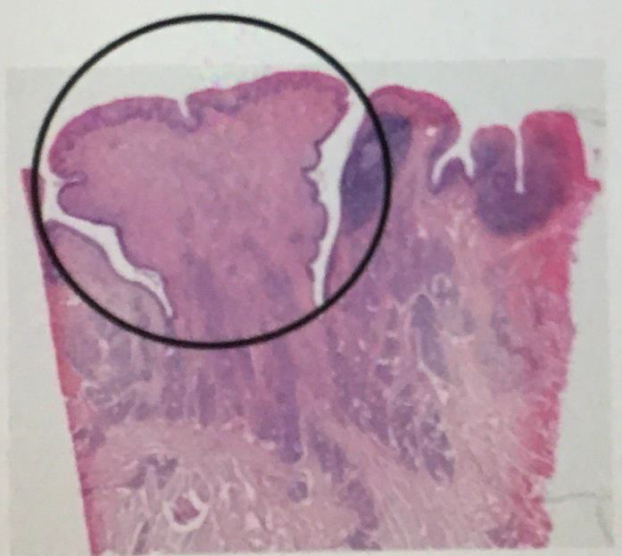
:::

:::left
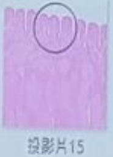
:::right
Foliate papillae
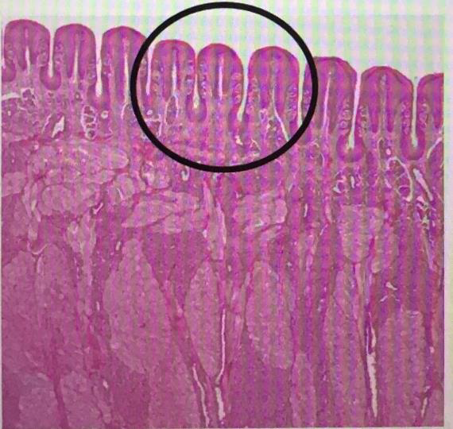
:::

:::left
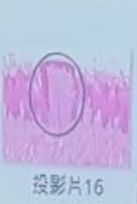
:::right
Fungiform papillae
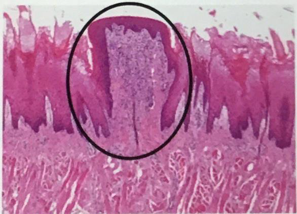
:::

:::left
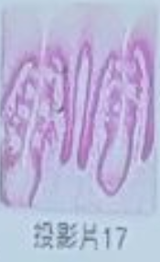
:::right
taste bud
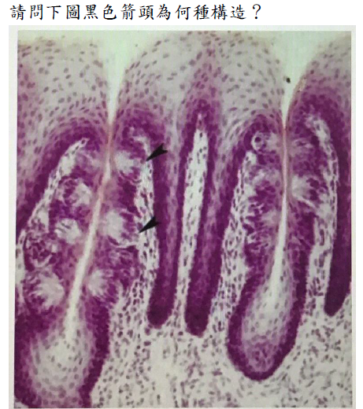
:::

:::left
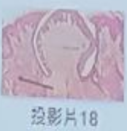
:::right
Von ebner's gland
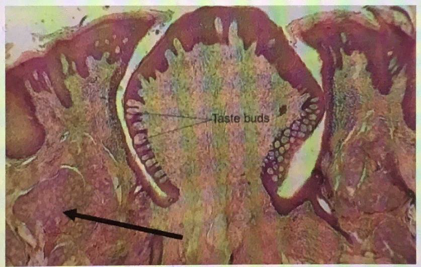
:::

:::left
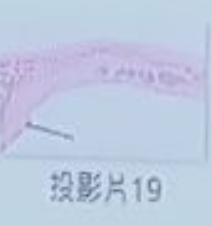
:::right
Hard palate rugae
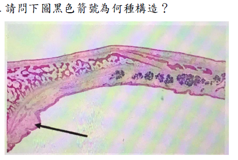
:::

:::left
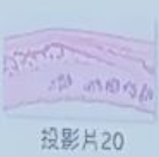
:::right
Hard palate

:::

:::left
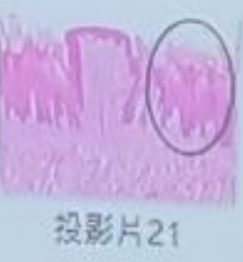
:::right
Filiform papillae
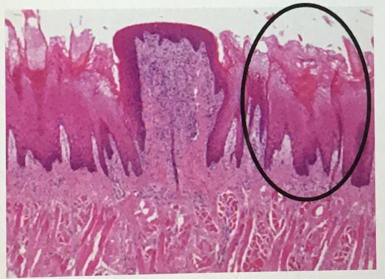
:::

:::left
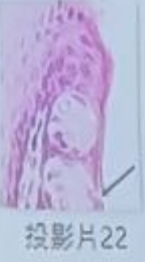
:::right
taste pore
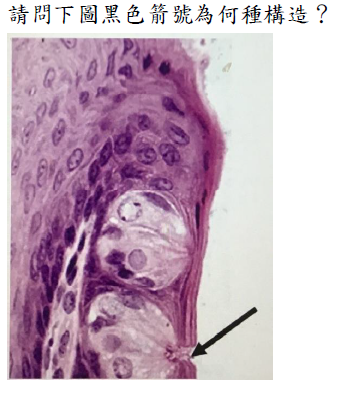
:::

:::left
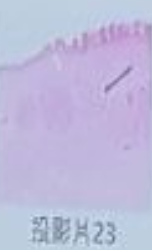
:::right
Mucous gland 
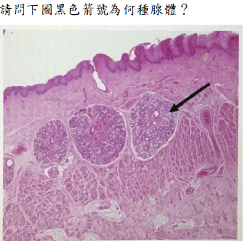
:::

:::left
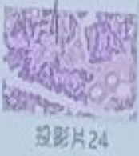
:::right
Serous gland
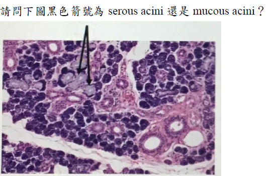
:::

:::left
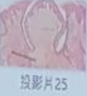
:::right
Serous gland
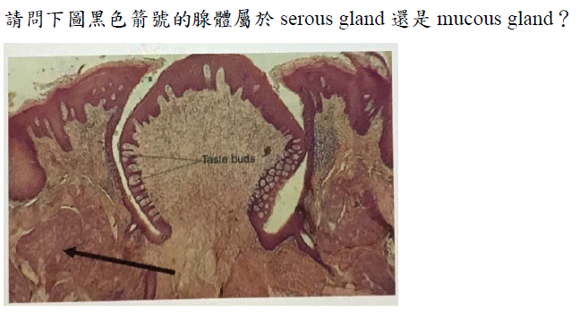
:::
