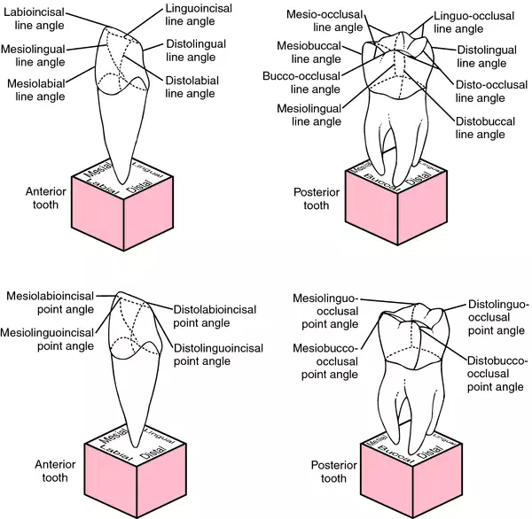
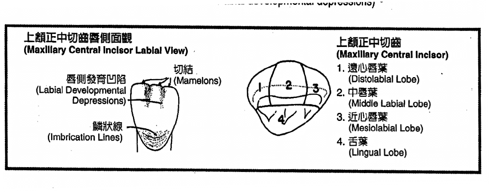
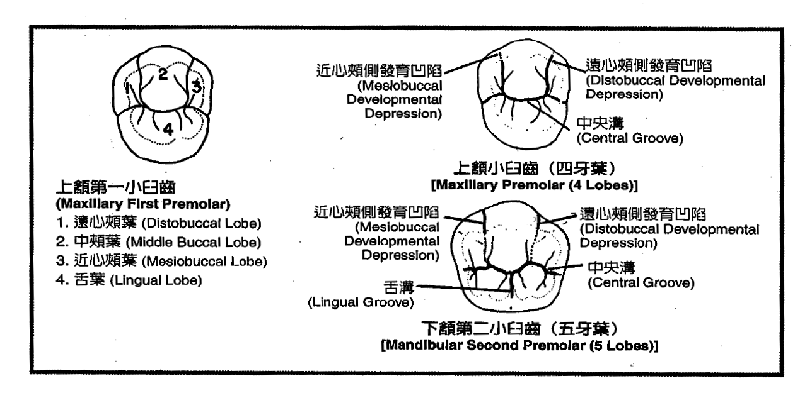
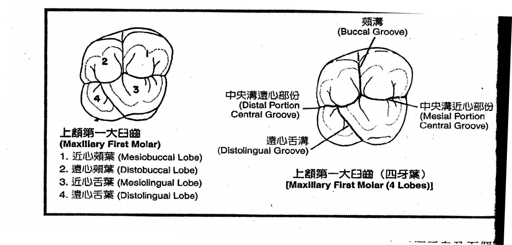
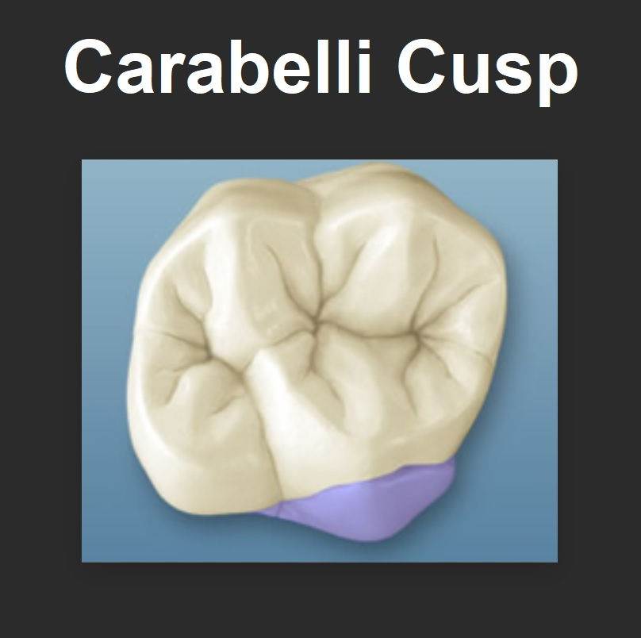

---
toc:
  depth_from: 1
  depth_to: 3
html:
    offline: false
    embed_local_images: false #嵌入base64圖片
print_background: true
export_on_save:
  html: true
---
# 原則
- Upper大
- Mesial 短
- Cervical line 越後面越平
- Contact point 
  - buccal側往 Cervical 斜
  - Mesial 測靠外
- Mesial cusp 大
- Mesial Marginal ridge 直
- Mesial Cervical line 較彎
- Distal Root depression 深（後牙擠壓）

- 通常
lingual embrasure space會比facial embrasure space大，除了maxillary 1st molar和2nd
molar之間(F>L)、lower central incisors之間(F=L)

# 整理
@web https://pocketdentistry.com/2-tooth-nomenclature/

# Tooth development from lobes
## 前牙

上顎正門牙 > 上顎側門牙 > 下顎側門牙 > 下顎正門牙(最小Crown)

## Premolars

### Maxillary
- Marginal ridge groove：連接到咬合面邊緣
- Transverse ridge 明顯
- distal slope比mesial slope短
#### first
  - Junction 左右在下1/3 
  - Mesial 測中央溝明顯

#### Second
  - 最對稱
  - 中央呈 "北"

### Mandibular
#### first
  - Transverse ridge 明顯
  - Contact point 沒有往 Cervical
  - groove, notch 在 Mesial

#### Second
- groove, notch 在 Distal

## Molar

:::warning

1. 上顎一大臼→5(if carabelli cusp)
   
2. 下顎一大臼→5(have a total of 5 cusps, including distal cusp)
3. 下顎二小臼→5(when there are two lingual cusps，舌側遠心 cusps 小)
:::

Discussion of the force decay of invisible aligners immersed in saliva and applied force within seven days
