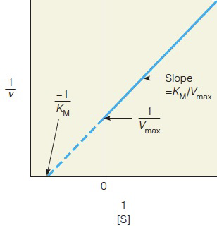

---
toc:
    depth_from: 1
    depth_to: 3
html:
    offline: false
    embed_local_images: false #嵌入base64圖片
print_background: true
export_on_save:
    html: true
---
# Nucleic Acids
- 最大吸收光為260nm (蛋白質280nm)

## 名詞們

Nucleic Acids
: 

Nucleosides
: 五碳＋含氮鹼基

Hairpin structure
: 單股折疊配對

Hypochromicity(減色效應)
: 雙股DNA對波長260nm的光吸收量小於變性的DNA，可
以用來檢測DNA是否變性

telomeres
: 端粒

ddNTPs
: C2,C3去氧，聚合中止於此

## tautomerize

## 聚合

## A, B form

- DNA-DNA: B form 
  - 窄長
  - 都是 anti form
- Other: A form
  - 寬胖
  - 都是 anti form

- Z form
  - 左旋
  - 出現在C-G對多的地方
  - 在基因調控上扮演重要角色
  - C、T 是anti form，A、G是syn form

# 胺基酸

## 名詞們
Peptide bond
: 肽鍵

pI 
: 等電點

Denaturation
: 變性，不涉及蛋白質一級結構的變化，次級鍵被嚴重破壞。
## 酸性胺基酸

- 可以變-2
- pH7 負電

:::tip{阿斯巴甜}

:::

:::tip{味精}

:::
## 鹼性

- 可變+2
- pH7 正電，除了Histidine 中性環境下未完全解離，可做為生理緩衝溶液

## 芳香

- $\pi$電子吸280nm，特別是Tyr

## 不代電極性

## 不代電極性

# Protein 
- 序列 N to C

:::left
- preproprotein
  - 去內質網

:::right
- proprotein
  - zymogen
  - 藍色要剪才有活性

:::

:::note {分子量}
$$
110 \times 胺基酸長度
$$
:::

## 內切酶
|內切酶|位置|
|-|-|
|Trypsin | Lys, Arg  $\rm(C)$|
|Chymotrypsin| Phe, Try, Tr|
|CNBr|Met|

## 結構
- Assembled subunits 的每個polypeptide chain 之間非共價鍵。
- $C_{\alpha}$ 兩邊能旋轉，$\alpha$的$\theta,\psi$ 同號

Chaperones
: 加速一級結構摺疊

### &alpha;-Helix
- 3.6胺基酸一圈，長度 $1.5\times$ 胺基酸數
- 沒有 Pro

 
### $\beta$-sheet

:::note {Circular dichroism}
旋光看$\frac{\alpha}{\beta}$
:::

:::note{X-ray diffraction crystallography}
決定三級結構
:::

## 一些蛋白質

:::note {holoprotein vs apoprotein}
  
:::

### Keratin
- Cys 雙硫
- 都是 $\alpha$

coiled coil
: $\alpha$絞在一起

### Collagen
- Lys, Pro 接 OH再接 Gal, Glc
- 脊椎動物獨有
- Tropocollagen

### Hemoglobin
Hemoglobin 是 Allosteric Protein(結合後會催化其他結合)

:::note {2,3-BPG}
擠回T-form，降低O_2_結合力

:::

:::note {胎兒 }

:::

### 抗體
:::tip 
Fc增加穩定
:::

### Actin/ Myosin

# 醣

- L-form C5的OH在左邊，D-form C5的OH在右邊
- 成環D在下，C1的OH在下面為&alpha; 

Aldonic acid
: C1氧化，醣酸

Uronic acids (Glucuronic acid) 
: C6氧化，解毒用
 

Alditols
: C1還原

amylose and amylopectin
: 無/有分支多醣

## 多醣們
### 肝醣 glycogen
8-12個&alpha;(1 &rarr; 4)出一個&alpha;(1 &rarr; 6)

### 纖維素 cellulose

&beta;(1 &rarr; 4)

### 幾丁質 chitin
&beta;(1 &rarr; 4)

### 黏多醣 mucopolysaccharides
- 酸性多醣

:::note {Proteoglycans}
黏多醣+蛋白質

:::

Heparin
: 阻止血栓

### 肽聚糖 Peptidoglycan
- &beta; (1 &rarr; 4)
- N-Acetyglucosamine (NAG), N-Acetylmuramic (NAG) 交錯形成鏈
- 鏈之間氨基酸連接
- ==Lysozyme== 切斷醣鏈

:::note{Gram-positive/ negative/}
- 陰性只有一層多糖

:::

:::note {Lectins}
為蛋白或醣蛋白，可辨認糖基，與之結合
:::

 
# Enzymes
Kinase
: 激酶，磷酸化

Phosphatase
: 磷酸酶，去磷酸化
## 模型
- key and lock model
- induced-fit model
- conformation selection model

:::left

:::right

:::

## 酵素動力學 (Michaelis-Menten kinetics)
$$
E+S\mathop{\rightleftarrows}\limits_{k_2}^{k_1} ES \mathop{\rightarrow}\limits^{k_3} E+P
$$

$$
\begin{aligned}
  (k_2+k_3)[ES]&=k_1[E][S]\\
  {\rm 定義}\ K_m&=\frac{k_2+k_3}{k_1}\\
  [E_t](所有E)全變成 ES&\Rightarrow\\
  V_{max}&=k_3[E_t]\\
\end{aligned}\\
$$

$$
\begin{aligned}
  {\rm 反應初速}\ V_0 &= k_3[ES]\\
  &=k_3K_m^{-1}[E][S]\\
  &=K_m^{-1}(k_3[E_t]-k_3[ES])[S]\\
  &=K_m^{-1}[S](V_{max}-V_0)\\
\end{aligned}
$$

使用 Pre-steady state (還沒飽和)
$$
V_0=\frac{V_{max}[S]}{K_m+[S]}
$$

$$
V^{-1}=V_{max}^{-1}K_m[S]^{-1}+V_{max}^{-1}
$$

:::note {k~cat~}
一個酵素分子在一定時間內可將受質轉變為產物的受質數量 即 k~3~ 
:::

:::note {K~m~}
酵素與受質間親和力的指標，Km越大親和力越小
:::

## 評估催化能力

$$
\frac{k_{cat}}{K_m}
$$
> 反比雙倒數圖的斜率
## 抑制劑

### 競爭

:::left

:::right

:::

### 非競爭

## 編號

**EC ?.?.?.?**
1. Oxidoreductases 
   - 催化氧還
2. Transferases
   - 移動官能基
1. Hydrolases
   - 水解
2. Lyases
   - catalyze removal of a group from or addition of a group to a double bond, or other cleavages involving electron rearrangement.
3. Isomerases
   - 異構
4. Ligases 
   - 連接
