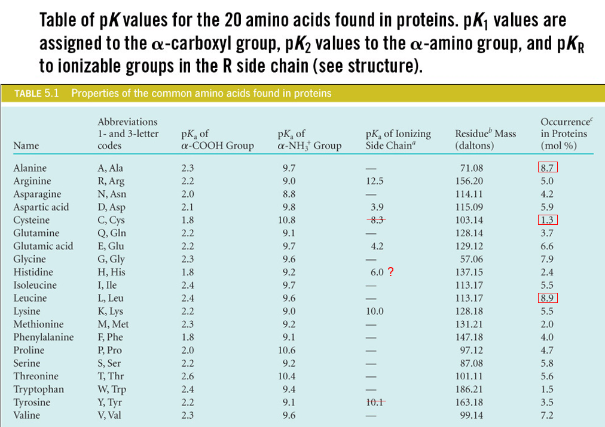
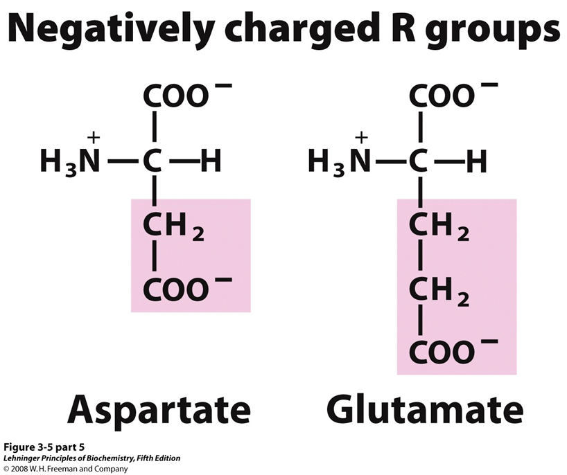
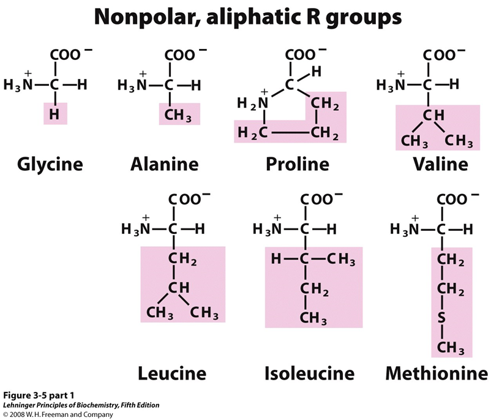

---
toc:
    depth_from: 1
    depth_to: 3
html:
    offline: false
    embed_local_images: false #嵌入base64圖片
print_background: true
export_on_save:
    html: true
---
# Nucleic Acids

# 胺基酸

Peptide bond
: 肽鍵
## 酸性胺基酸

- 可以變-2
- pH7 負電

:::tip{阿斯巴甜}

:::

:::tip{味精}

:::
## 鹼性

- 可變+2
- pH7 正電，除了Histidine 中性環境下未完全解離，可做為生理緩衝溶液

## 芳香

- $\pi$電子吸280nm，特別是Tyr

## 不代電極性

## 不代電極性

# Protein 
:::left
- preproprotein
  - 去內質網

:::right
- proprotein
  - zymogen
  - 藍色要剪才有活性

:::

:::note {分子量}
$$
110 \times 胺基酸長度
$$
:::

## 內切酶
|內切酶|位置|
|-|-|
|Trypsin | Lys, Arg  $\rm(C)$|
|Chymotrypsin| Phe, Try, Tr|
|CNBr|Met|

## 結構
- Assembled subunits 的每個polypeptide chain 之間非共價鍵。
- $C_{\alpha}$ 兩邊能旋轉，$\alpha$的$\theta,\psi$ 同號

Chaperones
: 加速一級結構摺疊

### $\alpha$-Helix
- 3.6胺基酸一圈，長度 $1.5\times$ 胺基酸數
- 沒有 Pro

 
### $\beta$-sheet

:::note {Circular dichroism}
旋光看$\frac{\alpha}{\beta}$
:::

:::note{X-ray diffraction crystallography}
決定三級結構
:::

## 一些蛋白質

### Keratin
- Cys 雙硫
- 都是 $\alpha$

coiled coil
: $\alpha$絞在一起

###

 Collagen
- Lys, Pro 接 OH再接 Gal, Glc
- 脊椎動物獨有
- Tropocollagen
