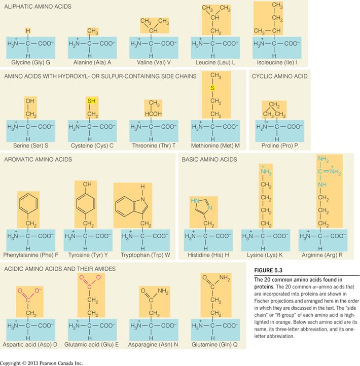
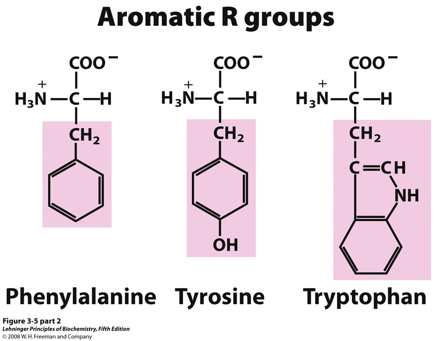
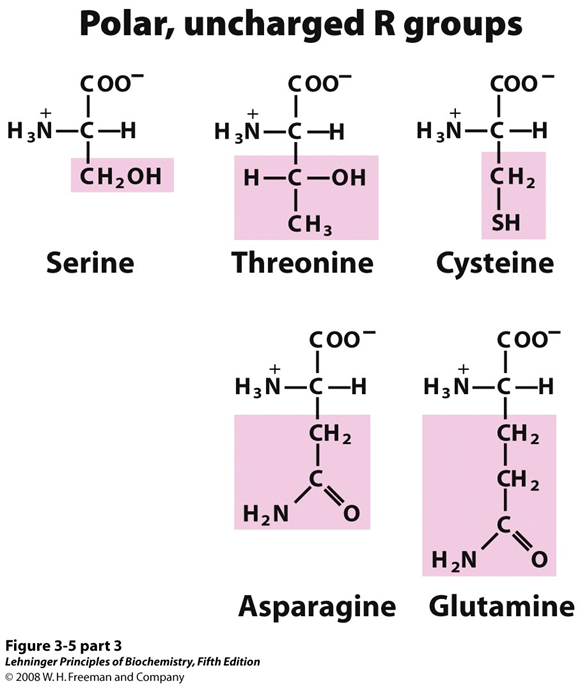
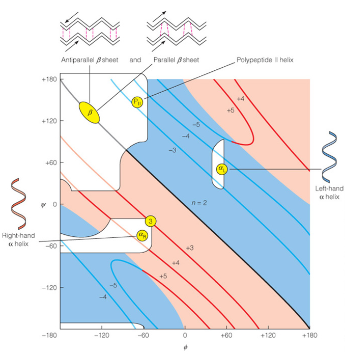
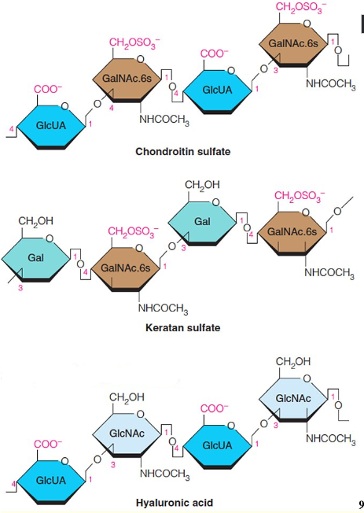
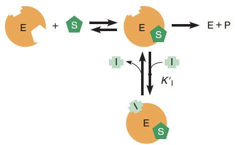

---
toc:
    depth_from: 1
    depth_to: 3
html:
    offline: false
    embed_local_images: false #嵌入base64圖片
print_background: true
export_on_save:
    html: true
---

# Nucleic Acids
- 最大吸收光為260nm (蛋白質280nm)

## 名詞們

Nucleic Acids
: 

Nucleosides
: 五碳＋含氮鹼基

Hairpin structure
: 單股折疊配對

Hypochromicity(減色效應)
: 雙股DNA對波長260nm的光吸收量小於變性的DNA，可
以用來檢測DNA是否變性

telomeres
: 端粒

ddNTPs
: C2,C3去氧，聚合中止於此

## tautomerize

## 聚合

## A, B form

- DNA-DNA: B form 
  - 窄長
  - 都是 anti form
- Other: A form
  - 寬胖
  - 都是 anti form

- Z form
  - 左旋
  - 出現在C-G對多的地方
  - 在基因調控上扮演重要角色
  - C、T 是anti form，A、G是syn form

- H form
  - 三股螺旋
  - 其中一股含豐富的嘌呤及二股含豐富的嘧啶。
  - A與兩個T配對，G與兩個C配對，每個鹼基都是從側邊配對。
  - 有 Watson-Crick base pairing 和 Hoogsteen－type base pairing

## 結構們
### G-quadruplex
富含鳥嘌呤的核酸序列所構成的四股型態，常見於telomeres

# 胺基酸

:::note {影片小知識}
Gly, Glu 是神經傳遞物質
:::

## 名詞們
Peptide bond
: 肽鍵

pI 
: 等電點 中性氨基酸pKa平均

## 酸性胺基酸

- 可以變-2
- pH7 負電

:::tip{阿斯巴甜}

:::

:::tip{味精}

:::
## 鹼性

- 可變+2
- pH7 正電，除了Histidine 中性環境下未完全解離，可做為生理緩衝溶液

## 芳香

- $\pi$電子吸280nm，特別是Try
  

## 不代電極性

## 不代電非極性

# Protein 
- 序列 N to C

:::left
- preproprotein
  - 去內質網

:::right
- proprotein
  - zymogen
  - 藍色要剪才有活性

:::

:::note {分子量}
$$
110 \times 胺基酸長度
$$
:::

## 名詞們
conjugated protein
: 不只是氨基酸

prosthetic group
: 輔基，不是氨基酸部分

Denaturation
: 變性，不涉及蛋白質一級結構的變化，次級鍵被嚴重破壞。

molecular chaperone
: 伴護蛋白，幫助功能蛋白折疊

## 內切酶
|內切酶|位置|
|-|-|
|Trypsin | Lys, Arg  $\rm(C)$|
|Chymotrypsin| Phe, Try, Tr|
|CNBr|Met|

## 結構
- Assembled subunits 的每個polypeptide chain 之間非共價鍵。
- ==Corey-Pauling rules==: 肽鍵不能轉
- $C_{\alpha}$ 兩邊能旋轉，$\alpha$的$\theta,\psi$ 同號

Chaperones
: 加速一級結構摺疊

### &alpha;-Helix
- 3.6胺基酸一圈，長度 $1.5\times$ 胺基酸數
- 沒有 Pro

 
### $\beta$-sheet

:::note {Circular dichroism}
旋光看$\frac{\alpha}{\beta}$
:::

:::note{X-ray diffraction crystallography}
決定三級結構
:::

## 一些蛋白質

:::note {holoprotein vs apoprotein}
  
:::

### Keratin
- Cys 雙硫
- 都是 $\alpha$

coiled coil
: $\alpha$絞在一起

### Collagen
- Lys, Pro 接 OH再接 Gal, Glc
- Cross link 發生在 Lys 的 N 
  
- 脊椎動物獨有
- 非&alpha;-Helix
- Tropocollagen

### Hemoglobin
Hemoglobin 是 Allosteric Protein(結合後會催化其他結合)

:::note {2,3-BPG}
擠回T-form，降低O_2_結合力

:::

:::note {胎兒 }

:::

### 抗體
:::tip 
Fc增加穩定
:::

### Actin/ Myosin

:::note {Ca^2+^ and Tropomyosin}

:::

### flagella and cilia
:::left
**flagella**
- ATP 驅動
- 擺動
:::right
**cilia**
- H^+^ 驅動(pmf 分子馬達)
- 轉動
:::

### Prion 

PrPc: 正常，&alpha;-helix 
PrPsc: 致病，&beta;-sheet 

## 練習題 

>產生雙硫鍵&rarr;氧化

# 醣

- L-form C5的OH在左邊，D-form C5的OH在右邊
- 成環D在下

## 名詞們

Glycoside
: 醣基 C1

anomeric pair
: C1的OH在下面為&alpha;

mutarotation
: anomeric pair 互變

Aldonic acid
: C1氧化，醣酸

glucitol
: 山梨醇，葡萄糖還原成醇

furanoses
: 五環

pyranoses
: 六環

oligosaccharides
: 寡醣 3-10

Uronic acids (Glucuronic acid) 
: C6氧化，解毒用
 

Alditols
: C1還原

amylose and amylopectin
: 無/有分支多醣

Sorbitol
: 堆積造成糖尿病白內障

Lectins
: 為蛋白或醣蛋白，可辨認糖基，與之結合

## 雙糖
|醣| |
|-|-|
Sucrose| &alpha;1&rarr;&beta;2|
Maltose| &alpha;(1&rarr;4)|
lactose| &beta;1&rarr;&beta;4|

糖胺
: 

pyranose
: 

## 多醣們

### 肝醣與澱粉 glycogen and starch
8-12個&alpha;(1 &rarr; 4)出一個&alpha;(1 &rarr; 6)

### 纖維素 cellulose

&beta;(1 &rarr; 4)

### 幾丁質 chitin
&beta;(1 &rarr; 4)

### 黏多醣 mucopolysaccharides
- Glycosaminoglycans
- 酸性多醣

:::note {蛋白聚糖 Proteoglycans}
黏多醣+蛋白質

:::

Heparin
: 阻止血栓

### 肽聚糖 Peptidoglycan
- &beta; (1 &rarr; 4)
- N-Acetyglucosamine (NAG), N-Acetylmuramic (NAG) 交錯形成鏈
- 鏈之間氨基酸連接
- ==Lysozyme== 切斷醣鏈

:::note{Gram-positive/ negative/}
- 陰性只有一層多糖

:::

### heparin
- 高度硫化的糖胺聚糖抗凝血劑
- The &alpha;(1 &rarr; 4) and &beta;(1 &rarr; 4)bonds alternate

 

### hyaluronic acid
- &beta;(1&rarr;4)

## 蛋白質醣基化(Glycosylation)
### N-linked glycosylation
C~1~ 接 Asn 的 N~R~

### O-linked glycosylation：
C~1~ 接 Ser 的 O

## 練習題

B 成環多&alpha;, &beta;

>這種東西
>:::fbox
>
::: 

# Enzymes
Kinase
: 激酶，磷酸化

Phosphatase
: 磷酸酶，去磷酸化
## 模型
- key and lock model
- induced-fit model
- conformation selection model

:::left

:::right

:::

## 酵素動力學 (Michaelis-Menten kinetics)
$$
E+S\mathop{\rightleftarrows}\limits_{k_2}^{k_1} ES \mathop{\rightarrow}\limits^{k_3} E+P
$$

$$
\begin{aligned}
  (k_2+k_3)[ES]&=k_1[E][S]\\
  {\rm 定義}\ K_m&=\frac{k_2+k_3}{k_1}\\
  [E_t](所有E)全變成 ES&\Rightarrow\\
  V_{max}&=k_3[E_t]\\
\end{aligned}\\
$$

$$
\begin{aligned}
  {\rm 反應初速}\ V_0 &= k_3[ES]\\
  &=k_3K_m^{-1}[E][S]\\
  &=K_m^{-1}(k_3[E_t]-k_3[ES])[S]\\
  &=K_m^{-1}[S](V_{max}-V_0)\\
\end{aligned}
$$

使用 Pre-steady state (還沒飽和)
$$
V_0=\frac{V_{max}[S]}{K_m+[S]}
$$

$$
V^{-1}=V_{max}^{-1}K_m[S]^{-1}+V_{max}^{-1}
$$

:::note {k~cat~}
一個酵素分子在一定時間內可將受質轉變為產物的受質數量 即 k~3~
:::

:::note {K~m~}
酵素與受質間親和力的指標，Km越大親和力越小
:::

### Plot

## 評估催化能力

$$
\frac{k_{cat}}{K_m}
$$
> 反比雙倒數圖的斜率
## 抑制劑

### 競爭

:::left

:::right

:::

### 非競爭

## 編號

**EC ?.?.?.?**
1. Oxidoreductases 
   - 催化氧還
2. Transferases
   - 移動官能基
1. Hydrolases
   - 水解
2. Lyases
   - catalyze removal of a group from or addition of a group to a double bond, or other cleavages involving electron rearrangement.
3. Isomerases
   - 異構
4. Ligases 
   - 連接

# Lipid
- R1,R2 儲存能量

## 俗名 

## 種類

### Glycerophospholipid

#### 修飾

> Serine 多了甲基

### Sphingolipid

- 2接醯氨

### Cholesterol
- 27 C
- 只有 OH親水

## 不對稱

## 細胞膜 
### Caveolins
- shaft 蛋白質特徵
- 大分子運輸

### 內外運輸

# 糖解
==Glucose &rarr; 2 Pyruvate==

NADH進入粒線體

:::fbox 

:::

## 反應
### 耗能部分

1. Hexokinase 磷酸化 Glucose C~6~ 接變G6P
   - I,II,II型酵素K~M~ 極小

2. G6P Isomerases 催化 G6P 變五環 F6P

3. Phosphofructokinase 磷酸化 F6P 變FBP

4. 切兩塊 

5. 變 2 GAP

### 產能部分
:::fbox 

:::

 
6. 磷酸脫氫
   -  NAD+氧化aldehyde產生酸，酸＋ Pi 磷酸化
   -  吸熱  

G3P + Pi + NAD^+^&rarr; BPG + NAD^+^ + H^+^

7. BPG + ADP &rarr; 3FP + ATP
   - 大放熱，回不去

8. Pi換位置
   2接上Pi ，再拿3的pi  
   

  >
9.  Enolase 脫水  

1.  PEP&rarr; Pyruvate， 大放熱  

>加磷酸難回頭

>Mg^+^能接兩個電子，用以穩定結構  

:::note {Pyruvate Kinase}
- L,R 受到ATP抑制
- M1 持續活化
-  
:::

## 無氧，NAD^+^再生

:::note{Pasteur effect}
酵母菌暴露空氣，無氧呼吸轉為有氧，Glucose, G6P, F6P 用量大減、NADH 累積

:::

### 酒精

## 其他路徑 

### Leloir pathway 
Galactose &rarr; G6P
- UDP-Glc&rarr;UDP-Gal 負責把4號OH翻過來
- ==Epimers== 再把 UDP-Gal 轉回來

### Glycerol 甘油 
1. 磷酸化(glycerol kinase)
2. 氧化(dehydrogenase)

## 酵素們

# 糖質新生

>肝、腎

## 反應

:::left 
### 丙酮酸羧化
- ==pyruvate carboxylase==
- 產生 Oxaloacetate
- 需要ATP, biotin
- 在 [粒線體](#大風吹) 進行，mitochondrial malate dehydrogenase(mitochondrial MDH)還原成用 Malate 穿膜
>比較：[Malate/aspartate shuttle](#nadh-進入粒線體)

### Oxaloacetate 磷酸化成 PEP

- 細胞質、粒線體都有 Kinase 
- PEP/ Malata 穿粒線體膜

### 拔Pi
- bisphoshaatase 
- glucose-6-phosphatase
:::right 

:::

## cori cycle
>骨骼肌產乳糖，到肝臟再生成葡萄糖

## Propionyl-CoA 
脂肪酸代謝，丙烯輔酶A 轉乘 Oxaloacetate

## Glycogen/ Starch
### 拆解
- 用 phosphorylase 拆(Pi在C4，再轉成G6P)

#### 酵素們 
:::left
- phosphorylase: 切長鏈(剩下4個)
- amylopectin: 搬運短鏈
- &alpha;(1&rarr;6)-glucosidase: 切&alpha;(1&rarr;6)
:::right

:::

#### 調控
>算了吧。。。

- Phosphoylase 
  - T 非活化
  - R 活化

### 合成
#### glycogen synthase
直鏈

#### transglycosylase
支鏈

#### 調控

## Ribsome 

### Transketolase 
- 拔酮，接到醛上面

- 需要TPP穩定

## 其他路徑  

# 電子傳遞 

## NADH 進入粒線體
###　Malate/aspartate shuttle
- 2.5mole ATP

### dihydroxyacetone phosphate/glycerol-3-phosphate shuttle
- 1.5 ATP

## Electron Transport 

###　Electron-carrying molecules 

#### NAD+
- 70% 在粒線體

- 質子接受者（N+對面那個C)

:::fbox

:::

#### FAD
- Flavoprotein

#### ubiquinone
- 輔酶Q

#### iron-sulfur proteins

#### Cytochromes
- 大多在蛋白質裡面
- 血基質（heme）

### 反應

#### NADH dehydrogenase 
- NADH $\rightarrow$ FMN $\rightarrow$ Fe-S $\rightarrow$ CoQ
 
#### Succinate dehydrogenase
- Succinate $\rightarrow$ FADH~2~ $\rightarrow$ Fe-S $\rightarrow$ CoQ
- 有 HemeB 做保險

#### Cytochromes c Oxidoreductases
- CoQH~2~ $\rightarrow$ Cyt b $\rightarrow$ Fe~2~-S~2~ $\rightarrow$ Cyt c~1~ $\rightarrow$ 2Cyt c

#### Cytochrome c oxidase 
- 2Cyt c $\rightarrow$ CuA $\rightarrow$ heme a $\rightarrow$ heme a3-CuB $\rightarrow$ O~2~
- CN^-^ 、 CO H~2~S抑制 

## Complex V 
### P/O ratio
- 一對電子產成ATP數量
- 人類10個 H^+^ 轉一圈（c subunit），產三個ATP
- 磷酸根進入粒線體需要同向運輸H^+^

### Uncoupling agent 
- 搶H^+^

#### Thermogenin (UCP1)

## 調控 
### 低氧 
- HIF 
- PDH kinase 
- COX4 失去功能
- ATP 回細胞
- 產生乳酸

## Mitochondria
Oxidase
: 產物無氧化劑

Oxygenases
: 產物有氧化劑
### Cytochrome P450
- ER, Mitochondria, 細胞膜
- 氧化酶，氧化類固醇、脂肪酸
- 附加 OH^-^

### Cytochrome c
- 啟動細胞凋亡 Intrinsic Apoptosis

### 自由基 （Reactive Oxygen Species）
- Peroxynitrite 會過破壞細胞膜

### 抗氧化 
- Glutathione
- Vitamins C and A
- Vitamins E (alpha tocopherol)
- Uric acid

# Pyruvate Oxidation
- 氧化脫酸，Pyruvate &rarr; Acetyl-CoA 
- 產生 1NADH
- 不可逆
- 催化劑：pyruvate dehydrogenase complex (PDC/ PDH)
- Cofactor 在 VitB裡面

## 步驟
:::fbox 

:::

### pyruvate dehydrogenase
- pyruvate跟TPP(Thiamine Pyrophosphate)結合
- N,S讓 C容易形成 C^-^，攻擊 pyruvate

### dihydrolipoyl transacetylase
- Lipoamide(Lipoyl-E2)從 HETTP 拿走 acetyl group
- 和CoA結合。
- 產生 Acetyl-CoA

### dihydrolipoyl dehydrogenase
- riboflavin &rarr; FADH~2~ &rarr; NADH 形成
- VitB~2~ 

:::info {CoA}
- Pantothenic acid(Vit B5) + ADP

:::

# Citric Acid Cycle
- 產生 CO~2~ 、 electron carrier
- CO~2~來自 Oxaloacetate

:::info {Mitochondria}
- 外膜有許多由孔蛋白(Porin)，讓分子量小於5000及離子可以自由穿過
- 內膜篩選
:::

## 步驟
### 形成citrate
- Acetyl-CoA和oxaloacetate(OAA)結合形成 citrate （檸檬酸）
- 不可逆
- ==Citrate synthase== 會被NADH、ATP和succinyl-CoA所抑制

### Isomerization of Citrate
- 3&deg;醇變 2&deg;醇
- ==aconitase==

### Generation of CO~2~
- 2&deg;醇氧化成酮 （oxalosuccinate）
- 形成 NADH 
- 脫去 CO~2~，形成α-Ketoglutarate
- ==isocitrate dehydrogenase==被ATP和NADH所抑制；被ADP和NAD+所活化

### 脫掉第二個碳(CO2)
- 僅留下 Acetyl-CoA的酸
- 形成 NADH
- 接上 CoA，形成 Succinyl-CoA
- ==α-Ketoglutarate dehydrogenase== 被ATP、NADH和succinyl-CoA抑制，並會被ADP及NAD+促進

### A Substrate-Level Phosphorylation
- ==succinyl-CoA synthetase==
- 產能

### A Flavin-Dependent Dehydrogenation
- ==succinate dehydrogenase==會出現在粒線體
的內膜上 ([Cox II](#succinate-dehydrogenase))
- C2氧化形成烯 (trans)
- 產生 FADH~2~

### Hydration
- fumarate hydratase 有 trans 專一性

### A Dehydrogenation that Regenerates Oxaloacetate

- 2&deg;醇氧化，形成 Oxaloacetate
- 形成 NADH 
- 吸熱

## 大風吹 

1. 路徑一：Pyruvate變成OAA
   - 要用掉ATP
   - 酵素是Pyruvate carboxylase
   - 在肝、腎細胞旺盛
   - 和 PDH路徑拮抗，Acety-CoA 太多 Pyruvate 就會改走這裡
   - Biotin (VitB7)參與
2. 路徑二：PEP變成OAA
   - 酵素是PEP carboxykinase
   - 在動物的心、肌肉細胞
3. 路徑三：PEP變成OAA
   - 酵素是PEP carboxylase(要和前一個酵素區分清楚)
   - 在植物、微生物細胞
4. 路徑四：Pyruvate變成Malate(再變成OAA)
   - 酵素是malic enzyme
   - 在所有真核細胞和細菌
   - 在脂肪酸合成的過程中，這個反應也可以走反方向，也就是Malate回到 Pyruvate，產生大量NADPH。
>補充：很多合成反應要用到NADPH作為能量來源，在分解作用則是用到NADH作為能量來源。

## VitB 們 
### B~1~ (Thiamine)
- 做 TPP，脱CO~2~用

### B~2~ (riboflavin) 

- 做 FMN, FAD 
- [PDH E3](#dihydrolipoyl-dehydrogenase)
- [Cox I](#nadh-dehydrogenase)
- [Cox II](#succinate-dehydrogenase)

### VitB~5~ (Pantothenic acid)
- 做 CoA

### VitB~7~ (Biotin)
- [pyruvate carboxylase](#丙酮酸羧化)

:::fbox 

:::

# 調控

 

## 糖解、糖升

### F2,6P調控
- FBP Pi接在1,6、F2,6BP在 2,6

#### PFK-2/FBPase-2
- Bifunctional 酵素，
- 磷酸化則偏向FBPase-2 ，拆 F2,6BP (升糖素促進)
- 去磷酸化則偏向PFK-2，做F2,6BP (胰島素促進)

#### glucokinase regulatory protein (GKRP)
>肝臟內運行
1. Glucose促進 GKRP釋放 hexokinase isozyme IV (HKIV)
2. insulin 促進 PFK-2/FBPase-2 去磷酸化
3. 去磷酸化 PFK-2/FBPase-2與 HKIV 結合，催化 F6P&rarr;F2,6P
4. F2,6BP促進F6P&rarr;FBP
5. 肝細胞糖解

### Pyruvate kinase 
- ATP 抑制 ，磷酸化失去活性

## PDH 
- PDH E1 磷酸化無活性
- PDH E2, E3產物抑制自己

## Citrate circle
- NADH &rarrb; ALL 
- ADP/ATP, Ca^2+^ &rarr; PDH, isocitrate dehydrogenase
- Succinyl-CoA &rarrb; α-Ketoglutarate dehydrogenase
