---
toc:
    depth_from: 1
    depth_to: 3
html:
    offline: false
    embed_local_images: false #嵌入base64圖片
print_background: true
export_on_save:
    html: true
---

# FPD
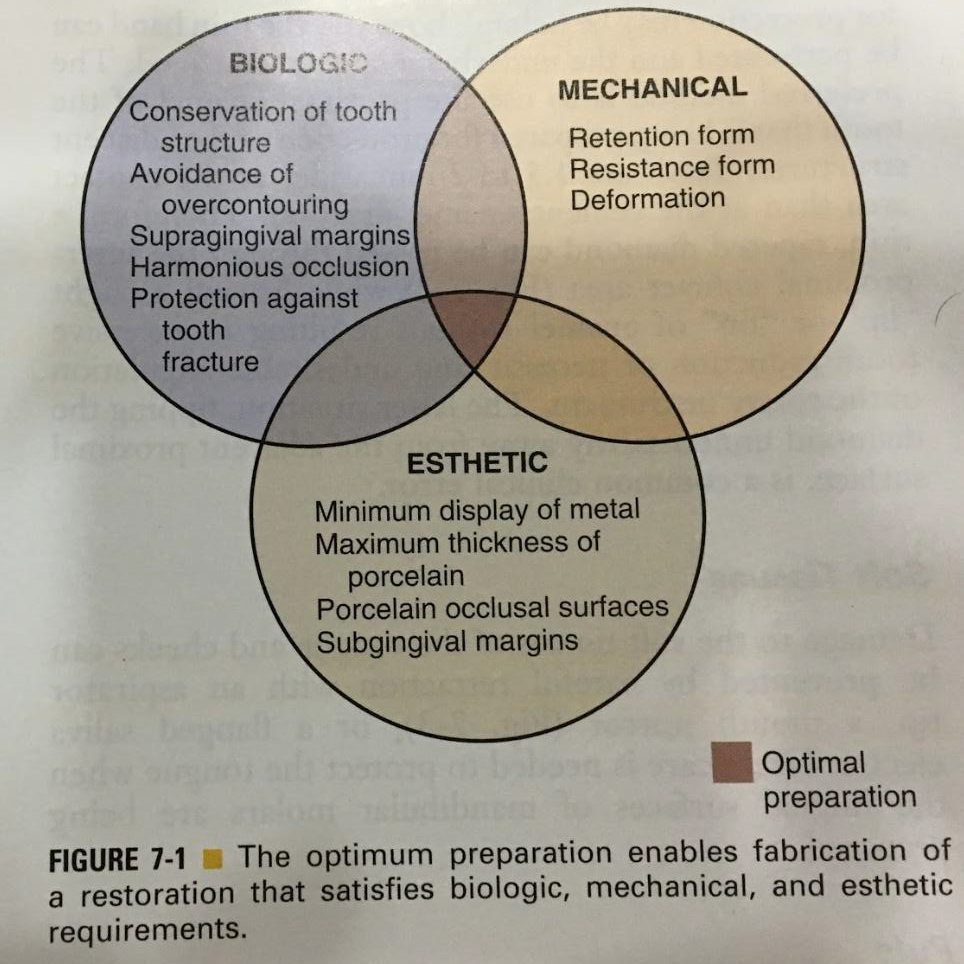

## 名詞 

Luting agent
: 黏著劑

## Marginal design
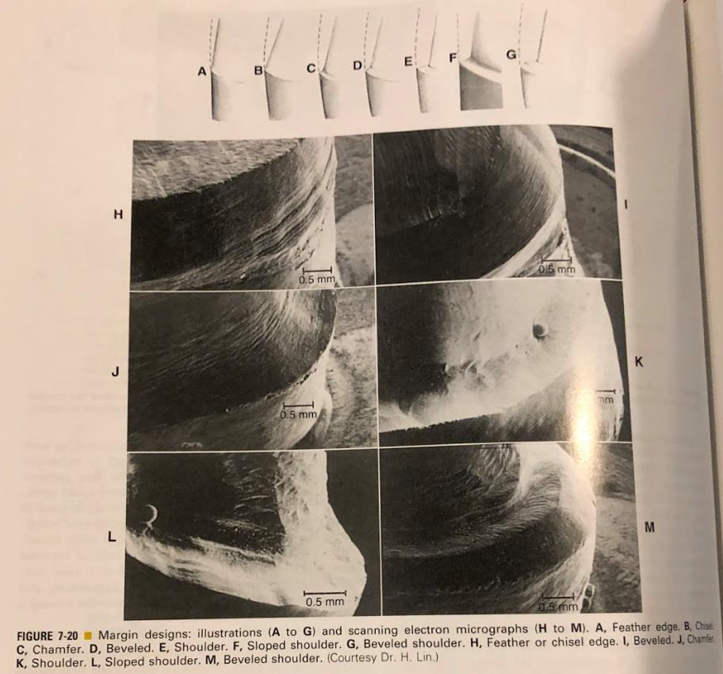
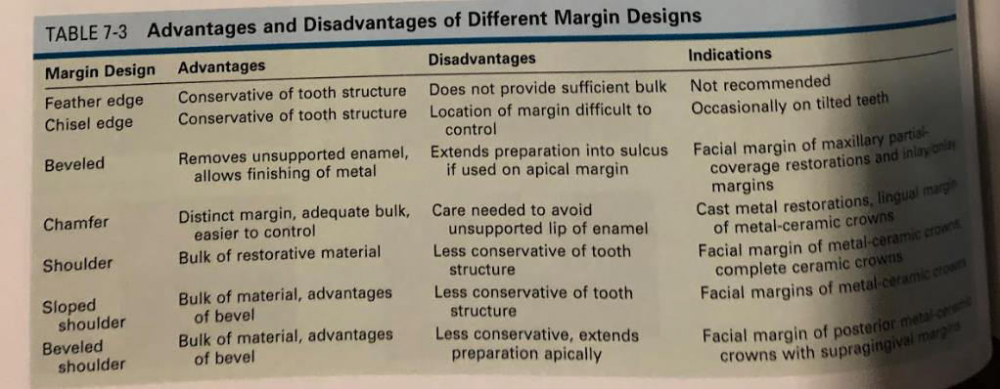

A. Feather edge
C. Chamfer
D. Beveled
E. Shoulder (與牙齒夾角約90度)(容易有undercut)
F. Sloped shoulder (與牙齒夾角約120度或135度)
G. Beveled shoulder (與牙齒夾角約90度，但在邊緣會做成斜面)

- Feather edge(少用)
  - 做陶瓷貼片(Porcelain Laminated Veneer)
- Chisel edge
- Chamfer margin
  - 鑄造金屬牙冠(cast metal crown)
  - 現在全瓷冠也可以用
  - chamfer margin < 0.5mm (半支 Bur)，否則產生 ==unsupported lip of enamel==
- Beveled margin
  - Cast
  - 藏在 Subgingival
- Shoulder
  - 要和表面垂直
  - PFM 的 Buccal
- Sloped shoulder (與牙齒夾角約120度或135度)
- Beveled shoulder
  - Shoulder 外面再 Beveled 
  - metal collar 的 PFM 的 Buccal

> 通常 Crown 會略大，Beveled 比較不密
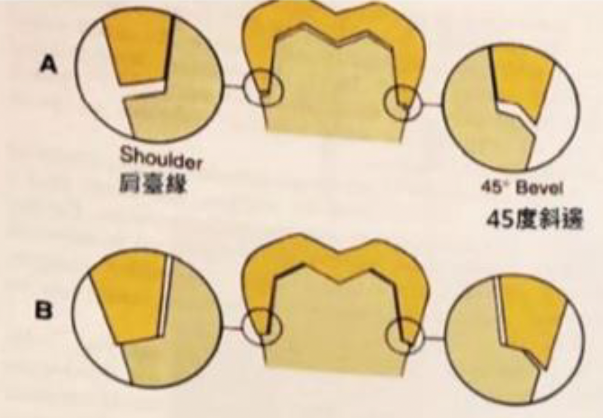

> 金屬空隙能到 10 &mu;m

## Resistant 
- 咬合力約 4340N
- 適宜的taper為5~22&deg;
- 大臼齒的cusp height至少要有3.5~4 mm
- h/w > 0.4
- ZPC 24h 抗壓 70MPa

### grooves
- 幾乎不增加 retention
- 高度: 3–4 mm
- 深度: occlusal< cervical

## Complete cast 

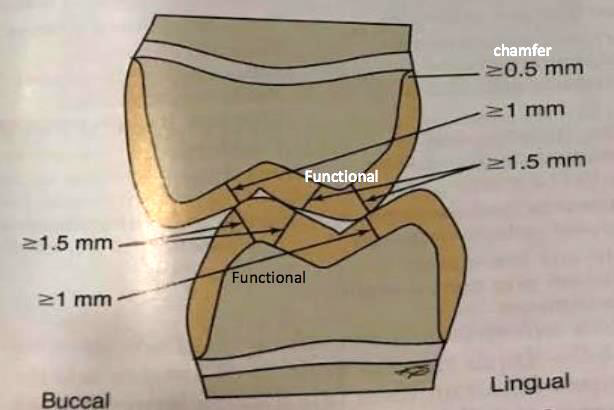

- Chamfer: &geq; 0.5mm
- Occlusal: 1.5mm
- retention: 6&deg;
- resistance: 5-2&deg;

- Mx. molar 
  - Buccal Cusp (Nonfunctional)
    - 1-1.5mm (1/2)
    - occlusoaxial line angle: Bevel, 厚度 &geq; 0.6mm
      - 太薄cast 做不出來，會 overcontour
  - Lingual cusp (functional)
    - 1.5-2mm 
    - Occlusal third bevel: 要足夠厚度

- Md molar 
  - Buccal Cusp (functional)
    - 1.5mm 
  - Lingual cusp (nonfunctional)
    - 1mm (幾乎不用特別修)

## PFM 

- PFM支架燒瓷溫度約960°C，傳統 complete cast crown 金屬會融化
- 金屬的線性膨脹係數需要比陶瓷的多0.5x10-6 /℃，
- 使用 Low-fusing glass frit +20%體積 Leucite
- ISO standard 9693：利用three-point bending test偵測金屬陶瓷間的鍵結強度，強度至少要有25MPa

---
- 燒瓷前後都能修金屬
- 磨很多（complete cast crown只咬 1mm
- Subgingival &rarr; 牙周問題
- 陶瓷至少要1.2mm，金屬至少0.3mm

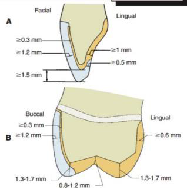

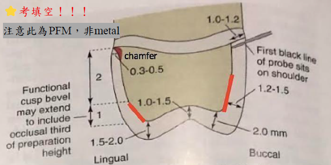

### Preparation 

- Depth grooves
  - 厚度: 1.2+0.3mm
  - Cervical plane
    - 牙齒長軸(同時也是置入途徑)
  - Incisal plane
    - Facial contour
  - C/I
    - 前:1/2
    - 後:1/1

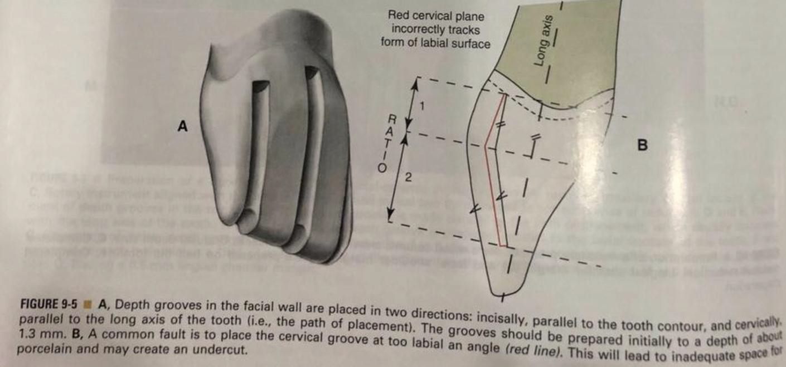

- Occlusal/ cusp
  - Metal: 1-1.5mm
  - 陶瓷: 2mm
    - 前牙 Incisor 為了美觀
    - 後牙為了強度

- 牙齦下金屬環(subgingival metal collar)
  - 0.5mm subgingival
  - shoulder margin: 寬1mm，超過 Contact point 才能藏金屬

- Margin 
  - Shoulder(90&deg;): 支撐 ceramic
  - Shoulder(90&deg;)+Bevel: metal collar,  Marginal gap &darr;
  - Shoulder(120&deg;): Free enamel&darr;, Marginal gap &darr;

## All Ceramic

### anterior crown monolithic
> Particle filled glass(第一類材料)

- Margin: 1mm
- Incisal：1.5-2.0 mm
- Labial, Palatal: 1.0-1.5mm 

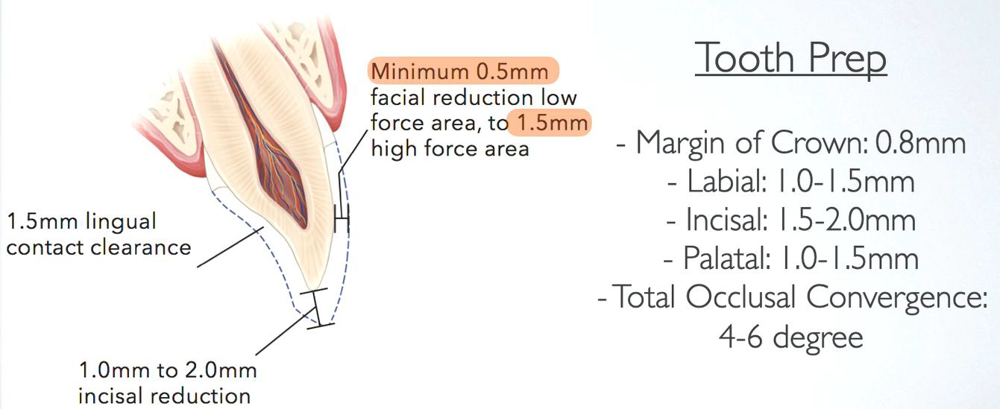

### posterior crown monolithic

- Margin：1.0 mm
- Occlusal：1.5-2.0 mm 
  - Cusp: 2mm
- Labial, Palatal: 1.0-1.5 mm。
- Converge 4-6&deg;

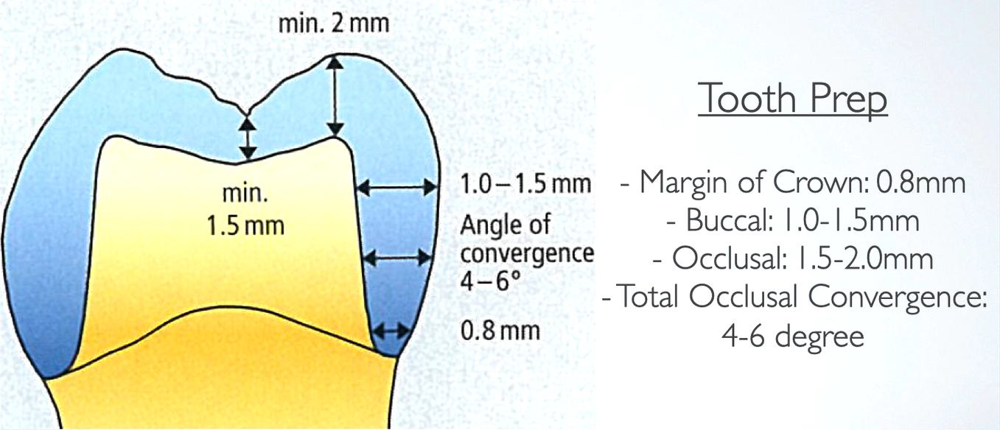

### Inlay 

- Thickness: 1.5-2 mm
- intercuspal width: < 2.5mm (1/3)
- Axial wall: 10&deg;
- TOC(總咬合收斂)：6&deg;

:::fbox 

:::

### Bridge 
- connectors: 4x4 mm

## Post and Core 
- 不一定要 Post 但 Core 要有
- Endodontically treated teeth (ETT) more brittle or fragile?
  - 含水量跟 vital 差不多 
  - Margin 破壞 &rarr; flexibility &darr;
  - 無法控制咬力
- ETT較易斷裂而無法保留，尤其在大臼齒區域、較少鄰接牙or無鄰牙處、較長或受力複雜之牙橋
- Cusp coverage 可明顯提高牙齒存活
  - 後牙 crown 沒/有：50/87 months
  - 前牙：幾乎沒差

- Peri-cervical Dentin (PCD) Thickness: CEJ上下各約4mm的dentin厚度，評估 ETT 結構

### Design 

#### 後牙 

- Complete-coverage crown + Core
  - 不一定要 Post
- Full metal &rarr; Zirconia
- 齒質結構好可考慮 onlay 
#### 前牙 

- 齒質多：Resin
- 齒質少、美觀考量：Post & Core + Crown(Veneer)
- 下顎前牙predentin wall 較薄 &rarr; fiber post

### Post

- 目的
  - 提供 Core Retention
  - 將力量轉移至牙根 (前牙)
- Post本身不會加強牙根的 strength，除非寬canal、管壁薄
- 放在最直，最沒有Concavity的牙根
  - Mx premolar: P(support好)
  - Mx molar: P
  - Md molar: D
    - 在 4 canal 不好用，但仍比 M 好，因為有danger-zone易造成 perforation
    - C shaped 會 direct filling (填 Resin )
  - molar 處，Post不要超過 Orifice 下 7mm

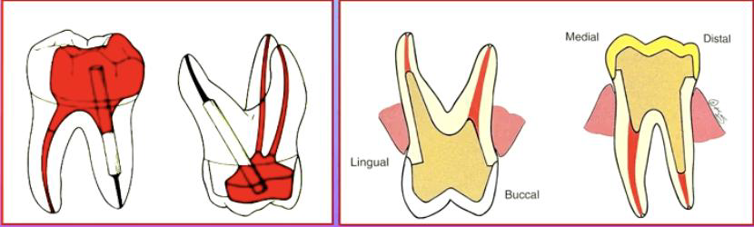

:::info { Two step v.s. One step}

- Post, Core 是否分開做
- One-step 通常是 Cast 
- Post, Core 的 Axis 有差異時只能 One step 否則Core 的 Retention 不足
  - Ex. Attrition 導致 Vd 喪失

| 項目 | One-step technique | Two-step technique |
|------|------------------|------------------|
| 操作時間 | 快 | 較慢 |
| Post 黏著 | 易受操作影響 | 穩定、可靠 |
| 氣泡產生 | 易發生 | 可控制 |
| 建議應用 | 短 post 或暫時性修復 | 永久 fiber post 修復 |

:::

#### Materials

- 過硬(base metal) &rarr; Root fracture 
- 過軟 (Gold) &rarr; 
  - Post 脫落
  - Flexibility &rarr; Crown marginal leakage
- tooth structure夠用較軟 Post ，反之選 Rigid
  - 後牙一般用軟 Post 

>\style[color: red;]{Prefabricated}: 預製成固定尺寸與形狀

| 材質種類||性質|
|-|-|-|
Metal| Cast (precious)|noble alloy, Fit|
|^| \style[color: red;]{ SS/ Ti}|\oneline{
- 強度高，彈性模數高
- Resin 結合能力差}|
Woven fiber||\oneline{
- woven fiber + resin matrix
- 多方向纖維、抗裂性佳、能吸收應力
- 美觀
}|
|單向纖維|\style[color: red;]{Carbon fiber}|\oneline{
- E: 20–40 GP
- 美觀差(黑)，少用
- 易取出， Retrievable
}|
| ^|\style[color: red;]{Glass/ Quartz fiber}| \oneline{
- E: 18–25 GPa (\~Dentin)
- 白色，美觀
- 可與 Dentin 黏著，但仍易取出
}|
|^|Polyethylene fiber (Ribbond)| \oneline{
- 柔軟可塑，可直接在根管內層壓成形
}
Ceramic (Zirconia) ||\oneline{
- 美觀
- 非常堅硬
- 難以取出
}|

#### 黏著劑(Luting cement)

| Cement 類型 | 特性 / 注意事項 | |
|-------------|----------------|-----------|
| Polycarboxylate cement   (PCC) | \oneline{
- 會有塑性變形（plastic deformation）
- 絕對不能用於 post-core，否則樁容易鬆脫 }|
|Zinc Phosphate Cements (ZPC)|\oneline{
- 沒有Adhesive
}|
|GI|\oneline{
- 濕度控制，小心口水干擾。
- Delay preparation」(24hrs)}
| RMGI | 早期版本會膨脹，現代已多改善，但仍需注意膨脹與黏著力問題 |
| Resin cement | \oneline{
- 黏著力強，適用 fiber post 
- 需控制污染
- Eugenol 需清除（用EDTA）
- 光固化深度可能不足 → self-cure/ dual-cure 
} |
| Screw post | \oneline{
- 螺紋 + cement 組合基本上不可拆
- 不可用力拔除，拔除時牙根幾乎會連同樁被拔出}|

#### Design 

- 寬度：無法確定直徑與Retention 有關，太寬還可能造成牙齒脆弱?
- 長度：影響受力、固位性
  - 太短 &rarr; root wall, Cervical 應力
  - 太長 &rarr; 影響Apical hermetic seal
  - 建議到牙根的Middle-third
- 表面設計：粗糙
- 形狀
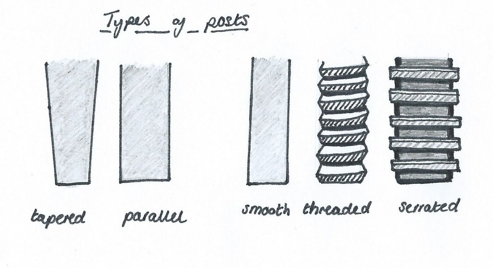

Post形狀 |特色|
|-|-|
|Tapered|\oneline{
- Fitness
- Retentive &darr;
- 根管修型少
- stopper 否則 wedge effect
}|
Parallel|\oneline{
- retentive
- 根管修型多
}|

|Post 表面處理| 特色|
|-|-|
Smooth|\oneline{
- 能滿足大多數情況
- Retention &darr;
}|
Threaded|\oneline{
- Retentive &uarr; &uarr; &uarr;
- 可能牙齒斷裂 (能夠不用盡量不用)
}|
Serrated|\oneline{
- Retentive &uarr;
- 最常用，搭配 parallel
}

- Custom cast post  v.s. Prefabricated post

| 項目 | Custom Cast Post | Prefabricated Post |
|------|-----------------|------------------|
| **特質** | 1. 可針對各種形態的根管密合 2. Custom cast core 可以避免 coronal dentin 大量損失 | 1. 無法和所有 canal 密合 2. 較省時，可一次完成 3. 相對較便宜 |
| **密合度** | 高 | 一般 |
| **保留齒質** | 高 | 中等 (要配合 Cast) |
| **Retention** | cement | 平行 + 粗糙，較好 |
| **省時性** | 較慢 | 快 |
|適用情況 | 齒質少 | 齒質多|

### Core 

| Type / Material | 性質 / 優缺點 |
|----------------|---------------|
| **Amalgam core** | \oneline{
- 強度很好
- 與牙齒無 adhesive
- 24hrs 硬化}|
| **Composite** |\oneline{
- 常用，分層堆疊
- Bulk-fill 可一次堆大坨，光照固化}|
| **Glass ionomer** | \oneline{
- 生物相容性佳，可釋放氟
- 強度略低於 composite resin }|
| **Dental cast gold** | 太軟，需要至少 Type IV |
| **Non-precious cast metal** | 高強度、成本低，美觀差，精密鑄造 |

### Prepare

> 一定要有 ferrule (圍箍)

1. Apical GP>3mm (最好 5mm)
2. Minimal canal preparation
3. Adequate post length
   - retention
   - canal的1/2~2/3, middle root:若放在cervical反而會造成力量集中，fracture
   - 要到 alveolar bone 下
4. Definite vertical stop (for casting)
   - 避免 Try in 產生 wedge effect
5. Anti-rotation effect: 別讓 Post 旋轉 
6. ferrule
   - sound tooth structure 至少高 1.5-2mm，厚 0.5~1mm 

:::tip {牙齒結構不足，沒有Ferrule effect}

- Crown lengthen
- Orthodontic Forced Eruption
  - 順便改善歪斜
:::

### Failures

- Custom cast post-core(CPC) > ParaPost(PP) with amalgam core
  - 製作很大的casting post-core(15%)比parapost(8%)失敗率更高，但會去做casting post- core 的患者，本身的齒質就比較脆弱了，因此就不太清楚到底是因還是果，只是統計學上的結論。
- 男>女
  - 咬力
- 年紀大>小
  - 牙齒較無彈性，尤其是大於60 歲的患者
- 上顎>下顎
  - 尤其是 lateral incisor, canine, premolar，比較多側向力，相對下顎都是垂直力
- 複雜的 FPD>Single crown

## impression

- 排齦線(Retraction Cord)
  - 浸泡止血劑 (Astringent): 酸性環境下才有效 &rarr; 溶 Smear layer &rarr; 術後敏感
  - dentinal tubule sealing 降低術後敏感
  - Double cord Technique
    - 第一條細線放得深：放入牙齦溝底部，在印模時防止牙齦溝出血。
    - 第二條粗線放得寬：放在margin的高度，用以排開牙齦，放好後要是肉眼可以稍微看到線的，否則牙齦仍然會是封起來的。
    - 等待適當時間後，取出第二條粗線，就可以印模了。

- 排齦膏(Displacement paste)
  - 含有 AlCl~3~

## Die 

- Gypsum 
  - IV, V
  - 便宜 
- Resin 
  - 不相容 polysulfide, Hydrocolloids 印模材，主要用 polyether
  - 
- 電鍍單齒模
  - 先在印模內壁上電度一層極薄且均勻的金屬膜（銅/ 銀），再灌石膏或樹脂
  - 強度高
  - 印模
    - Addition Silicone(PVS): 不相容，親油性，導電塗層不易均勻附著

    - Condensation silicone：不相容，醇類、有機副產物影響導電漆附著。
    - ==Polysulfide==：鍍銀
    - hydrocolloid：不相容，立即灌模
    - Polyether：容易吸水、變形
    - ==Impression compound==：鍍銅

### 單齒模的分類 

- 直接分開的單齒
  - 印兩個，把一個切成 Die 
  - 製造簡單，但難用

- 可拆式
  - 石膏分兩層灌模，要做 Die 的兩層間分離劑
  - 用 Pin 分類 

#### Dowel pin system
- Pin 有彎有直
- Pin 要平行，die 無 undercuts 
- 可以 Pre-pour (Pin 和第一層石膏一起) 和Post-pour (低一層石膏打洞，黏 Pin，==常用==)

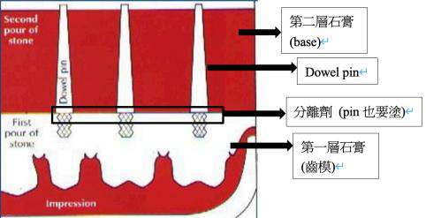

#### Di-lok tray system 

- Base 有齒輪狀 Groove 用以定位
- 先灌完模，再用特殊 Base 加厚，最後鉅下 Die  

#### Pindex system(罕見) 

- 類似 Post-pour，但是雷射定位，機器鑽孔

## Wax & Cast

> 在 die 上堆蠟

- Die Spacer: 提供黏著劑空間
  - 厚度 20–40μm
  - Margin 1mm 不塗，保留為密合區
- Marking the Margins
  - 不能用鉛筆：刮傷模型、顏色過深、抗焊性(anti-flux)

- Wax 性質 
  - 高熱膨脹：分層堆蠟
  - 殘餘應力：包埋前 remelt修邊 
  - 揮發性：重複加熱會裂開

- Wax types 

|類型|硬度|使用方式|特性
|-|-|-|-|
|Type I|中硬|口內直接法|在口溫下不應流動|
Type II|軟|模型間接法|室溫下仍應穩定不變形

- 編號工具
  - Wax addition instruments(No. 1 & 2, B)
  - Burnisher(No. 3, C)：可微熱使用，用於光滑與緊密化表面。
  - Wax carvers(No. 4 & 5, DE&F)：保持銳利，不加熱。
  - spatula (No. 7 / 7A, GH)：大量堆蠟，建立初始coping最實用。

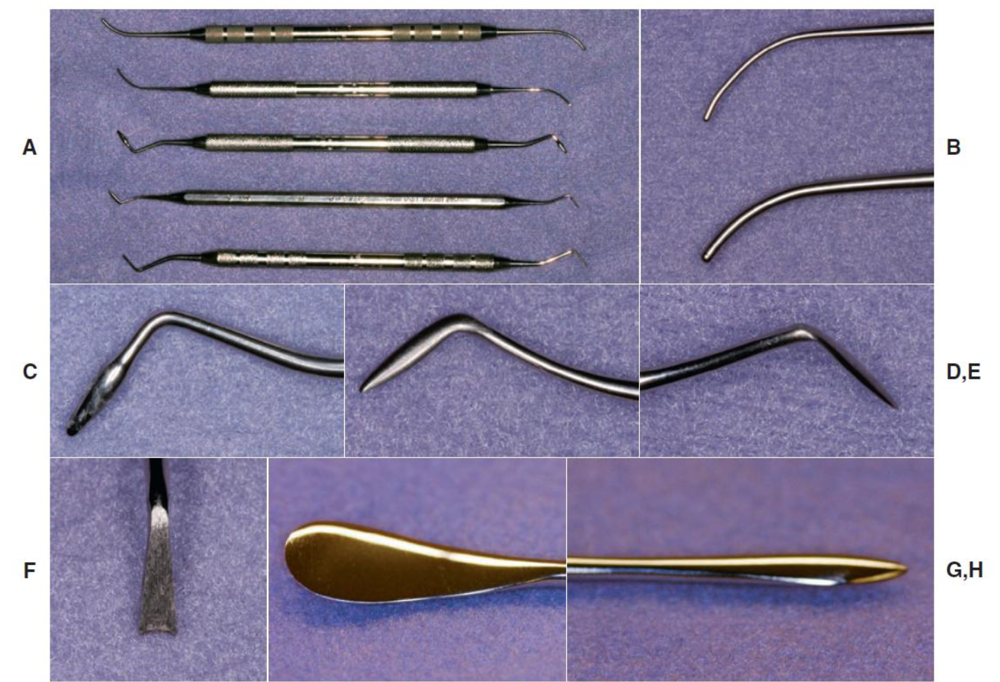

---
- 鑄道
  - Wax: 常用 
  - Plastic: 沸點比 Wax 高
    - 強度高、變形量小
    - 會堵塞，導致 Wax 殘留 &rarr; Metal 表面粗糙
    - Plastic 中空設計，避免堵塞
  - Metal
    - 高熔點
    - 中空設計
- 一般來說，鑄道的直徑大較好：熔融金屬更易流通

- Attachment (鑄道的連接點)
  - 過窄：流速不足
    - 孔洞(Porosity)
    - 表面粗糙：熔液流動不穩、氣體無法順利排出。
  - 過寬：熔液衝擊模壁
    - 湯口痕 (Sprue mark) / 流線痕 (Turbulence mark): 衝擊模壁，導致Attachment周遭表面不平整。
    - 收縮孔洞 (Shrinkage porosity)：熔液太快充滿模穴、主體先凝固 → 連接點仍液態 → 產生回縮時金屬不足。
    - 過寬處冷卻速度不均，導致內部應力集中，易產生微裂。

### 包埋 

- Setting Expansion

- 包埋材的組成
  - 耐火材料(Refractory Material)：常為矽土(silica)
  - 結合劑(Binder Material)：提供強度，用以分類
  - 添加劑(Additives)

#### Gypsum-bonded Investment 
- 650°C> 石膏不穩定
- Setting 放熱 &rarr; 混合時間長會縮短 Working Time
- 耐火材：方石英/白矽土(Cristobalite)、石英(Quartz)
- Type II, III, and IV 金合金。
- 膨脹
  - 硬化性膨脹(Setting Expansion)
  - 吸濕性膨脹(Hygroscopic Expansion)

  - 熱膨脹(Thermal Expansion)'
    - Cristobalite, Quartz 受熱由 &alpha; 轉 &beta; 相 &rarr; 水粉比高，膨脹少
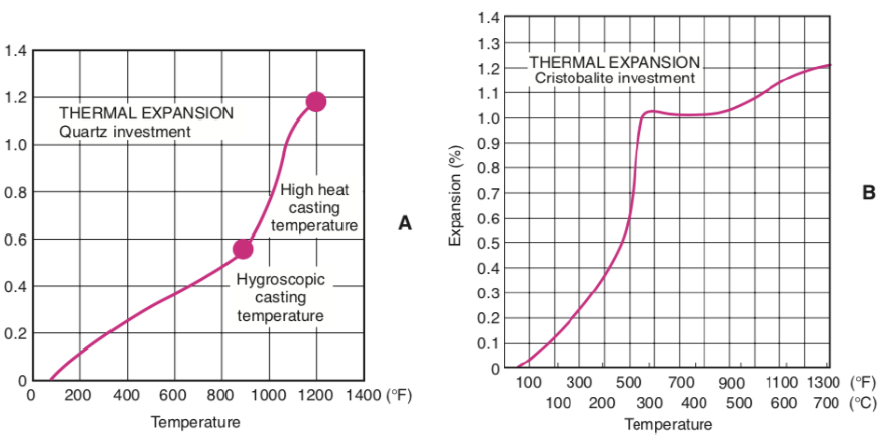

#### Phosphate-bonded investment

- 高濃度的Silica
- Blinder: MgO, NH~4~PO~4~
  - Working Time 短 
  - Setting 放熱 &rarr; 混合時間長會縮短 Working Time
  - Setting Expansion 可控，粉多膨脹高
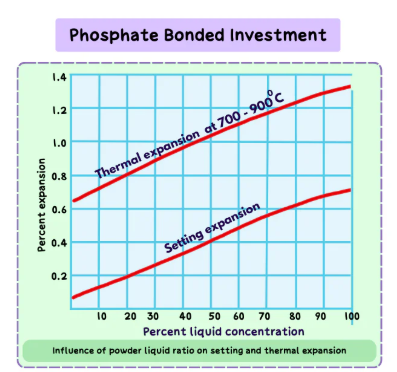
- Colloidal Silica in Water 膠體二氧化矽懸浮液
  - 取代水 
  - 延長 Working time 
  - 增加 Setting expansion : 膠體矽氧網絡在凝結時會形成更多交聯結構，使結構間的排斥力增大。
  - 增加 Thermal expansion : refractory 更強，能加熱到更高溫 
  - 增加表面平滑
- 孔隙小，空氣難完全離去

### 鑄造 

- PFM 合金需要 Gas-Oxygen Torch

## Resin-Bonded Fixed Dental Prostheses

- Panavia: bis-GMA-based resin + 10-methacryloxydecyl dihydrogen phosphate(MDP)
  - 彈性係數低
  - 較高的 fracture toughness
  - 隔絕氧氣、水硬化
    - polyethylene glycol gel (Oxyguard II) 隔絕氧氣
    - Rubber dam

### 馬里蘭牙橋
- Etching 賤金屬 Bounding 到 Enamel 
- zirconia 能做 single wing ，易清潔

- 優點
  - 移除最少的齒質
  - 對於 pulp 的 trauma 最少可以不需要用到麻醉劑
  - preparation 在牙齦上方(1mm)
  - 印模容易
  - 可以不需要臨時假牙
  - 減少看診時間
  - 較低的花費
  - Rebonding 是可行的(掉了可以輕易再黏回去)
- 缺點(本篇重點)
  - 贗復物的壽命較短：已經研究證實，壽命較傳統 FPD 來得短算是最大缺點
  - 一定要對 enamel 做調整(修形)
  - 殘留的空間不一定符合需求：使用樹脂固定式 FPD 時，缺牙區的空間很難做調整，當缺空間比自然牙尺寸大或小時，就很難用這種 FPD 達到美觀需求
  - 牙齒本身要排列得好
  - 對於後牙的美觀常需妥協：在後牙，由於金屬支架必須延伸到咬合面，不是很美觀
- 禁忌症(本篇重點)
  - 有 parafunction 習慣者 (如磨牙 )
  - 較長的無牙區
  - abutment 有受損或復形過 (restored)
  - compromised enamel(如 hypoplasia)
  - 明顯 pontic 寬度誤差
  - deep bite
  - 鎳過敏
  - 美觀區有可能會透出金屬色

- Bonding Area
  - 距離Free gingiva約1 mm
- 厚度要求：Zirconia框架需達到 0.7 mm。
- Light chamfer Margin

# 材料 

## Ceramic 

- 分成 Mill, Press 
- 不要 Bevel， 邊緣太薄車機做不出來
- 最小厚度 
  - Particle filled glass: 1mm
  - Zirconia: 0.5mm
- 都要 Rounding

- 材料
  - Glass-matrix ceramics(particle filled glasses)
  - Polycrystalline ceramics
  - Resin matrix ceramics (ceramic-polymer compound material)

| 類別 | 組成與代表材料 | Flexural strength (MPAa) | 特色|
|------|------------------------|----------------------------|-|
| **Particle-filled glasses** |\oneline{
- Feldspathic porcelain (長石瓷)
- Leucite-reinforced ceramic
- Lithium disilicate（二矽酸鋰）
}| ~120–500  | \oneline{
- 玻璃含量高 → 透明度最佳
- 脆性高，不建議長跨距 FPD
- ==前牙, 單顆冠、貼面、inlay/onlay==
}
| **Polycrystalline ceramics** （多晶陶瓷） |\oneline{
- Zirconia（3Y/4Y/5Y）
- Alumina（氧化鋁）
}| ~700–1200+  （Zirconia）|\oneline{
- 無玻璃相 → 結構緻密、韌性最好
- 半透明性較差
- 需良好拋光以避免磨耗對咬牙
- ==長跨距 FPD、後牙耐咬==
}
| **Ceramic-polymer compound material** （陶瓷–樹脂混合材料） | \oneline{
- Hybrid ceramic / Resin matrix ceramic
}| ~150–200 |\oneline{
- 好加工、易修補 &rarr; CAD/CAM
- 彈性，較不脆
- 強度不足，不建議 FPD &rarr;==臨時冠、單顆冠、inlay/onlay==
}|

| 燒結溫度分類 | 燒結溫度範圍 (°C) | 臨床／材料應用 |
|---|---|---|
| High-fusing ceramics | >1300 | \oneline{
- Porcelain jacket crown
- Denture teeth
- Fully sintered alumina zirconia core ceramics 
}|
| Medium-fusing ceramics | 1000-1300 | \oneline{
- Denture teeth
- Presintered（預燒的）zirconia
} |
| Low-fusing ceramics | 850-1000 | Metal-ceramic |
| Ultra-low fusing | <850 | Titanium and its alloys

### Glass-matrix (Particle filled glasses)

- 玻璃相
  - 熱膨脹低
  - 透明
- Devitrification(去玻璃化)：反覆燒結次數會產生結晶相
- 添加劑
  - Glass modifiers: 長石中的鈉和鉀
    - 分解SiO~2~的網架結構，降低熔融溫度
    - 增加熱膨脹係數
  - Alumina (Al₂O₃) 
    - 增加黏度，使燒瓷的過程中熔融的瓷粉不會很快地塌掉，比較容易塑形
    - 增加與金屬鍵結
    - 透明度 &darr;
  - Li₂O
    - 促進玻璃相流動

- 燒結
  - 網狀 Si-O 打斷重排 &rarr; SiO~2~ 含量高則燒結溫度高
  - 陶瓷燒結後會有27-45%的收縮

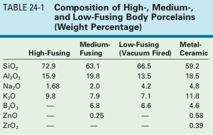

### Resin matrix ceramics 

#### Interpenetrating Phase composites (IPCs) 

- Primary phase
  - 多孔性陶瓷骨架
- Interpenetrating phase
  - 可滲入孔隙的 resin/ glass
- first IPC: In-Ceram Alumina
  - VITA In-Ceram
- second IPC
  - ==VITA Enamic(160 MPa)==
  - porcelain(135 MPa): 70％
  - polymer/ dental monomer infiltration: <30 MPa
  - 接近enamel ，與 lithium disilicate（≈360–400 MPa）仍有差距

### Zirconia 

- YO~2~: 四方晶相穩定劑
- Flexural strength: 900–1200 MPa

### 製作

#### Slip-casting technique (alumina core materials)
 1. 泥漿（slip）: 陶瓷粉末（如 Al₂O₃、MgAl₂O₄）分散於水或有機溶劑中
 2. 多孔模具吸走液相（水分）
 3. 陶瓷顆粒逐漸在模具內壁緊密堆積
 4. 初步低溫燒結，產生高孔隙率的生胚體
 5. 玻璃滲透（Glass infiltration）: 低黏度玻璃加熱至熔融，透過毛細作用滲入多孔陶瓷骨架
 6. 3 to 4 times stronger
- 商品: ==VITA In-Ceram==

| In-Ceram-? | 核心成分 | Flexural strength (MPa) | 備註 |
|---|---|---|---|
| **Alumina** | Al₂O₃ | 450–600 | 第一代 IPC |
| **Spinell** | MgAl₂O₄ |  300–400 | 透光性最佳 |
| **Zirconia** | Al₂O₃ + ZrO₂（~30%） |  600–700 | 最強、最不透光 |

#### Heat-Pressed Ceramics
- 瓷塊融化，壓鑄到 Wax up 的空腔
- 比 alumina core materials 有更好的 marginal fit

| Base | 融融溫度 |Flexural strength (MPa)| 特質 ||
|-|-|-|-|-|
|Leucite (KAlSi~2~O~6~) | 1165&deg;C |120–160 | \oneline{
- 商品: ==IPS Empress (Ivoclar Vivadent)==
}|
|Lithium disilicate | 920&deg;C|360–400|\oneline{
- strength+
- 商品: ==IPS e.max (Ivoclar AG)==
}|
|Zirconia-Reinforced Lithium Silicate (ZLS) | 860&deg;C |370–420| \oneline{
- 透明度不如 Lithium disilicate 
}|

#### Machined Ceramics
- 常用，佔8成
- 燒結好的瓷塊/瓷片，再用機器去硨出形狀當牙冠
- ==VITA Enamic(160 MPa)==

## 合金 

- 氧化層
  - Fe: Au
  - Sn, In: lower gold alloys 
- 染色
  - 銀原子透過diffusion進入陶瓷，呈現灰色或灰黃色調
---
### High noble metal alloys
- Au-Pt-Pd
  - 最早
  - 低 yield strength, elastic modulus
  - 密度最高
- Au-Pd-Ag
- Au-Pd
  - 高 yield strength, elastic modulus
- PFM 金屬的線性膨脹係數需要比陶瓷的多0.5x10-6 /℃，

### Noble alloys 
> 都是 Pd base，Pd熔點(1555°C)遠高於 Au(1064°C)

- Pd-Ag
  - 0-2％ Au，平價金牙
  - 不容易在鑄造時出現孔洞
  - In + 2% Au 會變成黃色
- Pd-Cu-Ga
  - Ga 降低熔點
  - 鑄造精確度高與  High noble metal alloys 相當
  - 高鈀合金可能會造成細胞毒性
  - casting出來可以直接燒瓷
- Pd-Ga
  - 硬度低
- Pd-Ga-Co
  - 相較 Pd-Ga 硬度提高，但會生成的深色氧化物

## Solder 

- 焊劑(Solder): 
  - Group I 含Gold，Group II 不含
  - 流動性: Ag &uarr;,  Cu &darr;, Au &darr;
  - Ag 會染陶瓷
  - Au &geq; 615或580金

- 助熔劑(Soldering Flux)
  - Borax glass (Na~2~B~4~O~7~, 硼砂)
  - 污染陶瓷
- 抗熔劑(antiflux)
  - Graphite 石墨
  - 氧化鐵

## 印模 

| 材料類別 | Accuracy | 優點 | 缺點 / 限制 | 操作 | 灌模 |
|---|---|:---|:---|:---|---|
|  PVS | 極高 (<25 μm) | 尺寸穩定性最強、抗撕裂強度高、可多次灌模 | 具疏水性、價格高、乳膠手套會抑制聚合 | 需排齦以克服疏水性；避免接觸乳膠 |  >60 min（H~2~） |
| 縮合型矽膠 (C-Silicone) | 中（約 50 μm） | 價格較 PVS 低、操作感適中 | 副產物（酒精）揮發導致明顯收縮 | 需快速調拌，因聚合反應較快 | < 30 min | 
| Polyether | 高 (<35 μm) | 極度親水、流動性優、適合多顆基牙 | 材質極硬、味苦、吸水會膨脹 | 僅限噴灑消毒；取出需迅速以防變形；嚴禁浸泡水中 | >30 min（應力回彈） | 
| Polysulfide | 優（約 40 μm） | 彈性極佳、抗撕裂強、工作時間最長 | 副產物（酒精）、氣味極臭、易沾染衣物、需手工調拌 | 調拌需均勻無條紋；凝固時間 8–12 分鐘 | <60 min（水） | 
| Agar | 高（約 25 μm） | 親水性極佳、成本低、模型表面細緻 | 需昂貴恆溫設備、操作流程繁瑣、強度低 | 噴灑消毒；需經液化(100 °C)、儲存(65 °C)、回火(45 °C)三步驟 | 立即 | 
| Alginate | 低 (>100 μm) | 便宜、操作簡單、病患接受度高 | 尺寸穩定性差 | 僅限噴灑消毒；注意粉水比；攪拌需排除氣泡 | 立即 | 

# 期末 

## 長度

- 冠外、冠內附連體: Crown 高度>4mm
- 橫槓式、鈕釦式、磁鐵式附連體：垂直咬合高度(VDO) > 7-9mm
- Solder Gap Width：0.25mm
- Pre-ceramic soldering：可以急速冷卻增加強度
