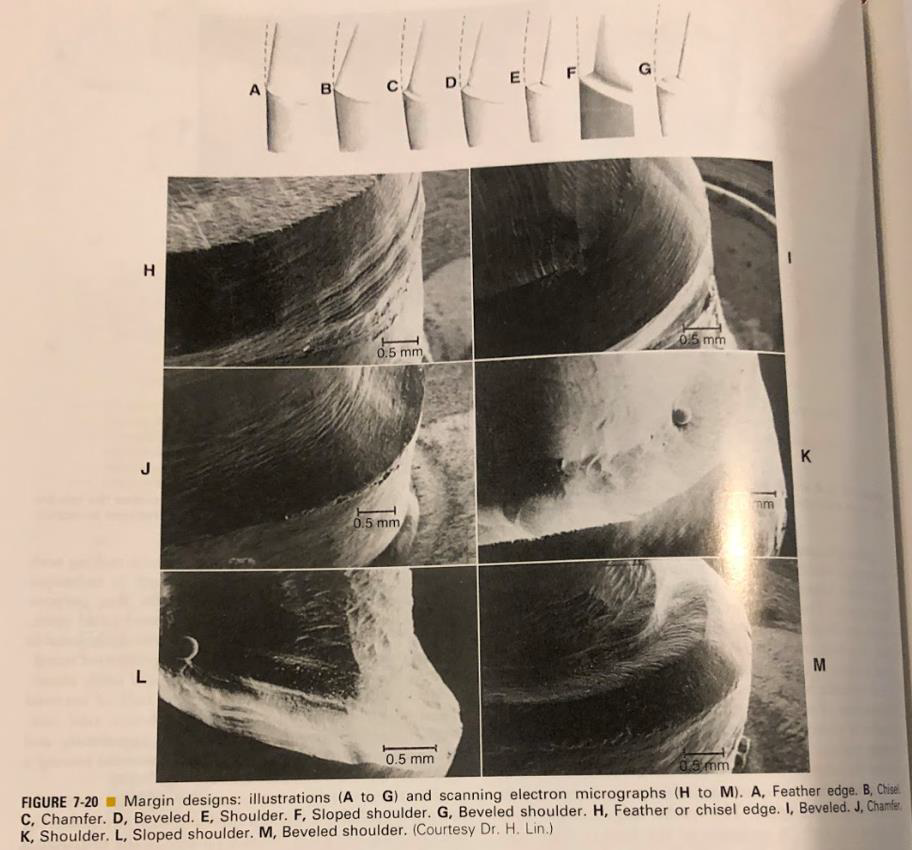

---
toc:
    depth_from: 1
    depth_to: 3
html:
    offline: false
    embed_local_images: false #嵌入base64圖片
print_background: true
export_on_save:
    html: true
---

# 名詞 

Luting agent
: 黏著劑

# Marginal design

A. Feather edge
C. Chamfer
D. Beveled
E. Shoulder (與牙齒夾角約90度)(容易有undercut)
F. Sloped shoulder (與牙齒夾角約120度或135度)
G. Beveled shoulder (與牙齒夾角約90度，但在邊緣會做成斜面)

- Feather edge(少用)
  - 做陶瓷貼片(Porcelain Laminated Veneer)
- Chisel edge
- Chamfer margin
  - 鑄造金屬牙冠(cast metal crown)
  - 現在全瓷冠也可以用
  - chamfer margin < 0.5mm (半支 Bur)，否則產生 ==unsupported lip of enamel==
- Beveled margin
  - Cast
  - 藏在 Subgingival
- Shoulder
  - 要和表面垂直
  - PFM 的 Buccal
- Sloped shoulder (與牙齒夾角約120度或135度)
- Beveled shoulder
  - Shoulder 外面再 Beveled 
  - metal collar 的 PFM 的 Buccal

> 通常 Crown 會略大，Beveled 比較不密

> 金屬空隙能到 10 &mu;m

# Resistant 
- 咬合力約 4340N
- 適宜的taper為5~22&deg;
- 大臼齒的cusp height至少要有3.5~4 mm
- h/w > 0.4
- ZPC 24h 抗壓 70MPa

# Prepare 

- Functional cusp > 1.5mm
- Nonfunctional cusp > 1mm

# Complete cast 

- Chamfer: 0.5mm
- Functional: 1.5mm
- Nom-functional: 1mm

# PFM 

- 燒瓷前後都能修金屬
- PFM支架燒瓷溫度約960°C，傳統 complete cast crown 金屬會融化
- 熱膨脹低
- 磨很多（complete cast crown只咬 1mm
