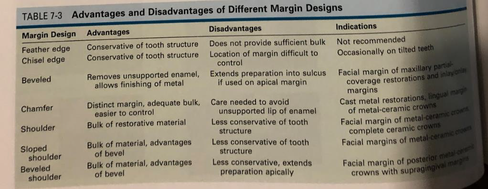
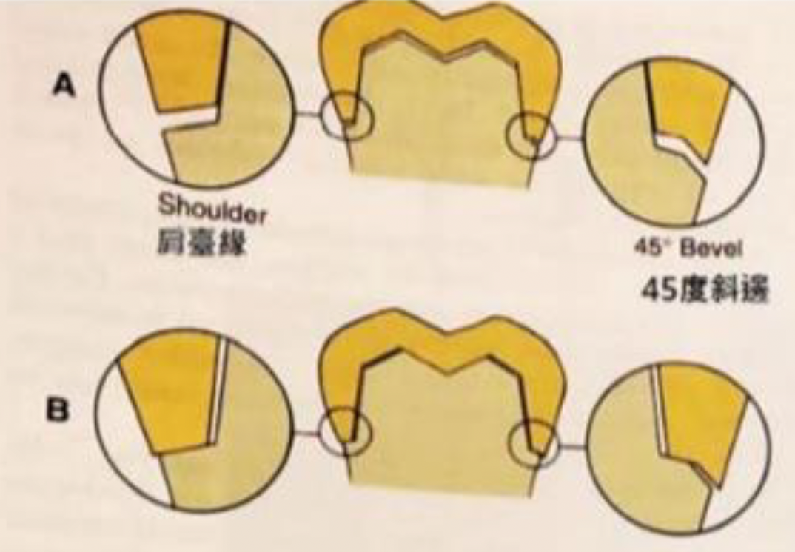

---
toc:
    depth_from: 1
    depth_to: 3
html:
    offline: false
    embed_local_images: false #嵌入base64圖片
print_background: true
export_on_save:
    html: true
---

# FPD

## 名詞 

Luting agent
: 黏著劑

## Marginal design

A. Feather edge
C. Chamfer
D. Beveled
E. Shoulder (與牙齒夾角約90度)(容易有undercut)
F. Sloped shoulder (與牙齒夾角約120度或135度)
G. Beveled shoulder (與牙齒夾角約90度，但在邊緣會做成斜面)

- Feather edge(少用)
  - 做陶瓷貼片(Porcelain Laminated Veneer)
- Chisel edge
- Chamfer margin
  - 鑄造金屬牙冠(cast metal crown)
  - 現在全瓷冠也可以用
  - chamfer margin < 0.5mm (半支 Bur)，否則產生 ==unsupported lip of enamel==
- Beveled margin
  - Cast
  - 藏在 Subgingival
- Shoulder
  - 要和表面垂直
  - PFM 的 Buccal
- Sloped shoulder (與牙齒夾角約120度或135度)
- Beveled shoulder
  - Shoulder 外面再 Beveled 
  - metal collar 的 PFM 的 Buccal

> 通常 Crown 會略大，Beveled 比較不密

> 金屬空隙能到 10 &mu;m

## Resistant 
- 咬合力約 4340N
- 適宜的taper為5~22&deg;
- 大臼齒的cusp height至少要有3.5~4 mm
- h/w > 0.4
- ZPC 24h 抗壓 70MPa

## Prepare 

- Functional cusp > 1.5mm
- Nonfunctional cusp > 1mm

## Complete cast 

- Chamfer: 0.5mm
- Functional: 1.5mm
- Nom-functional: 1mm

## PFM 

- 燒瓷前後都能修金屬
- PFM支架燒瓷溫度約960°C，傳統 complete cast crown 金屬會融化
- 熱膨脹低
- 磨很多（complete cast crown只咬 1mm

## Wax & Cast

> 在 die 上堆蠟

- Die Spacer: 提供黏著劑空間
  - 厚度 20–40μm
  - Margin 1mm 不塗，保留為密合區
- Marking the Margins
  - 不能用鉛筆：刮傷模型、顏色過深、抗焊性(anti-flux)

- Wax 性質 
  - 高熱膨脹：分層堆蠟
  - 殘餘應力：包埋前 remelt修邊 
  - 揮發性：重複加熱會裂開

- Wax types 

|類型|硬度|使用方式|特性
|-|-|-|-|
|Type I|中硬|口內直接法|在口溫下不應流動|
Type II|軟|模型間接法|室溫下仍應穩定不變形

- 編號工具
  - Wax addition instruments(No. 1 & 2, B)
  - Burnisher(No. 3, C)：可微熱使用，用於光滑與緊密化表面。
  - Wax carvers(No. 4 & 5, DE&F)：保持銳利，不加熱。
  - spatula (No. 7 / 7A, GH)：大量堆蠟，建立初始coping最實用。

---
- 鑄道
  - Wax: 常用 
  - Plastic: 沸點比 Wax 高
    - 強度高、變形量小
    - 會堵塞，導致 Wax 殘留 &rarr; Metal 表面粗糙
    - Plastic 中空設計，避免堵塞
  - Metal
    - 高熔點
    - 中空設計
- 一般來說，鑄道的直徑大較好：熔融金屬更易流通

- Attachment (鑄道的連接點)
  - 過窄：流速不足
    - 孔洞(Porosity)
    - 表面粗糙：熔液流動不穩、氣體無法順利排出。
  - 過寬：熔液衝擊模壁
    - 湯口痕 (Sprue mark) / 流線痕 (Turbulence mark): 衝擊模壁，導致Attachment周遭表面不平整。
    - 收縮孔洞 (Shrinkage porosity)：熔液太快充滿模穴、主體先凝固 → 連接點仍液態 → 產生回縮時金屬不足。
    - 過寬處冷卻速度不均，導致內部應力集中，易產生微裂。

### 包埋 

- Setting Expansion

- 包埋材的組成
  - 耐火材料(Refractory Material)：常為矽土(silica)
  - 結合劑(Binder Material)：提供強度，用以分類
  - 添加劑(Additives)

#### Gypsum-bonded Investment 
- 650°C> 石膏不穩定
- Setting 放熱 &rarr; 混合時間長會縮短 Working Time
- 耐火材：方石英/白矽土(Cristobalite)、石英(Quartz)
- Type II, III, and IV 金合金。
- 膨脹
  - 硬化性膨脹(Setting Expansion)
  - 吸濕性膨脹(Hygroscopic Expansion)

  - 熱膨脹(Thermal Expansion)'
    - Cristobalite, Quartz 受熱由 &alpha; 轉 &beta; 相 &rarr; 水粉比高，膨脹少

#### Phosphate-bonded investment

- 高濃度的Silica
- Blinder: MgO, NH~4~PO~4~
  - Working Time 短 
  - Setting 放熱 &rarr; 混合時間長會縮短 Working Time
  - Setting Expansion 可控，粉多膨脹高

- Colloidal Silica in Water 膠體二氧化矽懸浮液
  - 取代水 
  - 延長 Working time 
  - 增加 Setting expansion : 膠體矽氧網絡在凝結時會形成更多交聯結構，使結構間的排斥力增大。
  - 增加 Thermal expansion : refractory 更強，能加熱到更高溫 
