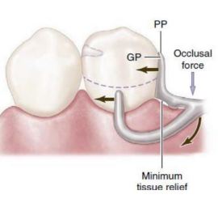
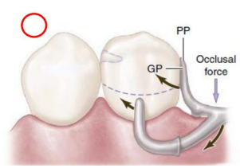

---
toc:
    depth_from: 1
    depth_to: 3
html:
    offline: false
    embed_local_images: false #嵌入base64圖片
print_background: true
export_on_save:
    html: true
--- 

# RPD 

- Support
  - rest
  - indirect retainer
  - denture base
  - major connector
- Retention
  - direct retainers
- Stability
  - proximal plate
  - major connector
  - minor connector
  - lingual plate
  - reciprocal arm
  - denture base
  - rigid components in contact with tooth surfaces

:::note {Abutment}
用來支撐、固持、或穩定局部義齒 的天然牙或植體 

- Primary: 與無牙區接觸
- Secondary: 只跟義齒接觸
:::

 

## Retention

- 抵抗 Vertical force of dislodgment (脫位)

Stress breaking Design
: 讓 Abutment 與 Base 受力時能獨立運動，避免力量全集中在 Abutment

### Direct Retainer 

- attachments  
  - 美觀 
  - 穩定 
  - Abutment 力矩小 (力量接近旋轉中心)
  - Abutment teeth 需要 4-6mm 
  - 設計複雜損失齒質
  - 需要良好 Oral hygiene

#### Intracoronal

- 一般要 Endo 
- Abutment 受力大 &rarr; 要 Splint 在一起
- 分類 
  - Precision attachments: CNC 切削 Matrix, Patrix 
  - Semiprecision: Casting

#### Extracoronal attachments

:::fbox 

:::

- 牙齒 Prepare 做牙套，現今多用 Implant 當 Abutment
- Abutment 受力大 &rarr; 要 Splint 在一起
- Joint 可以移動 &rarr; 緩衝 
- 塑膠的 Matrix 可更換，也有彈性能達到 Stress breaker

#### Clasp 

- 根據牙鉤從上或下鉤分成 Suprabulge(Circumferential), Infrabulge

### Clasp Design

- Rest
- Encirclement: >180&deg;
- Reciprocal Component (stability)

- Distal extension 要考慮 Stress breaking Design
- 盡量少 (一般放三顆 Abutment teeth 就足夠)
- Gingiva third 以下是 Retention，以上是 Stability

#### Akers clasp 

- Suprabulge
- 分區
  - Shoulder (S)：從 origin 伸出來的部分，有穩定及包覆功能，體積最大且彈性最不好(rigid)。
  - Midsection(M)：位於中段，粗細程度與彈性處於中間值(relatively flexible)
  - Terminus(T)：位於最末段，進入 undercut 以下，所以需要最細且彈性也最好(flexible)

- 要維持鉤子形狀才有彈性，能調整
- Preparation (理想:G)

---
#### Cast Circumferential clasp 
> 傳統經典
- Rest, Akers clasp, Reciprocal
- 鑄造
  - 半圓
  - 難以調整 
  - 耐用
- 缺乏 Stress breaking

:::fbox 
 
:::

#### Reverse Circumferential clasp 

- Mesial 往 DB 勾的 Cast Circumferential clasp ，適合 Distal ext.
- 

#### Ring clasp

- 用於 Md. Molar (Buccal 無 under cut) &rarr; 勾 ML
- Supporting strut
  - 需要深 Vestibular 
  - 軟組織倒凹不適用
- Second rest
:::fbox 

:::

#### Embrasure clasp 

- 一組鄰牙兩對 Retentive arm & Reciprocal arm，通常 Retentive arm 會一個 Buccal 一個 Lingual
- 適用於 Class II 缺牙
- Lingual side 的 minor connector 薄，容易咬到，斷掉
- 不適合放在有 Distal ext. 側 (右圖)，因為無 Stress breaking

:::fbox 

:::

#### Multiple clasp

- 兩個 Akers arm，舌側Reciprocal arm 連在一起
- 用於 #4 牙周不佳，以 Dual retention 分散受力

#### Half-and-half clasp 

- 一顆 Abutment tooth 兩根 Akers arm，點對稱
- Dual retention

:::fbox 

:::

#### Back-Action clasp 

- ML line angle 出發，勾到 Buccal
- 用於舌側無倒凹
- Retention 和 Reciprocal 對抗不足 &rarr; 不穩定
  - ==stress-breaking==
  - 不能用在單側 RPD

#### Reverse-action clasp (C-clasp)

- DB 出發 C-shaped clasp ，勾 DB
- Abutment 需要夠高
- 低彈性

#### Onlay clasp 

- 重建咬合平面 
- 磨對牙
- Caries++

#### 整理 

- 只有 DB 有 undercut: 
  - infrabulge/bar-type > reverse circlet > c-clasp

### Distal ext. stress breaking 

四種設計 

- wrought-wire circumferential clasp
- bar-type/infrabulge clasp
- RPI(rest, proximal plate, I-bar)
- RPA(rest, proximalplate, Aker’s/suprabulge clasp)

#### wrought-wire circumferential clasp 

- 鍛造金屬(wrought-wire)
  - 熱處理過，容易斷
  - 彈性最好，易變形 &rarr; 少數能放進 **0.5mm undercut**
  - 一般用 Stainless，Round 18-gauge (1mm)
- 可以用 Cast 的 Reciprocal arm (**combination clasp**)

#### Bar retainer 

- 用推的作用位置近旋轉中心 &rarr; 力矩小，效率高 (6-27N)
- bar 離 Gingiva margin 4mm
- 美觀優於 Suprabulge
- 接近 Denture border &rarr; Bar 受保護
- 限制 
  - Abutment tooth 過度 Lingual tilts
  - ==Soft tissue undercuts==
  - Shallow buccal Vestibular 
  - Frenum (頰繫帶)

##### T-clasp  (Roach clasp )

- Infrabulge
- 只勾 DB line angle，以抵抗 Distal rest 中心的旋轉

##### Modify T-clasp 

- T 去除 Mesial bar 以求美觀

##### Y-clasp 

- 比較長的 T (也許是用在 survey line 過高)

##### I-clasp 

- **Mesial rest**， 避免拔牙效應 

##### Swing-lock denture

- Retention: 門牙 I Bar + Labial bar
- Buccal Vestibular 6-8mm
- 下顎剩下門牙使用

#### RPI
> rest, proximal plate, I bar, lingual bar

- Mesial occlusal rest
  - 不接觸到臨牙
  - 連接 minor connector
- Proximal plate minor connector
  - 由上往下到 Mid, Cervical third 交界 (2-4mm)
  - 盡量 舌側延伸，必免往舌側翻 (Buccal 有 I Bar)

| | ||
|-|-|-|
|\oneline{
  Dr. Kratochvil FJ. 1963  
  穩定，無 Stress breaking
 } | &check; | 壓在 Alveolar crest |

- I bar 
  - 離開 Gingiva margin ==4mm==
  - Vestibular 空間(4mm)
  - 越過 Height of contour，Stability & retention
  - Retention 區域約 2mm

- 不接觸 Lingual 
  - 解決下顎 Lingual 的 survey line 很高
- 一定要配 lingual bar

- 缺點
  - I bar 所需 undercut 過低會壓迫牙齦或難以進入

:::fbox 

:::

####　RPA 
> rest, proximal plate, Akers clasp(modified), lingual bar

- RPA v.s. Akers
  - RPA 整個 clasp 都在 Undercut 下面， Akers 是 Suprabulge
- RPA 接觸牙齒處只有一條線和 Undercut 
  - Cast 要用蠟 Block out 

- 一定要配 lingual bar

## Indirect retainer 

- fulcrum line: Rest/ abutment 連線 
- Inderect retainer 離 Rest 越遠，抗旋轉越好 
  - 一般在 first premolar

### Auxiliary occlusal rest

- 就是多一個 Rest 

### Canine rest 
- premolar 太接近 Fulcrum line 時使用
- cingulum, Incisor 都行
  - Incisor 影響美觀

### Canine extensions from occlusal rest

- Rest 從 Premolar 延伸到 Canine cingulum 
- Class I, II (沒後牙適用)

### Instant 

- #44 的 Rest 同時是 Inderect retainer

---
:::fbox 

:::

- ==embrasure rest &rarr; two clasp==
- 中圖
  - Canine: Inderect retainer 
  - Molar: embrasure rest
  - Second premolar: mesial rest, Infra budge
  - Cons:
    - embrasure rest 容易斷掉 
- 右圖 Better 
  - mesial rest 改 distal: fulcrum line 遠離 
  - embrasure rest , Inderect retainer 改成 兩組 Clasp
    - 增加 retention, stability 
    - 分散受力

--- 

- Class IV 
- 為了增加 Inderect retainer 距離，選擇 **MO resst at 2^nd^ Molar**

## Denture Base 
:::left
- landmark
  - maxillary tuberosities
  - hamular notch
  - retromolar pads
  - retromylohyoid fossae
:::right

:::

- Distortion of tissue
  - 解法: 印模的時候用力把 soft tissue 往下壓

### distal extension 

- residual ridge 面積越大越好
- Support 效果受到bone, Soft tissue 影響
- 下顎骨拔牙後容易失去 cortical bone

| |Mx |Md |
|-|-|-|
| |.|.|
解剖型態|皮質骨多、Mucosa較Firm|海綿骨多
|主要受力區(1)|The Crest of the Residual Ridge|Buccal Shelf Regions
|次要受力區(2)|Buccal and Lingual Slopes|Lingual slopes of the residual ridge
relief(3)|Incisive Papilla |The Crest of the Residual Ridge
|^|Median Palatal Raphe|^
可受力區(4)|/|要延伸到Retromolar pads

--- 
#### 穩定Denture Base受力軌跡

- 受力運動軌跡垂直，避免 Mucosa 受傷
- Rest 往前，半旋轉徑變大，受力更垂直

- Indrect retainer 限制 Denture Base 

- Denture Base 不能 Overextension

## Stability 

- 金屬材夠硬，有 Stability
- 只是一份調查
  - 下顎大多是 Class I, II 

- 增加抗力臂
  - 抗力臂長 &uarr; &rarr; abutment tooth 受力 &darr; &rarr; stability &uarr;

### Class I 

- R^2^>R^1^
- 拔牙效應
- 要 Stress breaking
  - Wrought Wire
  - 不能 Cast circumferential retainer

:::fbox 

:::

#### Rotation
##### Rotation about an fulcrum lines 

> 不會在 Soft tissue 上水平移動，力量雖大，傷害相對小

- Resistant
  - Retentive clasp 
  - Minor connector
  - Indirect retainer

##### Rotation about the crest of the residual ridge

- Resistant
  - major and minor connectors

##### Rotation about center vertical axis 

- Resistant
  - reciprocal arms
  - major and minor connectors

  

### Guiding plane 

- 垂直 2-4mm 
  - Distal Ext. 考量 Stress breaking，只需 1.5-2mm
- Reciprocal arms 
  - 只有 retentive arm 接觸會產生側向力 &rarr; 修磨 Guiding 確保 Reciprocal arms 同時接處
  - 無法磨出適合的 Guiding plane 也能用 lingual plate
:::fbox 

:::

- 前牙缺牙
  - 能減少 undercuts 避免塞東西

###  Block out 

Master cast 做完 Block out 才能去翻耐火模

#### Parallel block out 
- 依照 path of insertion
- 6個要做平行封凹 

|Parallel block out |Thickness |Material
|-|-|-|
 guiding planes (Proximal)|只有析量刀與**牙面接觸點**之下的倒凹| Hard baseplate wax or blockout material|
minor connectors下方|^|^|
connectors 所跨越過的組織倒凹 |只有析量刀與**牙模型表面接觸點** 之下的倒凹|^|
minor connectors or lingual plates所覆蓋的鄰接縫隙|^|^|
Bar clasp 起點所跨越過的組織倒凹|^|^|
bar clasp arms to gingival crevice|僅牙鉤臂附著於 小連接體所包含的倒凹|-|

#### Shaped block out

- 在牙齒之頰及舌側面，用來定位牙鉤臂的蠟型
- 為了特定 clasp 功能，常用於 I bar, RPI clasp, RPA clasp
- Thickness
  - 定位 Retentive Arms: 盡量接近齒頸部位
  - 定位 Reciprocal arms: 順者 Height of contour
  - I bar 進入倒凹區時，會在牙齦邊緣處做「斜面狀」或「凹弧狀」的 shaped block out，讓金屬能順利滑過軟組織、不壓迫牙齦。
- Material: Hard baseplate wax
#### Arbitrary block out

- 方便鑄造與脫模，而非改變義齒設計
- 較大面積或深倒凹時可搭配 **oil-based clay** 以填平。

| Arbitrary block out | Thickness | Material | 備註 |
|------------|------------------|------------|------|
| 所有牙齦溝 | 牙齦溝適度平順 | Hard baseplate wax | 避免金屬框架壓迫牙齦緣 |
| denture framework 下方的大範圍組織倒凹 | 以蠟刀任意填平 | Hard baseplate wax 或 oil-based clay | 防止倒凹造成脫模困難 |
| denture framework distal 組織倒凹  | ^ | ^| 常見於終末 abutment teeth diatal 組織處 |
| 未包含於義齒設計的Buccal 牙齒及組織倒凹 | 填平至Coronal third &uarr; | ^| 修整非功能性倒凹區以利脫模 |

#### Relief 

- 刻意留出空間避免壓迫組織

| 區域 / 適應情況 | Thickness |Material |
|------------------|----------------|------------|
| lingual bar/plates 下 |\oneline{
- 舌側骨面平行於義齒置入方向: 32 gauge wax（0.2–0.25 mm）
- 舌側骨面**倒凹**: Parallel block out 再 32 gauge
}| Adhesive wax|
| major connectors 會接觸的軟薄組織區：Md. Lingual 骨嵴, palatal raphes | 薄薄一層蠟|Hard baseplate wax|
| Denture base framework 附著在 Resin 上方部分 |20 gauge wax | Adhesive Wax |

### 整理表 

