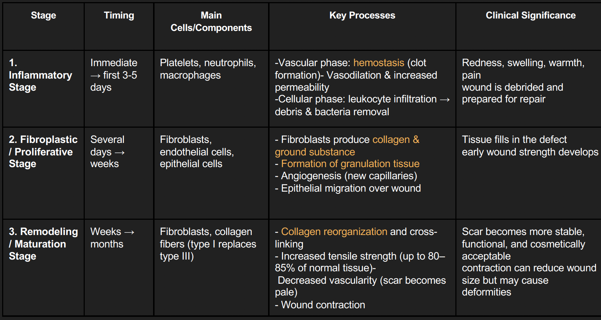
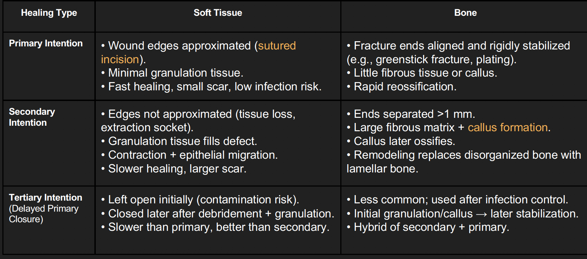
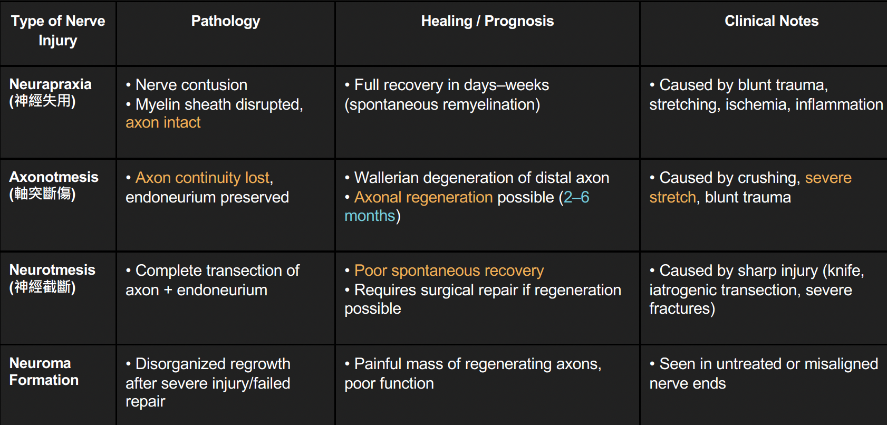
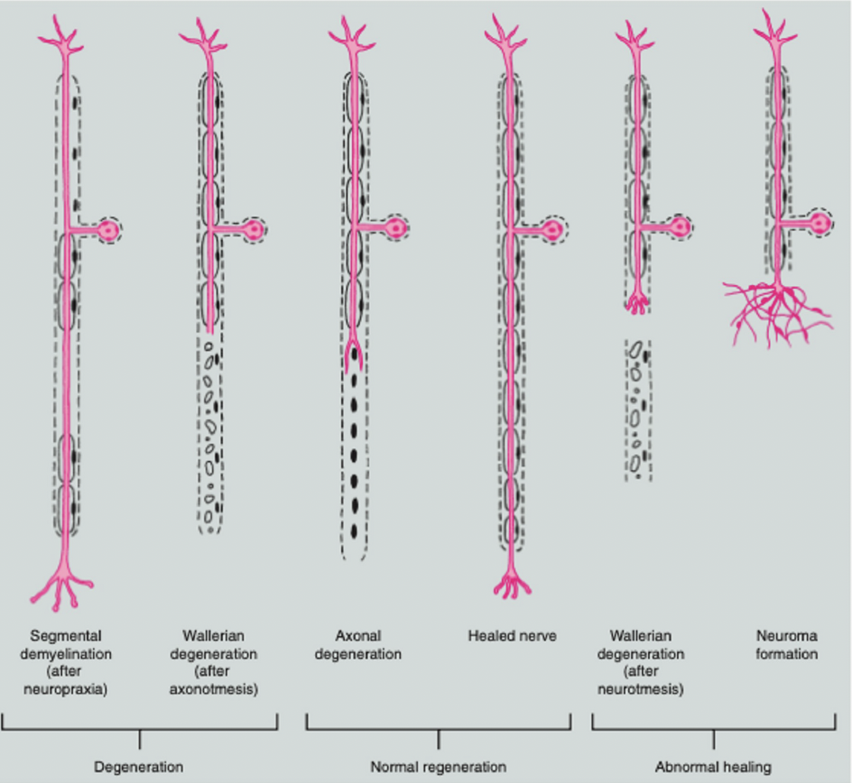

---
toc:
    depth_from: 1
    depth_to: 3
html:
    offline: false
    embed_local_images: false #嵌入base64圖片
print_background: true
export_on_save:
    html: true
---
# Repair 

| Stage                        | Timing                  | Main Cells/Components                        | Key Processes                                                                                                                                      | Clinical Significance                                                                                       |
|-------------------------------|-------------------------|----------------------------------------------|---------------------------------------------------------------------------------------------------------------------------------------------------|-------------------------------------------------------------------------------------------------------------|
| **Inflammatory Stage**     | 3–5d | Platelets, neutrophils, macrophages           | \oneline{
- Vascular phase: hemostasis (clot formation), vasodilation & increased permeability
- Cellular phase: leukocyte infiltration → debris & bacteria removal | Redness, swelling, warmth, pain Wound is debrided and prepared for repair
}|
| **Fibroplastic / Proliferative Stage** | \~1w  | Fibroblasts, endothelial cells, epithelial cells | - Fibroblasts produce collagen & ground substance - Formation of granulation tissue - Angiogenesis (new capillaries) - Epithelial migration over wound | Tissue fills in the defect Early wound strength develops                                                 |
| **Remodeling / Maturation Stage** | ~Ms         | Fibroblasts, collagen fibers (type I replaces type III) | - Collagen reorganization and crosslinking - Increased tensile strength (up to 80–85% of normal tissue) - Decreased vascularity (scar becomes pale) - Wound contraction | Scar becomes more stable, functional, and cosmetically acceptable Contraction can reduce wound size but may cause deformities |

## Impair wound healing

- foreign material
- necrotic tissue
- ischemia
- wound tension

## Healing type 

- 拔牙為 II 
- 骨裂 >1mm 會有骨痂
- 
## Healing of extraction sockets

| Day 1-2 | Week 1 | Week 2-3 |
|-|-|-|
|\oneline{
- ==Blood clot== forms → fibrin mesh stabilizes socket
- Acute inflammation → neutrophils & macrophages clear debris
}| \oneline{
- Clot &rarr; ==Granulation tissue== 
- Fibroblasts & endothelial cells proliferate → ==angiogenesis==
- Early epithelial migration from wound margins
}|\oneline{
- Granulation tissue → ==organized ct.==
- Collagen deposition increases
- ==Complete epithelial coverage== usually achieved
}

|Week 4-6 |Months 3-6 |
|-|-|
\oneline{
- ==woven bone== filled sockets
- trabecular framework replaces fibrous tissue
}|\oneline{
- Remodeling: woven bone → ==lamellar bone==
- marrow space develop
- final healed ridge with reduce h/w
}

## Nerve injury

- mandibular resection for oral neoplasms
- removal of impacted lower third molars
- Repair: 1-1.5 mm/day

# 阻生齒 

## Md.

- Angulation
  - 難度: Mesioangular < Horizontal < Vertical < Distoangular
  - 頻率: Mesioangular(43%) > Vertical(38%)> Distoangular(6%) > Horizontal(3%)
- Pell and Gregory classification
  - class 1: Crown 的MD直徑完全位於 Ramus 前緣之前，最好拔。
  - class 2：Crown 的MD直徑約有一半被Ramus覆蓋。
  - class 3： Crown 完全在 Ramus 內
  - Class A：阻生牙的咬合面最高點與第2^nd^ Molar 的咬合平面幾乎齊平
  - Class B：阻生牙的咬合面最高點介於2^nd^ Molar 的咬合平面和 CEJ 之間。
  - Class C：是指阻生牙的咬合面最高點低於2^nd^ Molar 的 CEJ。
:::fbox 
1
2
3
:::

- 牙根長度
  - 形成約1/3～2/3時，是最佳的拔除時機
  - 完全發育可能尖、畸形
  - 形成不到1/3，牙齒會在 follicle 內轉

- 健保代號 (軟組織覆蓋)

### 步驟 

1. Flap
2. 去除周邊骨頭 
   - Lingual 保留
3. 分割牙齒
   - Lingual 保留 
:::fbox 

:::

## Mx.
- Angulation
  - 難度：Distoangular < Vertical < Mesioangular
  - 頻率：Vertical(63%)> Distoangular(25%) < Mesioangular(12%) > Others(<1%) 

## 術後 
- 疼痛管理
  - 術前或取出紗布後給藥
  - 至少 3～4 天
  - 一般會開 Ibuprofen (NSAIDs) 7天 QID
- 腫脹
  - 輕度腫脹持續約3～4天(第三天高峰)
  - 約5～7天後可完全消退
  - 第1-2天可以冰敷，冰敷並不會使腫脹消退但會減緩不適。
  - 第3天開始熱敷，促進血液循環，加速腫脹消退。
- 類固醇使用：
  - 術前或術中給予 Dexamethasone 8 mg
  - 口服劑量：0.75～1.25mg，每日兩次，連續2～3天
  - 可能產生副作用，也有研究指出會增加乾槽症發生機率，非必要不建議
- 抗生素：有研究指出會降低乾槽症機率
- 張口困難(Trismus)
  - 常見於下顎阻生牙拔除後(正常現象)
  - 通常在術後7～10天隨腫脹消退恢復正常
- 症狀持續超過7天→需進一步檢查
