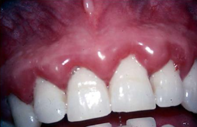
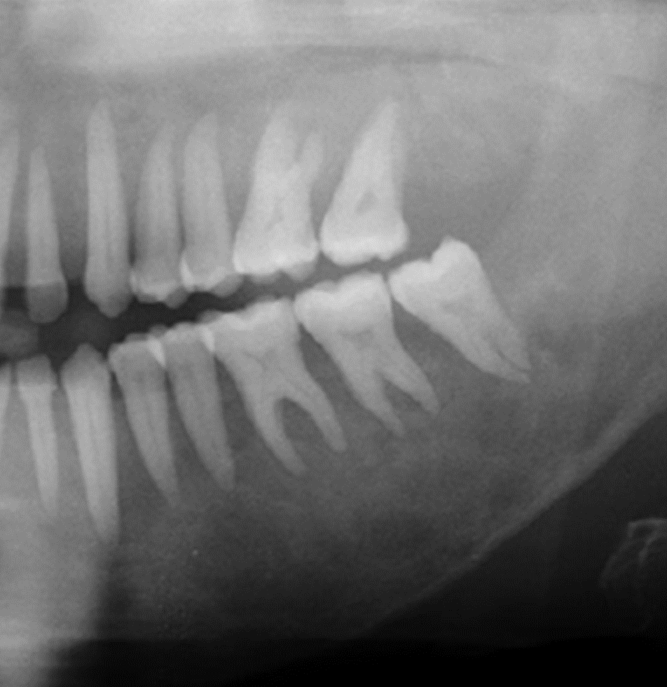
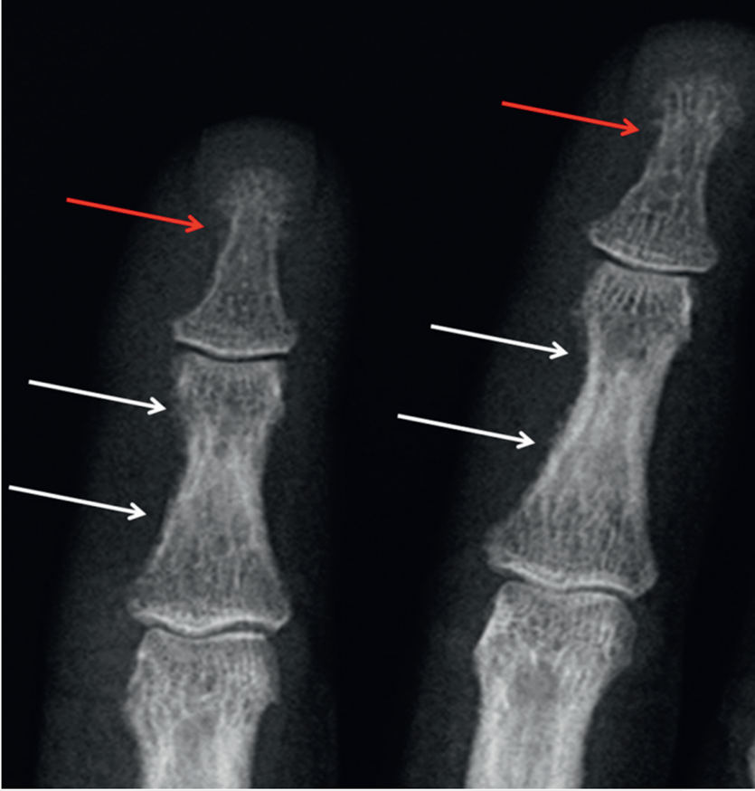

---
toc:
    depth_from: 1
    depth_to: 3
html:
    offline: false
    embed_local_images: false #嵌入base64圖片
print_background: true
export_on_save:
    html: true
--- 

# 檢測實驗數據

## Case 1: Gingiva Bleeding

- 65y 79kg 165cm 
- 心肌梗塞、服用凝血 
- CP: 刷牙 Bleeding
- Bleeding? 
  - 血小板
    - Thrombocytopenia
      - 出血: < 10 *10^9^ cells/L (normal 220-250 *10^9)
    - Thrombasthenia
  - Coagulation Factor V mutation 
  - Vascular 
  - Inflammatory / Truma
  - Durg

:::note {DM} 

- Free gingiva: Inflammatory、hypertrophy、出血
- 周邊血管基底膜AGEs堆積，增厚

:::

:::note {Advanced Glycation End-products (AGEs)}
AGEs 是還原糖和蛋白質、脂質或核酸經過Maillard reaction，形成的穩定化合物。
- 結合模受體 RAGE 
- 活化 NF-&kappa;B &rarr; TNF-&alpha;, IL-1&beta;, IL-6
:::

### 血液檢查 

- Complete Blood Count (CBC)
- 特別
  - Bleeding time 
  - Partial thromboplastin time 
  - Prothrombin time 
  - Thrombin time

### 心肌梗塞

| Marker | Increase | Peak | Return |
|---------------|---------------------|----------------|-------------------|
| **Myoglobin** | ==1–4h== | 6–7h| 24h|
| **CK-MB (Creatine Kinase-MB)** | 3–12h| 24h| 2–3d |
| **Troponins T & I** | 3–12h | 24–48h| ==7–14d== |
| **LDH (Lactate Dehydrogenase)** | 8–12h| 2–3d | 7–10d |

- WBC, CRP (C-Reactive Protein), ESR (Erythrocyte Sedimentation Rate) &uarr;

## Case 2 

- CP:最近假牙及附近牙齒鬆動的很明顯。
- 平常很注意口腔衛生，尤其在更換新的假牙更注重牙周清潔。
- 口腔檢查確實牙周很好，但是牙齒確鬆動。
- X-光檢查發現牙周的齒槽骨有變化，牙根周圍的lamina dura 明顯的消失。

---

- 牙周乾淨 &rarr; not local cause 
- lamina dura missing &rarr; 低血鈣  &rarr; Hyperparathyroidism
- 檢測 
  - Serum calcium 
  - Phosphorus
  - PTH 
  - PTHRP 
  - Vit.D

:::left

:::right

:::

## Case 3: DM 
有個欲做全口假牙的病患，在躺在治療椅上，醫師可以輕易聞到一股奇特的酸甜味道由病患口鼻中發出。此氣味來自病患的呼吸。病人是個有第二型糖尿病的中年男性。請問應做那些檢查可以評估現在病人的健康情形?

--- 

> 健康評估 

- Blood: 
  - CBC
  - AC (Ante Cibum / 空腹血糖)
  - PC (Post Cibum)
- Biochemistry: 
  - BUN (Blood Urea Nitrogen)
  - Cr.(Creatine, 肌酸酐)
  - GOT, GPT
  - HbA1C (3-4 月血糖平均): 
    - normal: 4-6.5% 
    - DM 前: 5.7-6.4% 
    - DM: >6.5%

## C
