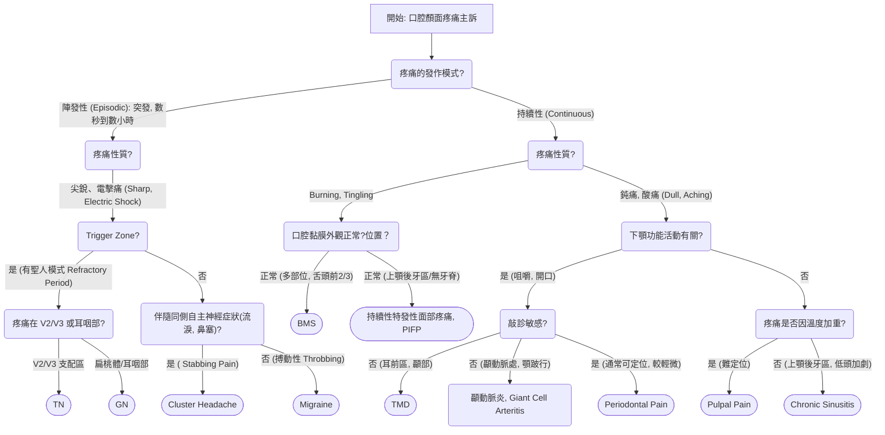

---
toc:
    depth_from: 1
    depth_to: 3
html:
    offline: false
    embed_local_images: false #嵌入base64圖片
print_background: true
export_on_save:
    html: true
---

1. 我是陳相瑋醫師
2. 患者姓名出生
3. 主訴
4. PMH 系統性家族性疾病/慢性病三高/用藥史
5. allergy 
6. ABC
7. 口內檢查
   1. 左右臉頰
   2. 上下唇
   3. 上顎
   4. 舌頭口底

## Ulcer 

- 擦拭
- 觸診，induration?
- Trauma history, 磨牙
m

## Oralfacial pain 

## 治療 

- 念珠菌
  - Nystatin
- 三叉神經、舌咽神經
  - Carbamazepine
- BMS
  - Rivotril
