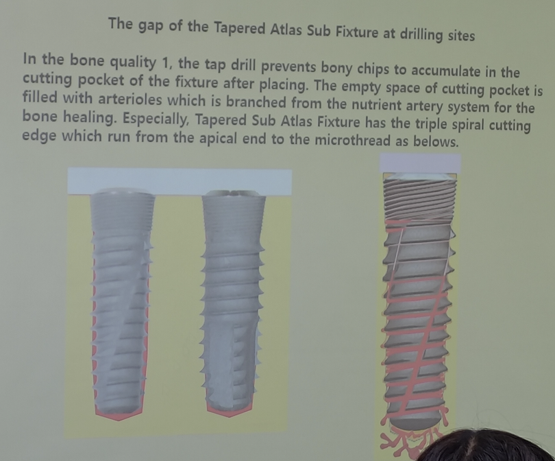
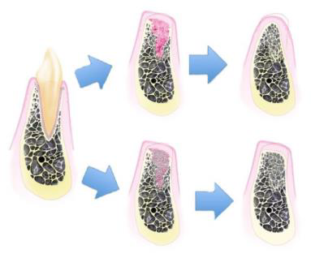

---
toc:
    depth_from: 1
    depth_to: 3
html:
    offline: false
    embed_local_images: false #嵌入base64圖片
print_background: true
export_on_save:
    html: true
---

# 牙周進階見習

## 治療計劃 

- element 
  - Bone
  - History (Med, Dent.)
    - 骨鬆 (Bisphosphonate)
      - 長骨 &rarr; 脊椎 &rarr; Mx.
      - 原先抑制癌症骨轉移
      - Bisphosphonate 會在骨內很久 (十年)
      - > 民事訴訟太難啦
    - 抗凝血
    - DM 
      - Well control: 7 
        - 被告不會輸
      - not well ctrl. survival rate &darr; about. 10% 
    - BP?
      - <160(mmHg)：無責
      - 160~180(mmHg)：可做簡單術式
      - 180 (mmHg): 全責
    - RT
      - Dose > 50 成功率下降 
      - 6y 後成功率恢復 90% &uarr; 
  - Soft t.
    - Volume
    - KT 
  - Space

- 會診白痴
  - 叫患者去掛原本醫師號詢問
  - 留下證據鏈（對話紀錄、掛號單。。。

---

- Nerve 
  - Inf. alv  n. 
  - Mental n. 
  - Lingual n. (??? 看不到，但真的切得到) 
  - Mesial palatine n. 
    - 可以截斷，注意 Bleeding 
  - G. Palatine 
    - 一般手術碰不到
  - Infra orbital n.
    - Canine apical 距離約 7mm
- Sinus 
- Artery  
  - Mesial palatine n. 
  - PSA a. 
    - Bone 外面 60% 
- Bone concavity 
  - 照 CT 

:::info {Nerve damage}

- 半年沒恢復 &rarr; 永久？ 
  - 實務上錯

:::

:::info {Inter foramen}

- 鑽到病人會很酸 
- 質體縮短、換位置 
- 發炎可能會影響 Mental n. 

:::

--- 
> PANO 看不到 Concavity 
- Radiographic guide 
  - 在那個 CT 又貴又慢的年代 
  - Bone 
  - 放在骨頭上的塑膠片，RO 
- Tomagraphy
  - 很多張橫截面影像 (只有單一方向)

---

- Crown and bridge ?
  - 不考慮患者意願 Crown and bridge 是個好選擇 
  - 不會 Fail、並發症
  - 價格？
    - 單顆缺牙會變成 3 個 Crown
  - 清潔 -\-
  - 前後本來就要假牙 ++ 
  - Bone 不足 ++

- endo or implant 
  - endo 成功率 70-80% (專科 80-90%)
  - Implant 3年成功率達 97%，10年成功率90-95%，peri-implantitis10-20年發生率10%
--- 

- All on 4
  - 歷史 30y
  - 高 Cp 值恢復全口功能 
  - 不用補骨，低訓練
  - Concern: 長期骨吸收嚴重

## 骨粉
- DBA (Demineralized Bone Allograft) 
  - 自體骨
- FDBA (Freeze-Dried Bone Allograft)
  - 同種異體骨
- DFDBA (Demineralized Freeze-Dried Bone Allograft)
  - 同種異體骨
- Bio-oss (牛骨)
  - 吸收慢
- Zinograft (豬骨)
- Bone, cementum, PDL 都要有再生才有 Periodontal Regenerative
- Neven’s membrane 少數證明 GTR 有幫助的 membrane

> Crestal 要 over platform 1.5-2mm

## Drug 

### **Bisphosphonate (BP), Denosumab**

- **高劑量使用**  
  - 植體失敗風險 ↑（尤其用於 **癌症骨轉移預防** 的 regimen）  
- **機轉 (Mechanism)**  
  - BP 被骨釋放後 → **Osteoclast 活性 ↓** → 骨重塑停滯 → **Dead Bone**  
  - **Macrophage ↑**，造成慢性發炎與壞死環境  
- **口服 BP (Osteoporosis 用藥)**  
  - MRONJ 發生率 <0.04%  
- **JCO (College Guideline)**  
  - 長期 BP 並不顯著增加骨折風險  
  - **Drug holiday 建議**：停藥前 2 個月、後 3 個月再行侵入性治療  
- **Denosumab (RANKL 抑制劑, IV injection)**  
  - 與 BP 相同會抑制骨重塑  
  - 植體失敗率：10% → 20% (較高風險)

### **Corticosteroid**
- 影響骨代謝與免疫  
- 可能造成 **Marginal bone loss** 與 **Implant clinical failure**

### **Romosozumab**
- **造骨型藥物 (Sclerostin inhibitor)**  
- 機轉：抑制骨抑制蛋白 → 促進 **Osteoblast 分化與骨形成**  
- 用於骨質疏鬆治療，對於牙科影響??

### CTX 與 MRONJ

- **CTX (C-terminal telopeptide of type I collagen)**  
  - type I collagen meta → Bone remodeling activity
  - 指標：>150 pg/mL → 拔牙與外科手術風險下降

- **MRONJ (Medication-Related Osteonecrosis of the Jaw)**  
  - Df：接受抗骨吸收或抗血管新生藥物後，顎骨出現 necrotic bone 且持續 >8 週未癒合  
  - Risk：高劑量 BP/Denosumab、癌症治療、侵入性牙科治療、差的口腔衛生

- **CTX 與停藥**  
  - 平均停藥 1 個月 → CTX ↑ 約 25 pg/mL  

- **BP lesion 特點**  
  - 病灶可能在拔牙前已經形成（Harvard 新動物研究證實）  
  - **IV BP**: 下次注射前拔牙
  - 若緊急拔牙 → 風險差異不大

## 質體

- Cortical bone Level: 細螺紋，卡緊
- Bunddle bone Level: 粗螺紋，長細胞
- implant 植入不能晃，但要有血液上來的空間
  - Drill 比 implant 深

- 放 implant: 20-50 N*cm

- ==質體定義==: A artificial material is inserted into the alveolar bone to restore the oral environment by osseointegration
- ==Osseointegration==: Direct structural and functional connection between ordered, living bone and the surface of load-bearing implant

- Fenestration: 牙根底部位置開始的骨缺損
- Dehiscence: 牙根周圍骨頭由齒頸向牙根尖缺損

:::info {Zirconia implant}
- 目前唯一能替代 Ti 
  - 5y survival \~ Ti (97> 都偏 prospective clinical trial)
  - MBL, PD,  \~ Ti
  - Abutment survival??
    - 易裂，僅用 single implant, One piece
- Metal Free? exclude two piece design 

:::

### Design 

- Standard Branemark (C\)
  - 最早(1977)

- Flute（排屑槽，C 黑匡）
  - 增加切削效率，排出骨屑
  - 避免熱累積與 bone necrosis
- Root form (A)
  - 避免尖端鑽出
  - Tapper, 無螺紋
- Taper form v.s. Straight form

|\diagonal{}| Taper | Straight|
|-|-|-|
| Drill誤差 | 0.5mm | 0.2mm|
| Dill 應力 | Cervical | Apical |
| Bone prepare ability| + | ++ | 

- Double thread
  - 螺距相同，但導程加倍
  - 同深度旋轉少 &rarr; 發熱少
  - Primary stabilization 較好

#### Abutment Connection

|-| Internal connection| External connection| Taper connection (為 Internal) |
|-|-|-|-|
| 特質|\oneline{

- Implant 露在 tissue &rarr; soft tissue 下降重建 BW 
- 穩固 (2-5mm connection)
}|\oneline{

- 最初設計
- 易於製造
- 穩定不佳 (1.2-1.5mm connection )

} |\oneline{
- 精密結合
- 難以移除
}
|縱切|  |  | |
| 橫切| |  | -|

#### Ones tage

- Straumann 
  - 圓底疏螺紋
  - 該患者雖然 Cortical Bone 厚，但海綿骨疏鬆 &rarr; 需要密的螺紋增加穩定
- One stage (Tissue level)
  - Margin 在 Body 上
  - 成功率 &uarr; 
  - 難以配合 GBR 
  - 無法調整，因為沒有 Abutment 來轉彎

## 骨整合

- Metal 放入骨頭會釋放 ions ，因此會被 Fibrous tissue 圍繞
- Implant 未完成骨整合，Moving < 50-100 &mu;m 否則 failure
- 質體邊緣至少要 2mm 骨頭才能保證血流供應，因為沒有 PDL 血流

|項目 |時間
|-|-|
|拔牙後等待|6個月
|骨整合|6個月
|質體接出來、等待軟組織癒合| 3~4星期
|製作假牙、調整咬合 |3~4星期
|合計|14個月

### 拔牙窩的癒合

| 時間階段     | 組織變化與重點 ||
|--------------|----------------|-|
| Day 0        | **血塊形成/止血**|血塊除了止血外，內含許多 growth factor，會釋放訊號誘發骨形成。 |
| Day 4~5      | **血塊轉為 granulation tissue**|持續釋放 growth factor，並伴隨更多鈣化物形成。 |
| Day 5~16     | **轉變為 connective tissue matrix**|拔牙窩的 bundle bone 開始吸收，讓周圍骨髓空間的血管增生，逐漸形成 cancellous bone。 |
| Week 3~6     | **骨生成與軟組織屏障**|woven bone 從拔牙窩周邊開始形成。 |
| Week 5~10    | **骨重塑形成 trabecular bone**|傳統觀念認為骨頭鈣化至此階段後才適合植牙。 |

---

- Bundle Bone 無法被 Preserve
- Bundle bone是骨前驅細胞的重要來源，拔牙窩越完整，自癒能力越好。
- 上下顎拔牙後，唇頰側的骨板易吸收
  - 癒合皆偏腭/舌側
  - 上顎後牙區鼻竇氣室化
- 前牙不補骨頭一定變 class III

### 拔牙齒槽的分類 

#### Elian
- **Type1**：軟組織與硬組織皆好
- **Type2**：軟組織完整但硬組織有垂直方向的缺損(不管缺損多少)
  - Type2A：唇側缺損(或說dehiscence)高度在上1/3(靠牙冠)
  - Type2B：唇側缺損(或說dehiscence)高度在中1/3
  - Type2C：唇側缺損(或說dehiscence)高度在下1/3(靠根尖)
- **Type3**：軟組織與硬組織皆有缺損

#### Kan’s

- Class I：牙根靠著唇側的cortical plate，最常見
- Class II：牙根位於唇舌徑的中間且根尖1/3沒有碰到任一邊的cortical plate。
- Class III：牙根靠著顎側的cortical plate
- Class IV：至少2/3的牙根有同時接觸兩側的cortical plate
> 過去即拔即種在顎側骨，所以 Class I 最多 (因為沒有那麼長的質體)

- 唇側dehiscence
  -  V-shape：
     -  只有在牙根最中、前側有小缺損(僅侷限在middle third)
     -  Growing potential：容易生長，主要依靠兩側的骨頭
  -  U-shape：
     -  比較大，但侷限於牙根最distal與最mesial的範圍內
     -  Growing potential：主要靠兩側的interdental bone主導
  -  UU-shape：
     -  超過牙根範圍，涉及interdental bone的程度(或碰到鄰牙)
     -  Growing potential：很差，牙根表面很難長骨頭，做即拔即種的話，此種成品最不美觀

### Osseointegration Detection

==共振&阻尼==

- 系統描述
  - 質量：\(m\)  
  - 彈簧：剛度 \(k\)  
  - 阻尼：粘滯阻尼 \(c\)  
  - 位移：\(x(t)\)

受力平衡方程：

\[
m \ddot{x} + c \dot{x} + k x = 0
\]

---

假設解為指數型：

\[
x(t) = e^{\lambda t}
\]

代入微分方程：

\[
m \lambda^2 e^{\lambda t} + c \lambda e^{\lambda t} + k e^{\lambda t} = 0
\]

整理得到特徵方程：

\[
m \lambda^2 + c \lambda + k = 0
\]

---

\[
\lambda = \frac{-c \pm \sqrt{c^2 - 4 m k}}{2 m}
\]

定義無阻尼自然頻率與阻尼比：

\[
\omega_0 = \sqrt{\frac{k}{m}}, \quad \zeta = \frac{c}{2 \sqrt{km}}
\]

則特徵根可表示為：

\[
\lambda = -\zeta \omega_0 \pm \omega_0 \sqrt{\zeta^2 - 1}
\]

1. **欠阻尼 (\(\zeta < 1\))**：

\[
\lambda = -\zeta \omega_0 \pm i \omega_d
\]

\[
\omega_d = \omega_0 \sqrt{1 - \zeta^2} = \sqrt{\frac{k(1-\zeta^2)}{m}} \quad \text{(阻尼振動頻率)}
\]

解：

\[
x(t) = e^{-\zeta \omega_0 t} \left( A \cos(\omega_d t) + B \sin(\omega_d t) \right)
\]

2. **臨界阻尼 (\(\zeta = 1\))**：

\[
\lambda = -\omega_0
\]

不振動，系統以最快速度回到平衡。

3. **過阻尼 (\(\zeta > 1\))**：

\[
\lambda = -\zeta \omega_0 \pm \omega_0 \sqrt{\zeta^2 - 1}
\]

仍不振動，系統慢慢回到平衡。

---

## 植牙的時機與步驟

| 分類 | 植牙時機 | 優勢 | 劣勢 |
|------|-----------|------|------|
| **Type 1** | 即拔即種 (Immediate, 0–1週) | - 減少手術次數 - 減少病患復原時間 - 減少術後疼痛 - 減少整體治療時間 - 骨頭剩最多 - 美觀效果佳 | - 受到齒槽型態影響大，若拔牙窩位置不佳易失敗 - 軟組織太薄時效果差 - 可能缺乏足夠角化牙齦（需額外組織手術） - 技術敏感度最高 |
| **Type 2** | 拔牙後 4–8 週 | - ==補完骨，軟組織最多==，翻瓣操作較容易 - 局部發炎反應較低 - 軟組織提供較佳血液供應，傷口不易裂開 | - 癒合初期仍受齒槽型態影響 - 拔牙窩吸收變化大 - 治療時間較長 - 技術敏感度仍偏高 - 可能需額外手術 |
| **Type 3** | 拔牙後 12–16 週 | - 已有部分骨生成，利於植體放置 - 軟組織成熟，操作容易 - 骨型態變化趨於穩定 - 可預測性較高 - 是目前最主流方法 | - 治療時間增加（需等待癒合） - 齒槽骨四周已有不同程度吸收 - 仍可能需要輔助手術 |
| **Type 4** | 拔牙後 > 6 個月 | - 骨與軟組織型態已穩定 - 軟組織成熟，有足夠角化牙齦 | - 治療時間最長 - 經過骨重塑後，骨頭型態可能不佳 - 仍可能需要輔助手術 |

>Type 1、2需要額外的技巧，因為傷口仍在癒合初期；Type 3、4比較保守，但齒槽嵴已經偏離原先的位置了，在判斷植體的apical-coronal深度時比較困難，最好的參考點是鄰牙CEJ或是未來要做假牙的牙冠邊緣往下3mm，短於2mm會有美觀風險，植體的平台或是金屬部分可能會露出來。

### Type I 
- 即拔即種
- 保留原本的骨頭
- implant
  - 原本 cingulum 位置穿出 
  - Labial 保留至少 2mm 
  - gingiva margin 下 3mm 
  - Lingual bone 提供 Primary stability
- GBR 
  - Labial, interdental bone 放  membrane 
- 牙齦往 coronal 縫 &rarr; Tension Release 

### Type II
- 4-8w
- 唇側沒有骨頭
- 先讓軟組織長夠多再來GBR植牙
  - 用膠原蛋白
  - 軟組織總量夠多就不須做tension release

## Alveolar ridge preservation

- 依據放入窩洞的材料：
  1. bone graft
  2. collagen plug (降解速度較快，效果較差)
  3. mixed 

- closed？
  - Kg 消失
  - 可能要 Release
- Flap？
  - 過去： Open 會讓軟組織進去、傷口暴露感染
  - 現在有 non-resorbable

- Socket shield
  - 拔牙留下一部分健康牙根
  - 爭議

- ARP 決策樹

### QA
- Tissue Level 為何軟組織不會進去
  - Final drill < Implant 
  - 完全密合
- 質體即拔即種鬆掉能不能鎖回去
  - 設計

## Immediate implant 
- Immediate implant placement (IIP)
- Immediate implant placement and proviosionalization (IIPP)
  - proviosion 若設計不佳，Implant 容易受力，影響成功率

- Daniel Buser (1999) 
  - Bone level 和 One stage tissue level 在 implant 不受力時成功率差不多
  - One stage tissue level 不會導致 soft tissue 往下掉

- Can the socket be cleaned up ?
  - Socket 的 granulation tissue 難以清乾淨

- Implant 會阻擋骨細胞移動 
  - 後牙 Labial Dehiscence 做 IIP 會導致 Labial bone 長不回來

## Furcation involvement

- Furcation involvement should record horizontal probing.
- Furcation involvement 在 Phase I 以 clinical 紀錄為主(即使 PA 已經 III)
- Furcation involvement 放 membrane 會影響 Blood supply &rarr; 改 CTG
  - 如果 gingiva recession 不多也可以不放
- Furcation involvement 可以掃超音波 diamond 有 Osteoplasty 效果

## CTG (Connective Tissue Graft)

- Miller's classification

- Graft 來源：Subepithelial connective tissue (常取自腭側)  
- 目的：  
  - 覆蓋牙根 (Root coverage)  
  - 增厚牙齦 (Gingival thickening)  
  - 改善美觀 (Aesthetic improvement)  
  - 穩定牙周組織 (Periodontal stability)  
- 缺點：需第二手術區 (Donor site morbidity)
- 上皮平均 0.4mm 最多約 0.8mm &rarr; 去上皮 1mm

- Bone 上 ST 能維持的 高度/厚度
  - 自然牙約 3/2
  - 植體約 2/3
  - Attachment 高度不足應該要加厚 Base &rarr; Bone 夠寬才能增加 Base 

:::question {自然牙recession為什麼是補soft tissue而不是補bone呢？}
一位義大利的牙科外科權威，用補bone方式的來做recession技術要求太高，所以效果不好，直接用 connective tissue graft(CTG)效果比較好。它是一個比較的結果。當然也可以同時補骨又補軟組織，但是代價太高昂，所以現在的牙根覆蓋式選擇用CTG。
:::

:::question {implant周圍的recession補 soft tissue？}
- 沒有植體周圍炎的情況，在正buccal補bone的難度非常高
- 補足volume，產生epithelial attachment，是靠著補足空間掩飾這個recession。
- 手術難度低
:::

### Donate

#### Langer and Langer (1985)

- 兩直兩橫取中間
- 東方人取partial thickness長度可能會不夠，所以通常會上面取full thickness，下面取partial thickness

:::info {Partial thickness vs Full thickness}

- Partial thickness：不含骨膜
- Full thickness：graft有包含骨膜，較好翻，flap的blood supply好。

:::

#### Bruno (1994)

- 兩水平，不 vertical release 
- Partial, Full thickness 都可

#### Hurzeler/ Lorenzana and Allen technique (1999)

- 切一刀，難但最快
- 缺少epithelium下層的dense CT

### Recipient
#### Roll tech. 
- Palatal CT &rarr; Buccal
- 用Suture 來拉 CT
- 可卷 Partial, Full thickness

#### External roll 

- Palatal 不翻上皮，直接 high speed 去除

#### Pouch tech.

#### Double papilla technique

#### Tunneling technique

#### Coronally-positioned technique

- 把 Soft tissue 往 Coronal 拉
- 由於手術簡單易學，為目前世界主流的技術

:::tip{Abutment 妙用}

:::

### FGG (Free Gingival Graft)
- 主要目的：增加角化牙齦帶 (Keratinized gingiva, KG++)  
- 應用：多用於缺乏足夠 KG 的情況，功能性佳但美觀較差
- 取上皮 &rarr; 可以切到比較 Distal 

### Augment crestal, buccal and pontic soft tissue

#### Pouch graft procedure

  

> Modification: 從牙齒切到牙齒，同時一起增加papilla高度

