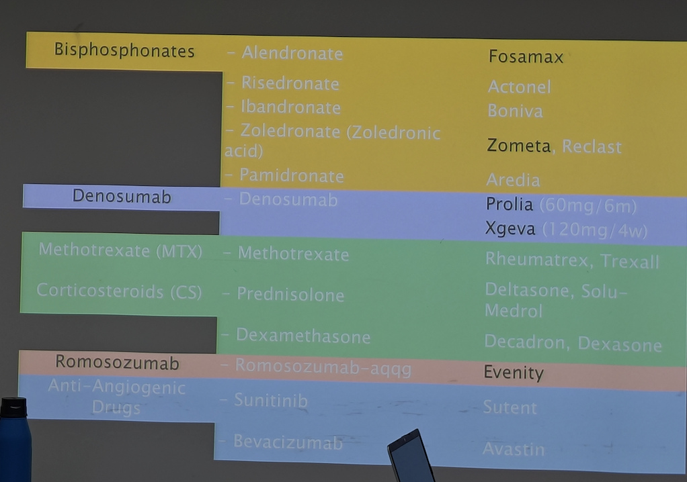
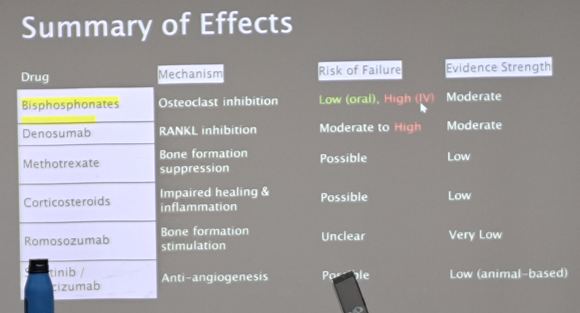

---
toc:
    depth_from: 1
    depth_to: 3
html:
    offline: false
    embed_local_images: false #嵌入base64圖片
print_background: true
export_on_save:
    html: true
---

# 牙周進階見習

## Drug 

### **Bisphosphonate (BP), Denosumab**

- **高劑量使用**  
  - 植體失敗風險 ↑（尤其用於 **癌症骨轉移預防** 的 regimen）  
- **機轉 (Mechanism)**  
  - BP 被骨釋放後 → **Osteoclast 活性 ↓** → 骨重塑停滯 → **Dead Bone**  
  - **Macrophage ↑**，造成慢性發炎與壞死環境  
- **口服 BP (Osteoporosis 用藥)**  
  - MRONJ 發生率 <0.04%  
- **JCO (College Guideline)**  
  - 長期 BP 並不顯著增加骨折風險  
  - **Drug holiday 建議**：停藥前 2 個月、後 3 個月再行侵入性治療  
- **Denosumab (RANKL 抑制劑, IV injection)**  
  - 與 BP 相同會抑制骨重塑  
  - 植體失敗率：10% → 20% (較高風險)

### **Corticosteroid**
- 影響骨代謝與免疫  
- 可能造成 **Marginal bone loss** 與 **Implant clinical failure**

### **Romosozumab**
- **造骨型藥物 (Sclerostin inhibitor)**  
- 機轉：抑制骨抑制蛋白 → 促進 **Osteoblast 分化與骨形成**  
- 用於骨質疏鬆治療，對於牙科影響??

### CTX 與 MRONJ

- **CTX (C-terminal telopeptide of type I collagen)**  
  - type I collagen meta → Bone remodeling activity
  - 指標：>150 pg/mL → 拔牙與外科手術風險下降

- **MRONJ (Medication-Related Osteonecrosis of the Jaw)**  
  - Df：接受抗骨吸收或抗血管新生藥物後，顎骨出現 necrotic bone 且持續 >8 週未癒合  
  - Risk：高劑量 BP/Denosumab、癌症治療、侵入性牙科治療、差的口腔衛生

- **CTX 與停藥**  
  - 平均停藥 1 個月 → CTX ↑ 約 25 pg/mL  

- **BP lesion 特點**  
  - 病灶可能在拔牙前已經形成（Harvard 新動物研究證實）  
  - **IV BP**: 下次注射前拔牙
  - 若緊急拔牙 → 風險差異不大

## 質體
- Zirconia implant 
  - 目前唯一能替代 Ti 
    - 5y survival \~ Ti (97> 都偏 prospective clinical trial)
    - MBL, PD,  \~ Ti
    - Abutment survival??
      - 易裂，僅用 single implant, One piece
  - Metal Free? exclude two piece design 

## 骨粉
- DBA (Demineralized Bone Allograft) 
  - 自體骨
- FDBA (Freeze-Dried Bone Allograft)
  - 同種異體骨
- DFDBA (Demineralized Freeze-Dried Bone Allograft)
  - 同種異體骨
- Bio-oss (牛骨)
  - 吸收慢
- Zinograft (豬骨)
- Bone, cementum, PDL 都要有再生才有 Periodontal Regenerative
- Neven’s membrane 少數證明 GTR 有幫助的 membrane

> Crestal 要 over platform 1.5-2mm

## Furcation involvement

- Furcation involvement should record horizontal probing.
- Furcation involvement 在 Phase I 以 clinical 紀錄為主(即使 PA 已經 III)
- Furcation involvement 放 membrane 會影響 Blood supply &rarr; 改 CTG
  - 如果 gingiva recession 不多也可以不放
- Furcation involvement 可以掃超音波 diamond 有 Osteoplasty 效果

## 牙根覆蓋 (Root Coverage)

:::note {Miller's classification}

:::

### CTG (Connective Tissue Graft)*
- Graft 來源：Subepithelial connective tissue (常取自腭側)  
- 目的：  
  - 覆蓋牙根 (Root coverage)  
  - 增厚牙齦 (Gingival thickening)  
  - 改善美觀 (Aesthetic improvement)  
  - 穩定牙周組織 (Periodontal stability)  
- 缺點：需第二手術區 (Donor site morbidity)
- 上皮平均 0.4mm 最多約 0.8mm &rarr; 去上皮 1mm

  

- Bone 上 ST 高度/厚度
  - 自然牙約 3/2
  - 植體約 2/3
  - Attachment 高度不足應該要加厚 Base &rarr; Bone 夠寬才能增加 Base 

#### Roll tech. 

- 用Suture 來塞 CT

#### Pouch tech.

### FGG (Free Gingival Graft)
  - Graft 來源：全層游離牙齦  
  - 主要目的：增加角化牙齦帶 (Keratinized gingiva, KG++)  
  - 應用：多用於缺乏足夠 KG 的情況，功能性佳但美觀較差
  - 取上皮 &rarr; 可以切到比較 Distal 

