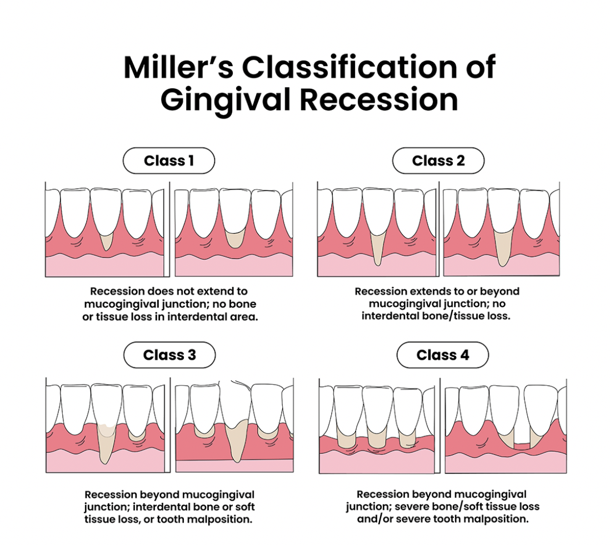
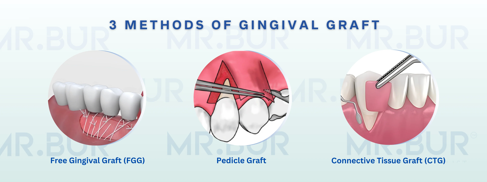

---
toc:
    depth_from: 1
    depth_to: 3
html:
    offline: false
    embed_local_images: false #嵌入base64圖片
print_background: true
export_on_save:
    html: true
---

# Drug 

- BP, Denosumab
  - high dose &rarr; implant failure (預防癌症骨轉移特別高)
  - Macrophage &uarr;
  - bp release &rarr; Osteoclast &darr; &rarr; Dead Bone
  - Osteoporoosis<0.04% (Oral BP)
  - JCO(College): 不增加骨折風險建議==停藥==
    - Drug holiday 前2m 後3m

  - loading, IV anti Receptor(ex. Denosumab) 
    - 10% failure &rarr; 20%
- 皮質醇: Marginal bone loss, clinical failure?
- Romosozumab (造骨型)

- CTX & MRONJ
  - CTX: I collagen 代謝marker &rarr; Bone Remodeling 強度
  - MRONJ: Medication-Related Osteonecrosis of the Jaw 
  - 評估 BP 停藥(>150 risk &darr;&darr;)
  - 平均停藥一個月提升 25
- initial load Anti 
  - 有助於 Healing
  - BP lesion 在拔牙前已經形成 (哈佛新動物研究)
    - IV 要停藥 
    - 下次注射前拔？緊急的話其實也沒差

- Zirconia implant 
  - 目前唯一能替代 Ti 
    - 5y survival \~ Ti (97> 都偏 prospective clinical trial)
    - MBL, PD,  \~ Ti
    - Abutment survival??
      - 易裂，僅用 single implant, One piece
  - Metal Free? exclude two piece design 

- 

# 骨粉
- DBA (Demineralized Bone Allograft) 
  - 自體骨
- FDBA (Freeze-Dried Bone Allograft)
  - 同種異體骨
- DFDBA (Demineralized Freeze-Dried Bone Allograft)
  - 同種異體骨
- Bio-oss (牛骨)
  - 吸收慢
- Zinograft (豬骨)
- Bone, cementum, PDL 都要有再生才有 Periodontal Regenerative
- Neven’s membrane 少數證明 GTR 有幫助的 membrane

> Crestal 要 over platform 1.5-2mm

# Furcation involvement

- Furcation involvement should record horizontal probing.
- Furcation involvement 在 Phase I 以 clinical 紀錄為主(即使 PA 已經 III)
- Furcation involvement 放 membrane 會影響 Blood supply &rarr; 改 CTG
  - 如果 gingiva recession 不多也可以不放
- Furcation involvement 可以掃超音波 diamond 有 Osteoplast 效果

# 牙根覆蓋

:::note {Miller's classification}

:::

- CTG 
  - Graft: Subepithelial tissue 
  - 目的: 覆蓋牙根、增厚牙齦、改善美觀、穩定牙周組織

- FGG
  - Graft: full-thickness graft
  - KG++ (功能性)
