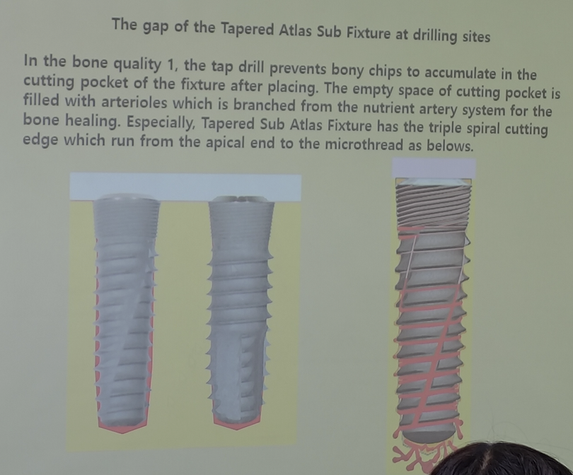
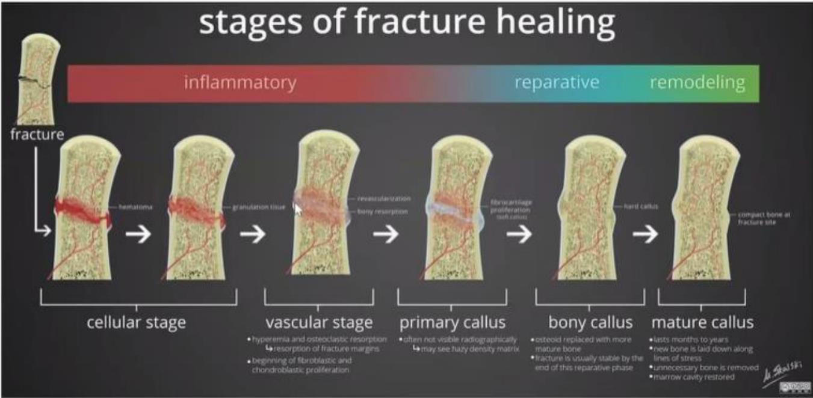
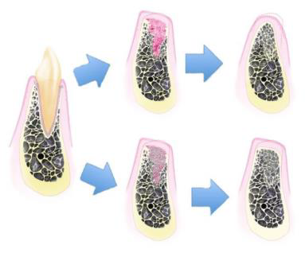
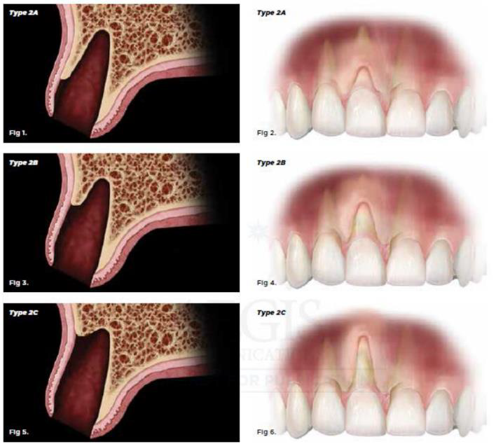
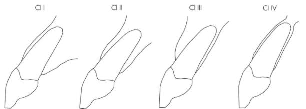
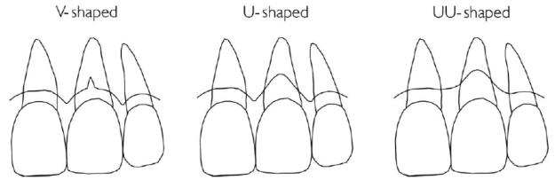
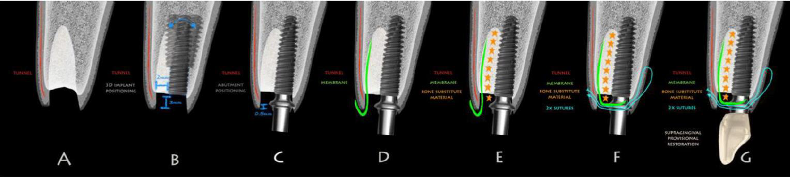
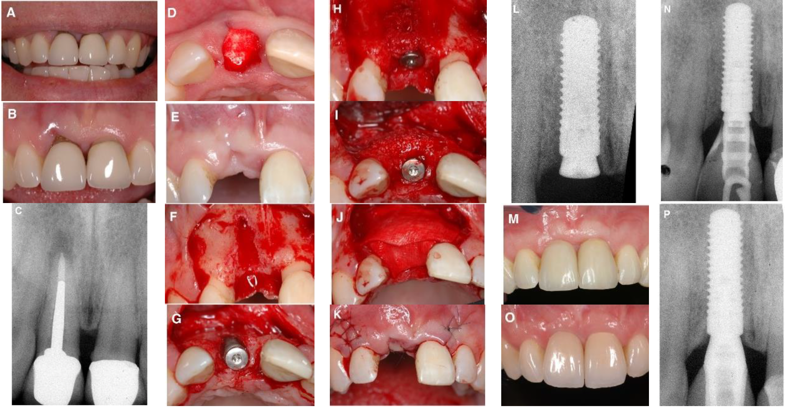
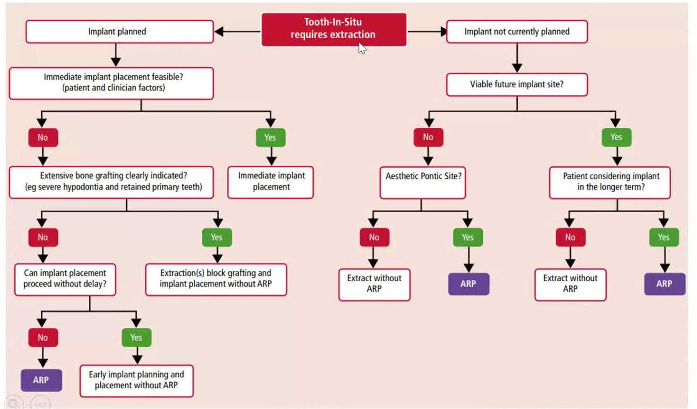

---
toc:
    depth_from: 1
    depth_to: 3
html:
    offline: false
    embed_local_images: false #嵌入base64圖片
print_background: true
export_on_save:
    html: true
---
# 質體

## Intro 
- Cortical bone Level: 細螺紋，卡緊
- Bunddle bone Level: 粗螺紋，長細胞
- implant 植入不能晃，但要有血液上來的空間
  - Drill 比 implant 深

- 放 implant: 20-50 N*cm

## 骨整合

- Metal 放入骨頭會釋放 ions ，因此會被 Fibrous tissue 圍繞
- Implant 未完成骨整合，Moving < 50-100 &mu;m 否則 failure
- 質體邊緣至少要 2mm 骨頭才能保證血流供應，因為沒有 PDL 血流

|項目 |時間
|-|-|
|拔牙後等待|6個月
|骨整合|6個月
|質體接出來、等待軟組織癒合| 3~4星期
|製作假牙、調整咬合 |3~4星期
|合計|14個月

### 拔牙窩的癒合

| 時間階段     | 組織變化與重點 ||
|--------------|----------------|-|
| Day 0        | **血塊形成/止血**|血塊除了止血外，內含許多 growth factor，會釋放訊號誘發骨形成。 |
| Day 4~5      | **血塊轉為 granulation tissue**|持續釋放 growth factor，並伴隨更多鈣化物形成。 |
| Day 5~16     | **轉變為 connective tissue matrix**|拔牙窩的 bundle bone 開始吸收，讓周圍骨髓空間的血管增生，逐漸形成 cancellous bone。 |
| Week 3~6     | **骨生成與軟組織屏障**|woven bone 從拔牙窩周邊開始形成。 |
| Week 5~10    | **骨重塑形成 trabecular bone**|傳統觀念認為骨頭鈣化至此階段後才適合植牙。 |

---

- Bundle Bone 無法被 Preserve
- Bundle bone是骨前驅細胞的重要來源，拔牙窩越完整，自癒能力越好。
- 上下顎拔牙後，唇頰側的骨板易吸收
  - 癒合皆偏腭/舌側
  - 上顎後牙區鼻竇氣室化
- 前牙不補骨頭一定變 class III

### 拔牙齒槽的分類 

#### Elian
- **Type1**：軟組織與硬組織皆好
- **Type2**：軟組織完整但硬組織有垂直方向的缺損(不管缺損多少)
  - Type2A：唇側缺損(或說dehiscence)高度在上1/3(靠牙冠)
  - Type2B：唇側缺損(或說dehiscence)高度在中1/3
  - Type2C：唇側缺損(或說dehiscence)高度在下1/3(靠根尖)
- **Type3**：軟組織與硬組織皆有缺損

#### Kan’s

- Class I：牙根靠著唇側的cortical plate，最常見
- Class II：牙根位於唇舌徑的中間且根尖1/3沒有碰到任一邊的cortical plate。
- Class III：牙根靠著顎側的cortical plate
- Class IV：至少2/3的牙根有同時接觸兩側的cortical plate
> 過去即拔即種在顎側骨，所以 Class I 最多 (因為沒有那麼長的質體)

- 唇側dehiscence
  -  V-shape：
     -  只有在牙根最中、前側有小缺損(僅侷限在middle third)
     -  Growing potential：容易生長，主要依靠兩側的骨頭
  -  U-shape：
     -  比較大，但侷限於牙根最distal與最mesial的範圍內
     -  Growing potential：主要靠兩側的interdental bone主導
  -  UU-shape：
     -  超過牙根範圍，涉及interdental bone的程度(或碰到鄰牙)
     -  Growing potential：很差，牙根表面很難長骨頭，做即拔即種的話，此種成品最不美觀

## 植牙的時機與步驟

| 分類 | 植牙時機 | 優勢 | 劣勢 |
|------|-----------|------|------|
| **Type 1** | 即拔即種 (Immediate, 0–1週) | - 減少手術次數 - 減少病患復原時間 - 減少術後疼痛 - 減少整體治療時間 - 骨頭剩最多 - 美觀效果佳 | - 受到齒槽型態影響大，若拔牙窩位置不佳易失敗 - 軟組織太薄時效果差 - 可能缺乏足夠角化牙齦（需額外組織手術） - 技術敏感度最高 |
| **Type 2** | 拔牙後 4–8 週 | - ==補完骨，軟組織最多==，翻瓣操作較容易 - 局部發炎反應較低 - 軟組織提供較佳血液供應，傷口不易裂開 | - 癒合初期仍受齒槽型態影響 - 拔牙窩吸收變化大 - 治療時間較長 - 技術敏感度仍偏高 - 可能需額外手術 |
| **Type 3** | 拔牙後 12–16 週 | - 已有部分骨生成，利於植體放置 - 軟組織成熟，操作容易 - 骨型態變化趨於穩定 - 可預測性較高 - 是目前最主流方法 | - 治療時間增加（需等待癒合） - 齒槽骨四周已有不同程度吸收 - 仍可能需要輔助手術 |
| **Type 4** | 拔牙後 > 6 個月 | - 骨與軟組織型態已穩定 - 軟組織成熟，有足夠角化牙齦 | - 治療時間最長 - 經過骨重塑後，骨頭型態可能不佳 - 仍可能需要輔助手術 |

>Type 1、2需要額外的技巧，因為傷口仍在癒合初期；Type 3、4比較保守，但齒槽嵴已經偏離原先的位置了，在判斷植體的apical-coronal深度時比較困難，最好的參考點是鄰牙CEJ或是未來要做假牙的牙冠邊緣往下3mm，短於2mm會有美觀風險，植體的平台或是金屬部分可能會露出來。

### Type I 
- 即拔即種
- 保留原本的骨頭

### Type II
- 4-8w
- 唇側沒有骨頭
- 先讓軟組織長夠多再來GBR植牙
  - 用膠原蛋白
  - 軟組織總量夠多就不須做tension release

# Alveolar ridge preservation

- 依據放入窩洞的材料：
  1. bone graft
  2. collagen plug (降解速度較快，效果較差)
  3. mixed 

- closed？
  - Kg 消失
  - 可能要 Release
- Flap？
  - 過去： Open 會讓軟組織進去、傷口暴露感染
  - 現在有 non-resorbable

- Socket shield
  - 拔牙留下一部分健康牙根
  - 爭議

- ARP 決策樹

## QA
- Tissue Level 為何軟組織不會進去
  - Final drill < Implant 
  - 完全密合
- 質體即拔即種鬆掉能不能鎖回去
  - 設計
