---
toc:
    depth_from: 1
    depth_to: 3
html:
    offline: false
    embed_local_images: false #嵌入base64圖片
print_background: true
export_on_save:
    html: true
---

# CD 

## Intro 

|\diagonal{|}| 自然牙 | CD |
|-|-|-|
|Mucosa 支持面積|上下顎 PDL: 45 cm^2^ |上顎 CD：22.96 cm^2^|
^|^| 下顎 CD：12.25 cm^2^|
咬合力 | 200N | 60-80 N (1/3) |
每日咬合時間 |\oneline{
- Chewing: 9min
- swallowing (meal): 0.5min
- swallowing (Between meal): 7.9min
} | Denture movement

- 全口無牙會變成 class III
- Articular eminence
  - 舊觀念： 變平（flattening）
  - 現代觀念：remodeling
    - flatten, maintain, 局部重塑
- Condyle
  - 位置可能較前上
- disc 
  - 可能 thinning, position 改變

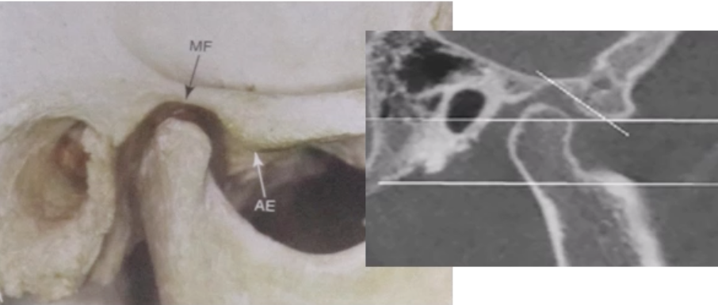

- 在 CD 上會用最後位當 CR 
  - 穩定
  - 吞口水位置

OVD 
: Occlusal Vertical Dimension

## 骨吸收與時機

- 拔牙後前牙 Residual ridge 吸收
  - 第一年: 上顎2-3mm、下顎4-5mm
  - 之後每年下顎 0.1~0.2 mm
  - 下顎前牙區吸收速率比例是上顎的4倍
- ==6 個月是最佳時機==
- 下顎推薦做 Implant over denture
- 影響因子 
  - 下顎 >上顎
  - 方臉 (咀嚼力)
  - Alveoloplasty 會加速
  - Healing
  - 贗復物因素
  - Osteoporosis (骨質疏鬆症): 上顎嚴重

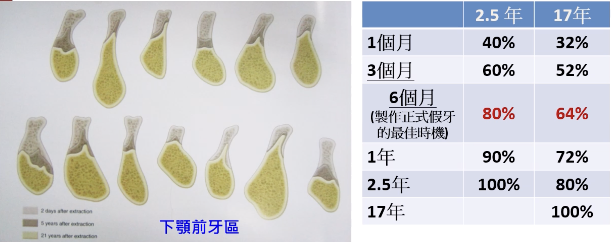

## Mucosa  
> 會影響 CD 配戴的因素

- Oral lichen planus 常見
  - 下顎後牙 Buccal
- EM (少見)
- pemphigoid/pemphigus
- SLE 
- BMS

### Denture stomatitis

- 上顎>下顎 (因為接觸面積)
- Newton’s classification
:::fbox 
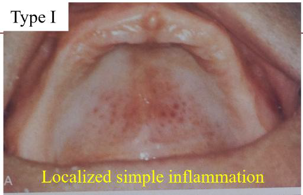
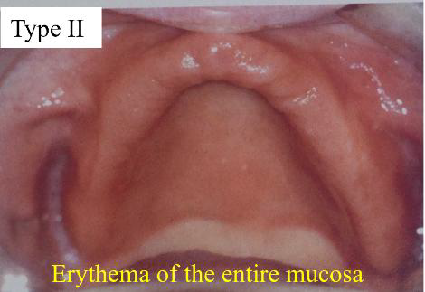
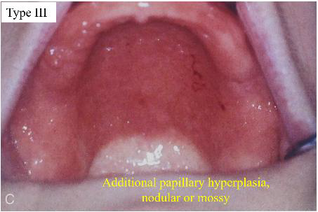

:::

### Angular cheilitis

- 垂直高度(OVD)不足關
- 也可能是口腔衛生差、或是念珠菌感染

### 綜合性症候群(Combination syndrome)

- 上顎CD；下顎 Kennedy Class I RPD 患者因為咬力不平均造成
- 上顎前牙區齒槽骨吸收、下顎前牙變長的現象
- 因重力影響，上顎粗隆往下掉、咬合平面歪掉(Down-growth of the maxillary tuberosity)
- 出現前庭區腫裂齦瘤(Epulis fissuratum)
- 戽斗
- 避免combination syndrom
  - stress break
  - 調整咬合
  - 下顎lingual plate阻止前牙長長
  - 上顎留一些殘根幫助吸收咬合力

## 檢查和診斷 

- 牙弓大小(Arch size)
- 牙弓形狀(Arch form)
- 無牙脊的形狀
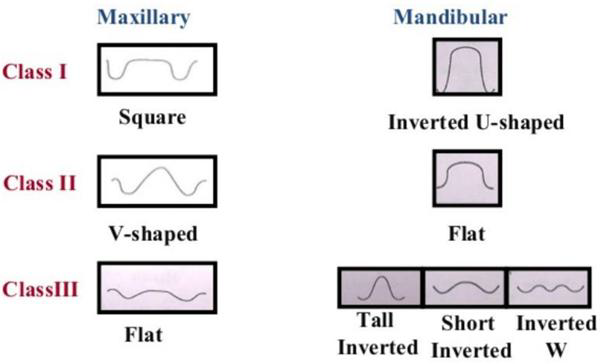

- 上下顎無牙脊的相對位置(Ridge relationship)
  - ：CD牙要排成 Class I
- 上下顎的無牙脊平行度
  - 通常要是平行的

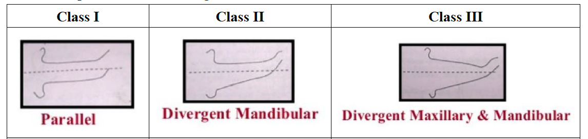

### 側方喉形 (Lateral throat form)

- 前: mylohyoid m.
- 側: superior pharyngeal constrictor m.
- 後: palatoglossus m.
- 內: 舌頭(tongue)
- 愈難把肌肉或舌頭推開，代表側方喉形愈小，假牙難穩定
- Neil’s classification：由curtain後緣與retromolar pad的夾角分類
  - Class I：90度，最適合做假牙(出現比例：70%)
  - Class II：60度(出現比例：25%)。
  - Class III：45 度，最狹窄(出現比例：5%)

:::fbox 

:::

### 上方喉形 (Palatal throat form)

- 做直或站立 soft palate 才掉下來可以看 PTF
- House’s classification
  - Class I：可以往後延伸5-13mm。(超過5mm的movable tissue可提供post dam，假牙的穩定性最好)
  - Class II：可以往後延伸3-5mm。(1-5mm的movable tissue可提供post dam
    - 大部分
  - Class III：往前延伸3-5mm。(少於1mm的movable tissue可提供post dam)可能會一直需要修，造成最後只壓在硬顎上而缺乏retention。

:::fbox 

 

:::

## Border molding  

| 部位                 | 對應解剖構造            | 臨床動作 (患者或醫師)                                |
| -------------------- | ----------------------- | ---------------------------------------------------- |
| 唇側區 (Labial)      | 唇繫帶、口輪匝肌        | 醫師將上唇向下、向內牽拉；患者做噘嘴、微笑動作。     |
| 頰側區 (Buccal)      | 頰繫帶、頰肌、顴突      | 醫師將頰部向下、向內牽拉，並前後移動；患者張大嘴。   |
| 後外側 (Distobuccal) | 冠突 (Coronoid process) | 患者將下顎向左右移動（藉此決定冠突留給義齒的空間）。 |
| 後緣 (Posterior)     | 振動線、PPS             | 患者發出「Ah」短促音；或進行吞嚥動作（Swallow）。    |

| 部位                   | 對應解剖構造                      | 臨床動作 (患者或醫師)                                          |
| ---------------------- | --------------------------------- | -------------------------------------------------------------- |
| 唇側區 (Labial)        | 唇繫帶、口輪匝肌、頦肌            | 醫師將下唇向上、向內牽拉；患者噘嘴。                           |
| 頰側區 (Buccal)        | 頰繫帶、頰肌、頰棚 (Buccal shelf) | 醫師將頰部向上、向內牽拉；患者張大嘴。                         |
| 前舌側 (Ant. Lingual)  | 舌繫帶、下頜舌骨肌 (Mylohyoid m.) | 患者舌尖舔上唇、舔兩側頰部、舌頭頂前牙。                       |
| 後舌側 (Post. Lingual) | 內側翼肌 (Medial pterygoid m.)    | 患者用力吞嚥；或舌頭用力伸出。                                 |
| 遠心端 (Distal)        | 後磨牙墊 (Retromolar pad)         | 患者張大嘴（確保不干擾到翼下頜韌帶 Pterygomandibular raphe）。 |

## 咬合 

### 決定咬合平面 

#### 上顎 
##### Camper’s Line

- 平行瞳孔間線
- lip中間往下 0.5~2.0mm 
- Camper’s Line 平行 (鼻翼下緣到耳道中點) 

##### H-IP Plane

- Hamulus-Incisive-papilla Plane: Incisive Papilla與由左、右 Hamulus Notch
- HIP Plane會與水平面夾約 6-14度
- incisive papilla 向下 8mm, hamulus notch向下 12mm，即為咬合平面

### Fully Balance 達成

- 牙齒旋轉角度 （不旋轉會有干擾）

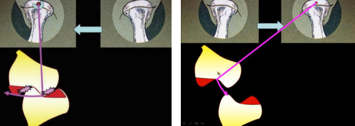
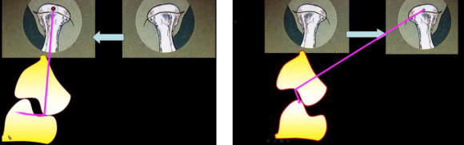

- 面弓轉移誤差的影響
  - Protrusion 因為同時增加 CG, IG 所以對排牙相對角度沒差
  - Lateral Movement 因為把 working side CG 當做 0&deg; 所以會產生誤差

#### 排牙順序 

1. 上前
2. 上後 
3. 下 6 &rarr; 5 &rarr; 4 &rarr; 7 
4. 下 12 （調到 Protrusion 再 edge to edge)
5. 下 3
   1. 推至 balancing side以及 w orking side後牙接觸最多處，將咬合器螺絲旋緊固定好 ，再 working side的犬齒放上去，讓其切端對切端

## 排牙學閥

### 零度排牙法

- Cusp 從 Incisor guidance 漸變到 Condylar guidance
- Working side condylar 不滑移 &rarr; 0&deg;
- Cusp 必須 30-27-23.5-17.5-7 否則  Working Side Interference 
- 太麻煩 &rarr; 0&deg; Cusp
- Christensen’s phenomenon 用 Compensating Curve, 下顎後牙斜坡補

$$Balanced Occlusion = \frac{Condylar\ Guidance×Incisal\ Guidance}{Plane\ of\ Occlusion \times Compensating\ Curve \times Cusp\ Height}​$$

| 特性     | 1. 按照曲線排 (Balanced Monoplane)                       | 2. 按照平面排 (Neutrocentric Concept)               |
| -------- | -------------------------------------------------------- | --------------------------------------------------- |
| 核心理念 | 追求平衡：即使牙齒沒牙尖，也要透過排列達成運動時的接觸。 | 追求穩定：捨棄平衡，將力完全垂直導向齒槽嵴。        |
| 平衡狀態 | 具有 Balanced Occlusion (前伸與側向皆接觸)。             | 無平衡 (Non-balanced)。                             |
| 臨床機制 | 利用 Compensating Curve 或 Balancing Ramp。              | 嚴格遵守 Flat Plane (水平面)，且通常不設 Overbite。 |
| 代表學派 | 傳統平衡合學派 (Gysi, Hanau)。                           | DeVan 的中性理論 (Neutrocentric Concept)。          |
| 適用對象 | 齒槽嵴條件尚可，追求更好咀嚼效率與穩定度者。             | 齒槽嵴嚴重萎縮、手部運動不協調、或習慣咬合不穩者。  |

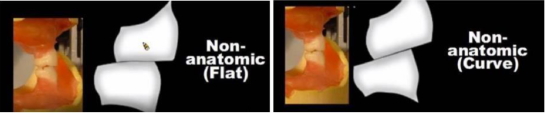

###  Lingualized Occlusion 

- Danger Zone 不受力 &rarr; 尖的 Upper lingual Cusp 咬平的 Lower  
- 力量往下顎舌側 &rarr; 不穩 

- 上牙選 33度，下牙選 10-20度或 0度牙都可
- ==調整咬合的時候要調整下顎牙齒==

## 馬老的分類器

### 秀外慧中

- 圓的貝殼牙
- 齒頸部部分修窄，切緣修圓

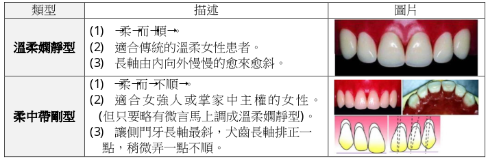

### 豔麗四射

- 差別性很大(藉以吸引目光)，但又騷中帶柔：要選正中門齒與側門齒差距很大
-  牙齒由兩副前牙中分別選取。 
   1. 較大、較長、唇面較圓，切緣角也較圓的正中門齒，特長的正中門齒「易於吸引別人目光」、「成為眾人目光的焦點」。 
   2. 較小、較短、唇面較圓，切緣角也較圓的側門齒

- 長長的正中門齒修得「不太長」，且讓它呈現「柔柔的美感」
  - 把正中門齒切緣略向內
  - 光影調理
  - 減少垂直性的線條，誇張水平性的線條 
  - 把進心觸面變大

- 短短的側門齒修得看起來比較長
  - 並把切緣修得圓滑的匯向接觸區內
  - 增強垂直向的反射
  - 較長較平的唇面
  - 把進心觸面修成幾近接觸點

:::fbox 
 

:::

### 折衝沙場

- 選擇「唇面較平」，使光容易反彈的前牙：與溫柔嫻靜型正好極端的相反，要表現出陽剛的個性，就要讓排出的牙齒表現出激烈的反彈效果。 
- 選擇「切緣較平、切緣角較稜角分明」的前牙：為了表現以牙還牙的狠勁。 
  - 最好能配合患者的臉形倒影來選，這些人通常臉形都是方形，因此選擇方尖(Square Taper)或方圓型(Square O void)的前牙。 
  - 排好牙後再將牙齒修得「切緣更平」、「切緣角更尖銳」。

:::left

- 有衝刺力 
  - 前牙排列呈「參差不平」，借光學折射呈現突出而不暴出。
  - 上顎門齒切緣略向顎側，可將正中門牙遠心端排的較突出，表現出反彈效果。。 

:::right

:::

:::left
- 有決斷力 
  - 掌握「平」、「直」選牙時選切端平直、切緣角明顯的牙齒，排好後再將切緣角修飾更有稜有角 

:::right

:::
:::left
- 有精神 
  - 主要掌握在犬齒，將犬齒排得向內斜入，將犬齒平齊面朝向外方 

:::right

:::

### 溫文儒雅

- 「圓」但「不可太柔」。 
  - 溫和：反抗性及反彈性不強。 
  - 清秀：乾乾淨淨而且順眼

- 唇面不要太平
- 不會太圓的切緣角

:::left
- 個性溫和不挑剔 
  - 排出溫和、順眼，正中門牙、側門牙、犬齒是慢慢順過去的，犬齒不要太斜。 
  - 選牙時選唇面不要太平、切緣、切緣角不要太圓的牙齒。 
  - 排牙時排成弧形，不要有前後的扭轉差異

:::right

:::

:::left
- 個性固執脾氣硬 
  - 排出溫和但不順眼，側門齒的長軸比犬齒甚至正中門齒還向近心。 
  - 選牙時選唇面不要太平、切緣、切緣角不要太圓的牙齒。 
  - 排牙時排成弧形，可選一顆側門齒略微扭轉，但若略有微言立即調順

:::right

:::

### 慈祥和藹型

- 依據患者雙眉以下之臉型選牙
- 女性將側門牙遠心端向內扭，男性將側門牙遠心端向外扭
- 牙齒修整 
  1. Incisor edge約略作出咬耗型態 
  2. Contact point變成 contact area 
  3. 齒頸部略微刻露出來 
  4. 甚至可以補銀粉使其看起來更像真牙 

## 印模材考試

| 分類               | 材料                          | 彈性 | 尺寸穩定性 | 細節再現 | 副產物     | 消毒方式                                   | 臨床重點                |
| ---------------- | --------------------------- | -- | ----- | ---- | ------- | -------------------------------------- | ------------------- |
| **Nonelastic**   | Impression plaster          | ❌  | 普通    | 高    | 無       | （少用，未特別強調）                             | mucostatic、不壓組織     |
|          ^        | **ZOE paste**               | ^  | ⭐極佳   | ⭐高   | 無       | 2% alkaline glutaraldehyde             | final impression 常用 |
|        ^          | **Impression compound**     | ^  | 普通    | 低    | 無       | NaOCl、iodophor、phenolic glutaraldehyde | border molding      |
| **Hydrocolloid** | **Agar**                    | ✅  | 普通    | ⭐高   | 無       | NaOCl、iodophor、glutaraldehyde          | 設備複雜、少用             |
|     ^             | **Alginate**                | ^  | ❗差    | 中    | 無       | 稀釋漂白水（1:10）、iodophor、phenol            | ⭐primary impression |
| **Elastomeric**  | Polysulfide                 | ^  | ❗差    | 高    | 水       | 可浸泡各種消毒液                               | 需1hr內灌模             |
|     ^             | Condensation silicone       | ^  | ❗差    | 高    | 酒精      | 可浸泡各種消毒液                               | 收縮大                 |
|    ^             | **Addition silicone (PVS)** | ^  | ⭐極佳   | ⭐極高  | 無（可能H₂） | 可浸泡各種消毒液                               | ⭐final impression   |
|      ^            | **Polyether**               | ^  | ⭐佳    | ⭐高   | 無       | ❗不可浸泡>10分鐘（建議噴霧+密封）                    | 親水但易變形              |

# 期末 

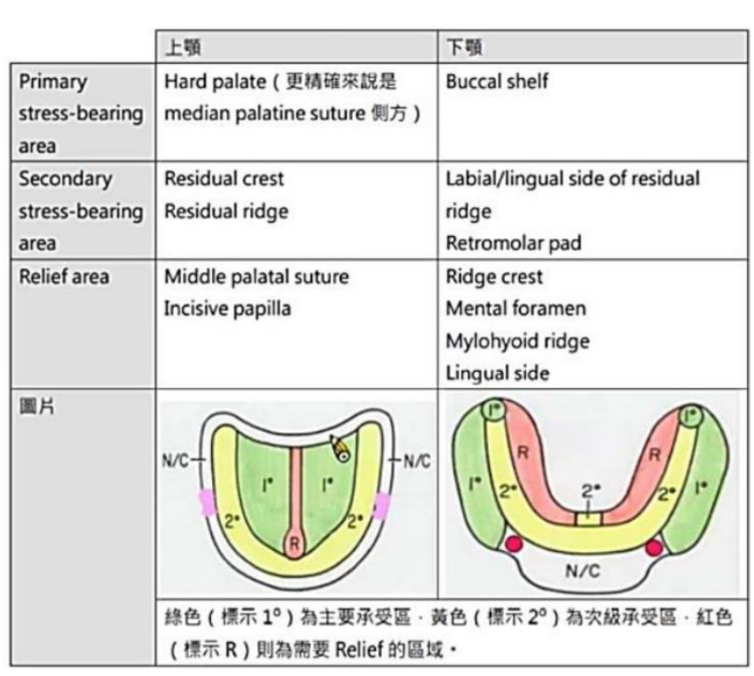

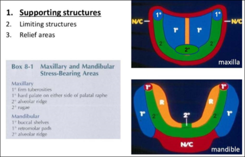