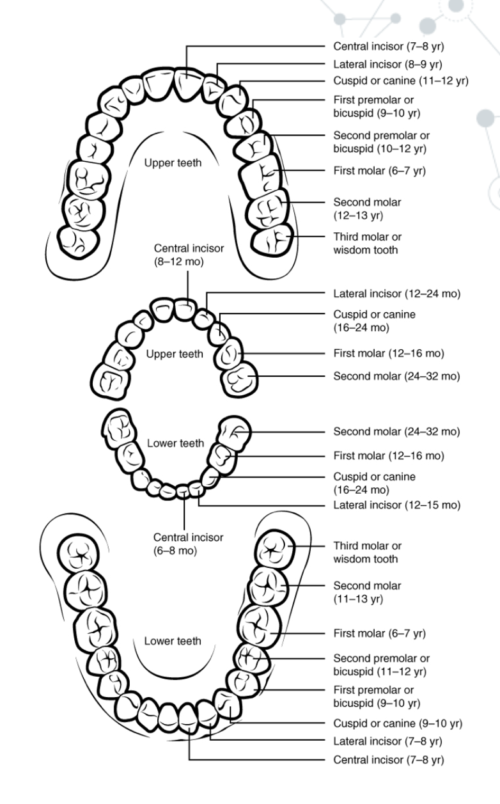
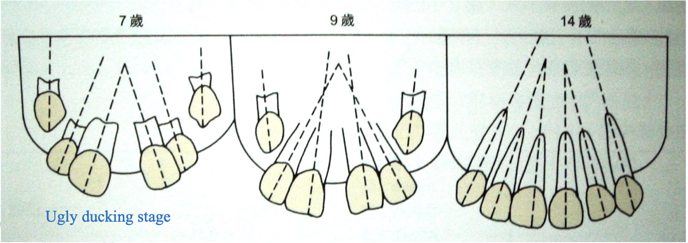

# 兒牙

## 萌發

### Incisor liability
- 門牙恆齒 MD 大很多
- Maxillary ：7mm
- Mandibular ：6mm
- 嚴重程度：下顎>上顎 男生>女生。而雖然上顎的incisor liability為7mm、下顎為6mm，但一開始上顎就有較大的門牙間空隙，使得恆門齒萌發時空隙跟Incisor liability 剛好打平，而下顎則應ㄧ開始的空間不足，會缺1.6mm的空間。
- 介入時機： 

| 情況                        | 介入時機 (Intervention) | 處理方式建議                                        |
| --------------------------- | ----------------------- | --------------------------------------------------- |
| 前牙反咬 (Crossbite)        | 發現即處理              | 防止骨骼發育受限或牙周受損 (如使用 3/4 circle arch) |
| 異位萌發 (Ectopic eruption) | 恆牙路徑嚴重偏移        | 早期導引萌發或拔除滯留乳牙                          |
| 嚴重擁擠 (> 4 mm)           | 混合齒列早期            | 評估空間分析，考慮擴張 (Expansion) 或間隙管理       |
| 多生牙 (Supernumerary)      | 阻礙恆牙萌發時          | 手術拔除以利恆牙順利萌發                            |

### 八字形牙間隙(Diastema)
- Ugly-duckling stage
- 等到#13、#23 canine(大概12-14 歲)長出來後，會把縫自然地關起來。

### 靈長類間隙 (Primate Space)
