# 兒牙

很多牙齒萌發的重要時間點都跟6 有關
- 乳牙開始形成是在胚胎時期第6 週
- 恆牙開始形成是胚胎時期第16 週
- 長出第一顆乳牙是在出生後6 個月
- 長出第一顆恆牙是在6 歲。

## 萌發

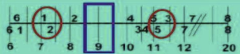

### 異常

#### 阻生 

阻生發生率：
- 下顎智齒 (22%) > 上顎智齒 (18%) > 上顎犬齒 (0.92%) > 小臼齒 (0.13%) > 下顎犬齒 (0.09%)

- 女性 (1.17%) > 男性 (0.51%)
- 單側 > 雙側

#### 萌發順序異常(DTE)
- 最容易出DTE的是上顎前牙，下顎前牙相對較不常見
- DTE of Maxillary Incisor
  - 對側牙齒已經萌發超過6 個月
  - 下顎正中門齒已經萌發超過一年
  - 側門牙已經萌發

---

#### 萌發位置異常(Ectopic eruption)

- Barberia Leache classification

| | | |
|-|-|-|
Grade 1| Mild |Limited resorption to the cementum or with minimum dentine penetration. (只靠到前面鄰牙的Cementum)|
Grade 2| Moderate |Resorption of dentine without pulp exposure.(會造成前面鄰牙的吸收)
Grade 3 |Severe| Resorption of the distal root leading to pulp exposure (會造成前面鄰牙牙根的吸收)
Grade 4 | Very severe |Resorption that affects the mesial root of the primarysecond molar

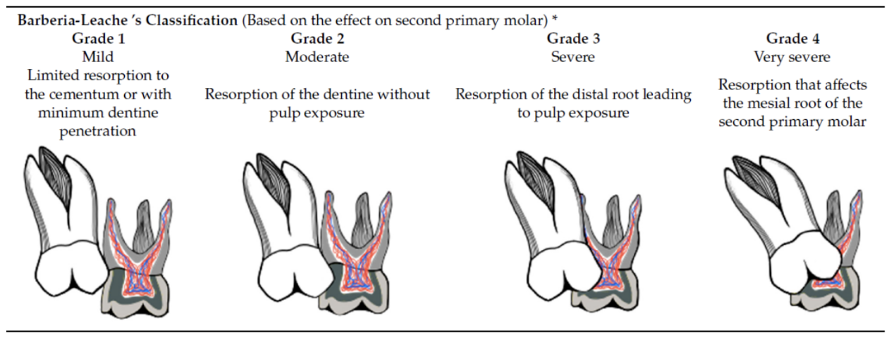

- Young (1957) classification

- 可逆型 (Reversible / Jump type)：異位萌發的大臼齒雖然卡在第二乳臼齒的遠心端，但在發育過程中會自行解脫，最終回到正常的萌發路徑。約有 66% 的異位萌發大臼齒屬於此類，通常在 7 歲前會自行校正。

- 不可逆型 (Irreversible / Hold type)：大臼齒持續卡在第二乳臼齒的牙根處，無法自行萌出。如果不進行醫療介入，通常會導致第二乳臼齒的牙根嚴重吸收甚至過早脫落。

- 介入時機
  - 牙齒穿透齒槽骨時(Tooth penetrates the alveolar crest)
  - 7 歲以上，且觀察後確認異位萌發為不可回復
- Treatment
  - Interproximal wedging
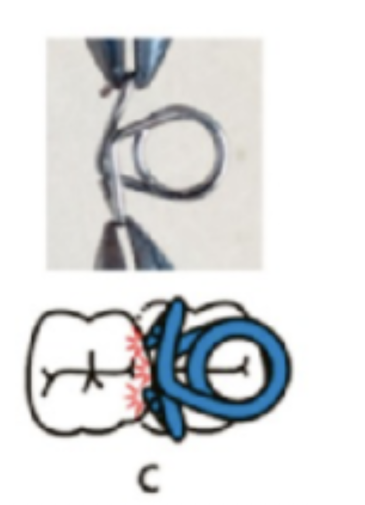
  - Separating spring
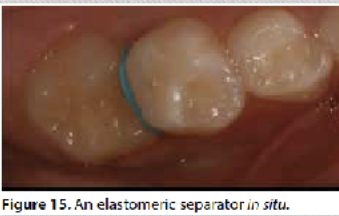
  - Halterman appliance

  - modified Nance appliance
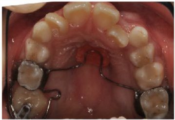

#### Ankylosis 

- 乳牙咬合面比鄰牙低 1mm 以上就是 Ankylosis
- 常見於下顎 D, E
- 正常恆牙萌發時脫落

## Space

### Incisor liability
- 門牙恆齒 MD 大很多
- Maxillary ：7mm
- Mandibular ：6mm
- 嚴重程度：下顎>上顎 男生>女生。而雖然上顎的incisor liability為7mm、下顎為6mm，但一開始上顎就有較大的門牙間空隙，使得恆門齒萌發時空隙跟Incisor liability 剛好打平，而下顎則應ㄧ開始的空間不足，會缺1.6mm的空間。
- 介入時機： 

| 情況                        | 介入時機 (Intervention) | 處理方式建議                                        |
| --------------------------- | ----------------------- | --------------------------------------------------- |
| 前牙反咬 (Crossbite)        | 發現即處理              | 防止骨骼發育受限或牙周受損 (如使用 3/4 circle arch) |
| 異位萌發 (Ectopic eruption) | 恆牙路徑嚴重偏移        | 早期導引萌發或拔除滯留乳牙                          |
| 嚴重擁擠 (> 4 mm)           | 混合齒列早期            | 評估空間分析，考慮擴張 (Expansion) 或間隙管理       |
| 多生牙 (Supernumerary)      | 阻礙恆牙萌發時          | 手術拔除以利恆牙順利萌發                            |

### 八字形牙間隙(Diastema)
- Ugly-duckling stage
- 等到#13、#23 canine(大概12-14 歲)長出來後，會把縫自然地關起來。

### 靈長類間隙 (Primate Space)
- 上顎1.7mm，下顎1.5mm
- 歲左右(20 顆乳牙就會長到定位)，到6 歲(第一大臼齒萌發)前，側邊
整體咬合呈現很穩定的狀態
- **Early Mesial Shift**: 6萌發會把往前推用掉 Primate Space，調出正常 class I 

- **Late Mesial Shift**： 如果早期沒用完空間，等到 $10$ 至 $12$ 歲乳臼齒脫落時，恆牙大臼齒會再次趁機往前移動，把這部分的 Leeway Space 填滿。

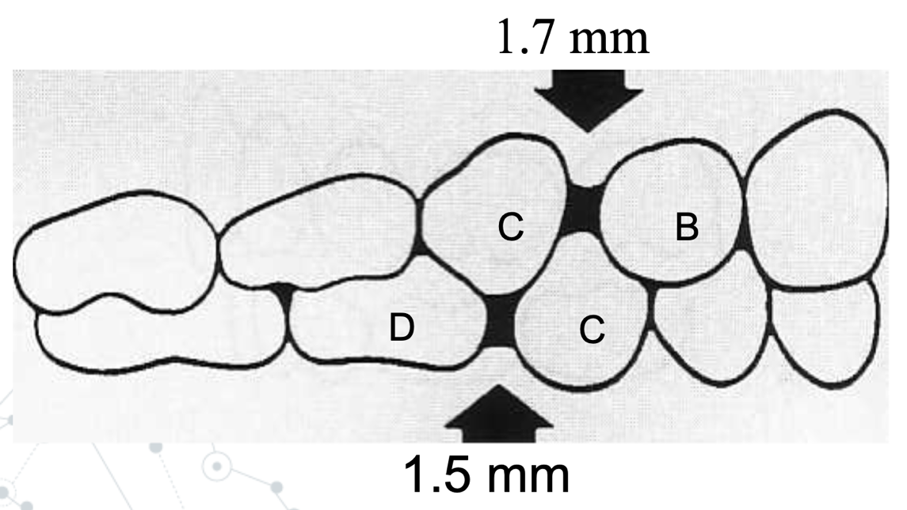

### 次級間隙  Secondary Space 

- 下顎的發動： 當#2準備萌發時，因為空間不足，它的牙胚會推擠#c，迫使#c 向Distal, Lateral 位移

- 牙弓擴張

- 上顎的連動： 因為上下顎乳犬齒之間有咬合接觸，當下顎#c被往外推時，會像齒輪一樣帶動上顎#c也跟著往側方移動。

- Secondary spacing: 上#c往外移後，會出現新的縫隙。

### Leeway space
- (C+D+E) – (3+4+5)
  - 上顎：單邊0.9mm
  - 下顎：單邊1.7mm
- Leeway space 解決75% lower anterior crowding

#### 估計 

$$
345 =  a\times \text{lower Ant.}+ b
$$

- Tanaka-Johnston analysis
  - Mx: a=0.5, b=11
  - Mn: a=0.5, b=10.5

- 小野
  - M Mx: a=0.53, b=10.2
  - M Mn: a=0.52, b=9.7 
  - F Mx: a=0.57, b=9
  - F Mn: a=0.55, b=A8.5

## 空間維持器

### 考量

- 乳牙喪失後所經過的時間
  - 前6個月內，是齒列移動最劇烈的時
- Dental age: 發育年齡
- 覆蓋在未萌發牙齒上的骨頭量
  - 1mm 的骨頭，大概還要再長6 個月
- 牙齒萌發
  - #6 萌發前 space 不大改變。在大臼齒萌發的過程中，則需要空間維持器。
- Delayed eruption
- Congenital absence

- 空間喪失在以下的狀況會比較劇烈(Space loss is greater.)
  - 上顎(相較於下顎)
  - crowded dentition(相較於spaced dentition)
  - 越早發生缺失
  - 越後方的牙齒
  - 越多牙齒缺失

## 缺牙 

### 乳犬齒缺失

- 側門牙擠掉乳犬齒
- 中線偏移
  - 拔對側 C 
- 沒偏移
  - 空間維持 
  - RPD
- 重可能需要及早矯正 (Deep bite)

### 乳臼齒缺失

- 上6: molar 以palatal root 為中心向mesial 旋轉
  - Transpalatal bar
  - Fixed appliance
  - Band and loop
- 下6: 向mesial 傾倒
  - Lingual arch
  - Band and loop

#### Fixed appliance

- Nance appliance (第一種fixed)
  - acrylic button靠在軟組織處

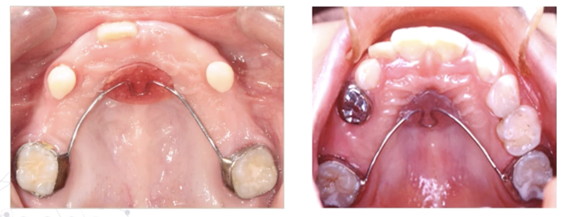

- Transpalatal arch
  - 舒適、清潔更容易
  - 穩定性差
  - 雙側E都缺失時不建議使用

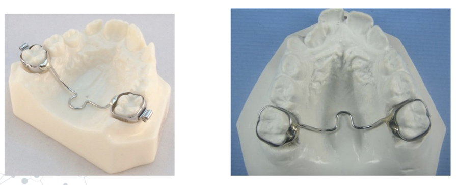

- Lower lingual holding arch(LLHA) 
- 全部恆門齒皆長出才能放置

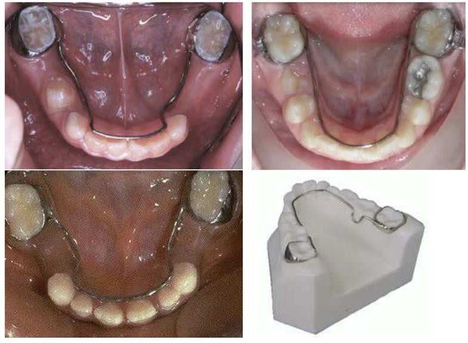

#### 決策樹

##### 乳牙列期 (Primary Dentition)

>此階段第一大臼齒 ($6$) 尚未萌發，最大的挑戰是防止 $6$ 近中移位。

- 缺失 D ：均使用 Band and loop 
- 缺失 E ：
  - 下顎： 使用 Distal shoe (引導 $6$ 萌發) $\rightarrow$ 等恆門牙與 $6$ 萌發後換成 LHA。
  - 上顎： 暫時觀察 $\rightarrow$ 等 $6$ 萌發後做 Distal crown and loop $\rightarrow$ 雙側 $6$ 全長出後換 TPA。
- 多顆/雙側乳臼齒缺失：使用 Saddle appliance (功能性空間維持器) $\rightarrow$ 待 $6$ 萌發後換 Nance (上顎) 或 LHA (下顎)。

##### 混和齒列早期 (Early Mixed)
>此階段 $4$ 顆第一大臼齒 ($6$) 已萌發，但恆門牙可能尚未完全長齊。

- 缺失 D ：通常不需處理 (No tx.)，除非為了保住 Leeway space。下顎單側若有需求可做 Band and loop。
- 缺失 E ：
  - 上顎： TPA (橫顎桿) 或 Nance 。
  - 下顎： 
    - 單側 Band and loop $\rightarrow$ 等恆門牙長齊換 LHA；
    - 雙側直接考慮 LHA (需注意門牙萌發狀況)
- 多顆缺失：
  - 上顎：Nance。
  - 下顎：Saddle appliance $\rightarrow$ 換 LHA。

##### 混和齒列晚期 (Late Mixed)

>此階段 $6$ 顆第一大臼齒與所有恆門牙均已萌發。

- 缺失 D ：大多不需處理 (No tx.)，除非需嚴格保留 Leeway space。
- 缺失 E ：
  - 上顎： TPA (單側) 或 Nance (雙側/多顆)。
  - 下顎： Lower Lingual Holding Arch (LHA) 為黃金標準，因為恆門牙已萌發，可穩定支撐。

## 行為 

### 吸吮 

- 2 歲以前的吸吮動作都是正常的
- 3–4 歲：建議戒除時機
- 4 歲後仍未戒除：可能影響齒槽骨的發育
- 前牙開咬
- 呈現安格氏第二類咬合關係(Class II malocclusion)

### 吐舌癖 Tongue thrust swallowing

- 定義：吞嚥時舌頭前推，位於上下前牙之間 (retained infantile swallow)
- Contributing factors：
  - 臺灣過敏的小朋友超過40%，臺北小孩更是超過50%。過敏時Tonsils、Adenoids 會腫、鼻子會塞住，就會造成口呼吸，進而造成tongue thrust。
  - 餵食習慣feeding practice：奶瓶
  - 代償機制functional adaptation4
  - Lingual frenum：可能因為舌頭frenum過緊，限制舌頭上抬。
  - Brain injury

## Tx 

### Caries

風險類別 |臨床檢查 |X 光回診時間 |塗氟齲齒防治|
|-|-|-|-|
低風險| 6~12m | 12~24m |每日刷2 次1000ppm含氟牙膏|
高風險 |3m | 6m |每日刷2 次1000ppm含氟牙膏  氟補充劑：每3 個月塗氟
超高風險 |每個月回診| 6m |每日刷3 次1000ppm含氟牙膏  氟補充劑：每1~3 個月塗氟

### Endo 
> - 間接蓋髓術 (IPT, Indirect Pulp Treatment): 乳牙無效
> - 直接蓋髓術 (DPT, Direct Pulp Treatment)
> - Pulpotomy: 移除受感染的冠部牙髓
> - Pulpectomy: RCT

**Operative Diagnosis**: 一邊治療，一邊改診斷

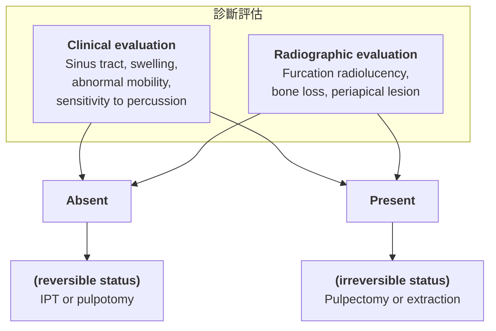

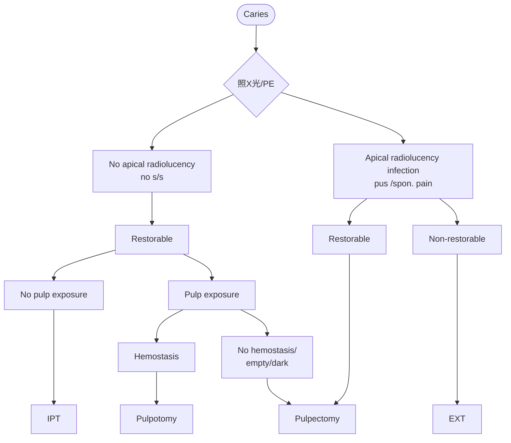

####  Clamp selections

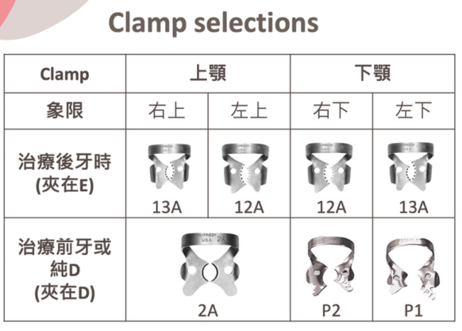
