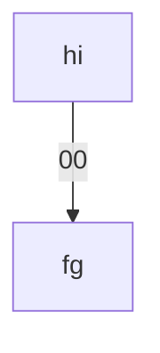

---
toc:
    depth_from: 1
    depth_to: 3
html:
    offline: false
    embed_local_images: false #嵌入base64圖片
print_background: true
export_on_save:
    html: true
---


# &gamma;
# g 


# basic 

- **bold**
- *Italic*
- ***f8***
- ```hello```
  - 不要放在一行開頭
- ~~Delete~~
- {++dd++}
- H~2~O, e^i^
- ==Hightlight==
- //Italic quote//
- 註解[^tag] 
[^tag]: 真的沒用
- line: ```ddc```
- HTML 符號
  - &alpha;&beta;&gamma; 

  - &rarr;&deg;&check;&cross;
- :fa-car::smile::bus:
  - [emoji-cheat-sheet](https://github.com/ikatyang/emoji-cheat-sheet/blob/master/README.md )
- [ ] CHECK
- [x] CROSS


 


---

> quote 

Words
: Definition

## Coding

```python 

import random
import time

def is_sorted(lst):
    for i in range(len(lst) - 1):
        if lst[i] > lst[i + 1]:
            return False
    return True

def extreme_bogo_sort(lst):
    attempts = 0
    while not is_sorted(lst):
        random.shuffle(lst)
        attempts += 1
        print(f"第 {attempts} 次嘗試: {lst}")
        # 加一點延遲，免得輸出刷太快
        time.sleep(0.2)
    print(f"\n排序完成！總共 {attempts} 次嘗試")
    return lst

# 範例
lst = [3, 1, 4, 2]
sorted_lst = extreme_bogo_sort(lst)
print("最終結果:", sorted_lst)

```


## latex 

$$
\sum^{1}_{x=2}\frac{1}{2}
$$

## Figure 


\picBox{
    
        

}

:::fbox 


:::


# Table


|\diagonal{星期 |節次}|星期一 | 星期二|星期三 |
|-|-|-|-|
|第一節|國文|星期 | 數學|
|第二節|自然| |公民
|第三節|體育|音樂|數學|
|^|^|代數||


|a|l|-|
|-|-|-|
|\oneline{
1. fwegfwerfergw4edfaerg
2. f 
3. &rarr;


}|\oneline{
1. f 
2. f fstfergw4edfaergfwegfwerfergw4edfaergfwegfwerfergw4edfaerg
3. &rarr;

}|\collapse[fwegfwerfergw4edfaergfwegfwerfergw4edfaergfwegfwerfergw4edfaergfwegfwerfergw4edfaergfwegfwerfergw4edfaergfwegfwerfergw4edfaergfwegfwerfergw4edfa oerg]{dd}|


|a|a|
|-|-|
|a|\oneline{
- dc 
- df 
- d
\collapse[]{hi}
}| 


>gfgw


# 花招

## alert 

:::note {note}
notes
:::


:::warning {Warning}
!!
:::


:::info {info}
i
:::


:::danger
{qq}
danger
ff
:::


:::example
$$
-\frac{1}{12}=1+2+3+4...
$$
:::

:::question
:::

:::success
:::
:::failure
:::


## 兩欄 
:::left
- left 
- left 
- left 
- left 
- left 
:::right
1. right 
1. right 
1. right 
1. right 
1. right 
:::


 ```lr```


## Iframe

@web https://la.wikipedia.org/wiki/Lamina_propria


## Mermaid 





```tikz
\draw[gray, thick] (-1,2) -- (2,-4);
\draw[gray, thick] (-1,-1) -- (2,2);
\draw[red, thick] (1,-1) -- (2,2);
\filldraw[black] (0,0) circle (2pt) node[anchor=west]{Intersection point};
```


# 其他手搓插件 

`\div-class[class]{content}`
\div-class[class]{content}

---
`\style[background:red ; color: yellow]{ hi}`
\style[background:red ; color: yellow]{ hi}

---
`\collapse[詳細]{資料}`
\collapse[詳細]{資料}


# 官方文檔 
https://shd101wyy.github.io/markdown-preview-enhanced/#/ 

@web https://shd101wyy.github.io/markdown-preview-enhanced/#/

## 危險，容易有 bug 的毒瘤: 內嵌可執行代碼

@web https://shd101wyy.github.io/markdown-preview-enhanced/#/code-chunk?id=showcases-outdated


## 施工中 
