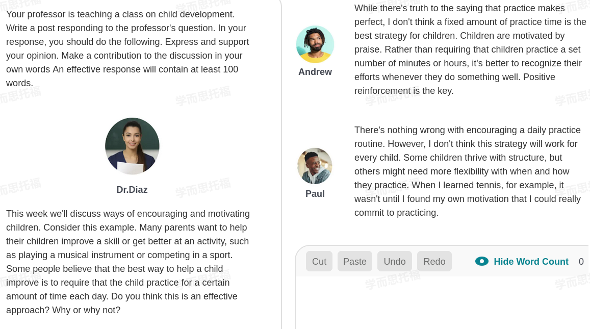

---
toc:
    depth_from: 1
    depth_to: 3
html:
    offline: false
    embed_local_images: false #嵌入base64圖片
print_background: true
export_on_save:
    html: true
---

# 1108

Whether project base learning is more effective than traditional learning is a complex issue. I agree with Andrew's point that traditional learning is the better one. According to my experience, very few teacher can guide a project-based laerning correctly. Most of time, the teacher just distributes topics to every groups of students, but can't fing the points or the knowledge that students missed in the reports. In the end, students can only learn shallowly. Kelly raised relavant point, but she neglects the fact that although interpersonal skills are helpful, learning knowledge is the first priority in the college.

Whether young students or older student can benefit more from group learning activities is a complex issue. I agree with Andrew's point because group learning activities require students to have the ability of dealing with conflicts and older students are mature enough to have this ability. For example, when I was a high school student, I had a group representation with my classmates. We conflicted when deciding the topic, in the end; we overcame it and learned interpersonal skills. 
Claire raised a relevant perspective, but she overlooked the fact that young students respect their teacher too much that they may be lack of creativity.

# 1113

Whether a fixed amount of practice time is the best way to improve children's skills is a complex issue. I agree with Paul´s opinion that the practice should be flexible. Although it is impossible to learning a skill without plenty of practice, cultivating motivation is the better learning stratege than forcing children to rigid practice. When i was a child, for example, I couldn´t write chinese characters well until founding the motivation for pracice. I though the repetive writing practice for characters is untolerable at the time. However, after realizing writing beautiful could help me express myself better, I began to commit in pracice. Accordingly, I don´t support that practice a certain amount of time each day is an effective approach for learning.
