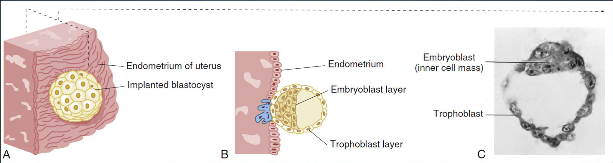
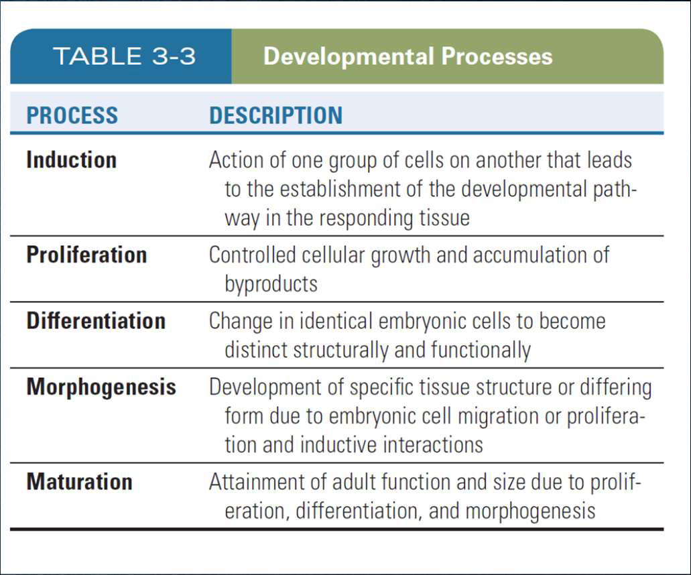
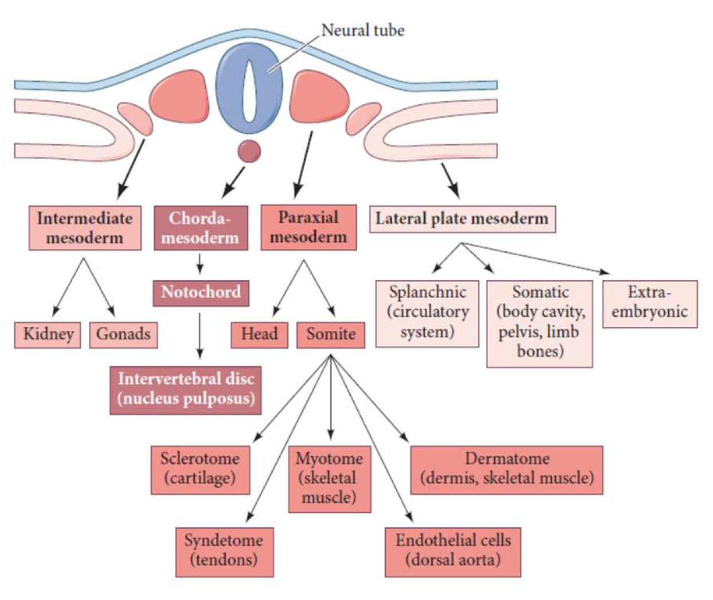

---
toc:
  depth_from: 1
  depth_to: 3
html:
    offline: false
    embed_local_images: false #嵌入base64圖片
print_background: true
export_on_save:
  html: true
---

# General

- 精子進入點對面是背（垂直軸，$\beta$-catenin）
- morula 8-16
- blastula 囊胚
  - trophoblast cells
    - 形成胎盤
  - embryoblast
    - 分化成細胞

## 分化
- 頭尾分化
  - Wnts 

- SHH
  - 左右分化
  - 鞭毛

!!!   
    Wnts: 沒翅膀
    SSH: 一堆剛毛，Sonic hedgehog

Somite
: from 中胚

Somitomeres
: 產生頭部肌肉

neural crest cells (NCCs)
: 外胚層，生成神經節、頭頸部雜七雜八
