---
toc:
    depth_from: 1
    depth_to: 3
html:
    offline: false
    embed_local_images: false #嵌入base64圖片
print_background: true
export_on_save:
    html: true
---

@import "口病_cyst.md"
@import "口病_odontogenicTumor.md"
@import "口病_epithelialTumor.md"
@import "口病_唾液腺.md"
@import "口病_皮膚.md"
@import "口病_感染.md"
@import "口病_Hema.md"
@import "口病_Soft.md"

# developmental defect
<iframe src="developmental defect.pdf" width="100%" height="600px"></iframe>

# Abnormal

- 症候群相關
  - PITX-2 
  - SHH 
  - PAX-9

Neonatal ring
: 胎兒期與出生後期牙齒發育中的交界

## 發育型

|變異名稱| 好發位置|| 好發族群| 成因 | 症狀 |其他||
|-|-|-|-|-|-|-|-|
|Turner hypoplasia|Crown & Root|<ul><li>**Trauma** : 上顎正中門牙, Facial (Avulsion, intrusive luxation)</li><li> **Caries**: 小臼齒</li></ul>| <ul> <li>**Crown**: 1.5-3y</li><li>**Root**: 4-5y</li></ul>|發炎 (乳牙 Caries, trauma) 影響恆牙發育 |局部或整個牙冠白、黃或棕色發育不全 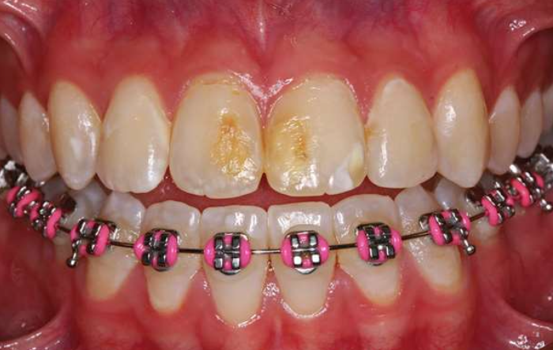|	
|^|^|^|^|^| 無明顯邊界|
|Molar-Incisor Hypomineralization (MIH)|Crown|單或多個恆牙下顎 1^st^Molar (可能影響 Incisor) |-| **乳牙**: 產前母體疾病、藥物、早產   **恆牙**: 幼兒期疾病(fever, asthma, pneumonia)| 局部白、黃或棕色發育不全，可能多孔凹陷 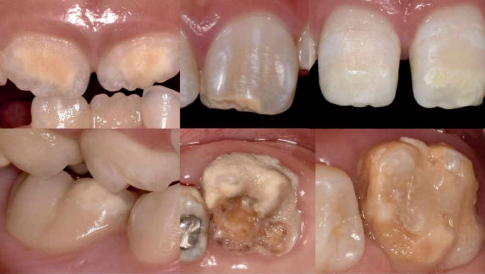 | CPPACP: 重新鈣化，降敏
|^|^|^|^|^| 有明顯邊界|^|
|^|^|^|^|^| 痛 (27.4%)|^|
| Molar Root-Incisor Malformation (MRIM, MIM) |Crown & Root|單個恆牙下顎 1^st^Molar (可能影響 Incisor) |3y (1^st^ Molar root)|非遺傳，可能和神經疾病( seizures, meningitis)相關|短窄尖牙根，牙冠相對正常|
|^|^|^|^|^| Chamber 變矮，異位礦化(ectopic mineralized ) 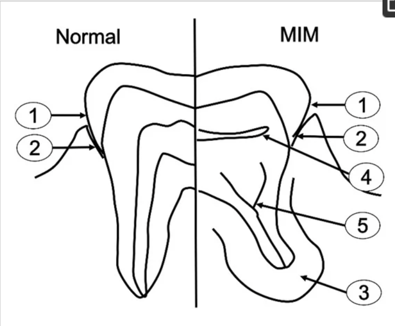
|^|^|^|^|^| 常見疼痛|
|^|^|^|^|^| 1^st^ Molar 拔除|
|Hypoplasia Caused by Antineoplastic Therapy| Root & Crown | -| 12y&darr; (Common)   5y&darr; (Extensive)| 放射線(4gy: 畸形，30gy: 發育停止)、化療 | 小牙症 (microdontia, 3y&darr; 暴露)
|^|^|^|^|^|發育不全 (hypodontia)
|^|^|^|^|^|V-shaped hypoplastic roots
|^|^|^|^|^|enamel hypoplasia
|^|^|^|^|^|下顎垂直發育減少
|Dental Fluorosis |Crown |兩側同時，對稱性|上顎 Incisor 在 3y 發育完成，需重點監測|氟結合 Amelogenin |琺瑯質白色區域(white, chalky areas)，無光澤，不透明
|^|^|^|^|^| 可能有黃色至深棕色區域(mottled enamel)
|Syphilitic Hypoplasia (Congenital syphilis)|Crown| ALL | - | 先天梅毒 | **Screwdriver-shaped incisors**: Incisor 切端收縮，中間 1/3 最寬 (必要)
|^|^|^|^|^| Incisor 切端中間發育不全切跡 (central hypoplastic notch)
|^|^|^|^|^| 桑椹臼齒(mulberry molars)

### Imperfecta

#### Amelogenesis Imperfecta (AI)

- 低鈣化型 (Hypocalcified): 
  - enamel 密度低，X-ray 下dentin 分不出界線
  - "Moth-eaten" (蟲蝕狀) 外觀
- 發育不全型 (Hypoplastic)： 
  - enamel薄 &rarr; Square crowns, Open contact points

- 髓腔和牙根正常（這是與 DGI 最重要的區別）。

:::fbox 

:::

#### Dentinogenesis Imperfecta (DGI)

- Osteogenesis Imperfecta 相關
- Bulbous Crowns
- Cervical Constriction： CEJ 明顯的緊縮，讓牙冠看起來更容易斷裂。
- Pulp Obliteration： 髓腔和根管在萌發後不久就會鈣化、閉鎖，X 光上看不到髓腔。
- Short Roots

:::fbox 

:::

#### Dentin Dysplasia (DD)

- Type 1: Radicular (根部型) 
  - Rootless Teeth
  - W形/新月形殘髓： 髓腔幾乎完全鈣化，僅在牙冠部留下一點點水平的、像新月形 (Crescent-shaped) 的透射區。
  - 根尖病變： 在沒有蛀牙的情況下，常可見Periapical RL，是 Granuloma or Cyst
- Type 2: Coronal (冠部型)
  - 乳牙： 似 DI（球狀牙冠、髓腔鈣化）。
  - 恆牙（關鍵）： 
    - 牙根長度正常。
    - 髓腔形呈現 "Thistle-tube appearance" (薊花管狀)，即髓室擴大且延伸至根管口
    - 髓腔內常充滿 Pulp stones (髓石)。

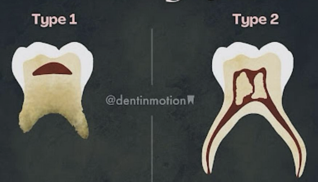 

### ACCESSORY CUSPS

:::left

- Talon Cusp

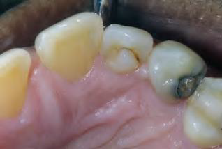

- Shovel-Shaped Incisors

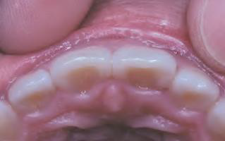
:::right
- DensEvaginatus
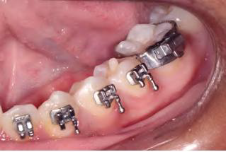

- Dens invaginatus

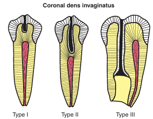
:::

### 牙根 

:::left

- Supernumerary Roots
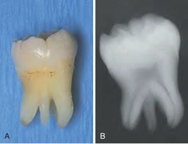

- Globodontia
:::fbox 
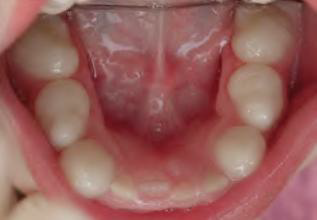
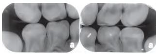
:::
:::right

- Lobodontia
  - 一堆小尖牙

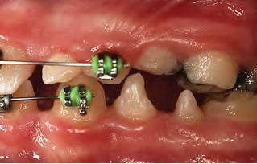

:::

## 發育後

|變異名稱| 好發位置|| 好發族群| 成因 | 症狀 |其他||
|-|-|-|-|-|-|-|-|
|Attrition| Crown| Occlusal, incisor edge|-|磨牙, Deep bite, Cross bite | 敏感。雖然會 Pulp exposure 但 reparative secondary dentin 填充 pulp chamber，較少疼痛| 
|Abrasion|^|非慣用手頰側齒頸 | - | 刷牙| 齒頸水平 notch
|^|^| 鄰接面 |^| 牙籤、牙線| 鄰接面半月形
|^|^| 犬齒、小臼齒 |^| 咬螺絲、菸斗| O, V 型缺口|
|Erosion| ^ | **唾液較少處:** 上顎前牙, 下顎後牙 Occlusal& Facial| **唾液腺功能衰退**: salivary gland aplasia, 脫水(dehydration) , 放射治療, Sjögren syndrome, DM, 神經性貪食症(bulimia nervosa) | 酸性侵蝕 | Dentin exposure，周圍 Enamel 白圈高起 (侵蝕抗性差異)
|^|^|^|^|^|上顎門牙齒頸湯齒狀凹陷|
|^|^|^|^|^|金屬補綴物邊緣暴露|
|^|^|^| **胃酸**: perimolysis|^|^|
|Abfraction |^| 後牙Facial, 單顆齒頸1/3 | - | 咬合力| V 形尖銳缺口，可能延伸到牙齦下。 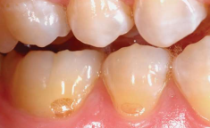
|^|^|^|^|^| Tertiary dentin 修復，較少疼痛
|Internal Resorption |Root|少見||**發炎吸收:** 肉芽組織取代 Dentin|無症狀，發炎則疼痛。   Pulp 紅色透出。   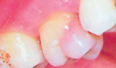  X-ray 下 balloon-like dilation of the canal。 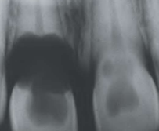|
|^ |^|^|^|**替代或化生吸收 (replacement or metaplastic resorption )**: Bone, cementum 取代 Dentin|^|
|External Resorption|^|常見|| 發炎| Root 變短，根尖不規則。妥善治療則一年內痊癒。 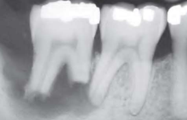
|^|^|^|| ^| PDL, 根尖周圍 lamina dura 消失或模糊
|^|^|^|| ^| 妥善治療則一年內痊癒
|^|^| 上顎門牙 (移動距離長)| 矯正| | 根尖圓形。 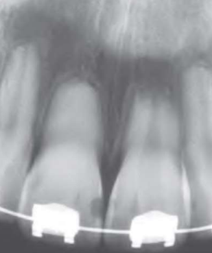
|^|^| -|| **其他外部壓力:** 阻生齒、腫瘤、Cysts | 根據受力位置、形狀
|^|^| -||嚴重 luxation, avulsion 導致 PDL 死亡| 牙齒視為異物，外吸收並骨取代|
|^|^|齒頸 cementum|Invasive cervical resorption (三顆牙以上 &rarr; multiple idiopathic cervical root resorption )|-| 沿著齒頸一圈吸收，不太影響 pulp|
|^| 遺傳 (如 IL-1B allele) 可能導致外吸收。未萌發牙冠可能發生外吸收|

## 染色 

:::left

- Tobacco Discoloration
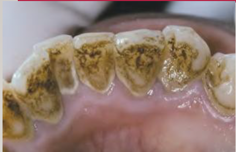
- Erythropoietic Porphyria–Related Discoloration
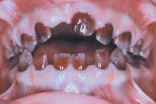
- Hyperbilirubinemia-Related Discoloration
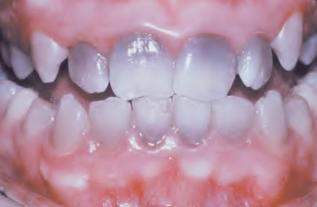

:::right
- Amalgam Discoloration
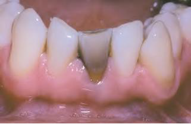

- Tetracycline-Related Discoloration
  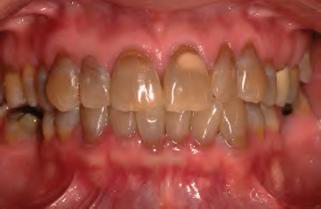
  - 3y 前
- Minocycline-Related Discoloration

  - 成熟後仍能染
:::

# 物裡傷害 

Emphysema
: 氣腫

Dysguesia
: 味覺障礙

Contusion
: 挫傷/鈍器傷

Riga-Fede Disease
: 一歲內，neonatal/natal tooth 萌出後磨到舌尖或口底

Bednar’s ulcer
: 新生兒吸吮負壓造成， palate 壓迫 hamulus 形成 ulcer

epulis fissuratum
: 假牙側翼太長，長期摩擦上顎前庭

Inflammatory papillary hyperplasia
: palate 假牙不合創傷 + candida albicans，漱口水 (Nystatin)

Morsicatio buccarum, linguarum
: 片狀，長期咬

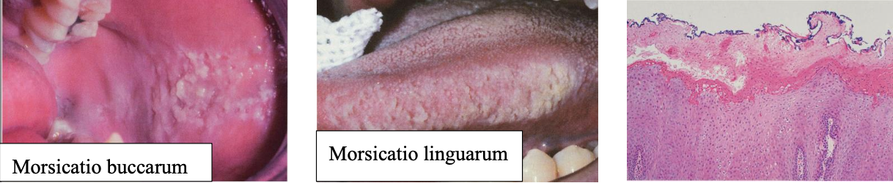

Exfoliative cheilitis 
: 剝落性唇炎

Stomatitis nicotina
: 尼古丁性口炎，palate 反向草莓 (紅色為小唾液腺開口)

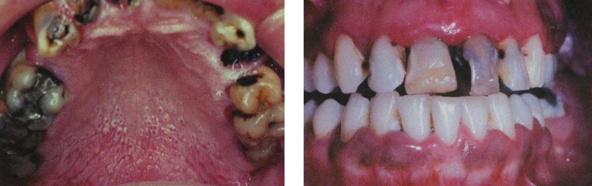

Radiation Caries
:Dentin 壞死 ，齒頸一圈，可能一刮就掉。

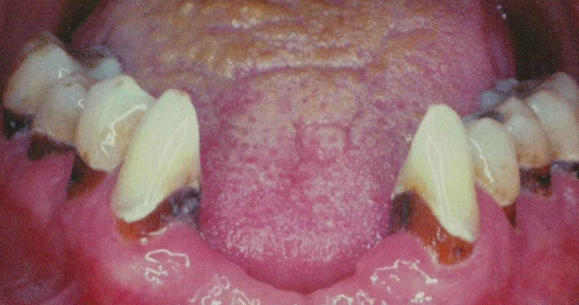

osteoradionecrosis(ORN)
: 無局部腫瘤疾病，骨頭表面暴露，長達 3~6 個月無法癒合。Fibrosis 導致缺血造成骨壞死 &rarr; 下顎 risk

# Chemical injuries

- 上皮凝固性壞死(Coagulation necrosis): 外型尚存中央壞死

- 傳統化療導致 DNA 裂解，ROS 導致發炎壞死，不宜 steroids 治療 (無法防止 DNA damage 又抑制免疫 )。
- mTOR inhibitor-associated stomatitis (-limus ) 
  - 類似 RU 潰瘍 + 周圍紅斑 
  - 用 steroids

## Osteonecrosis of the Jaw (ONJ)

Medication-Related Osteonecrosis of the Jaw (MRONJ)

- 名稱流變 BRONJ→MRONJ→ONJ
- 雙磷酸鹽 (曾用於抑制骨吸收) 相關
- 植牙一直失敗
- Osteoblast 把藥存進骨頭裡 
- Fosamx, Zometa
- mandible 多

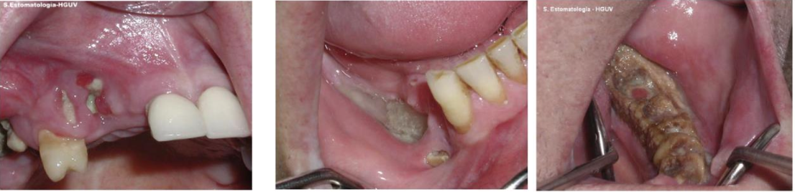

# 整理 

- 上唇疾病
  - Canalicular Adenoma
  - Nasolabial Cyst
  - Fordyce Granules

- 嘴唇的腫脹(廣泛性) 
  - Sarcoidosis 結節病 
  - Tuberculosis 結核病
  - Scrofula
  - inflammatory bowel disease, IBD
    - Crohn’s disease 
    - pyostomatitis vegetans (增殖性化膿性口炎)

- 多處局部腫脹
  - Multifocal Epithelial Hyperplasia (Heck Disease)
  - Orofacial Granulomatosis
  - Granulomatosis with polyangiitis 
    - 草莓牙齦(Strawberry gingivitis)
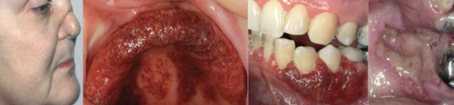
  - Tuberous Sclerosis (結節型硬化症)
  - Cowden Syndrome

---

- 脫屑性牙齦炎(desquamative gingivitis)
  - 自體免疫，Interdental papilla高度正常
  - PV 
  - MMP 
  - SLE
  - Erosive Lichen Planus
  - Chronic Ulcerative Stomatitis (CUS)
- 壞死性潰瘍性齦炎 (necrotizing ulcerative gingivitis, NUG)
  - 細菌感染，Interdental papilla高度下降，幾乎不見

---

- 草莓舌
  - kawasaki disease
  - 猩紅熱
  - 小孩子的 COVID-19

- Fissured Tongu
  - 組織
    - Filiform papilla 的 keratin 消失
    - PMN 跑到上皮
  - 1/3 地圖舌
  - 相關 syndrome
(1) 唐氏症
(2) Melkersson-Rosenthal syndrome 梅-羅綜合症
Fissure tongue、口腔顏面肉芽腫、嘴唇腫脹、顏面神經麻痺
Bell palsy
(3) 惡性貧血症
(4) 巨舌症
(5) 先天性甲肥厚(Pachyonychia congenita)
(6) Cowden
1. 治療
(1) 無症狀不需治療，只需維持口腔衛生
(2) 疼痛→系統性疾病、感染（念珠菌）→steroid

---

- 骨痛
  - 休息骨痛: Paget
  - 休息骨痛緩和: osteoarthritic
  - 夜間躺平骨痛:  Osteoid osteoma 

- 造成淋巴結的腫脹的疾病 
  - 感染性
    - Scrofula 
    - Cat-scratch disease 
    - Infectious mononucleosis 
    - Measles(Rubeola)(較多) 
    - Rubella(較少) 
    - Human immunodeficiency virus(HIV) 
  - 血液性： 
    - Hodgkin lymphoma 
    - Kawasaki disease 
    - Rosai-Dorfman disease 
    - Kikuchi-Fujimoto disease 
    - Kimura disease 
    - Castleman disease 

- Eosinophil 浸潤
  - Lymph Follicle內
    - Kimura disease
    - Epithelioid Hemangioma
  - Hodgkin lymphoma
  - Langerhans cell histocytosis (LCH)
  - pyostomatitis vegetans (增殖性化膿性口炎)
  - Bullous Pemphigoid (BP)

## 罵取表
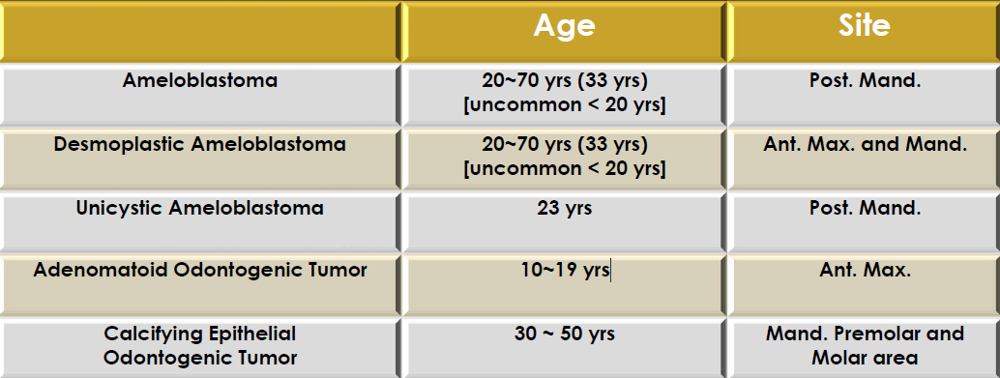
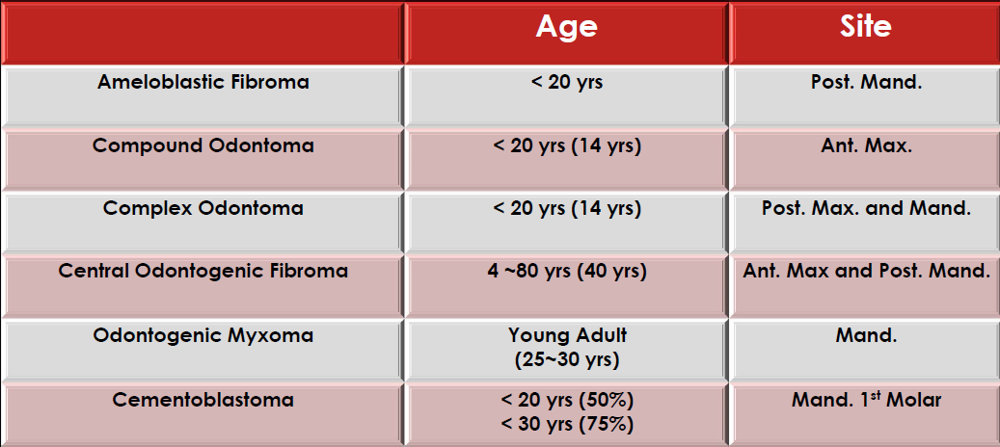
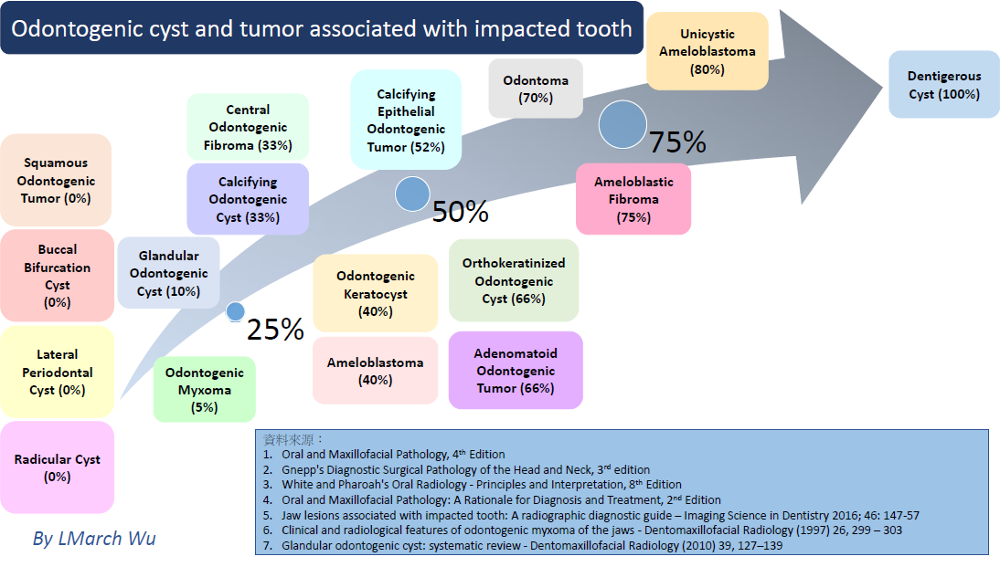

### 指甲 

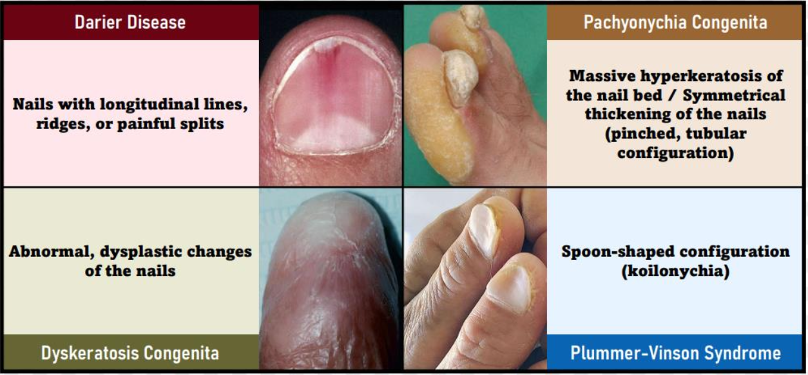

### 根尖病變 

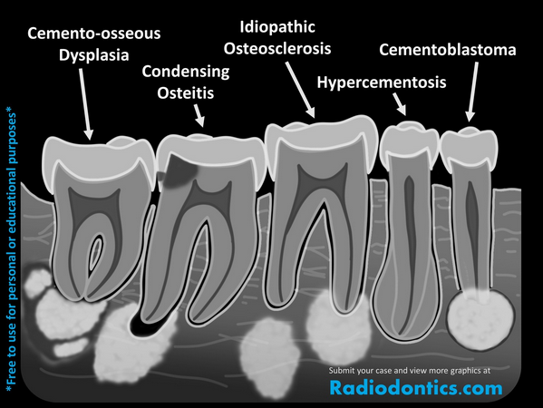

## 基因 

### BRAF mutation
- [Intraoral melanocytic Nevus](#p-stylecolorred-intraoral-melanocytic-nevusp)
- Skin Melanoma  

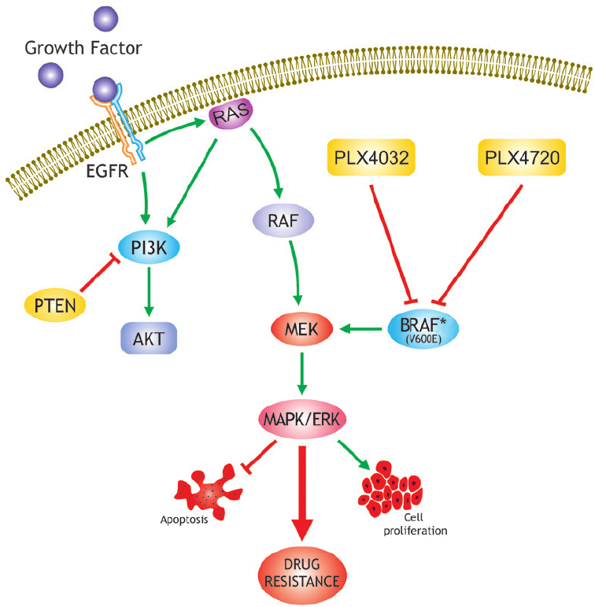

### CTNNB1 mutation
- WNT 
  - β-catenin 由 CTNNB1基因編碼，Mutation &rarr; β-catenin 無法降解

- Calcifying Odontogenic Cyst
- Fibromatosis
- Basal cell adenoma
- Sinonasal-type hemangiopericytoma

### KRAS

- 原癌基因
  - 生長因子信號細胞膜  &rarr; 細胞核
- March 在搞 ， 就他一個人說 KRAS 和 Giant cell 有關，明明機制超不清楚，2018 才被提出來 KRAS 和 Central giant cell carcinoma 有關
- 反正總而言之，大概和==顎骨腫瘤裡面的發炎反應有關==

### GNAQ

- 9q21
- 編碼蛋白質: Gαq（G蛋白αq亞基）。

- Sturge-Weber Syndrome：腦三叉神經血管瘤病，錯構瘤性的血管增生
- Blue Nevus： 良性

### HLA-傻B 

| |HLA|
|-|-|
|Sjogren syndrome | B8, DR3 &rarr; DRw52 |
| Dermatitis Herpetiformis (DH) | DQ2(90%), DQ8 |
| Stevens-Johnson Syndrome |  B1502 (carbamazepine), B5801(allopurinol)
| Psorsis | Cw6 |
| Reactive Arthritis | B27|

## IHC 

- 神經 
  - S100 
  - Sox 10
  - GFAP (髓鞘 )
- 肌肉 
  - SMA (平滑肌)
  - Actin
  - Calponin
  - Desmin (分化好)
  - Myogenin, MyoD1 (橫紋)
- 間質 
  - Vimentin
- 間質腫瘤
  - CD 117 (c-kit)
- adipocyte
  - S100 (Liposarcoma)
  - Leptin

---

- 血管內皮 
  - CD31, CD34
- 淋巴內皮 
  - D2-40 
- 淋巴球 
  - CD43 
- Macrophage
  - CD68
  - CD14 (促發炎)
- B cell 
  - CD79a
- plasma cells
  - CD138
---
- 上皮腫瘤
  - CK
  - p63 
  - p40 (鱗狀上皮)

- Skin
  - BRAF

- melanoma 
  - HMB45
  - MART-1 (Melan-A)

---
- Cell cycle
  - MDM2
  - CDK4
- Mitosis
  - Ki67
- 抗凋亡
  - bcl-2
---
- 玻尿酸
  - Alcian blue
- 粒線體
  - PTAH

## 驗血

- 自體免疫
  - ANA（Antinuclear Antibody）
    - 高度敏感、但特異性低
  - RF（Rheumatoid Factor）類風濕因子
    - 特異性與敏感度都不高
  - Anti-SS-A(Anti-Ro), Anti-SS-B(Anti-La)
    - Sjögren syndrome
  - Anti-CCP
    - RA 特異度最高（>90%）

| 抗體名稱 (Abbreviation) | 全稱 / 標的 | 相關疾病 (Associated Disease) | 敏感度 / 特異性 (Sens/Spec) | 臨床與口腔意義 (Clinical & Oral Significance) |
| :--- | :--- | :--- | :--- | :--- |
| **ANA** | Antinuclear Antibody (抗核抗體) | SLE, Sjögren syndrome, Sclerosis, MCTD 等 | **敏感度高** (篩檢用) **特異性低** | **自體免疫疾病的初步篩檢**。 若口腔有非特異性潰瘍，通常會先測此項以排除系統性問題。 |
| **RF** | Rheumatoid Factor | RA, Sjögren syndrome | 敏感度與特異性**皆不高** | 僅作參考，易有偽陽性。需結合臨床症狀判定。 |
| **Anti-CCP** | Anti-cyclic citrullinated peptide | RA | **特異性最高 (>90%)** | **RA 診斷黃金標準**。 用於早期診斷 RA 及預測骨破壞程度。 |
| **Anti-SS-A (Ro)** **Anti-SS-B (La)** | Sjögren's Syndrome A/B | **Sjögren's Syndrome**、SLE | 特異性中等 | -|
| **Anti-Sm** | Anti-Smith | **系統性紅斑狼瘡 (SLE)** | 敏感度低 **特異性極高** | **SLE 的確診指標**。 SLE 口腔表現可能為潰瘍或盤狀紅斑。 |
| **Anti-intercellular substance** | 抗細胞間質抗體 | **PV** | **高特異性 (診斷用)** | Desmoglein, **脫屑性牙齦炎**。 |
| **Anti-BMZ** | Anti-Basement membrane zone| **MMP** | **高特異性 (診斷用)** | **脫屑性牙齦炎**。 |
| **Anti-Scl70** | Topoisomerase I | **Sclerosis** | **高特異性** | - |

---

- 發炎 
  - ESR（Erythrocyte Sedimentation Rate，紅血球沉降速率）
    - 非特異性、反映全身慢性發炎反應的檢測
    - 慢（24–48 小時）
  - CRP(C-reactive protein)
    - 快（6–8 小時）
    - 高靈敏
- 細菌感染
  - Procalcitonin（PCT）
- ACE &uarr; (angiotensin-converting enzyme)
  - Macrophage 分泌，全身性肉芽腫
    - Sarcoidosis
    - Tuberculosis
    - Leprosy
  - Hyperthyroidism
  - Diabetes mellitus
- 能否使用carbamazepine
  - HLA-B1502
- aphthous ulcer(復發性口瘡) 
  - 缺鐵性貧血會有 atrophic glossitis
  - CBC(全血球)
  - 鐵
  - TIBC(總鐵結合能力)
  - B12、葉酸
  - Homocysteine(大球性貧血)

## 治療 

- 念珠菌
  - Nystatin
- 三叉神經、舌咽神經
  - Carbamazepine
- BMS
  - Rivotril

## 誰有病 
Gorlin Syndrome
: 頭大, 眼寬, OKC, Basal cell carcinoma, 分岔肋

Gorlin Cyst
: Calcifying Odontogenic Cyst

Gardner syndrome 
: APC基因突變，β catenin 分解不掉 &rarr; 上皮增生 [Wnt 相關](/notes/國考/口胚整理.html#wnt)

Sjogren syndrome
: 自體免疫疾病，腮腺淚腺

Heck’s disease
: Multifocal epithelial hyperplasia

Mikulicz Disease
: IgG4-related disease， Sialadenitis

Cannon disease
: White Sponge Nevus，Disorder of Keratinization

Witkop’s disease
: Hereditary Benign Intraepithelial Dyskeratosis (HBID)

Papillon-Lefèvre Syndrome 
: Cathepsin C gene mutation

Bloch-Sulzberger syndrome
: Incontinentia Pigmenti 色素失調病

Klinefelter syndrome
: 次雄症，XXY

Darier Disease 
: 毛囊角化病

Osler-Weber-Rendu syndrome 
: Hereditary Hemorrhagic Telangiectasia 遺傳性出血性微血管擴張症

Bourneville-Pringle disease
: Tuberous Sclerosis 結節型硬化症

Proteus syndrome
: 變形!四肢不一樣長

Stevens-Johnson Syndrome
: Toxic Epidermal Necrolysis 

Cowden Syndrome
: 多發性缺陷瘤症候群，PTEN，錯構瘤

Muir-Torre Syndrome
: 皮脂腺瘤+胃腸道惡性腫瘤

Warthin tumor
: From striated duct，良性

GALVANIZETOEFL8
EALATOEFL10
