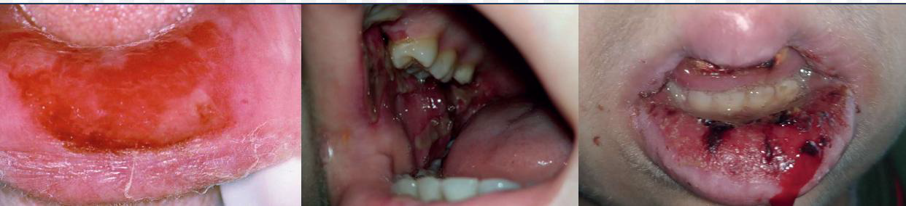
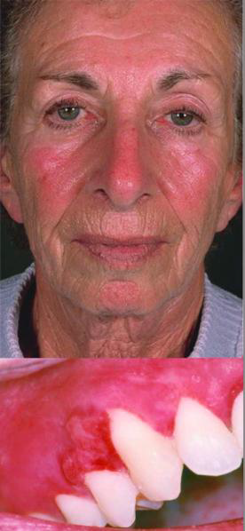
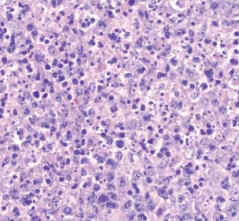
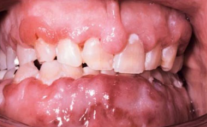
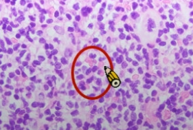

---
toc:
    depth_from: 1
    depth_to: 3
html:
    offline: false
    embed_local_images: false #嵌入base64圖片
print_background: true
export_on_save:
    html: true
---

# Hematologic Disorders

> 需要切片 

## Thalassemia 地中海/海洋性貧血

- α-Thalassemia
  - &alpha; 出問題， 只有 4β 或 2β2δ
  - 嚴重，易死胎
- β-Thalassemia
  - &beta;^0^: 較常見，完全無 &beta;
  - &beta;^+^: 較少見， &beta; 少
- 症狀
  - Sunrise skull bone (Hair-on-end)
  - 造血細胞/ 骨增生
    - 長骨骨隨增生
    - 扁平骨變寬
  - 血色素沉積: 心、胰、脾

\picBox{

}

## 缺鐵性貧血相關病症

- MCV/RBC
  - 缺鐵性貧血: >16
  - 地中海型貧血: <13
- 口腔灼熱感、口角炎(angular cheilitis)
- 廣泛性口腔黏膜萎縮(generalized oral mucosal atrophy)
- 萎縮性舌炎(atrophic glossitis): 一片光滑

|名稱|| 成因 |GLA|特徵 ||||
|-|-|-|-|-|-|-|-|
| Hereditary Hemorrhagic Telangiectasia (遺傳性出血性微血管擴張症，HHT，Weber syndrome)|| \oneline{
體顯性，`GENE`
- HHT1: endoglin (ENG)
- HHT2: activin receptor-like kinase (ALK1; ACVRL1)
- HHT + juvenile polyposis: MADH4
}|| \oneline{
- 流鼻血(epistaxis)而被診斷
- 口鼻黏膜紅色丘疹，壓迫變白
- 萎縮性舌炎
- 腸道易出血 &rarr; 慢性缺鐵性貧血
- 動靜脈廔(arteriovenous fistulas)
- 牙周血管畸形 &rarr; 菌血 &rarr; 化膿性肺栓塞
- 黏膜下纖維化症 (Submucous Fibrosis) 

}|
| \style[color: red;]{ Plummer-Vinson syndrom}^罕^ || -| 30-50y |\oneline{
- 癌前變化 &rarr; SCC
- 食道蹼(esophageal webs) &rarr; sideropenic dysphagia(缺鐵性吞嚥困難)
- 萎縮性舌炎
- 匙狀指甲(koilonychia)

\picBox{

}
}

## Aplastic Anemia再生不良性貧血

- cytotoxic T lymphocytes 攻擊骨髓中分化中的造血細胞所致
  - 暴露於特定環境毒素(如：苯benzene)
  - 使用某些藥物(尤其是抗生素氯黴素chloramphenicol)
  - 感染某些病毒(尤其是非A、非B、非C、非G型肝炎病毒)
- Dyskeratosis Congenita 可能進展為再生不良性貧血
- 紅血球缺乏：造成血液攜氧能力下降
  - 症狀：疲倦、頭暈、心悸(tachycardia)、無力
  - 口腔黏膜可能呈蒼白
- 血小板缺乏(thrombocytopenia)：易出現瘀斑與出血
  - 影響多個部位，包括視網膜及腦部出血，屬較嚴重表現
  - 牙齦出血
  - 口腔黏膜瘀點(petechiae)、紫斑(purpura)、瘀斑(ecchymoses)
- 白血球缺乏
  - 最重要的併發症，易導致細菌與真菌感染，常為死亡原因
  - 牙齦感染性潰瘍

## Methotrexate (MTX)

- 葉酸拮抗劑(folic acid antimetabolite)，作為steroid-sparing agent。用於治療：
  - 白血病(leukemia)
  - solid tumors
  - 自體免疫疾病
  - 某些型態 psoriasis
- 全血球減少(pancytopenia)、肝毒性(hepatotoxicity)
- 口腔 (嘴唇、頰黏膜、舌頭)
  - 紅斑區(erythematous areas)
  - 不規則潰瘍
  - 白色假膜(whitish slough)

## Polycythemia Vera真性紅血球增多症
- 紅血球(RBCs)總量增加
- 種酪氨酸激酶基因(tyrosine kinase gene)—Janus kinase 2 (JAK2) 的後天突變
- GAL 
  - 60歲
- 症狀
  - 初期症狀多非特異性，包括：頭痛、虛弱、頭暈、嗜睡、視力異常、多汗、體重下降、呼吸困難、上腹痛等

## Myelodysplastic syndrome(MDS，骨髓發育不良症候群)

- 如果發展成 Acute leukemia &rarr; gingival hyperplasia

### Acute monocytic leukemia (AML-M5)

- 最常侵犯口腔的 leukemia
  - 血小板減少 &rarr; 出血
- 病灶在骨隨
  - 腫瘤細胞增生,取代正常細胞甚至破壞骨質
  - starry sky pattern
    - 星星:macrophages
    - 夜空:核濃染的lymphoid cells其中的macrophage,其細胞質內含有apoptotic bodies
    - 代表是high grade的lymphoma
- 兒童、年輕人

\picBox{

}

## Kikuchi-Fujimoto disease

- 淋巴結發炎壞死
- Necrosis: 砂粒狀，粉粉的
- nuclear dust: 核破碎的髒東西
- Histiocytes: 結締組織macrophage，CD68, CD163

## leukemia, myeloid sarcoma
- 根據 acute/chronic、lymphoid/myeloid 分成四型： 
  - ALL：預後最好，最常發生在小孩(其他型是成年男性居多) 
  - AML：diffuse gingival enlargement 常見原因
  - CLL: 最常見
  - CML：t(9,22)BCR-ABL 
 
- 臨床症狀 
  - 造血細胞出問題&rarr;血球生成受影響&rarr;血小板最先受影響，thrombocytopenia&rarr; 凝血出問題&rarr;容易瘀血、bleeding、常有點狀瘀血(petechial hemorrhages)在硬顎後方、自發性出血
  - 常在 gingiva 出現 Neutropenic ulcers，呈現深的、punched-out lesion 伴隨著灰白色的 necrotic base 
  - 最常發生的是在==牙齦有廣泛性的腫脹(diffuse gingival enlargement)==(特別是AML)，因為裡面都是血液的物質，所以外觀呈現一整片藍紫色。 
  - IHC 染色
    - CD45 
    - Myeloid lineage：MPO & lysozyme & C-kit & CD34 & CD15 (for granulocyte) 
    - B cell：CD10 & CD79a   
    - T cell：CD3 

- 白血病細胞的腫瘤樣聚集稱為骨髓肉瘤(myeloid sarcoma)

## Lymphoma

- 口內 
  - Diffuse Large B-cell Lymphoma (DLBCL)
- 唾液腺
  - Mucosa-Associated Lymphoid Tissue (MALT)

- 與免疫低下無關 
  - Hodgkin Lymphoma (HL)
  - DLBCL
  - Burkitt Lymphoma

### Diffuse Large B-cell Lymphoma (DLBCL)

- 成人口內最常見 Lymphoma (20%)
- 40-50y
- 快速增長，並在淋巴結及其他器官（例如肝臟、脾臟或骨髓）形成腫瘤。
- IHC: BCL6, CD10, MUM1

### Extranodal Marginal Zone B-cell Lymphoma (MALT lymphoma )

- Sjogren syndrome 的衍生疾病。
  - 好發: Parotid gland
- Helicobacter pylori 相關
- Russell body (From plasma cell)

### Burkitt lymphoma
> B lymphocyte 的惡性腫瘤，未分化的B細胞

- 分類 
  - Endemic(地區型 African type): 下顎組織腫脹、腎臟、腎上腺、卵巢
  - Sporadic (偶發型): 腹腔 
  - HIV-associated type
- EVB related 
  - Endemic 100% 
  - Sporadic 15-20% 
  - HIV: 25%
- t(8;14)(t 代表 translocation )， c-MYC 轉位到十四對染色體的 IgH 免疫球蛋白重鏈基因的位置
  - c-MYC: Light zone 跟 T~FH~ 結合存活表現
  - c-MYC 大量產生 &rarr; 增生 
  - Ki-67(+)

---
- 口腔常出現
- 年輕 
- 侵犯性強，化學治療敏感

---
- starry sky pattern

### Plasmablastic Lymphoma

- EBV related
- 年紀大
- 淋巴結外
- IHC: 
  - Plasma cell marker: CD38, CD138, CD97a

### Extranodal NK/T Cell Lymphoma 

- EBV related (100%)
- 淋巴結之外的 NK/T cell 所發展出來的
- 長在鼻中線
- 圍著血管長，侵犯血管 (尤其是動脈)
  - 造成大區域缺血壞死
- 侵犯性強，化學治療不敏感 &rarr; 預後不佳，大部分病歷都在診斷後三年內過世

### Mycosis Fungoides 

- CD4 T cell 
- 侵犯上皮 

## Solitary Plasmacytoma 單一漿細胞瘤
> 過多免疫球蛋白堆積在細胞質

- 分類 
  - 侵犯骨頭(osseous)
    - 常發生在脊椎(vertebral column)
    - 10~20 年後可能進展成多發性骨髓瘤(multiple myeloma)
  - 侵犯軟組織(extraosseous)
    - 常發生在上呼吸道(鼻竇、鼻咽)、肺部、口腔。
    - 局限於上述位置，很少進展成多發性骨髓瘤
    - 可以通過局部切除或放射線治療

---

- 非典型漿細胞(atypical plasma cells)
  - 細胞質較多且偏藍紫色

## Langerhans Cell Histiocytosis 

- Langerhans cell 增生的腫瘤
- BRAF 
- 骨侵蝕，從上皮往下長
- 15y &darr;，男女差不多。
- 蝕骨
- IHC: 
  - HLA-DR: 來自 MHC II
  - S-100
  - CD1a
  - CD-207(langerin)
- punched out, scooped out 
\picBox{

}

- 一堆 Eosinophil
- Langerhans Cell: Coffee been 細胞核

punched out
: 邊緣清晰、圓形或類似「穿孔」的骨病變

## multiple myeloma
- 排除轉移性疾病，骨內腫瘤中約 50%為多發性骨髓瘤
- 自單一細胞瘤
  - &kappa; chain 超多 (10:1)
- 骨破壞 
- 蛋白尿
- punched out

- Plasma cell 大小不一
- 可能表現 CD79a, CD56

- Amyloidosis (澱粉狀病變)
  - 大舌頭，節結狀
  - 眼睛 Waxy plagues 
  - 堆在 Blood vessel 周邊

:::fbox 

:::

## Oral Graft versus Host Disease (GVHD)

- 骨髓移植造成
- 急性 (3 月內)
  - 移植 T cell 攻擊組織

## Cat Scratch Disease

- Granulomas 但一堆 neutrophil

:::left
## Kimura disease
> eosinophils 跑到 Lymph Follicle

- 亞洲年輕的成年男性 (20-30y)
- 良性淋巴組織增生
  - 深層病灶，淋巴、唾液腫
  - 唾液正常
- 血管增生，型態正常
- 抽血 eosinophils 升高
- IgE-positive mast cell

:::right
## Epithelioid Hemangioma
> eosinophils 跑到 Lymph Follicle

- 男女差不多 (30-50y)
- 淺層病灶，淋巴唾液較少腫脹
- 血管增生，但圓胖內皮 &rarr; 墓碑
- 抽血無 eosinophils 升高

:::

## Castleman disease 
- Onion skin: 淋巴圍血管，一圈又一圈
- 血管壁退化 &rarr; hyalinized walls
- Paraneoplastic Pemphigus 可能引發
  - HHV 8, IL6

## Rosai-Dorfman disease 

- 大 Histiocytes 吃周圍 lymphocyte 

## 整理 

- Lymphoma 和 EBV
  - Burkitt Lymphoma
  - Hodgkin Lymphoma
  - NK/T-Cell Lymphoma
  - Lymphoepithelial carcinoma 
- 成人最常見的 lymphoma: Diffuse large B cell lymphoma 
