---
toc:
    depth_from: 1
    depth_to: 3
html:
    offline: false
    embed_local_images: false #嵌入base64圖片
print_background: true
export_on_save:
    html: true
---

# cyst

## 分類

## 玻片特徵

- Developmental cyst
  - epithelial lining 與結締組織交界處平整
- 非發炎型(noninflamed)
  - 結締組織鬆散
  - 糖胺聚醣基質(glycosaminoglycan ground substance)。  
- 發炎型(inflamed)
  - 網嵴(rete ridges)
  - cholesterol clefts

  - 齒源 &rarr; Rushton bodies
:::left
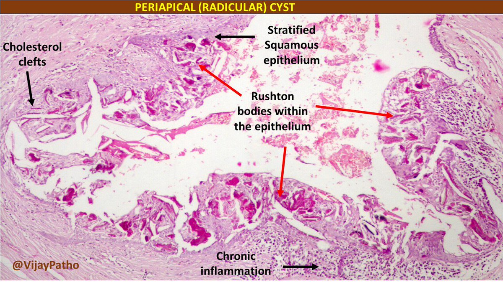

:::right
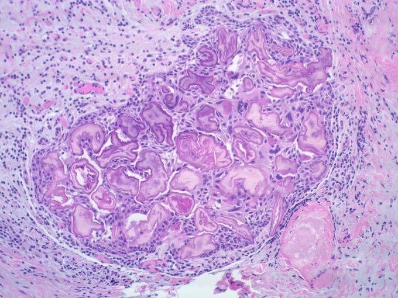

:::

- true cyst
  - 兩到四層的扁平非角化上皮

## Odontogenic

### 癌化

- 良性不痛
- Risk 
  - RC > DC > OKC

### 發育型

| |原因|好發| 年齡 |特徵||
|-|-|-|-|-|-|
|Dentigerous cyst (DC)|follicle 分離| 38,48 | 10 - 30y| \oneline{

- 阻生齒,牙根吸收
- 包 CEJ
- &phi; = 3-4mm

}|
|Eruption cyst (EC)| Dentigerous 萌發 |12a, 12b, 34a, ?6|10y &darr;|\oneline{

藍色或紫棕色  

\picBox{

 
}

}|
| Odontogenic Keratocyst cyst (OKC)| \oneline{
- dental lamina rest
- Gorlin syndrome 相關
- `GENE`: 
  - `PCNA (proliferating cell nuclear antigen)
  - Ki-67 

} | 下顎骨後端，下齒槽管上方|10-40y |組生齒(40%) 
|^|^|^|^| Radiolucent、  MD方向下顎骨吸收，但牙根完整。 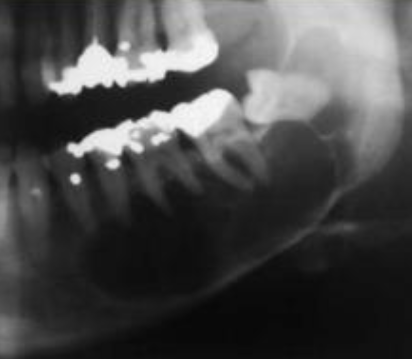
|^|^|^|^|4-8 層、副角化(有核)、Basal cell 為 palisaded(柵狀)
|^|^|^|^|高復發 (30%)
| 
Orthokeratinized Odontogenic cyst (OOC)
|-|下顎後牙|年輕人| 阻生齒 (66%)、   granule layer 明顯 、  生長慢
| Gingival Cyst of the newborn | dental lamina rest | 新生兒上顎牙齦   |-| 管腔內含有角質碎屑(keratinaceous debris) 
| Gingival Cyst of the adult (LPC 長出來)| ^| 下顎premolar、canine facial 牙齦| 40-60y| 藍色(bluish)、藍灰色(DeepSkyBlue-gray) 
|^|^|^|^| focal plaques|
|^|^|^|^| focal plaques|
|Lateral Periodontal (LPC) | ^|  下顎 premolar、canine、lateral incisor lateral root 表面| 40-70y | ^|
|^|^|^|^|類似 OKC，但推開牙齒 |
| Botryoid Odontogenic Cyst (BOC)| 多囊 LPC
|Calcifying Odontogenic Cyst   ( Gorlin Cyst, COC)|- |前牙(65%) 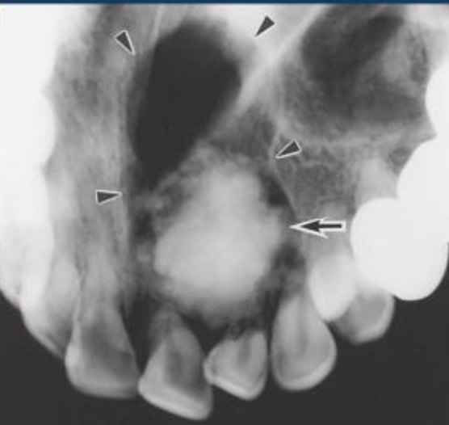| 20-40y  若有 odontoma，17y 發病| 未萌發的牙齒(33%)、 阻生齒(66%)
|^|^|^|^| basal cell reverse polarity 
|^|^|^|^| ghost cells (嗜酸無核) 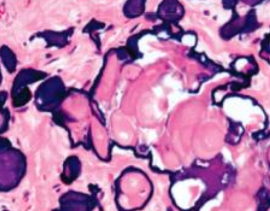
|^|^|^|^| &beta; catenine + |
| Peripheral Calcifying Odontogenic Cyst|COC 長出來 |-|60-80y |.|
|Glandular Odontogenic Cyst (GOC)|-|下顎前牙|46-51y| 跨中線、無 MAML2|
|^|^|^|^| 復發、局部侵犯性，吃 cortical bone 
|^|^|^|^| 杯狀細胞, cilia, focal plaques

==MAL2 讓 MEC 預後好==

:::note {Gorlin syndrome}
- SUFU 也可能造成
- 多發 OKC
- BCC risk

:::

:::note {\style[color:red;]{Gardner Syndrome}}
- 家族性腺瘤性息肉病 (Familial Adenomatous Polyposis, FAP) 的一個變異型
- APC基因突變，β catenin 分解不掉
  - β catenin: WNT轉錄因子
  - 導致結直腸內產生數百甚至數千個腺瘤性息肉 &rarr; 結直腸癌 (Colorectal Cancer)
  - 十二指腸癌 (Duodenal Cancer)
  - 甲狀腺癌 (Thyroid Cancer)
- 多發性 Epidermoid Cyst (Infundibular cyst)
- 多發性骨瘤 (Osteomas)
- 多發性多生牙
- 女性較多

:::

### 發炎型

| |原因|好發| 年齡 |特徵
|-|-|-|-|-|
|Periapical(radicular) cysts| Rest of  Malassez 被刺激|-|-|true/ periapical cyst   圓形的光通性==包圍根尖==|
|^|^|^|^| 牙根吸收, 2cm &uarr; 根管治療無效  |
| Buccal Bifurcation Cyst| 36, 46 Buccal (兩側 1/3)| 5-13y | -|\oneline{
- 腫脹，推牙根 
- cervical enamel extension 相關

 

}|

Rest of Malassez
: Hertwig's epithelial 殘留

Rushton bodies
: 齒源系上皮

## Non- Odontogenic
| |原因|好發| 年齡 |特徵|
|-|-|-|-|-|
| Palatal Cysts of the Newborn | Epstin’s pearl &rarr; 融合線的上皮 | 中腭裂(前)、多發性| -| \collapse[白色或黃白色, 角化, 不需治療]{ }
|^| Bohn nodules &rarr; 小唾液腺 | 散佈在硬腭軟顎的交界(後)、多發性|^|^
| 
Nasolabial Cyst 
| \collapse[融合線]{} | 上唇中線旁(外側)，軟組織內 | 40-50y| 不痛 |
|^|^|^|^|   \collapse[纖毛上皮, goblet cells, 附近有肌肉]{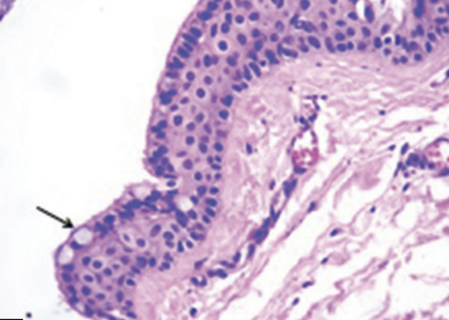}|
|^|^|^|^| \collapse[facial depression]{ } 
|
Nasopalatine duct cyst 
| Nasopalatine duct 上皮的殘留 | 顎部前 |==40-60y== | \collapse[藍]{}|
|^|^|^|^|  \collapse[牙根吸收]{}|
|^|^|^|^| 多種上皮, cilia, goblet cell, 神經和血管可見|
|
Incisive canal cyst 
| NDC 特例| \collapse[Incisive papilla 內]{} |^ | &phi; < 6mm |
| Median palatal cyst | lateral palatal shelves 融合時將上皮困住 | palatine papilla 後硬顎中線 | 年輕 | 表面是多層鱗狀上皮 |
|^|^|^|^| \collapse[無神經、血管、cilia、goblet cell]{ }|
| 
Epidermoid Cyst (Infundibular cyst)  
| trauma|-| 青春期後|  \collapse[凹陷]{ }
|^|^|^|^| ==正角化上皮==，爆開會被當異物 &rarr; granuloma
|^| Gorlin syndrome| 多發性 | ^| ^|
|^|Gardner syndrome| ^ | 青春期前| ^|
|Milia |-|類似 Epidermoid Cyst |-| 小、黃或白、充滿keratin  |
|^|^|^|^| 位於 Superficial dermis|
|\style[color:red]{Pilar (Trichilemmal) cysts  毛髮囊腫}| -|頭皮 (90%)、多發性(70%)|-|無凹陷開口|
|^|^|^|^|  \collapse[cholesterol clefts(90%), 淡染,  無 granular layer]{}|
|^|^|^|^| 破裂 &rarr; 發炎細胞湧入 cyst &rarr; secondary inflammation
| Dermoid Cyst | Teratoma| 口底中線|兒童、年輕| 多個 germ layer| 
|^|^|^|^|  \collapse[正角化上皮, Cyst Wall 有皮膚附屬物(皮脂腺細胞核居中)]{}|
| Thyroglossal Duct Cyst   甲狀舌管囊腫 | 甲狀腺殘留 | \collapse[脖子中線上、舌骨下\(75%\)]{}|20y &darr; (40%) | \collapse[Cyst wall 上有 Thyroid follicle ]{} |
| Branchial Cleft Cyst   (cervical lymphoepithelial cyst，鰓裂囊) | branchial arches 殘留 (2^nd^，95%)| \collapse[SCM 前/下]{}| 10 - 40y| 複層鱗狀、淋巴、發中心(germinal center)。
| Oral Lymphoepithelial Cyst | 上皮內陷(invagination)淋巴 &rarr; keratin debris | Waldeyer ring, 口底, 舌腹, 軟顎| 40-50y |  \collapse[&phi;<1cm 的黏膜下黃白色腫塊]{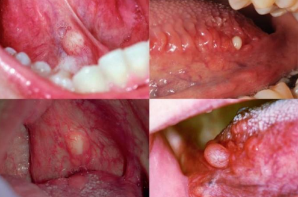}
|^|^| 單發&rarr;發育   多發&rarr;HIV |^|\collapse[不含rete ridges, 角化不全並脫落填滿空腔, 淋巴組織包圍 ]{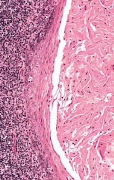}|

Gardner syndrome 
: APC基因突變，β catenin 分解不掉 &rarr; 上皮增生 [Wnt 相關](/notes/國考/口胚整理.html#wnt)

:::info {魏氏環(Waldeyer ring)}
- 顎扁桃(palatine tonsils)
- 舌扁桃(lingual tonsils)
- 咽部腺樣體(pharyngeal adenoids)

:::

## Pseudocyst

| |原因|好發| 年齡 |特徵|
|-|-|-|-|-|
| Mucocele| 唾腺導管破裂，黏液灑入周遭的軟組織間隙 | 下唇中線旁(易咬到)| 常見 | 透明藍色, 波動感(fluctuant), 高復發 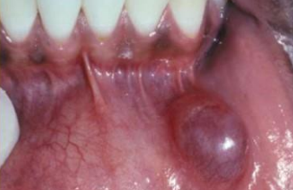 |
|^|^|^|^|發炎，granulation tissue 包圍黏液 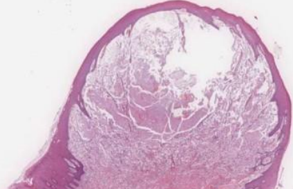|
| Ranula 蛤蟆腫 | 口底、和舌下腺有關的 Mucocele|-|
|\style[color: DeepSkyBlue;]{ Stafne Defect (Stafne Bone Cyst ，骨內囊腫)} | 唾液腺擠壓 cortical bone &rarr; x-ray 透光 |後側 mandibular canal | 中年 | 大小固定，邊界明顯 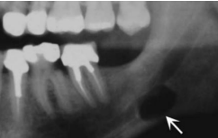|
| Simple Bone Cyst  單純性骨囊腫 | 空($\frac{1}{3}$)或液體骨腔 | 肱骨、 股骨近端、 下顎後牙、 下顎聯合區| 年輕人 | 少疼痛、皮膚感覺異常|
|^|^|^|^| 不須積極治療，復發率低   (例外: cementoosseous dysplasia)|
|^|^|^|^| 侵犯牙根之間區域，不影響鄰牙，近遠心擴張 |
| Aneurysmal Bone Cyst   動脈瘤性骨囊腫|==大小不等==骨內堆積被纖維結締組織和活性骨包圍，並充滿血液| 長骨或脊椎骨、 下顎(2%)後牙  | 30y &darr; | 骨頭腫得快，可能多房，邊界不一定完整 
|^|^|^|^| Granulation tissue: 巨噬細胞蝕骨  |

## 整理 

> - COC 在前區

> - BOC = 多囊 LPC &rarr; 在 premolar
> - Slaodontogenic Cyst (GOC) 在前牙跨中線
