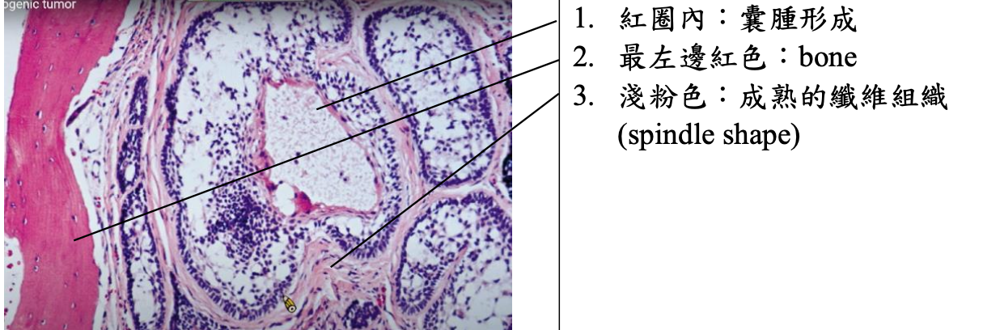
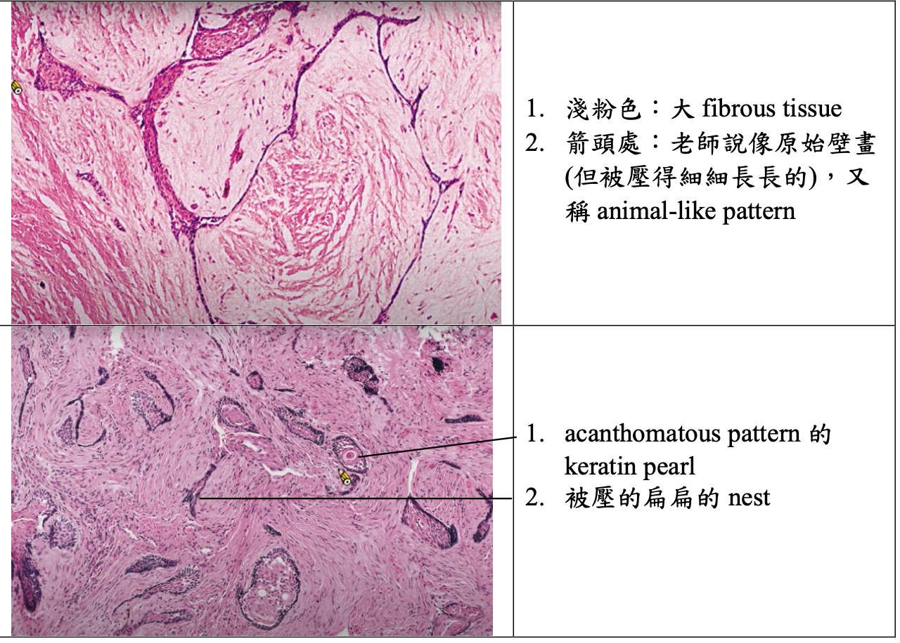
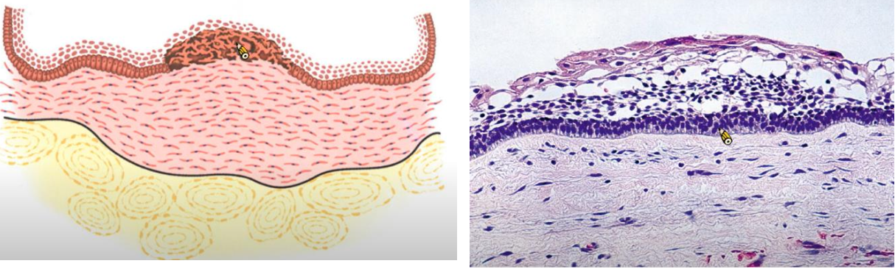
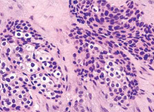
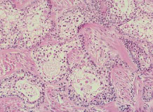
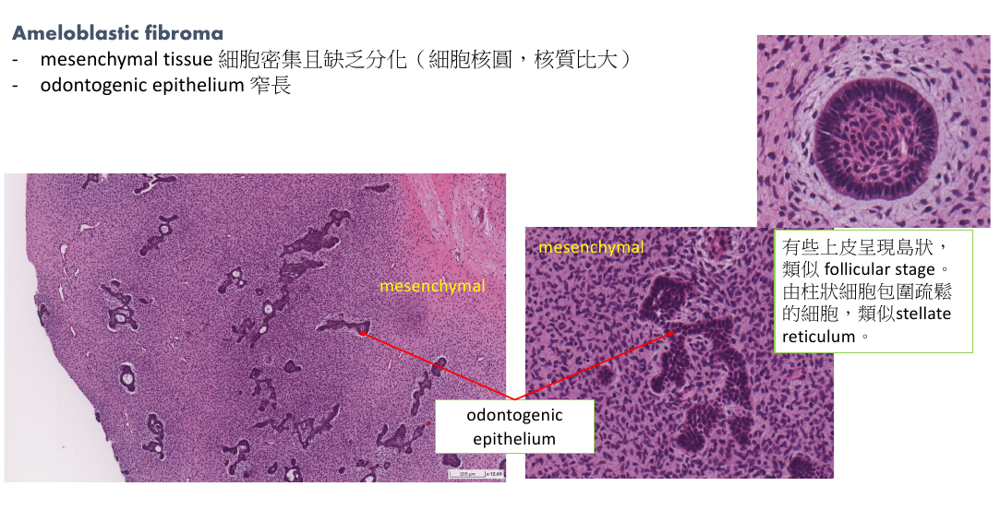
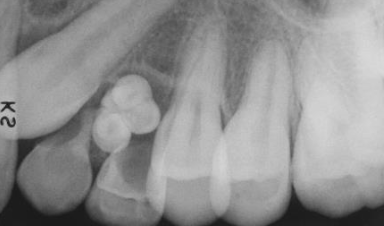
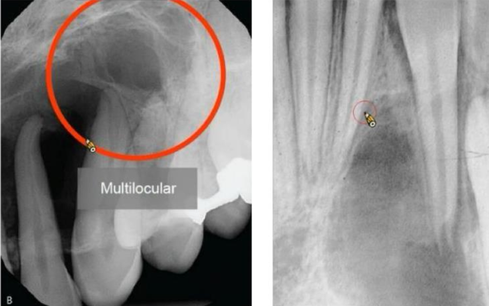

---
toc:
    depth_from: 1
    depth_to: 3
html:
    offline: false
    embed_local_images: false #嵌入base64圖片
print_background: true
export_on_save:
    html: true
---

# 齒源性腫瘤 Odontogenic Tumor
> - 上皮組織惡性病變: carcinoma
> - 間葉組織惡性病變: sarcoma

1. 上皮性來源(tumors of odontogenic epithelium)
   1. Ameloblastoma (2^nd^)
   2. Clear cell odontogenic carcinoma
   3. Adenomatoid odontogenic tumor (4^th^)
   4. Calcifying odontogenic tumor
   5. Squamous odontogenic tumor
2. 混和性來源(mixed odontogenic tumors)來自上皮+外胚層間葉
   1. Ameloblastic fibroma
   2. Ameloblastic fibro-odontoma
   3. Ameloblastic fibrosarcoma
   4. Odontoma (1^st^)
   5. Primordial odontogenic tumor
3. 外胚層間葉來源(tumors of odontogenic ectomesenchyme)
   1. Odontogenic fibroma
   2. Granular cell odontogenic tumor
   3. Odontogenic myxoma (3^rd)
   4. Cementoblastoma

## 上皮性來源
| ||原因|位置| 年齡 |特徵||
|-|-|-|-|-|-|-|-|
Ameloblastoma | 多囊腫型 (coventional solid or multicystic intraosseous) | \oneline{
- 牙齒發育過程上皮(典型良性)在錯的位置
- BRAF mutation
- DC 變過來 (unicystic)
} |下顎 (80-85%)|-| \oneline{
- 最常見(80%)，長得慢，通常會到了腫瘤很大時才來就診。
- 頰舌擴張
- 牙根吸收
- 局部侵犯，少轉移，預後好
}|
|^|^|^|^|^|\oneline{
#### follicular Pattern
- 最常見

}|
|^|^|^|^|^|\oneline{
#### plexiform pattern

- stellate reticulum 擠扁 
 

}|
|^|^|^|^|^|\oneline{

#### basal cell pattern 
- 最少

stellate reticulum 不明顯 

}|
|^|^|^|^|^|\oneline{
#### acanthomatous pattern

}|
|^|^|^|^|^|\oneline{
#### granular cell pattern
- 最常見

}|
|^|^|^|  前牙 | ^ | \oneline{
####  desmoplastic pattern

- fibrous stroma &rarr; TGF-β &rarr; collagen fiber &rarr; 大量膠原蛋白基質(dense collagenized stroma)堆積 &rarr; radiopaque, odontogenic epithelium 呈現小島狀(small islands)或是索狀(cord)
- 無鈣化，但 RO

} |
|^| 單一囊腫型(unicystic) |^|下顎後 | ~23y | \oneline{
- 預後較多囊好
- 常圍繞未萌發的牙齒，特別是第三大臼齒

 } |
|^|^|^|^|^| **luminal ameloblastoma** |
|^|^|^|^|^| **intraluminal ameloblastoma**   多為 plexiform type   |
|^|^|^|^|^| **mural ameloblastoma** |
|^|骨外囊腫型(peripheral/ extraosseous)|^|下顎後、軟組織^限^| 52y | plexiform 或是 follicular pattern |
|^|^|^|^|^|局部切除， 15-20% 復發 |
| Ameloblastic Carcinoma ||- |下顎後側 |50-60y| **放射線**   不規則，邊界不清楚。|
| Calcifying epithelial odontogenic tumor (CEOT) ||-|下顎 | 30-50y|\oneline{
- 類似 Ameloblastoma，可能單多囊
- 鈣化，長得慢，低侵略，邊界清楚
- 阻生齒
- 復發率約 15%

}|
|^|^|^|^|^| \oneline{
- intercellular bridge
- 嗜酸 amyloid-like substance (ODAM) &rarr; ==Congo red==
- 多核細胞(→)
 

\picBox{

 }
}|
| \style[color: red;]{Adenomatoid odontogenic tumor (AOT)} ||-|上顎、前牙、犬齒、頰側|10-19y| \oneline{
**Tumor of two-third**
1. 10~19y
2. Female
3. 上顎、前牙、犬齒
4. 未萌發牙冠
}
|^|^|^|^|^| 無痛小病灶(&phi;<3cm)，變大時==骨膨脹==
|^|^|^|^|^| radiolucency 跨過 CEJ，可能有鈣化  |
|^|^|^|^|^| \oneline{
- fibrous capsule 厚 &rarr; 切得乾淨
- Ductlike、上皮螺旋(whorled mass)、玫瑰(rosettelike)團塊
- 2/3 鈣化， 內部 fiber 少
- 靠近 Capsule 有 Anastomosing cords 上皮

}|
| Squamous odontogenic tumor ||錯位|上顎前，下顎後|-| \oneline{
- 可能造成牙根鬆動，一般無症狀
- "正常"鱗狀上皮小島被Fiber包圍
- 上皮小島內可能會出現一些 microcyst

}|
| Clear cell odontogenic carcinoma |biphasic |一堆 Clear cell, 一堆 Glycogen|-|-|\oneline{
- Clear cell
- 嗜酸多邊形上皮 (eosinophilic polygonal epithelial cells)

}
|^|monophasic| -|-|-| \oneline{
- 只有 Clear cell
- 均質 hyalinized CT

}
|^| ameloblastoma-like |-|-|-|\oneline{
- 最外圈 Clear cell 反極

}

## 混和性來源

| ||原因|位置| 年齡 |特徵||
|-|-|-|-|-|-|-|-|
| Ameloblastic fibroma ||-| 下顎臼齒區| 20y &darr; | \oneline{
- 通常無症狀
- 阻生齒(75%)
- fiber 多 &rarr; 邊界清楚
- odontogenic epithelium 排列成兩層細胞 long, narrow cords
- Ameloblast 包未成熟 fibroblast，小顆無 cyst
- CT 充滿缺乏分化 fibroblast

}|
| \style[color: DeepSkyBlue;]{ Ameloblastic fibrosarcoma} ||Ameloblastic fibroma 惡化 | 下顎(80%) | 27.5y (1.5:1)| \oneline{
- 侵犯快，==會痛==
- 骨頭破壞 &rarr; 牙齒鬆動
- 向外侵犯 &rarr; 粘膜潰養
}
|^|^|^|^|^|\oneline{
- 只有 CT 惡性
}
| Odontoma |compound  | 最常見|上顎前牙| 20y &darr;|\oneline{
- 構造順序排列

}
|^| complex | ^| 後牙|^|\oneline{
- dentin 和 enamel matrix 混在一起
- 有時可見嗜酸 Ghost cell

}|
| Ameloblastic fibro-odontoma || Ameloblastic fibroma + Odontoma | 下顎後 | 10y | \oneline{
- 多為單房，分界明顯

}|
|Primordial Odontogenic Tumor ^新^||-| 下顎後牙(3^rd 大臼齒, 乳臼齒) | 10y-20y| \oneline{
- 良性，分界好，堅硬，無痛
- 包住牙冠

}
|^|^|^|^|^| --|

## 外胚層間葉來源

| ||原因|位置| 年齡 |特徵||
|-|-|-|-|-|-|-|-|
| Odontogenic fibroma | central type^罕^ (骨內)|-| 上顎為第一大臼齒以前、下顎為第一大臼齒以後 | 未萌發的牙齒(5%) | \oneline{
- 多房: 大，骨頭膨大
- 單房: 小
- 擠牙根，齒動搖

}|
|^|^|^|^|^| Simple, WHO 
|^| peripheral type (軟組織) |-|下顎牙齦 facial | 10-40y| 又稱 Odontogenic epithelial harmatoma, Peripheral fibroameloblastic dentinoma |
|^|^|^|^|^| \oneline{
- 無痛
- 緻密的 collagen
- 厚的 epithelium
- WHO type 類似
- 某些區域類似 giant cell granuloma
  

}|
| Granular Cell Odontogenic tumor ||-|-|-| \oneline{
- 富含 Lysosome &rarr; 嗜酸
- Narror cords, island Odontogenic 上皮

}
| Odontogenic myxoma   齒源性黏液瘤|| - | 顎骨^限^(下顎稍高) | 25-30y |\oneline{
- 無痛腫脹，生長慢
- 難切乾淨，復發率高(25%)
  - 推開牙根，牙根吸收
- 單或多房，多房分成 soap bubble, ==stepladder==
- IHC: Actin 不太表現

}
|^|^|^|^|^| 間質淡粉紅色，看不太到 collagen fiber
|Cementoblastoma || cementoblast 狂做 | 下顎(75%)，後牙(90%)，下顎第一大臼齒(50%)| <20y (50%)|\oneline{
- ==不受控生長==，但不能不同牙齒黏一起
- 阻生齒、未萌發
- ==2/3 腫痛==
- Pulp 存活
- 高復發

}
|^|^|^|^|^| \oneline{
- 有 Capsule，cementum 高柱狀
- 多核巨細胞
  - cementoclast, ==odontoclast==
- 小空腔: cementocyte
- reversal line

}|

## 齒源性腫瘤、Cyst 整理

- 良性，但棘手，高復發
  - OKC (局部侵犯，切不乾淨)
  - GOC (局部侵犯)
  - Ameloblastoma (局部侵犯)
    - 惡性 &rarr; Ameloblastic fibrosarcoma (侵犯又快又痛)
  - myxoma: 長得慢，但拿不乾淨
- 頰舌擴張
  - BBC
  - 多房 Ameloblastoma
- 非下顎好發
  - EC: 乳前牙, 第一大臼齒
  - COC: 前牙，上下一樣多
  - AOT: 上顎前牙犬齒頰側
  - Squamous odontogenic tumor: 上顎前，下顎後
  - compound Odontoma: 上顎前牙
  - Odontogenic fibroma: 上顎為第一大臼齒以前、下顎為第一大臼齒以後

| 男性較多                                                                                                                                                                                                                                  | 女性較多                                                                       |
|---------------------------------------------------------------------------------------------------------------------------------------------------------------------------------------------------------------------------------------|----------------------------------------------------------------------------|
| OOC  odontogenic carcinoma NDC   EC Stafne Defect   Simple Bone Cyst 長骨型 | Nasolabial Cyst   Gardner syndrome  Pilar cysts |

| 必定伴隨阻生牙| 可能伴隨阻生牙| 一定不伴隨阻生牙|
|-------------------|------------------------------------------------------------------------------------------------------------------------------------------------------------------------------|--------------------------|
|\oneline{
- DC
}|\oneline{
- OKC(40%)
- OOC (66%)
- COC(33%機率)
- 單房 Ameloblastoma
- AOT (66%)
- CEOT
- Ameloblastic fibroma (75%)

} | \oneline{
- LPC
 } |

| 牙根吸收| 牙根不太吸收|
|-|-|
| \oneline{
- DC
- RC

}| \oneline{
- OKC
- LPC 
- Ewing Sarcoma
- Fibrosacroma
- Langerhans Cell Histiocytosis（LCH）
}|
|\oneline{
- GOC
- Ameloblastoma 多房型
- Ameloblastic Carcinoma
- Squamous odontogenic tumor
- Odontogenic fibroma
} |^|
|\oneline{
- Odontogenic myxoma

}|^

| 正角化上皮| 不完全角化上皮| 非角化上皮 |
|-------------------------------------------------------------------------------------|--------------------------------------------------------|-------------------------------------------------------------------------------------------------------|
| \oneline{
- OOC
- EC
- Dermoid cyst

} |\oneline{
- OKC
- Oral Lymphoepithelial Cyst

  }  |\oneline{
- DC
- LPC
- GOC} |

| 單房 Unilocular| 多房 Multilocular|
|-----|-------------------------------|
| OOC   COC   Simple Bone Cyst | GOC   Ameloblastoma |
