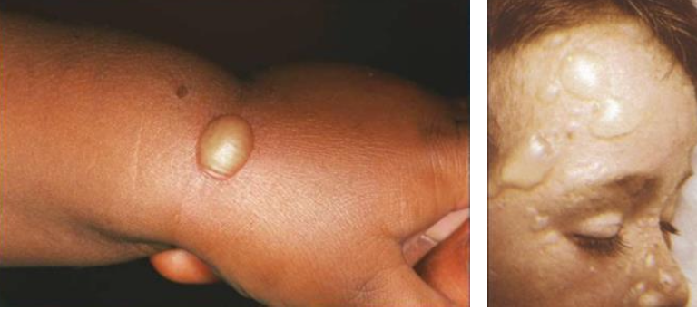
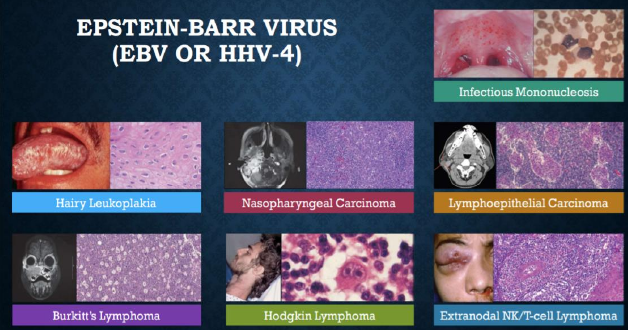
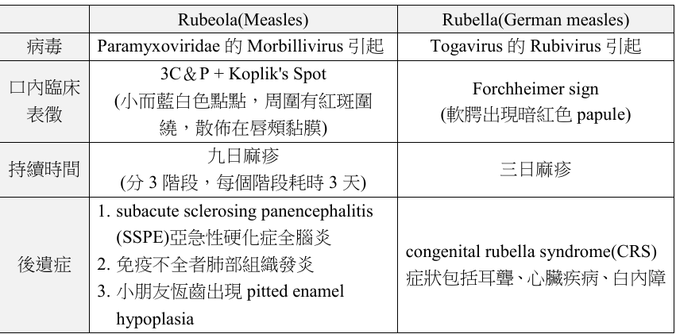

---
toc:
    depth_from: 1
    depth_to: 3
html:
    offline: false
    embed_local_images: false #嵌入base64圖片
print_background: true
export_on_save:
    html: true
---

#　感染
## 細菌感染 Bacterial Infection

### 膿皰瘡 Impetigo

- S. aureus 與 S. pyogenes 
- Bullous impetigo:相對比較不常見，主要是由 S. aureus 

|||原因| GLA|特徵||
|-|-|-|-|-|-|-|-|
Impetigo || S. aureus 與 S. pyogenes | -|
|Bullous impetigo || S. aureus |\oneline{
- 四肢(Extremities)、軀幹和臉

}|-|
| 丹毒 Erysipelas || β-hemolytic streptococci |年輕人和較老的成年 |\oneline{
- 蝴蝶斑
}
| 猩紅熱 Scarlet Fever || Group A, β-hemolytic streptococci | Palate, 3-12y | \oneline{
- Super antigen
- 草莓舌
- 斑疹(Exanthematous rash)
  - 在有壓力或皮膚皺摺區域丘疹更嚴重，發生微血管脆性(capillary fragility)後會出現橫向紅色紋路，稱為 Pastia lines。
}
|\style[color: Deepskyblue;]{Tonsillar concretions and Tonsillolithiasis }|| 脫落的角質蛋白和伴隨著次級細菌群落的外來物質 | -| 口臭，PANO 
|  白喉 Diphtheria |-|

## 病毒 

- Oral Hairy Leukoplakia (OLH)
  - EBV 會在舌側引發
  - 白色黏膜斑塊且不會被擦掉
- EBV 
  - HI2C3L

- HSV 最常用的治療藥物:Acyclovir (口服、藥膏都有,但是不能同時使用)

- 卡波西肉瘤(Kaposi1. sarcoma)
  - HHV-8 
  - Patch phase: 血管圍繞在原本存在的血管旁增生
  - Plaque: 明顯的 spindle cell 增生
  - Nodule: 血管外 RBC, 有縫狀的管腔

--- 

- Congenital rubella syndrome(CRS)
  - 感染 CN8，耳聾、白內障、心臟疾病

## 真菌 

- Candidiasis
  - Nystatin 的懸浮液(漱口)

- 不規則捲邊 
  - 芽生菌病 Blastomycosis
  - 副球黴菌病 

- 球黴菌病 Coccidioidomycosis
  - 裂谷熱(Valley fever )

- 副球黴菌病 Paracoccidioidomycosis
  - 男生
  - 口內多發桑葚狀的潰瘍

- 組織漿菌病
  - 鈣化物質存在於淋巴結

# 不想做了 

- Palate 會出現紅點
  - scarlet fever
  - EBV mononucleosis
  - Rubella(Forchheimer sign)
  - 過度口交

- 口咽相通
  - 梅毒
  - 白霉菌病
  - 巴西利什曼病 (Leishmania braziliensis)

- 口內 unhealing ulcer
  - Syphilis?
  - CMV
  - 黴菌
  - Tuberculosis: 舌頭慢性潰瘍、不會癒合的拔牙傷口
  - Histoplasmosis

- 唾液腺
  - Actinomycosis
  - CMV (唯一 HHV)
  - COVID-19
  - Mumps (廢話)

- 頸部淋巴結
  - 球黴菌病 Coccidioidomycosis
  - G.A.S.
  - Cat-Scratch disease
  - 牛分枝桿菌
  - EBV mononucleus (年輕成人)
  - HIV 潛伏期
  - 弓蟲症(毒漿體病) Toxoplasmosis (嗜酸性巨噬細胞堆疊)

- 大多無症狀 
  - 淋病在咽喉部
  - 初發性肺結核
  - HSV 初次
  - EBV mononucleus (兒童 )
  - CMV Mononucleosis (新生兒或免疫低落的成年人除外)
  - Rubella
  - Mumps (30%)
  - HIV 急性期
  - Histoplasmosis
  - Coccidioidomycosis
  - Crptococcosis 初期感染

- TORCH syndrome
  - 先天性弓蟲症(Congenital toxoplasmosis)
  - 眼盲
  - 智力障礙
  - 運動發展遲緩

## 上皮增生

- Hyperkeratosis
  - 二期梅毒

- Hyperparakeratosis 
  - Oral Hairy Leukoplakia(OHL)

- 偽上皮增生 (良性)
  - Granular cell tumor
  - 三期梅毒
  - Blastomycosis
  - Paracoccidioidomycosis
  - 

- 蕈狀乳突
  - 猩紅熱
